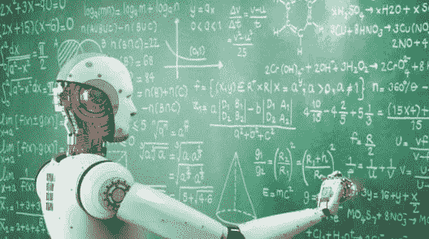

# 机器学习教程—通过示例了解

> 原文：<https://medium.com/edureka/machine-learning-tutorial-f2883412fba1?source=collection_archive---------1----------------------->


Machine Learning — Edureka

机器学习是一个概念，它允许机器从例子和经验中学习，并且不需要显式编程。本文将帮助您理解以下主题:

*   用类比理解机器学习
*   什么是机器学习？
*   最大的困惑 AI vs ML vs 深度学习
*   了解监督学习
*   理解无监督学习
*   理解强化学习
*   使用 Python 的机器学习

# 用类比理解机器学习

作为一个人:假设有一天你去买芒果。卖主有一辆装满芒果的手推车，在那里你可以亲手挑选芒果，称重，并根据每公斤固定的价格付款。


**任务:你将如何选择最好的芒果？**

下面给出的是一套学习，人类从他的经验中获得的购物芒果，你可以钻下去，有一个更深入的细节。浏览一遍，你会很容易把它和机器学习联系起来。

## **学习 1:** 亮黄色的芒果比淡黄色的更甜。

**体验 1:**

有人告诉你，明亮的黄色芒果比苍白的黄色芒果更甜。

所以你制定了一个简单的规则:只从亮黄色的芒果中挑选。你检查芒果的颜色，挑选亮黄色的，付钱，然后回家。对吗？

## 学习 2:较小的鲜黄色芒果只有一半时间是甜的。

**体验二:**

当你回家品尝芒果时，有些并不像你想象的那么甜。你担心你的智慧不够。你的结论是，在购买芒果时，你不能只看颜色。

经过大量的思考和品尝不同类型的芒果后，你得出结论，较大的亮黄色芒果肯定是甜的，而较小的亮黄色芒果只有一半时间是甜的(即，如果你买了 100 个亮黄色芒果(50 个大，其余 50 个小)，那么 50 个大芒果都是甜的，而 50 个小芒果中，只有 25 个是甜的)。然后，你将更新你的芒果购物规则，从下次开始，你将记住这一点。

## 学习 3:小的，浅黄色的是最甜的。

**体验三:**

**悲剧:**下一次在市场，你看到你最喜欢的小贩已经出城了。你决定从另一家供应商那里购买，这家供应商提供的芒果产自该国的另一个地区。现在，你意识到你所学的规则(又大又亮的黄色芒果是最甜的)不再适用了。你得从头学起。你品尝了这个小贩的每一种芒果，发现小小的淡黄色芒果实际上是所有芒果中最甜的。

## 学习 4:软芒果更多汁。

**经验四:**

有一天，你的表弟从另一个城市来看你。你决定用芒果招待她。但她就像“我不在乎一个芒果的甜，我只想要最多汁的”。现在再一次，你运行你的实验，品尝各种各样的芒果，并意识到软的更多汁。

## 学习 5:绿色的芒果比黄色的更美味。

**历练五:**

后来，你搬到了世界的另一个地方，你发现这里的芒果尝起来和你的祖国完全不同。你意识到对这个国家来说，绿色的芒果比黄色的更美味。

## 学习 6:你不再需要芒果了。

**经验六:**

你嫁给了一个讨厌芒果却喜欢橙子的人。现在你去买橘子而不是芒果。现在，你积累的所有关于芒果的知识都一文不值了。现在你必须通过同样的实验方法来了解苹果的物理特性和味道之间的关系。

# 如果你必须为它写一个代码呢？

**作为人类编写的代码:**现在，想象你被要求编写一个计算机程序来选择你的芒果(或橙子)。您可以编写以下规则/算法:

如果是明黄色的**和**个头大的**和**出售者:芒果是甜的。果(软):芒果多汁

你可以用这些规则来选择芒果。

## **作为人类的结论:**

但是每当你从实验中得出新的观察结果时，你必须手动修改规则列表。

你必须了解影响芒果质量的所有因素的细节。如果问题变得足够复杂，你可能很难手工制定精确的规则来涵盖所有可能的芒果类型。这需要大量的研究和努力，不是每个人都有这么多的时间。

> 这就是机器学习的用武之地

# 什么是机器学习？

## **定义:**

机器学习是一个允许机器从例子和经验中学习的概念，也是在没有明确编程的情况下。因此，你要做的不是编写代码，而是向通用算法提供数据，算法/机器根据给定的数据构建逻辑。



机器学习算法是普通算法的进化。它们允许你的程序从你提供的数据中自动学习，从而使你的程序“更聪明”。该算法主要分为:

*   培训阶段
*   测试阶段

## **训练阶段**


你从市场上随机选择一个芒果样本(**训练数据**，制作一个表格，列出每个芒果的所有物理特征，如颜色、大小、形状、生长在该国的哪个地区、由哪个供应商出售等(**特征**，以及该芒果的甜度、多汁度、成熟度(**输出变量**)。你将这些数据输入机器学习算法(**分类/回归**)，它就会学习一个平均芒果物理特征与其质量之间相关性的模型。

## **测试阶段**


下次当你去购物时，你将测量你正在购买的芒果的特征(**测试数据**)，并将其馈送给机器学习算法。它将使用之前计算的模型来预测芒果是否是甜的、成熟的和/或多汁的。该算法可能在内部使用规则，类似于您之前手工编写的规则(例如，一个**决策树**)。最后，你现在可以非常自信地购买芒果，而不用担心如何选择最好的芒果的细节。

## **作为算法的结论**

你知道吗！你可以让你的算法随着时间的推移而改进(**强化学习**)，这样当它在越来越多的训练数据集上得到训练时，它就会提高它的准确性。万一它做出错误的预测，它将自己更新它的规则。

最棒的是，你可以使用相同的算法来训练不同的模型。你可以分别创建一个来预测苹果、葡萄、香蕉或任何你想要的东西的质量。

# 最大的困惑 AI vs ML vs 深度学习

让我们在这个机器学习教程中继续讨论一个最大的困惑。人们认为人工智能、人工智能和深度学习这三者是一样的。但这是不对的！，让我为你澄清事情。

## 人工智能


人工智能是机器能够以更智能的方式执行任务的更广泛的概念。它涵盖了任何能使计算机像人一样工作的东西。

## 机器学习


机器学习是人工智能的一个子集，它基于这样一种想法，即机器应该能够访问数据，应该能够自己学习和探索。它处理从大型数据集中提取模式。

## 深度学习


深度学习是机器学习的一个子集，其中类似的机器学习算法用于训练深度神经网络，以便在前者表现不达标的情况下实现更好的准确性。让我们将机器学习分成几个部分，看看它们是什么，它们是如何工作的，以及它们在现实生活中是如何使用的。

从监督学习开始，那么是什么呢？

# 了解监督学习

让我们看看监督学习的数学定义。

在监督学习中，您有输入变量(x)和输出变量(Y ),并使用算法来学习从输入到输出的映射函数。它，

> Y = f(X)

目标是很好地逼近映射函数，以便无论何时获得新的输入数据(x ),机器都可以很容易地预测该数据的输出变量(Y)。


***让我用简单的术语重新表述一下:***

在监督机器学习算法中，训练数据集的每个实例都由输入属性和期望输出组成。训练数据集可以接受任何类型的数据作为输入，如数据库行的**值、图像的像素，甚至是音频直方图。**

现在让我告诉你为什么这种机器学习被称为监督学习？

这一类别被称为监督学习，因为从训练数据集学习算法的过程可以被认为是一个**教师在教他的学生**。算法在训练数据的基础上不断预测结果，并由老师不断修正。学习继续进行，直到算法达到可接受的性能水平。

# 监督学习用例

## 科尔塔纳


**Cortana** 或者你手机里的任何语音自动化系统训练你的声音，然后基于这个训练开始工作。这是监督学习的一个应用

## 天气应用


根据一些先验知识，通过分析给定时间的参数来预测即将到来的天气(当天气晴朗时，温度较高；当天气多云、湿度较高时，等等。).

## 生物识别出勤


在**生物识别出勤**中，你可以用你的生物识别身份输入来训练机器——它可以是你的拇指、虹膜或耳垂等。一旦机器被训练，它可以验证你未来的输入，并可以很容易地识别你。

# 理解无监督学习

***那么，什么是无监督学习？***

**数学上，**无监督学习就是你只有输入数据(X)，没有对应的输出变量。

无监督学习的目标是对数据中的底层结构或分布进行建模，以便了解更多关于数据的信息。


***让我用简单的术语给你换个说法:***

在无监督学习方法中，训练数据集的样本没有与其相关联的预期输出。使用无监督学习算法，您可以根据输入数据的典型特征来检测模式。聚类可以被认为是使用无监督学习方法的机器学习任务的例子。然后，机器将相似的数据样本分组，并在数据中识别不同的聚类。

***现在让我告诉你为什么这类机器学习被称为无监督学习？***

这种机器学习被称为无监督学习，因为与有监督学习不同，没有老师。算法自行发现并返回数据中有趣的结构。

# 无监督学习用例


一个朋友邀请你参加他的聚会，在那里你遇到了完全陌生的人。现在，您将使用无监督学习(无先验知识)对他们进行分类，这种分类可以基于性别、年龄组、穿着、教育资格或您喜欢的任何方式。因为你没有任何关于人的先验知识，所以你只是把他们归类为“忙碌的”。


让我们假设你以前从未看过足球比赛，偶然在网上看了一个视频，现在你可以根据不同的标准对球员进行分类，比如穿着相同类型球衣的球员在一个类别，一种风格的球员在一个类别(球员，守门员，裁判)，或者根据比赛风格(进攻者或防守者)或者你观察的任何方式，你可以对其进行分类。

# 理解强化学习

***那么，什么是强化学习呢？***

强化学习可以被认为是一种反复试验的学习方法。机器每执行一个动作就会得到一个奖励或惩罚点。如果选项正确，机器将获得奖励点，如果回答错误，机器将被扣分。


强化学习算法完全是关于环境和学习代理之间的交互。学习代理基于探索和开发。

探索是指学习主体在试错的基础上采取行动，而开发是指学习主体根据从环境中获得的知识采取行动。环境对代理人的每一个正确动作都给予奖励，这就是强化信号。为了获得更多的奖励，代理人改进其环境知识以选择或执行下一个动作。

***让我们看看巴甫洛夫是如何用强化训练法训练他的狗的？***

巴甫洛夫把他的狗的训练分为四个阶段。

在第一部分，巴甫洛夫给了狗肉，作为对肉的回应，狗开始垂涎三尺。

在下一个阶段，他用铃铛制造了一种声音，但是这一次狗对任何东西都没有反应。

在第三阶段，他试着用铃铛训练他的狗，然后给它们食物。看到食物，狗开始流口水。

最终，狗在听到铃声后就开始流口水，即使食物没有被给，因为狗被强化，只要主人按铃，他就会得到食物。


# 使用 Python 的机器学习

对于新工具，从小项目开始总是好的。例如，在这种情况下，[虹膜数据集](https://archive.ics.uci.edu/ml/datasets/Iris)上的鸢尾花分类。

这是一个很好的项目，非常容易理解。

*数据集中的所有属性都是数字，你只需要知道如何加载和处理数据*

*这是一个多类分类问题，因此你可以练习监督学习算法*

4 个属性和 150 行，意味着它很小，很容易放入内存

*所有的数字属性都采用相同的单位和比例，不需要任何特殊的缩放或变换即可开始*

```
# Check the versions of libraries
# Python version
import sys
print('Python: {}'.format(sys.version))
# scipy
import scipy
print('scipy: {}'.format(scipy.__version__))
# numpy
import numpy
print('numpy: {}'.format(numpy.__version__))
# matplotlib
import matplotlib
print('matplotlib: {}'.format(matplotlib.__version__))
# pandas
import pandas
print('pandas: {}'.format(pandas.__version__))
# scikit-learn
import sklearn
print('sklearn: {}'.format(sklearn.__version__))

# Load libraries
import pandas
from pandas.plotting import scatter_matrix
import matplotlib.pyplot as plt
from sklearn import model_selection
from sklearn.metrics import classification_report
from sklearn.metrics import confusion_matrix
from sklearn.metrics import accuracy_score
from sklearn.linear_model import LogisticRegression
from sklearn.tree import DecisionTreeClassifier
from sklearn.neighbors import KNeighborsClassifier
from sklearn.discriminant_analysis import LinearDiscriminantAnalysis
from sklearn.naive_bayes import GaussianNB
from sklearn.svm import SVC

# Load dataset
url = [https://archive.ics.uci.edu/ml/machine-learning-databases/iris/iris.data](https://archive.ics.uci.edu/ml/machine-learning-databases/iris/iris.data)
names = ['sepal-length', 'sepal-width', 'petal-length', 'petal-width', 'class']
dataset = pandas.read_csv(url, names=names)

# shape
print(dataset.shape)

# head
print(dataset.head(20))

# head
print(dataset.head(20))

# descriptions
print(dataset.describe())

# class distribution
print(dataset.groupby('class').size())

# box and whisker plots
dataset.plot(kind='box', subplots=True, layout=(2,2), sharex=False, sharey=False)
plt.show()

# histograms
dataset.hist()
plt.show()

# scatter plot matrix
scatter_matrix(dataset)
plt.show()

# Split-out validation dataset
array = dataset.values
X = array[:,0:4]
Y = array[:,4]
validation_size = 0.20
seed = 7
X_train, X_validation, Y_train, Y_validation = model_selection.train_test_split(X, Y, test_size=validation_size, random_state=seed)
# Test options and evaluation metric
seed = 7
scoring = 'accuracy'

# Spot Check Algorithms
models = []
models.append(('LR', LogisticRegression()))
models.append(('LDA', LinearDiscriminantAnalysis()))
models.append(('KNN', KNeighborsClassifier()))
models.append(('CART', DecisionTreeClassifier()))
models.append(('NB', GaussianNB()))
models.append(('SVM', SVC()))

# Spot Check Algorithms
models = []
models.append(('LR', LogisticRegression()))
models.append(('LDA', LinearDiscriminantAnalysis()))
models.append(('KNN', KNeighborsClassifier()))
models.append(('CART', DecisionTreeClassifier()))
models.append(('NB', GaussianNB()))
models.append(('SVM', SVC()))

# evaluate each model in turn
results = []
names = []
for name, model in models:
    kfold = model_selection.KFold(n_splits=10, random_state=seed)
    cv_results = model_selection.cross_val_score(model, X_train, Y_train, cv=kfold, scoring=scoring)
    results.append(cv_results)
    names.append(name)
    msg = %s: %f (%f) % (name, cv_results.mean(), cv_results.std())
    print(msg)

# Make predictions on validation dataset
knn = KNeighborsClassifier()
knn.fit(X_train, Y_train)
predictions = knn.predict(X_validation)
print(accuracy_score(Y_validation, predictions))
print(confusion_matrix(Y_validation, predictions))
print(classification_report(Y_validation, predictions))
```

如果你想查看更多关于人工智能、DevOps、道德黑客等市场最热门技术的文章，你可以参考 Edureka 的官方网站。

请留意本系列中的其他文章，它们将解释 Python 和数据科学的各个方面。

> 1. [Python 教程](/edureka/python-tutorial-be1b3d015745)
> 
> 2. [](/edureka/python-functions-f0cabca8c4a) [Python 编程语言](/edureka/python-programming-language-fc1015de7a6f)
> 
> 3. [Python 函数](/edureka/python-functions-f0cabca8c4a)
> 
> 4.[Python 中的文件处理](/edureka/file-handling-in-python-e0a6ff96ede9)
> 
> 5. [](/edureka/scikit-learn-machine-learning-7a2d92e4dd07) [Python Numpy 教程](/edureka/python-numpy-tutorial-89fb8b642c7d)
> 
> 6. [Scikit Learn 机器学习](/edureka/scikit-learn-machine-learning-7a2d92e4dd07)
> 
> 7. [Python 熊猫教程](/edureka/python-pandas-tutorial-c5055c61d12e)
> 
> 8. [Matplotlib 教程](/edureka/python-matplotlib-tutorial-15d148a7bfee)
> 
> 9. [Tkinter 教程](/edureka/tkinter-tutorial-f655d3f4c818)
> 
> 10.[请求教程](/edureka/python-requests-tutorial-30edabfa6a1c)
> 
> 11. [PyGame 教程](/edureka/pygame-tutorial-9874f7e5c0b4)
> 
> 12. [OpenCV 教程](/edureka/python-opencv-tutorial-5549bd4940e3)
> 
> 13.[用 Python 进行网页抓取](/edureka/web-scraping-with-python-d9e6506007bf)
> 
> 14. [PyCharm 教程](/edureka/pycharm-tutorial-d0ec9ce6fb60)
> 
> 15.[Python 中从头开始的线性回归算法](/edureka/linear-regression-in-python-e66f869cb6ce)
> 
> 16.[面向数据科学的 Python](/edureka/learn-python-for-data-science-1f9f407943d3)
> 
> 17. [Python 正则表达式](/edureka/python-regex-regular-expression-tutorial-f2d17ffcf17e)
> 
> 18.[Python 中的循环](/edureka/loops-in-python-fc5b42e2f313)
> 
> 19. [Python 项目](/edureka/python-projects-1f401a555ca0)
> 
> 20.[机器学习项目](/edureka/machine-learning-projects-cb0130d0606f)
> 
> 21.[Python 中的数组](/edureka/arrays-in-python-14aecabec16e)
> 
> 22.[在 Python 中设置](/edureka/sets-in-python-a16b410becf4)
> 
> 23.[Python 中的多线程](/edureka/what-is-mutithreading-19b6349dde0f)
> 
> 24. [Python 面试问题](/edureka/python-interview-questions-a22257bc309f)
> 
> 25. [Java vs Python](/edureka/java-vs-python-31d7433ed9d)
> 
> 26.[如何成为一名 Python 开发者？](/edureka/how-to-become-a-python-developer-462a0093f246)
> 
> 27. [Python Lambda 函数](/edureka/python-lambda-b84d68d449a0)
> 
> 28.[网飞如何使用 Python？](/edureka/how-netflix-uses-python-1e4deb2f8ca5)
> 
> 29.[Python 中什么是套接字编程](/edureka/socket-programming-python-bbac2d423bf9)
> 
> 30. [Python 数据库连接](/edureka/python-database-connection-b4f9b301947c)
> 
> 31. [Golang vs Python](/edureka/golang-vs-python-5ac32e1ef2)
> 
> 32. [Python Seaborn 教程](/edureka/python-seaborn-tutorial-646fdddff322)
> 
> 33. [Python 职业机会](/edureka/python-career-opportunities-a2500ce158de)

*原载于 2018 年 5 月 29 日*[*www.edureka.co*](https://www.edureka.co/blog/machine-learning-tutorial/)*。*