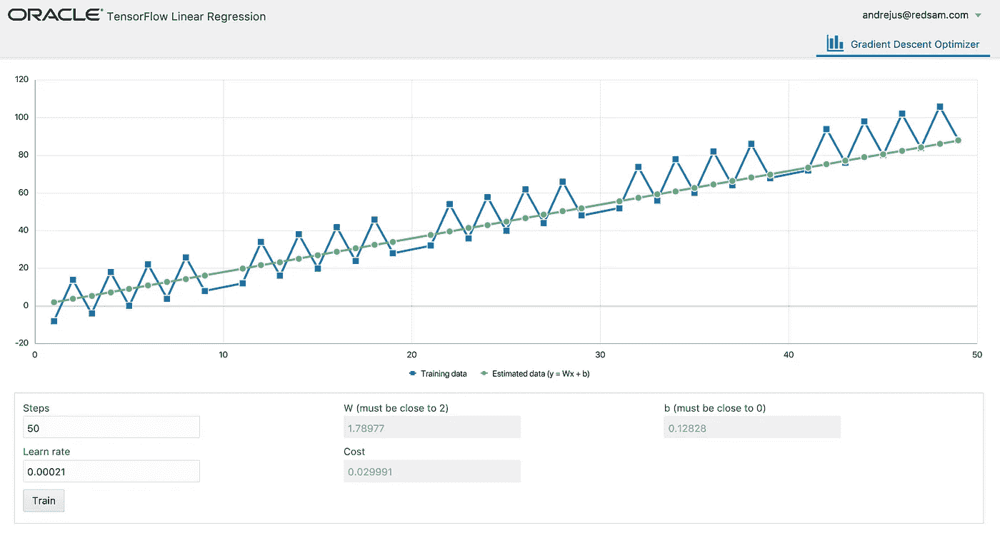
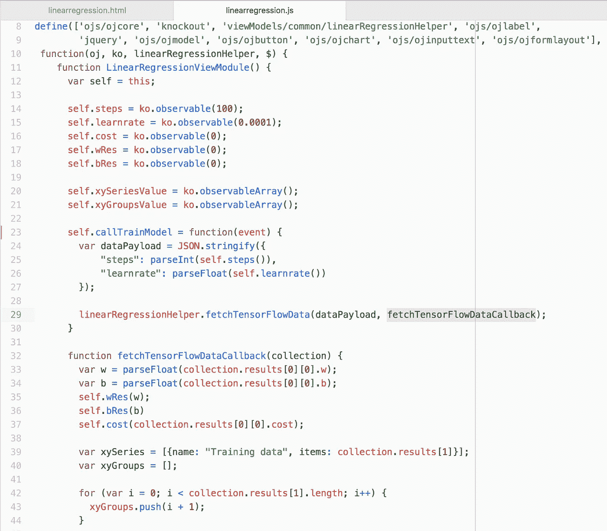
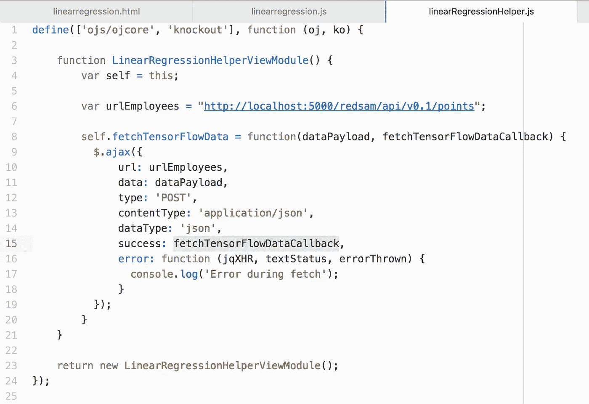
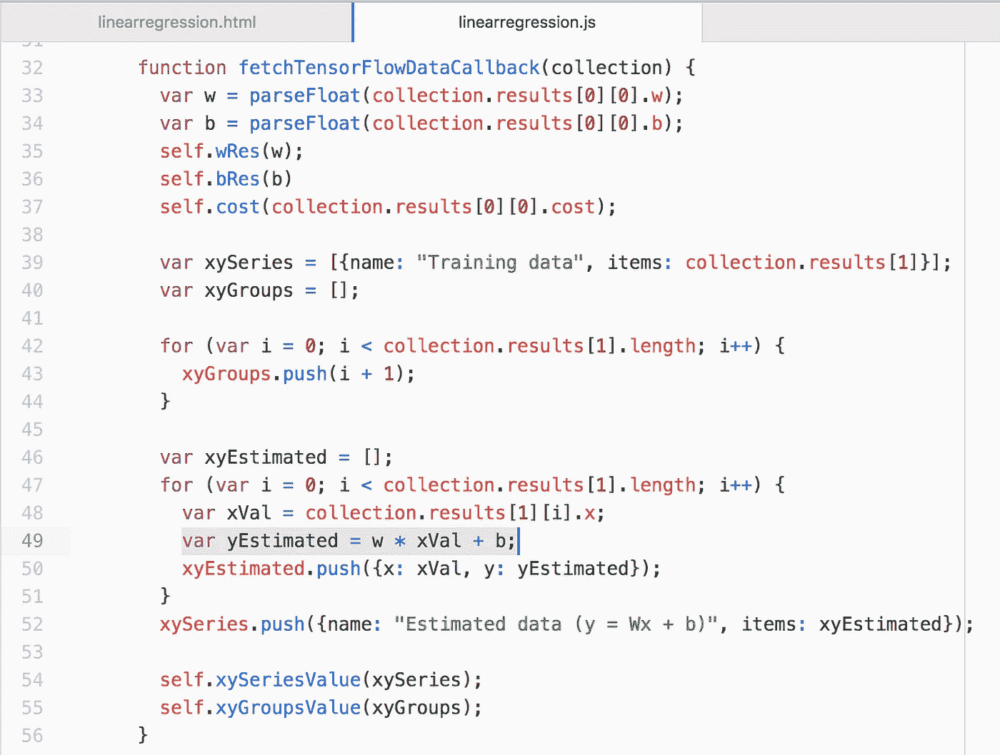
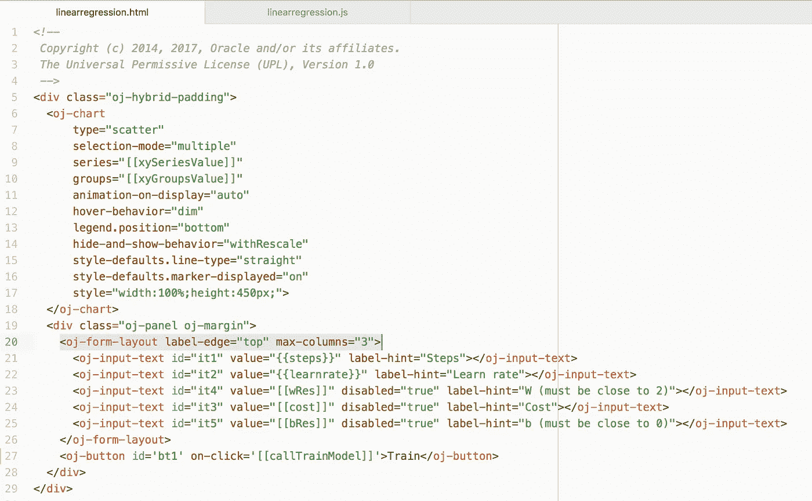
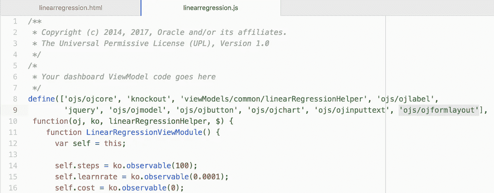
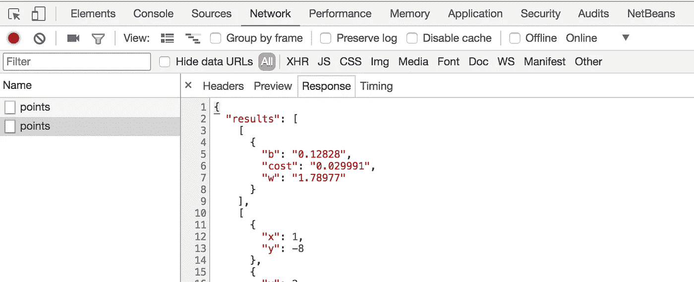
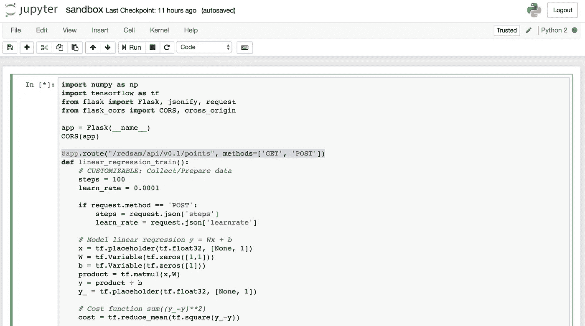

# 使用 Oracle JET 和 TensorFlow 进行机器学习

> 原文：<https://medium.com/oracledevs/machine-learning-with-oracle-jet-and-tensorflow-fb1b93873011?source=collection_archive---------0----------------------->

Oracle JET 可与任何类型的 REST 服务协同工作，此类服务可能来自 TensorFlow(在我的上一篇文章中阅读更多信息— [TensorFlow 使用 Flask](http://andrejusb.blogspot.lt/2017/12/tensorflow-linear-regression-model.html) 通过自定义 REST API 访问线性回归模型)。我在 TensorFlow 中实现了带有梯度下降优化器的线性回归模型(将在我的下一篇文章中更详细地描述这一点——机器学习完全是关于数学的),并在 JET UI 中使用它:

有一个选项来定义训练步骤(或数据点)和学习率。作为结果，我们得到线性方程 *y = Wx + b* 的 W 和 b 值。在执行训练(所谓的机器学习过程)之后，识别出 *W* 和 *b* 参数，这允许预测任意 *x* 的 *y* 值。在我的下一篇文章中会有更多关于这方面的内容，今天我将集中讨论 JET。为了执行训练，我们调用 TensorFlow REST API 端点并传递训练步数/点数和学习率。我已经创建了 JET helper 模块来执行实际 REST 调用，将逻辑与 REST 调用分离开来。有用的自定义回调技术用于从帮助模块调用位于主模块中的方法。我们通过回调方法名 REST 调用 helper 函数:

REST 调用通过 JQuery 执行，成功的回调用我们的方法名赋值(我们可以在主模块中进行处理，而不是在 REST 调用帮助器方法中处理结果):

这就是结果处理发生的地方——在自定义回调方法中。我们准备了 *x/y* 训练数据集以显示在图表中。我们得到估计的 *W* 和 *b* 参数，这允许基于等式 *y = Wx + b* 为训练集中使用的所有 *x* 值计算估计的 *y* (以比较模型的训练情况):

Oracle JET 的一个更好的组件——表单布局。它使得创建简单的表单、指定最大列数变得非常容易，并且您将获得开箱即用的表单组件的响应 UI:

务必添加 *ojformlayout* 模块:

要调试 TensorFlow REST 服务返回的数据，请在浏览器开发工具中检查网络历史记录:

顺便说一下 REST JSON 数据形状完全由您决定。使用来自 Flask 的 Python jsonify，您可以从数据数组构建 JSON，并在 Python 脚本中的任何地方发布您自己的 REST 端点(您在 Python 中为 TensorFlow 编写代码):

从 [GitHub](https://github.com/abaranovskis-redsamurai/linearregressionui) 下载示例 JET 应用程序(确保在 ojet 服务之前使用 ojet restore)。本样本使用的 TensorFlow 线性回归模型可从 [GitHub Gist](https://gist.github.com/abaranovskis-redsamurai/ddc0891f19d4c2f094c1e64b0300729e) 获得。

*原载于 2017 年 12 月 16 日*[*andrejusb.blogspot.com*](https://andrejusb.blogspot.lt/2017/12/machine-learning-with-oracle-jet-and.html)*。*