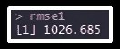

# 用 R 中的一个例子理解机器学习

> 原文：<https://medium.com/edureka/machine-learning-with-r-c7d3edf1f7b?source=collection_archive---------6----------------------->


Machine Learning with R — Edureka

机器学习是现在，也是未来！从网飞的推荐引擎到谷歌的自动驾驶汽车，都是机器学习。这篇关于用 R 实现机器学习的文章帮助你理解机器学习的核心概念，以及不同的机器学习算法和用 R 实现这些机器学习算法。

本文由以下几部分组成:

*   理解机器学习
*   机器学习算法的类型
*   用 R 实现机器学习算法

# 理解机器学习

*   机器学习算法的类型
*   用 R 实现机器学习算法

# 理解机器学习


你怎么知道这些都是鱼？

作为一个孩子，你可能会看到一张鱼的照片，你的幼儿园老师或父母会告诉你这是一条鱼，它有一些特定的特征，比如它有鳍，鳃，一双眼睛，一条尾巴等等。现在，每当你的大脑遇到具有这些特征的图像，它会自动将其注册为一条鱼，因为你的大脑*已经*知道它是一条鱼。

这就是我们大脑的运作方式，但是机器呢？如果把同样的图像输入机器，机器将如何识别它是一条鱼？


这就是 M *achine Learning* 的用武之地。我们将继续向带有“鱼”标签的计算机输入鱼的图像，直到*机器学习到与*鱼相关的*的所有特征。*


一旦机器学习了与鱼相关的所有特征，我们将向它输入新数据，以确定它学习了多少。


换句话说，*原始数据/训练数据*被提供给机器，因此它*学习*与*训练数据相关的所有特征。*一旦学习完成，它将获得*新数据/测试数据*以确定机器学习的程度。

让我们在这篇关于机器学习的文章中继续前进，了解机器学习的类型。

# 机器学习的类型

## 监督学习:

监督学习算法从具有标签的已知数据集(训练数据)中学习，以进行预测。


回归和分类是监督学习的一些例子。

***分类:***

分类确定新的观察值属于哪一组类别，即分类算法学习训练数据的所有特征和标签，并且当新的数据被提供给它时，它必须根据它从训练数据中学习到的内容为新的观察值分配标签。


对于这个例子，如果第一个观察被赋予标签“男人”,那么它被正确地分类，但是如果它被赋予标签“女人”,那么分类是错误的。类似地，对于第二个观察，如果给定的标签是“女人”，它被正确地分类，否则分类是错误的。

***回归:***

回归是一种监督学习算法，有助于确定一个变量如何影响另一个变量。


在这里，“居住面积”是自变量，“价格”是因变量，即我们确定“价格”如何随“居住面积”而变化。

## 无监督学习:

无监督学习算法从没有标签的数据中进行推理。


*聚类*就是无监督学习的一个例子。“K-均值”、“分层”、“模糊 C-均值”是聚类算法的一些例子。


在这个例子中，观察值集合被分成两个集群。聚类是基于观察值之间的相似性来完成的。存在高的组内相似性和低的组间相似性，即，在所有公共汽车之间存在非常高的相似性，但是在公共汽车和汽车之间存在低的相似性。

## 强化学习:

强化学习是一种机器学习算法，其中在*环境*中的*机器/代理*学习理想的行为以最大化其性能。代理人需要简单的奖励反馈来学习它的行为，这被称为*强化信号*。


就拿*吃豆人*来说吧。只要吃豆人继续吃食物，它就能获得积分，但当它撞上怪物时，它就失去了生命。因此，吃豆人知道它需要吃更多的食物，并避免怪物，以提高其性能。

# 用 R 实现机器学习；

## 线性回归:

我们将使用 diamonds 数据集来实现线性回归算法:


数据集的描述:


在对数据建立任何模型之前，我们应该将数据分成“训练”和“测试”集。该模型将在“列车”装置上建立，其准确性将在“测试”装置上检查。

我们需要加载“caTools”包来将数据分成两组。

```
library(caTools)
```

“caTools”包提供了一个函数“sample.split()”，有助于拆分数据。

```
sample.split(diamonds$price,SplitRatio = 0.65)->split_index
```

价格列中 65%的观察值被指定为“真”标签，其余 35%被指定为“假”标签。

```
subset(diamonds,split_index==T)->train subset(diamonds,split_index==F)->test
```

所有具有“真”标签的观察值已被存储在“*训练”对象*中，而那些具有“假”标签的观察值已被分配给“测试”组。

现在，拆分已经完成，我们有了“训练”和“测试”集，是时候在训练集上构建线性回归模型了。

我们将使用“lm()”函数来构建“train”数据的线性回归模型。我们根据数据集的所有其他变量来确定钻石的价格。构建的模型存储在对象“mod _ regressive”中。

```
lm(price~.,data = train)->mod_regress
```

现在，我们已经建立了模型，我们需要对“测试”集进行预测。“predict()”函数用于获得预测值。它需要两个参数:T2 制造的模型 T3 和 T4 测试集。预测结果存储在“result _ regressive”对象中。

```
predict(mod_regress,test)->result_regress
```

让我们使用“cbind()”函数将“测试”数据集中的实际价格值和预测值绑定到一个数据集中。新的数据帧存储在“最终数据”中

```
cbind(Actual=test$price,Predicted=result_regress)->Final_Dataas.data.frame(Final_Data)->Final_Data
```

浏览由实际值和预测值组成的“最终数据”:


让我们通过从实际值中减去预测值来找出误差，并将该误差作为新列添加到“Final_Data”中:

```
(Final_Data$Actual- Final_Data$Predicted)->errorcbind(Final_Data,error)->Final_Data
```

“最终数据”也包括预测误差:


现在，我们将继续计算"*均方根误差"*，它给出了所有预测的总误差

```
rmse1<-sqrt(mean(Final_Data$error^2))rmse1
```



接下来，让我们建立另一个模型，以便我们可以比较这两个模型的准确性，并确定哪个模型更好。

我们将在“train”集合上建立一个新的线性回归模型，但这一次，我们将从独立变量中删除“x”和“y”列，即钻石的“价格”由除“x”和“y”之外的所有列决定。

建立的模型存储在“mod _ regression 2”中:

```
lm(price~.-y-z,data = train)->mod_regress2
```

预测结果存储在“result _ regression 2”中

```
predict(mod_regress2,test)->result_regress2
```

实际值和预测值合并存储在“Final_Data2”中:

```
cbind(Actual=test$price,Predicted=result_regress2)->Final_Data2as.data.frame(Final_Data2)->Final_Data2
```

让我们也将预测中的误差添加到“Final_Data2”中

```
(Final_Data2$Actual- Final_Data2$Predicted)->error2cbind(Final_Data2,error2)->Final_Data2
```

“Final_Data2”一瞥:


寻找均方根误差以获得总误差:

```
rmse2<-sqrt(mean(Final_Data2$error^2))
```


我们看到“rmse2”略小于“rmse1”，因此第二个模型略好于第一个模型。

## 分类:

我们将使用“car_purchase”数据集来实现分类算法*递归分区*。


让我们使用“caTools”包中的“sample.split()”函数将数据分成“训练”和“测试”组。

```
library(caTools)
```

“已购买”栏中 65%的观察值将被指定为“真”标签，其余的将被指定为“假”标签。

```
sample.split(car_purchase$Purchased,SplitRatio = 0.65)->split_values
```

所有那些具有“真”标签的观察值将被存储到“训练”数据中，而那些具有“假”标签的观察值将被分配给“测试”数据。

```
subset(car_purchase,split_values==T)->train_datasubset(car_purchase,split_values==F)->test_data
```

构建递归分区算法的时间:

我们将从加载“rpart”包开始:

```
library(rpart)
```

“已购买”列将是因变量，所有其他列都是自变量，即我们将根据所有其他列来确定此人是否购买了汽车。模型建立在“train_data”上，结果存储在“mod1”中。

```
rpart(Purchased~.,data = train_data)->mod1
```

让我们画出结果:

```
plot(mod1,margin = 0.1) text(mod1,pretty = T,cex=0.8)
```


现在，让我们继续在“test_data”上预测结果。我们将构建的 rpart 模型“mod1”作为第一个参数，测试集“test_data”作为第二个参数，预测类型作为第三个参数的“class”。结果存储在“result1”对象中。

```
predict(mod1,test_data,type = "class")->result1
```

让我们使用 caret 包中的“confusionMatrix()”函数来评估模型的准确性。

```
library(caret) confusionMatrix(table(test_data$Purchased,result1))
```


混淆矩阵告诉我们，在这个人没有买车的 90 次观察中，79 次观察被正确地归类为“否”，11 次被错误地归类为“是”。类似地，在这个人实际购买汽车的 50 次观察中，47 次被正确地分类为“是”，3 次被错误地分类为“否”。

我们可以通过将正确预测除以总预测，即(79+47)/(79+47+11+3)，来确定模型的准确性。

## k 均值聚类:

我们将使用“iris”数据集来实现 k-means 聚类:


让我们删除“物种”列，并创建一个新的数据集，该数据集仅包含“iris”数据集的前四列。

```
iris[1:4]->iris_k
```

让我们假设集群的数量为 3。“Kmeans()”函数接受输入数据和数据将被聚类的聚类数。语法是:kmeans( data，k)其中 k 是聚类中心的数量。

```
kmeans(iris_k,3)->k1
```

分析聚类:

```
str(k1)
```


str()函数给出了 kmeans 的结构，其中包括各种参数，如 withinss、betweenss 等，分析这些参数可以了解 kmeans 的性能。

**betweenss :** 平方和之间，即聚类内相似性

**内:**平方和内即簇间相似度

**总相似度:**所有类的所有相似度之和，即总的类内相似度

好的聚类将具有较低的“tot.withinss”值和较高的“betweenss”值，这取决于最初选择的聚类数“k”。

成为机器学习专家的时机已经成熟，可以利用你遇到的新机会。这就把我们带到了这篇“ ***机器学习带 R*** ”文章的结尾。我希望这篇文章是有益的。

如果你想查看更多关于 Python、DevOps、Ethical Hacking 等市场最热门技术的文章，那么你可以参考 [Edureka 的官方网站。](https://www.edureka.co/blog/?utm_source=medium&utm_medium=content-link&utm_campaign=machine-learning-with-r)

请留意本系列中的其他文章，它们将解释数据科学的各个方面。

> *1。* [*数据科学教程*](/edureka/data-science-tutorial-484da1ff952b)
> 
> *2。* [*数据科学的数学与统计*](/edureka/math-and-statistics-for-data-science-1152e30cee73)
> 
> *3。*[*R 中的线性回归*](/edureka/linear-regression-in-r-da3e42f16dd3)
> 
> *4。* [*机器学习算法*](/edureka/machine-learning-algorithms-29eea8b69a54)
> 
> *5。*[*R 中的逻辑回归*](/edureka/logistic-regression-in-r-2d08ac51cd4f)
> 
> *6。* [*分类算法*](/edureka/classification-algorithms-ba27044f28f1)
> 
> *7。* [*随机森林中的 R*](/edureka/random-forest-classifier-92123fd2b5f9)
> 
> *8。* [*决策树中的 R*](/edureka/a-complete-guide-on-decision-tree-algorithm-3245e269ece)
> 
> *9。* [*机器学习入门*](/edureka/introduction-to-machine-learning-97973c43e776)
> 
> *10。* [*朴素贝叶斯在 R*](/edureka/naive-bayes-in-r-37ca73f3e85c)
> 
> *11。* [*统计与概率*](/edureka/statistics-and-probability-cf736d703703)
> 
> *12。* [*如何创建一个完美的决策树？*](/edureka/decision-trees-b00348e0ac89)
> 
> *13。* [*关于数据科学家角色的 10 大误区*](/edureka/data-scientists-myths-14acade1f6f7)
> 
> *14。* [*顶级数据科学项目*](/edureka/data-science-projects-b32f1328eed8)
> 
> *15。* [*数据分析师 vs 数据工程师 vs 数据科学家*](/edureka/data-analyst-vs-data-engineer-vs-data-scientist-27aacdcaffa5)
> 
> *16。* [*人工智能的种类*](/edureka/types-of-artificial-intelligence-4c40a35f784)
> 
> *17。*[*R vs Python*](/edureka/r-vs-python-48eb86b7b40f)
> 
> *18。* [*人工智能 vs 机器学习 vs 深度学习*](/edureka/ai-vs-machine-learning-vs-deep-learning-1725e8b30b2e)
> 
> *19。* [*机器学习项目*](/edureka/machine-learning-projects-cb0130d0606f)
> 
> 20。 [*数据分析师面试问答*](/edureka/data-analyst-interview-questions-867756f37e3d)
> 
> *21。* [*面向非程序员的数据科学和机器学习工具*](/edureka/data-science-and-machine-learning-for-non-programmers-c9366f4ac3fb)
> 
> *22。* [*十大机器学习框架*](/edureka/top-10-machine-learning-frameworks-72459e902ebb)
> 
> *23。* [*用于机器学习的统计*](/edureka/statistics-for-machine-learning-c8bc158bb3c8)
> 
> *24。* [*随机森林中 R*](/edureka/random-forest-classifier-92123fd2b5f9)
> 
> *二十五。* [*广度优先搜索算法*](/edureka/breadth-first-search-algorithm-17d2c72f0eaa)
> 
> *二十六。*[*R 中的线性判别分析*](/edureka/linear-discriminant-analysis-88fa8ad59d0f)
> 
> *27。* [*机器学习的先决条件*](/edureka/prerequisites-for-machine-learning-68430f467427)
> 
> *28。* [*互动 WebApps 使用 R 闪亮*](/edureka/r-shiny-tutorial-47b050927bd2)
> 
> *29。* [*机器学习十大书籍*](/edureka/top-10-machine-learning-books-541f011d824e)
> 
> *30。* [*无监督学习*](/edureka/unsupervised-learning-40a82b0bac64)
> 
> *31。* [*10 本最好的数据科学书籍*](/edureka/10-best-books-data-science-9161f8e82aca)
> 
> *32。* [*监督学习*](/edureka/supervised-learning-5a72987484d0)

*原载于 2018 年 6 月 14 日*[*www.edureka.co*](https://www.edureka.co/blog/machine-learning-with-r)*。*