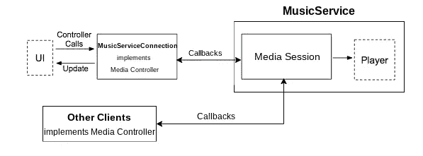
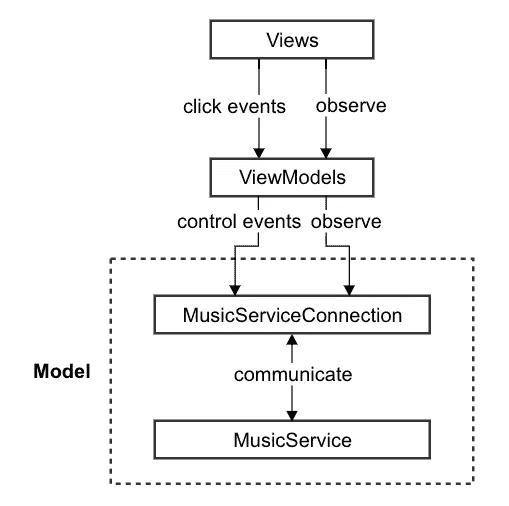
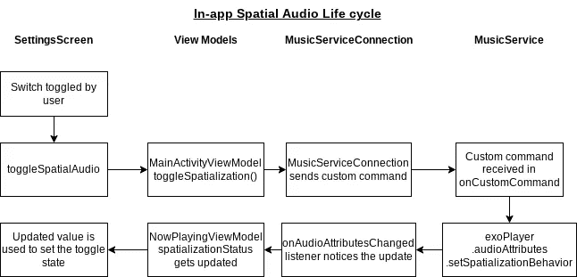

# 疯狂迷恋媒体

> 原文：<https://medium.com/androiddevelopers/mad-about-media-f536f7d601c?source=collection_archive---------0----------------------->

*媒体应用的现代安卓开发(MAD)*

*来见见我们的暑期 Android DevRel 工程师实习生 Avish Parmar！*

大家好！

我在谷歌的 Android DevRel 团队做了一个夏天的开发者关系工程师实习生。加入谷歌后，我欣喜若狂，因为有机会对开发者社区产生影响。在这篇博文中，我将通过我的经验来讨论创建 Android 媒体应用程序的现代方法，我将通用 Android 媒体播放器(UAMP)媒体播放示例应用程序转换为 Compose，并更新它以使用 Media3 等现代库。

# 从零开始

作为一个具有 Java 背景的 Android 开发新手，学习 Kotlin 是一件轻松愉快的事情。同样，我能够依靠我对声明性框架的了解，比如 React to learn[Jetpack Compose](http://d.android.com/compose)，Android 的现代 UI 工具包。以下是我注意到的一些相似之处:

*   就像 React 一样，Compose 允许开发人员构建 ui，同时使用 Compose 的[预览功能](https://developer.android.com/jetpack/compose/tooling#preview)查看他们正在创建的内容。
*   Compose 的语法类似于 React，但更简洁，因为所有的标记(如不同语言的字符串)都隐藏在应用程序的资源文件中，并使用适当的资源函数进行引用。

*Button implementation in React*

*Button implementation in Compose*

# 向 UAMP 进军

我的目标是改造 UAMP，使其融入现代 Android 开发(MAD)原则。首先，我需要了解 Android 媒体应用的架构，熟悉 UAMP 是如何实现的。

这是 UAMP 的整体建筑:

**音乐服务:**

最近，UAMP 被迁移到使用新的 Jetpack Media3 库，这使得 Android 应用程序能够创建丰富的音频和视觉体验。Media3 整合了传统 API，如 Jetpack Media(也称为 MediaCompat)、Jetpack Media2 和 Exoplayer2。它引入了一个当前开发人员熟悉的更简单的架构，允许您更容易地构建和维护您的应用程序。

代表 UAMP 的“服务器”方面或“后端”。

下图描述了`MusicService`:

`MusicService`由两部分组成，`[MediaSession](https://github.com/androidx/media/blob/50475814f700d08519c88585c9583f2aba5d702e/libraries/session/src/main/java/androidx/media3/session/MediaSession.java)`和`Player`。`MediaSession`表示正在进行的媒体回放会话。它提供了各种机制来控制回放、接收状态更新和检索有关当前媒体的元数据。UAMP 使用`ExoPlayer`，Media3 的默认`Player`实现，进行回放。

一个`[MediaController](https://github.com/androidx/media/blob/release/libraries/session/src/main/java/androidx/media3/session/MediaController.java)`用于与`MediaSession`通信。`MediaController`由`MusicServiceConnection`在 UAMP 实现，也可能由其他客户端实现，用于与`MediaSession`通信。

要了解更多关于 Media3 的信息，请查阅 [Media3 文档](https://developer.android.com/guide/topics/media/media3/)。

**用户界面:**

UAMP 使用`Model-View-ViewModel`架构来支持抽象和各层之间的责任划分。

我将 UAMP 转换为 Compose 的主要任务是将视图重写为 Compose 屏幕，将它们连接到各自的视图模型。

UAMP 有三个主要的 UI 类——一个活动和两个片段:

*   `[MainActivity](https://github.com/android/uamp/blob/2cb3b89c62b9b3b882468ef903d101280d06f5aa/app/src/main/java/com/example/android/uamp/MainActivity.kt)`负责两个片段之间的交换。
*   `[MediaItemFragment](https://github.com/android/uamp/blob/2cb3b89c62b9b3b882468ef903d101280d06f5aa/app/src/main/java/com/example/android/uamp/fragments/MediaItemFragment.kt)`负责浏览音乐目录。它显示媒体项目列表，可以是专辑或歌曲。轻触专辑将显示一个新的`MediaItemFragment`，其中包含该专辑中的歌曲。点击歌曲将开始播放该歌曲并显示`NowPlayingFragment`。
*   `[NowPlayingFragment](https://github.com/android/uamp/blob/2cb3b89c62b9b3b882468ef903d101280d06f5aa/app/src/main/java/com/example/android/uamp/fragments/NowPlayingFragment.kt)`显示当前正在播放的歌曲。

这两个片段将被[转换](https://developer.android.com/jetpack/compose/interop/interop-apis#compose-in-fragments)以进行组合，同时出于转换的目的，保持`MainActivity`或多或少不变。

# 编写新的用户界面

UAMP 使用视图绑定和数据绑定来与视图交互。

视图绑定允许您更容易地编写与视图交互的代码，并且在 Compose 中是不需要的。数据绑定允许您使用声明性(而非编程性)格式将布局中的 UI 组件绑定到应用程序中的数据源。

以下是转换使用视图绑定进行合成的应用程序的三种方法:

1.  删除用于设置绑定的适配器(例如 UAMP 的[mediaitemdadapter](https://github.com/android/uamp/blob/12cc476714d6a2c07865543b7f74e2e3d1a6ffcd/app/src/main/java/com/example/android/uamp/MediaItemAdapter.kt)),并使用这些值来填充组件。这种方法是有效的，因为您不必更改由各个片段建立的底层框架，并且代码可以被重定向以使用 Composables。
2.  如果您的应用程序使用片段，删除片段并从头创建屏幕是另一种可行的方法，尽管这种方法可能有点麻烦，因为片段实现可能包含一些需要在可组合函数中重新实现的逻辑。
3.  为了保持视图绑定，一种方法是在 Compose 中只实现 UI 的某些部分。通过使用各自的视图功能，例如`binding.view_id_name.setText()`，可以继续访问视图。可以通过`binding.composeview_id_name.apply { /* All the Compose code here */ }.`访问组件

我选择删除`MediaItemAdapter`并保留片段，这样我就可以重用已经在 UAMP 实现的业务逻辑。这是可能的，因为像 Compose 这样的反应式框架消除了绑定视图的需要。

对于数据绑定，我使用了`observeAsState`函数将组件绑定到`LiveData`。每当关联的 LiveData 中有更改时，编写屏幕就会重新编写并传播这些更改。

After setting observeAsState for the position attribute of a mediaItem, Compose takes over state management tasks

完成这些后，我开始将 UI 的组件转换为 Compose。比如我把`RecyclerView`改成了`LazyColumn`。

Before: Defining the RecyclerView in the XML layout

Before: Business logic to populate the RecyclerView with media items

After: LazyColumn in Compose handles both defining the UI and populating the list with items

最后一步是在片段的`onCreateView`函数中返回一个`ComposeView`(例如，参见`MediaListFragment`的`onCreateView`函数[这里的](https://github.com/android/uamp/blob/2cb3b89c62b9b3b882468ef903d101280d06f5aa/app/src/main/java/com/example/android/uamp/fragments/MediaItemFragment.kt#L67))来显示相关的屏幕。屏幕包含定义 UI 的可组合函数和将屏幕连接到视图模型中嵌入的业务逻辑的处理程序。

*The play/pause icon defines a handler which invokes the appropriate view model function to play/pause the now playing media item.*

我还创建了一个 Compose 屏幕，`[NowPlayingScreen](https://github.com/android/uamp/blob/2cb3b89c62b9b3b882468ef903d101280d06f5aa/app/src/main/java/com/example/android/uamp/fragments/NowPlayingScreen.kt)`，它使用 Composables 来单独显示当前播放项目的相关元数据，比如专辑封面、标题、&持续时间。

# 被新功能包围:

Media3 可以轻松采用空间音频等新功能，该功能可以让您的应用程序播放声音，就好像声音来自放置在听众周围的虚拟扬声器，以获得更真实的体验。随着 [Media3 1.0.0-beta02](https://developer.android.com/jetpack/androidx/releases/media3#1.0.0-beta02) 的最新发布，`ExoPlayer`经过更新，可配置多声道空间音频平台。

为了整合空间音频，我创建了一个[设置屏幕](https://github.com/android/uamp/blob/2cb3b89c62b9b3b882468ef903d101280d06f5aa/app/src/main/java/com/example/android/uamp/fragments/SettingsScreen.kt)，它将允许用户切换应用内空间音频，并从 Spatializer API 中检索当前播放媒体项目的信息。下面是应用内切换控件的实现方式:

*描述流程的 5 个代码片段。*

*SettingsScreen Switch and toggleSpatialAudio implementation*

*MainActivityViewModel toggleSpatialization sends a custom command to MusicService via MusicServiceConnection*

`*spatializationBehavior*` *audio attribute is set for ExoPlayer instance*

*onAudioAttributesChanged is invoked in MusicServiceConnection which then posts the updated value to isAppSpatializationEnabled*

*isAppSpatializationEnabled observer in NowPlayingFragmentViewModel invokes updateState which updates the value of spatializationStatus*

# 思考作曲和媒体 3:

Compose 是我进入 Android 开发的一个很好的方式，因为我能够依靠我在其他声明性框架方面的经验，并简化我编写的代码。能够与 XML 互操作组合使得将 UAMP 片段转换为组合屏幕变得无缝，因为我可以利用已经用于视图的底层业务逻辑。Compose 还允许我通过使用@Preview 注释在实时 UI 预览中可视化组件和属性的变化来“查看我编写了什么”。由于 Compose 负责视图绑定之类的状态管理，所以我可以专注于让 UAMP 的 UI 变得美观和具有交互性。

新的库正在被积极地引入 Compose，以改进当前的功能并添加新的特性。要参与进来，你可以加入 Compose [社区](https://developer.android.com/jetpack/community)并分享你的反馈。有了蓬勃发展的开发人员社区和频繁的更新，很容易找到您可能遇到的问题的解决方案。社区已经开发了高质量的库来处理流行的用例，比如动态图像获取。我强烈建议任何开发人员，不管是新的还是老的，在创建一个新的应用程序、向现有应用程序添加新的屏幕或者将应用程序迁移到 Compose 时，至少尝试一下 Compose。

回到 Media3，它在本质上作为几个媒体库之间的桥梁所提供的简单性和兼容性证明了它的效率和有效性。Media3 库使开发人员能够更轻松地将空间音频等现代功能集成到他们的应用程序中，同时需要更少的代码和更简单的架构。从开发人员的角度来看，Media3 是您可能需要的所有媒体功能的一站式商店。

# 我的成长:

在这个项目中，我学到了很多东西；不仅仅是技术上的，作为一个开发者，心理上也是如此。很快，学习 Kotlin 和 Jetpack 库让我扩展了我的知识和技能。作为一名开发人员关系工程师实习生，我更深入地了解了 Roman Nurik 关于 DevRel 的“[边走边谈](/google-developers/walk-then-talk-3b935bfe5484)”哲学的价值，这意味着不仅要批判性地思考最佳实践，还要站在其他开发人员的角度考虑问题，这些库旨在满足他们的大量用例。希望我已经让你相信了为你的媒体应用程序采用现代 Android 开发技术的好处。

现代库，如 Compose 和 Media3，定期发布和更新，使开发人员更容易利用新的工具和功能。虽然 MAD 提高了标准，但鉴于其简单性，它也降低了新开发人员开始 Android 开发的学习曲线。

# 延伸阅读:

**了解更多关于 UAMP 的信息:**

https://github.com/android/uamp

**了解更多关于撰写的信息:**

[https://developer.android.com/jetpack/compose/](https://developer.android.com/jetpack/compose/documentation)

**了解更多关于 Media3 的信息:**

[https://github.com/androidx/media](https://github.com/androidx/media)

**了解如何迁移应用程序以编写:**

[https://developer . Android . com/codelabs/jetpack-compose-migration # 0](https://developer.android.com/codelabs/jetpack-compose-migration#0)