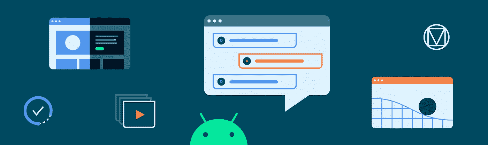

# MAD 技能材料设计组件:总结

> 原文：<https://medium.com/androiddevelopers/mad-skills-material-design-components-wrap-up-d22a2df069c8?source=collection_archive---------0----------------------->

## 我们希望你喜欢我们的材料

# 是个 wrap_content！

关于现代 Android 开发的 [MAD Skills 系列视频和文章](https://developer.android.com/series/mad-skills)中的第三个主题已经完成。这一次，我们讨论了材料设计组件(又称 MDC)。这个[库](https://github.com/material-components/material-components-android)提供了 Android 小部件形式的材质组件，使得实现 material.io 上看到的设计模式变得容易，比如材质主题、黑暗主题和运动。

查看下面的剧集和链接，看看我们都报道了什么。我们*设计了*这些视频，以紧密跟随我们最近的 MDC 文章系列以及现有的示例应用和 codelabs，因此您有多种方式来参与内容。我们还有一个问答节目，主角是来自 MDC 团队的工程师！

# 第一集:为什么要用 MDC？

Nick Butcher 的第一集是整个 MAD 技能系列的概述视频，包括我们为什么推荐 MDC，然后深入探讨材料主题、黑暗主题和运动。它还介绍了 MDC 与 Jetpack Compose 的互操作，以及对 Android Studio 模板的更新，包括 MDC 和主题/样式最佳实践。

或者以文章形式:

 [## 我们推荐材料设计组件

### 原因如下

medium.com](/androiddevelopers/we-recommend-material-design-components-81e6d165c2dd) 

# 第 2 集:材料主题化

Nick Rout 撰写的第 2 集涵盖了[素材主题化](https://material.io/design/material-theming/overview.html#material-theming)，并介绍了如何使用 MDC 在 Android 上实现它的教程。关键主题包括设置一个`Theme.MaterialComponents.*`应用程序主题，选择颜色、类型和形状属性——使用 material.io 上的工具——最后将它们添加到您的主题中，以查看小部件如何自动做出反应并调整其 UI。还介绍了 MDC 为某些场景提供的便利实用程序类，比如解析主题颜色属性和对图像应用形状。

或者以文章形式:

 [## 使用 MDC 的材质主题:颜色

### 使用 MDC 库的 Android 颜色主题

medium.com](/androiddevelopers/material-theming-with-mdc-color-860dbba8ce2f)  [## 使用 MDC 的材质主题:类型

### 使用 MDC 库在 Android 上输入主题

medium.com](/androiddevelopers/material-theming-with-mdc-type-8c2013430247)  [## 使用 MDC 的材质主题:形状

### 使用 MDC 库在 Android 上设计主题

medium.com](/androiddevelopers/material-theming-with-mdc-shape-126c4e5cd7b4) 

# 第三集:黑暗主题

由[克里斯·贝恩斯](https://medium.com/u/9303277cb6db?source=post_page-----d22a2df069c8--------------------------------)制作的这一集变得非常黑暗……它将带你完成一个使用 MDC 的安卓应用的[黑暗主题](https://material.io/design/color/dark-theme.html)。涵盖的主题包括使用“强制黑暗”进行快速转换(以及如何从中排除视图)，手动制作带有设计选项的黑暗主题，`.DayNight` MDC 应用程序主题，`.PrimarySurface` MDC 小部件样式，以及如何处理系统 UI。

或者以文章形式:

 [## MDC 的黑暗主题

### 使用材料设计组件实现黑暗主题

medium.com](/androiddevelopers/dark-theme-with-mdc-4c6fc357d956) 

# 第四集:物质运动

第四集由[尼克·鲁特](https://medium.com/u/37290b859aca?source=post_page-----d22a2df069c8--------------------------------)制作，讲述的是[材质的运动系统](https://material.io/design/motion/the-motion-system.html)。它严格遵循现有的“为 Android 构建具有材质运动的美丽过渡”中的步骤 [codelab](https://codelabs.developers.google.com/codelabs/material-motion-android) 。它使用 Reply 示例应用程序来演示如何使用过渡模式——容器转换、共享轴、淡入淡出和淡出——以获得更流畅、更易于理解的用户体验。它经历了涉及片段(包括[导航组件](/androiddevelopers/mad-skills-navigation-wrap-up-4e5733ecb107))、活动和视图的场景，如果你以前使用过 AndroidX 和平台转换框架，你会感觉很熟悉。

或者以文章形式:

 [## 使用 MDC 的材料运动

### 为 Android 构建带有材质运动的美丽过渡

medium.com](/androiddevelopers/material-motion-with-mdc-c1f09bb90bf9) 

# 第 5 集:社区提示

第 5 集是由 Android 社区的一名成员——Android 的谷歌开发专家(GDE)Zarah Dominguez[——带领我们使用](https://medium.com/u/19d8ca156951?source=post_page-----d22a2df069c8--------------------------------) [MDC 目录应用程序](https://github.com/material-components/material-components-android/tree/master/catalog)作为小部件功能和 API 示例的参考。她还解释了在她工作的应用程序中建立一个“主题展示”页面的好处，以确保不同屏幕和流程之间有一个连贯的设计语言。

# 第六集:现场问答

总结一下(正如我们在过去系列中所做的)，Chet Haase 与 MDC 工程团队的成员 Dan Nizri 和 Connie Shi 一起主持了一次问答会议。我们回答了您在 YouTube Live、Twitter 和其他地方提出的问题。我们探讨了 MDC 的起源，它与 AppCompat 的关系，以及它是如何发展的。其他主题包括组织你的主题和资源的最佳实践，使用不同的字体和排版风格，形状主题化…很多形状主题化。我们还展示了所有我们喜欢的材料成分！最后，我们展望了 MDC 和 [Jetpack Compose](https://developer.android.com/jetpack/compose) 中新组件的未来，这是 Android 的下一代 UI 工具包，默认内置材料设计。

# 示例应用程序

在本系列中，我们使用了两个不同的示例应用程序来演示 MDC:

*   [“构建一个材质主题”](https://material.io/resources/build-a-material-theme)(又名 MaterialThemeBuilder)是一个交互式项目，让你通过自定义颜色、字体和形状的值来创建自己的材质主题
*   [回复](https://material.io/design/material-studies/reply.html)是材料研究之一；一个电子邮件应用程序，使用材料设计组件和材料主题创建品牌传播体验

这两个都可以在 MDC examples GitHub 存储库中与另一个材料研究示例应用程序 [Owl](https://material.io/design/material-studies/owl.html) 一起找到。

 [## 材料-组件/材料-组件-Android-示例

### 这个库中的应用程序是虚构材料研究的 Android 实现。每一个都是使用…

github.com](https://github.com/material-components/material-components-android-examples)