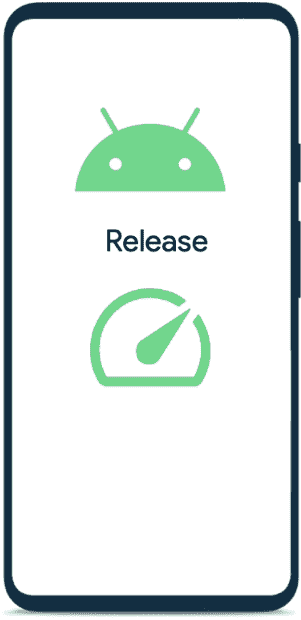

# MAD 技能表演—总结

> 原文：<https://medium.com/androiddevelopers/mad-skills-performance-wrap-up-33688abfc51f?source=collection_archive---------1----------------------->

Illustration by Claudia Sanchez

八月份，MAD 技能视频和博客系列将帮助您开始学习性能。事情的要点是这样的。

# 设置场景

在介绍关于绩效的 MAD 技能系列时，我们分享了我们用来处理绩效的模型。

我们的指导与三大支柱一致:*检查*、*改进*、*监控*。

我们文档的这种调整和重组有助于改善开发人员的体验，并使处理性能变得更加容易，特别是对于不太熟悉该领域的开发人员。

Inspect -> Improve -> Monitor & repeat

你可以在[d.android.com/performance](http://d.android.com/performance)上找到更新的指南和文档。

## 完整的故事

 [## 介绍关于绩效的 MAD 技能系列

### 性能涵盖了 Android 开发的各个方面，作为现代 Android 开发的一部分，我们的目标是…

medium.com](/androiddevelopers/introducing-the-mad-skills-series-on-performance-7dbb26e8b17f) 

# 重要的绩效指标

在这里，我们涵盖了应用程序启动和帧速率指标的重要性能指标，这为该系列的剩余部分带来了重要的数据点。

这一集介绍了冷启动、热启动、热启动、初始显示时间和完全显示时间。它还介绍了为什么让工作远离主线程很重要，以及要优化什么样的帧速率。

## 完整的故事

 [## 重要的绩效指标

### 在您开始有效地处理绩效之前，我们建议您熟悉关键绩效…

medium.com](/androiddevelopers/important-performance-metrics-c7dacf018eb3) 

# 检查性能

[Tomámlynari](https://medium.com/u/f557899ce692?source=post_page-----33688abfc51f--------------------------------)向您介绍有助于提高代码性能的工具和方法。

> 当您检查性能时，请确保您的应用程序中发生的事情与您预期的一致。

我们介绍了不同的绩效检查方法，从被动的*到手动的*再到自动的*和最后的*。**

*从这一集学到的一个关键点是，你应该总是用**发布版本和真实设备**来检查性能。*

**

*Always inspect release builds on a physical device*

## *完整的故事*

* [## 检查性能

### 这篇关于检查性能的 MAD 技巧文章向您介绍了一些工具和方法，当您的代码…

medium.com](/androiddevelopers/inspecting-performance-95b76477a3d7) 

# 使用基线配置文件提高性能

[基线配置文件](https://d.android.com/baseline-profiles)通过提前优化关键代码路径，帮助您的应用更快地启动和运行。这允许更平滑的用户体验。

这一集包含了所有的信息，让你去与基线概况简单。首先，您将了解什么是基线配置文件，它如何提高应用程序和库的性能。然后[Tomámlynari](https://medium.com/u/f557899ce692?source=post_page-----33688abfc51f--------------------------------)向您展示如何生成基准配置文件，以及如何衡量新配置文件对您的应用程序的影响。

## 完整的故事

 [## 使用基线配置文件提高性能

### 基线概况的快速概述

medium.com](/androiddevelopers/improving-performance-with-baseline-profiles-fdd0db0d8cc6) 

要获得更详细的代码，请查看 GitHub 上的[示例](http://github.com/android/performance-samples)或参加[宏基准代码实验室](https://goo.gle/baseline-profiles-codelab)或[基线配置文件代码实验室](https://goo.gle/baseline-profiles-codelab)以获得该主题的实际指导。

# 监控应用性能

这一集将引导您了解最佳实践，并提供有关可用于监控应用性能的工具的指导。

可以在开发环境、实验室或现场监控性能。我们正在分享最佳实践和工具来监控您的应用性能。

> 监控有助于您验证绩效是否朝着正确的方向发展。

## 完整的故事

 [## 监控应用性能

### 在这篇关于监控性能的 MAD 技巧文章中，我将引导您了解最佳实践，并提供以下方面的指导

medium.com](/androiddevelopers/monitoring-app-performance-ebf9af4ebe36) 

# 问答环节

9 月 1 日，我们与[卡门·杰克逊](mailto:carmenjackson@google.com)、[克里斯·克赖克](mailto:ccraik@google.com)、[汤姆亚斯·姆林纳瑞](mailto:mlykotom@google.com)和[本·韦斯](mailto:benweiss@google.com)主持了一场直播问答会。

在长达一小时的节目中，我们讨论了许多关于表演的问题。你可以随时重新观看。这篇文章也将在未来几天发表。

## 完整的故事

文章发布后，将在此处添加文章。

# 现在该怎么办

阅读我们更新的开发者性能指南:[https://d.android.com/performance](https://d.android.com/performance)

**为您的应用创建一个** [**基线配置文件**](https://d.android.com/baseline-profiles) **，以提高启动和运行时性能。**

如果您还没有这样做，请查看 GitHub 上的[样本](http://github.com/android/performance-samples)或使用[宏基准代码实验室](https://goo.gle/baseline-profiles-codelab)或[基线配置文件代码实验室](https://goo.gle/baseline-profiles-codelab)。

要了解最新的 Android 性能，请在 Twitter 上关注 [@AndroidDev](http://twitter.com/androiddev) 、 [@keyboardsurfer](http://twitter.com/keyboardsurfer) 和 [@mlykotom](http://twitter.com/mlykotom) 。

留意新的疯狂技能集。*