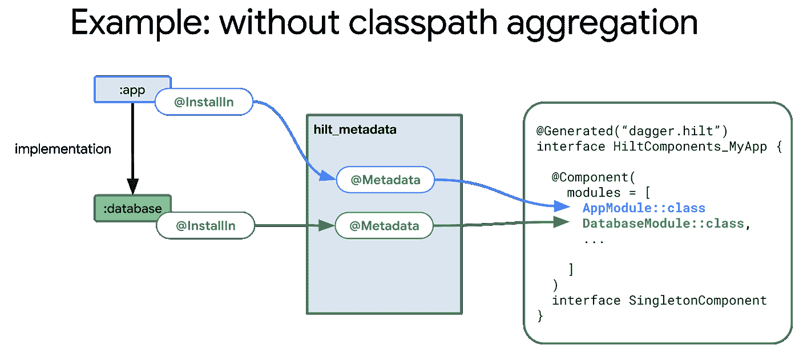

# 疯狂技能系列:引擎盖下的剑柄

> 原文：<https://medium.com/androiddevelopers/mad-skills-series-hilt-under-the-hood-9d89ee227059?source=collection_archive---------1----------------------->

## 剑柄狂技能系列第三集

这是[剑柄](https://dagger.dev/hilt/)上的狂技能系列第三集！一定要看完[第 1 集](/androiddevelopers/introduction-to-hilt-in-the-mad-skills-series-40f0908f2fc0)和[第 2 集](/androiddevelopers/hilt-testing-best-practices-in-the-mad-skills-series-8186a57eee2c)。在这一集里，我们将深入探究希尔特是如何在引擎盖下工作的。

如果您喜欢以视频格式观看这些内容，请点击此处查看:

# 涵盖的主题

*   各种刀柄注释如何一起工作来生成代码。
*   Hilt Gradle 插件如何在幕后工作，以提高使用 Hilt 和 Gradle 时的整体体验。

# 各种刀柄注释如何一起工作来生成代码

Hilt 使用注释处理器来生成代码。将源文件转换成 java 字节码时，注释处理发生在编译器内部。顾名思义，注释处理器是由源文件中的注释触发的。注释处理器通常检查注释和类型，以执行各种任务，如验证或生成新源。

在《剑柄》中，三个最重要的注解是`[@AndroidEntryPoint](https://dagger.dev/api/latest/dagger/hilt/android/AndroidEntryPoint.html)`、`[@InstallIn](https://dagger.dev/api/latest/dagger/hilt/InstallIn.html)`和`[@HiltAndroidApp](https://dagger.dev/api/latest/dagger/hilt/android/HiltAndroidApp.html)`。

# @ androdidentrypoint

`[AndroidEntryPoint](https://dagger.dev/api/latest/dagger/hilt/android/AndroidEntryPoint.html)`在您的 Android 类中启用字段注入，如活动、片段、视图和服务。

在下面的例子中，简单地用`AndroidEntryPoint`注释`PlayActivity`允许我们将音乐播放器注入到我们的活动中。

如果您正在使用 Gradle，您可能熟悉上面显示的简化语法。然而，这个语法实际上只是由 Hilt Gradle 插件提供给你的语法糖。下面是关于 Hilt Gradle 插件的更多信息，但是现在让我们看看这个例子在没有语法糖的情况下会是什么样子。

现在我们看到最初的基类`[AppCompatActivity](https://developer.android.com/reference/androidx/appcompat/app/AppCompatActivity)`实际上是`AndroidEntryPoint`注释的输入。这个`PlayActivity`本身实际上扩展了生成的类`Hilt_PlayActivity`。这个类是由 Hilt 的注释处理器生成的，包含了执行注入所需的所有逻辑。下面是生成的基类中代码的一个简化示例:

在这个例子中，生成的类扩展了`AppCompatActivity`。然而，一般来说，它会扩展传递到`AndroidEntryPoint`注释中的任何类。这使得注入可以与您想要的任何基类一起工作。

这个生成的类的主要目的是处理注入。重要的是尽早执行注射，以防止在注射前意外进入某个区域。因此，对于活动，注入发生在`onCreate`方法期间。

在 inject 方法中，我们首先需要它的注入器的一个实例，`PlayActivity_Injector`。在 Hilt 中，活动的注入器是一个入口点，我们可以使用`EntryPoints`实用程序类获得注入器的实例。

您可能已经猜到，`PlayActivity_Injector`也是由 Hilt 的注释处理器生成的。它将具有以下格式:

生成的注入器是一个安装到`ActivityComponent`中的刀柄入口点。它包含一个方法，允许我们注入一个`PlayActivity`的实例。如果你曾经在 Android 应用程序中使用 Dagger 而没有使用 Hilt，你很可能熟悉直接在组件上编写这些注入方法。

# @InstallIn

`[InstallIn](https://dagger.dev/api/latest/dagger/hilt/InstallIn.html)`用于指示模块或入口点应该安装到哪个组件中。在下面的例子中，我们已经将`MusicDataBaseModule`安装到了`[SingletonComponent](https://dagger.dev/api/latest/dagger/hilt/components/SingletonComponent.html)`中:

使用`InstallIn`，模块或入口点可以从应用程序的传递依赖关系中的任何地方贡献出来。然而，在某种程度上，我们需要收集所有的`InstallIn`贡献，以获得每个组件的全套模块和入口点。

Hilt 在一个固定的包中生成一个元数据注释，使得收集和发现这些`InstallIn`贡献更加容易。生成的注释将具有以下格式:

通过将元数据放入一个固定的包中，Hilt 的处理器可以很容易地找到应用程序的所有可传递依赖项中生成的元数据。从那里，我们可以使用元数据注释中包含的信息来查找对`InstallIn`贡献本身的引用——在本例中是`MusicDatabaseModule`。

# HiltAndroidApp

最后，`[HiltAndroidApp](https://dagger.dev/api/latest/dagger/hilt/android/HiltAndroidApp.html)`注释支持在您的 Android 应用程序类中注入。在这方面，你可以把它想成和`AndroidEntryPoint`注释一模一样。首先，用户只需要用`@HiltAndroidApp`注释他们的应用程序类。

不过，`HiltAndroidApp`还有一个重要的功能——生成匕首组件。

当 Hilt 注释处理器遇到`@HiltAndroidApp`时，它在一个包装类中生成一组组件，该包装类与应用程序类同名，前缀为`HiltComponents_`。如果您以前使用过 Dagger，这些组件就是您通常会手工编写的`[@Component](https://dagger.dev/api/latest/dagger/Component.html)`和`[@Subcomponent](https://dagger.dev/api/latest/dagger/Subcomponent.html)`带注释的类。

为了生成这些组件，Hilt 在上面描述的元数据包中查找所有带`@InstallIn`注释的类。`@InstallIn`模块放在相应组件声明的`modules`列表中。`@InstallIn`入口点作为相应组件声明的超类型放置。

从这里，Dagger 处理器接管并从`@Component`和`@Subcomponent`注释生成组件实现。如果你曾经使用过无柄匕首，你可能会直接与这些职业互动。然而，Hilt 向用户隐藏了这种复杂性。

因为这篇博文是关于 Hilt 的，所以我们不会深入讨论 Dagger 生成的代码。然而，如果你感兴趣，你可以看看罗恩·夏皮罗和大卫·贝克的这个介绍，他们会带你了解细节。此外，你可以查看匕首代码 101 的[备忘单。](http://goo.gle/dagger-codegen-cheatsheet)

# 刀柄梯度插件

既然你已经看到了代码生成在 Hilt 中是如何工作的，现在让我们来看看 [Hilt Gradle 插件](https://dagger.dev/hilt/gradle-setup#hilt-gradle-plugin)。Hilt Gradle 插件执行许多有用的任务，包括字节码重写和类路径聚合。

# 字节码重写

顾名思义，字节码重写就是重写字节码的过程。与只能生成新代码的注释处理不同，字节码重写可以重写现有的代码。如果谨慎使用，这个特性会非常强大。

要了解我们为什么在 Hilt 中使用字节码重写，让我们回到`@AndroidEntryPoint`。

虽然扩展`Hilt_PlayActivity`基类在实践中是可行的，但它会导致 IDE 出现问题。因为生成的类在成功编译代码之前是不存在的，所以您经常会在 IDE 中看到红色的曲线。此外，您将无法访问自动完成功能，例如重写方法，也无法访问基类中的方法。

这些特征的丢失不仅会降低你的编码速度，而且所有这些红色的曲线也会使你很难集中注意力。

Hilt Android 插件通过在你的`AndroidEntryPoint`类上启用字节码重写来拯救你。启用了 Hilt Android 插件，所有需要做的就是用`@AndroidEntryPoint`注释你的类，然后你就可以扩展你的普通基类了。

因为该语法不再引用生成的基类，所以 IDE 没有问题。在字节码重写过程中，Hilt Gradle 插件会用生成的`Hilt_PlayActivity.`替换你的基类，因为这个过程直接发生在字节码中，对用户来说是不可见的。

然而，字节码重写也有一些缺点。

*   插件必须修改低级字节码，而不是源代码。这有点容易出错。
*   因为字节码在重写发生时已经编译好了，所以任何问题通常都是在运行时而不是编译时出现的。
*   重写使调试变得复杂，因为当出错时，源文件可能不代表正在执行的字节码。

出于这些原因，Hilt 尽量少依赖字节码重写。

# 类路径聚合

最后，让我们看看 Hilt Gradle 插件的另一个有用的特性:类路径聚合。为了理解什么是类路径聚合以及为什么需要它，让我们看另一个例子。

在这个例子中，`:app`依赖于单个梯度模块`:database`，其中`:app`和`:database`都贡献了`InstallIn`模块。

正如我们已经看到的，Hilt 将在固定的`hilt_metadata`包中生成元数据，这些元数据将用于在生成组件时查找所有带`@InstallIn`注释的模块。

虽然这对于单级依赖关系很好，但是让我们看看当我们添加另一个 Gradle 模块`:cache`作为`:database`的依赖关系时会发生什么。

在编译`:cache`的时候，虽然会生成元数据，但是那个元数据在编译`:app`的时候是不可用的，因为它是一个可传递的依赖。因此，Hilt 没有办法知道`CacheModule`，它会被意外地从生成的组件中排除。

虽然您可以通过将`:cache`依赖项声明为`api`而不是`implementation`来从技术上解决这个问题，但是不推荐这样做。使用`api`不仅对于增量构建来说更糟糕，维护起来也是一场噩梦。

这就是柄 Gradle 插件来拯救。

即使使用了`implementation`，Hilt Gradle 插件也会自动聚集来自`:app`的可传递依赖的所有类。

此外，与直接使用`api`相比，Hilt Gradle 插件也有很多好处。

首先，与在整个应用程序中手动使用`api`进行依赖相比，类路径聚合更不容易出错，并且不需要维护。你可以像平常一样简单地使用`implementation`，剩下的就交给刀柄 Gradle 插件了。

第二，Hilt Gradle 插件只在应用程序级别聚合类，所以与使用`api`不同，你的项目中库的编译不会受到影响。

最后，类路径聚合为依赖项提供了更好的封装，因为不可能在源文件中意外引用这些类，并且它们不会在代码完成中作为建议出现。

# 结论

在这一集里，我们揭示了各种各样的刀柄注释是如何一起工作来生成代码的。我们还查看了 Hilt Gradle 插件，并了解了它如何使用字节码重写和类路径聚合来使使用 Hilt 更加安全和简单。

感谢您的阅读，请关注更多疯狂技能集！