# 用画面变魔术

> 原文：<https://medium.com/edureka/magic-with-tableau-e983ef5d606e?source=collection_archive---------5----------------------->

Tableau 在线培训的需求正处于顶峰，因为它在市场上的采用速度越来越快。本文旨在让您了解 tableau 是什么，以及 Tableau 对数据可视化有什么好处。

**什么是 Tableau？**

你们大多数人都知道 tableau 是一个数据可视化工具，但是为什么要学习 tableau，而不是其他任何可以访问的数据可视化工具呢？在理解 Tableau 的基本概念之前，理解这一点非常重要。

有一种叫做 Gartner 幻方图的东西，可以在 tableau 网站上找到，正如你所看到的，tableau 占据着领导者的位置，在全球范围内都非常受尊重。

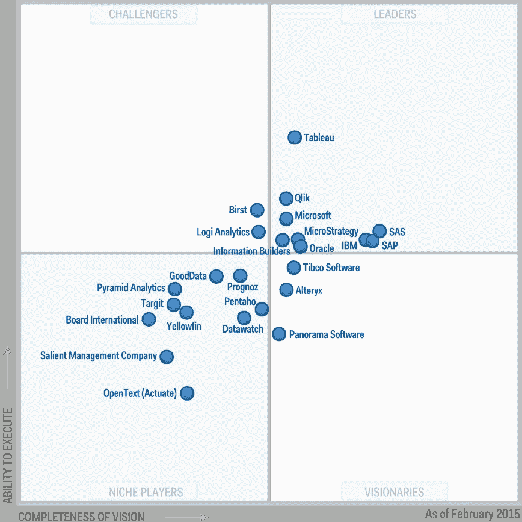

让我提前告诉你一件事。数据可视化并不是生成精美的图表。目标是使用数据可视化向我们的各种利益相关者讲述一个故事。如果客户给你一个产品，作为数据可视化的一部分，客户一定有很多问题需要回答。现在，你的目标应该是满足客户的业务优先级，而不仅仅是展示一些花哨的统计数据和图表。

让我们看一个例子，它将告诉你什么是数据可视化，以及它将如何帮助你满足你的客户的目标。

因此，在 NBA 篮球赛中，我们每年有 32 支球队参加 82 场比赛，有大量与他在 www.basketball-reference.com 有关的数据，104 万条记录，这是从球员比赛中提取的记录数，现在我们想分析这些数据并从中找出意义。那么，在这个过程中，我们想要回答的关键问题是什么呢？我们希望开发一个数据可视化，帮助 2 个主要利益相关者，一个是球队教练，另一个是球员。

**团队:**

*   球队的表现趋势如何？
*   本赛季输得最差和赢得最好的比赛是哪几场？
*   对阵哪个队强，对阵哪个队弱？
*   在主场比赛和在非主场比赛时，表现有什么不同？

**玩家:**

*   他们在一个赛季的每场比赛中表现如何？
*   拍摄成功率如何？
*   对阵哪个队表现好，对阵哪个队表现不好？

现在，这些是我们希望作为可视化的一部分得到答案的问题，这正是 tableau 将帮助你做的。

现在，我们在这里创建了一个控制面板，为了创建这个控制面板，我们处理了许多单独的工作表。我可以选择我选择的球队和年份，我现在可以看到他们赢了多少场比赛，输了多少场。他们在对阵丹佛掘金、费城等队时表现最好。对洛杉矶，萨克拉门托国王等最差。

因此，在这里你可以看到车队最好的 5 次表现以及哪些表现良好，最差的 5 次表现以及哪里出了问题。

如果你看到主场对非主场，可以清楚地看到，球队在主场比非主场表现更好。

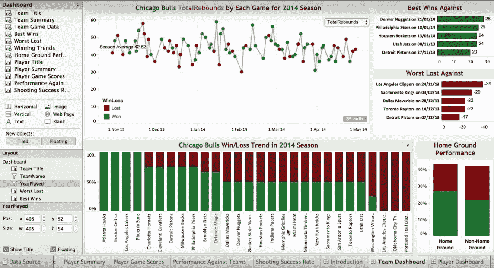

你可以得到很多分析，比如总篮板数，总助攻数，抢断数，个人犯规数等等。

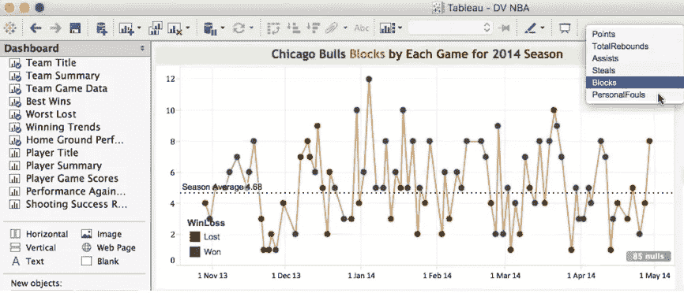

这里的目的是让您对各种业务问题和疑问有一个大致的了解，这些问题和疑问可以使用 tableau 中的数据可视化来回答。

从球员的角度，你可以看到一个球员在一个赛季中的详细表现。

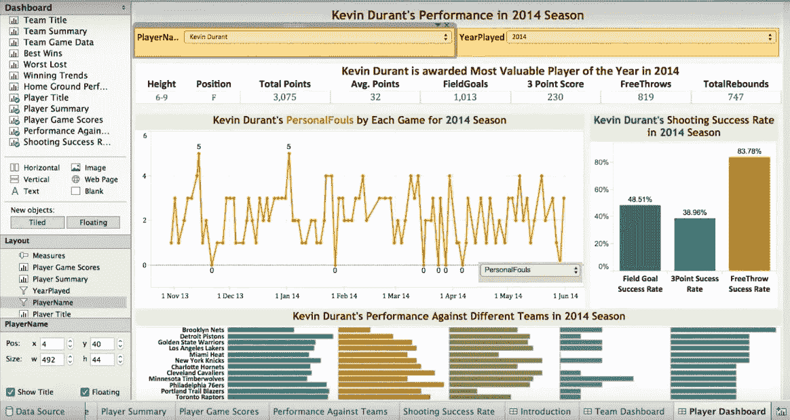

我们有一种叫做 tableau 的动画图表，使用它你可以想出非常有效的演示。下图显示了不同国家的平均 GDP(国内生产总值)。你可以点击播放按钮，它会显示随着时间的推移，GDP 发生的变化。

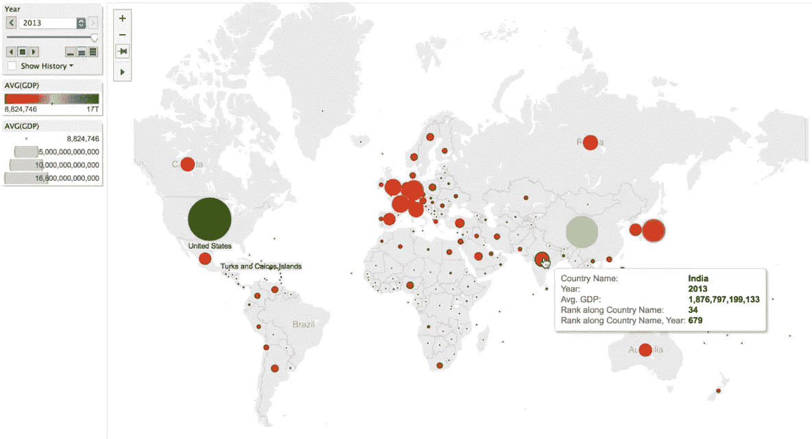

Tableau 工具提供了两个数据集:样本-超市和世界指标。

下面是我创建的第一个工作表— **前 5 名客户**，我在其中的列中取了 SUM(利润),在行中取了客户名称，并过滤了产生更多利润的前 5 名客户。

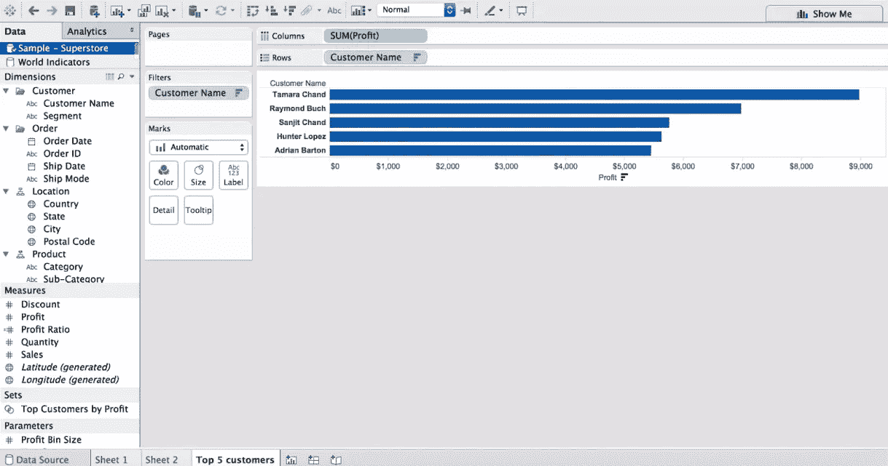

下面是我创建的第二个工作表— **底部 5 个客户**，与上面的工作表正好相反。

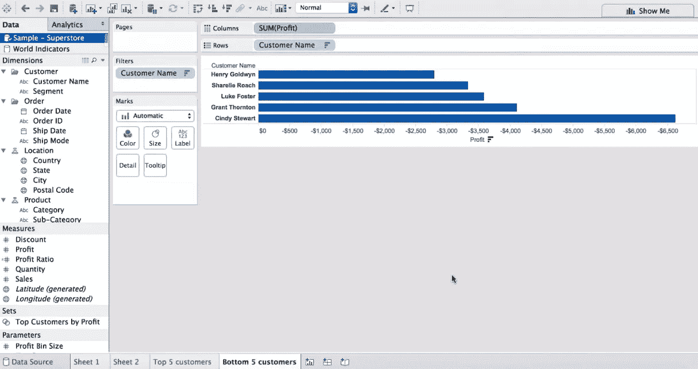

下面是我创建的第三个工作表——**州利润**，我以纵列表示经度，以横列表示纬度，并根据每个州的利润赋予不同的颜色。

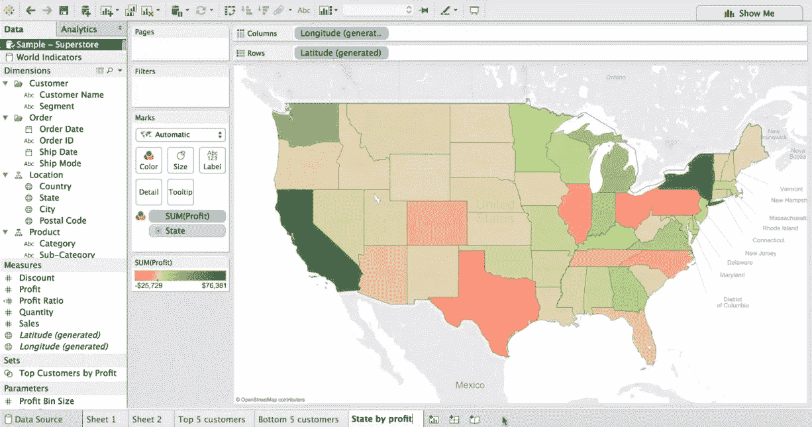

现在我将创建一个仪表板，下面是创建新仪表板的选项。

在这个仪表板中，我从仪表板窗格中拖放了我在上面创建的 3 个工作表到我的仪表板中。你可以根据自己的需要将它们放在左侧或右侧或顶部或底部，这取决于你想如何向客户展示。

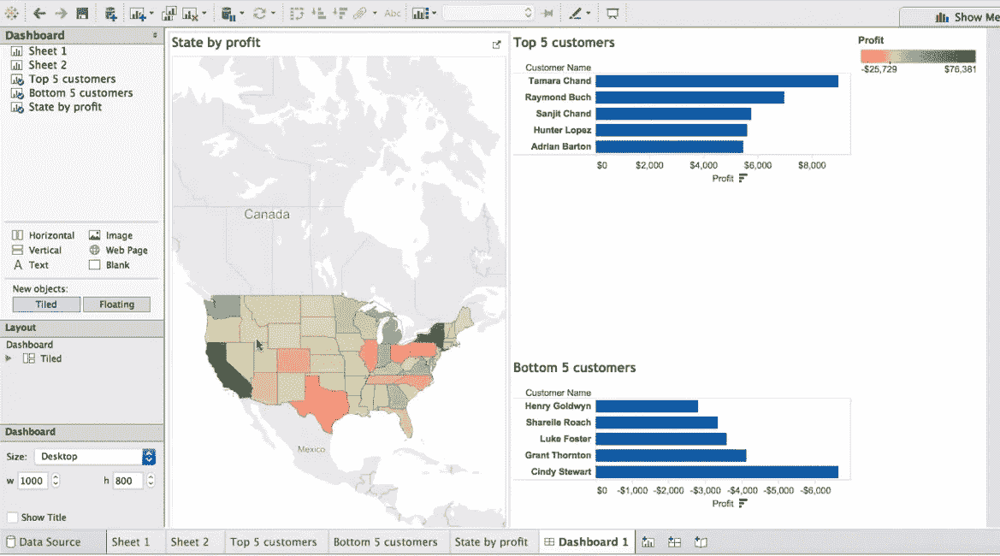

现在，我不想要总体前 5 名和后 5 名客户，我希望它显示国家明智的数据。但是当我点击任何一个州时，什么也没有发生，我的前 5 名和后 5 名客户没有变化。那是因为我们还没有做任何事情。

现在，单击下面快照中所示的下拉箭头，并单击“用作过滤器”。

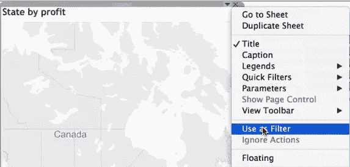

现在，当我单击 California 时，前 5 名和后 5 名客户的数据会相应地发生变化。**注意:**根据数据集，对于加利福尼亚，我们只有前 5 名中的 2 名客户和后 5 名中的 3 名客户。

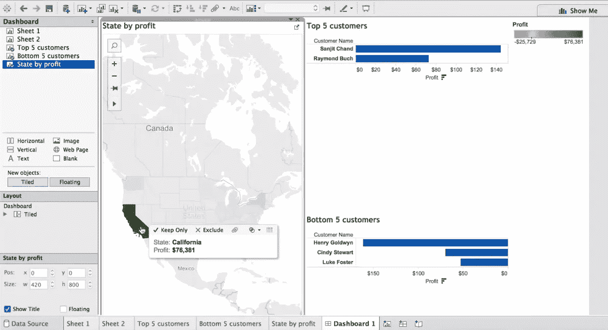

这是一种你可以在舞台上表演的魔术。Tableau 在线课程或 Tableau 认证将帮助您获得超越其他分析师的优势，并让您以更好、更有洞察力的方式呈现数据。从 Tableau 教程开始。

如果你想查看更多关于人工智能、DevOps、道德黑客等市场最热门技术的文章，你可以参考 Edureka 的官方网站。

请留意这个系列中的其他文章和视频，它们会帮助你理解 Tableau 的各种概念。

> *1。* [*Tableau 教程*](/edureka/tableau-tutorial-37d2d6a9684b)
> 
> *2。* [*什么是 Tableau？*](/edureka/what-is-tableau-1d9f4c641601)
> 
> *3。* [*Tableau 功能*](/edureka/tableau-functions-ce794b10e588)
> 
> *4。* [*画面仪表盘*](/edureka/tableau-dashboards-3e19dd713bc7)
> 
> *5。*[*Tableau 中的 LOD 表达式*](/edureka/tableau-lod-2f650ca1503d)
> 
> *6。* [*画面技巧*](/edureka/tableau-tips-and-tricks-a18bf8991afc)
> 
> *7。* [*循序渐进指导学习 Tableau*](/edureka/tableau-public-942228327953)
> 
> *8。* [*Tableau 桌面 vs Tableau 公共 vs Tableau 阅读器*](/edureka/tableau-desktop-vs-tableau-public-vs-tableau-reader-fbb2a3aa0bac)
> 
> *9。* [*如何在 Tableau 中创建和使用参数？*](/edureka/parameters-in-tableau-ac552e6b0cde-ac552e6b0cde)
> 
> *10。*[*Tableau 中的集合是什么，如何创建*](/edureka/sets-in-tableau-39befe9b7fa1)
> 
> *11。* [*数据融合*](/edureka/tableau-lod-2f650ca1503d)
> 
> *12。* [*圆环图中的 Tableau*](/edureka/donut-chart-in-tableau-a2e6fadf6534)
> 
> *13。*[*2020 年你必须准备的 50 大 Tableau 面试题*](/edureka/tableau-interview-questions-and-answers-4f80523527d)
> 
> *14。* [*如何以及何时使用不同的 Tableau 图表*](/edureka/tableau-charts-111758e2ea97)

*最初发表于 2021 年 12 月 20 日 https://www.edureka.co**。*