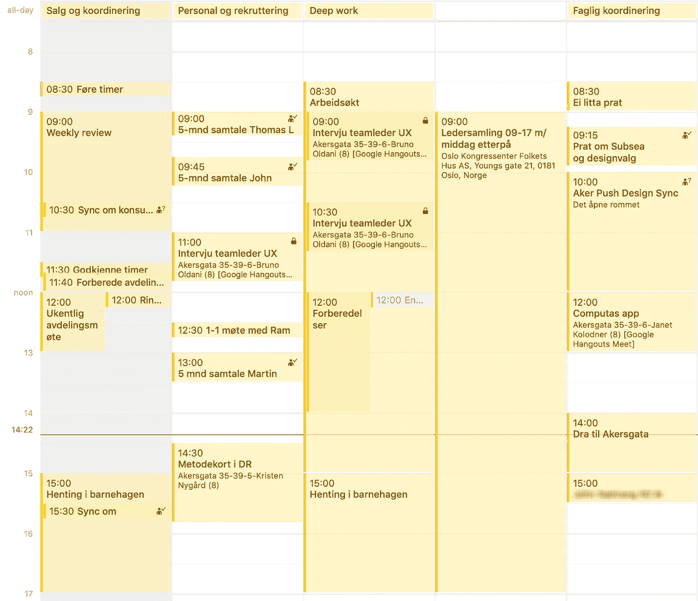

# Magien som kommer fra (tvungen) fokusert arbeid

> 原文：<https://medium.com/compendium/magien-som-kommer-fra-tvungen-fokusert-arbeid-dce30e7d3d0e?source=collection_archive---------2----------------------->

Etter hver [design sprint](https://computas.com/tjenester/design-sprint) vi kjører pleier vi å gjennomføre en retrospektiv. Da ber vi om tilbakemeldinger på hva som fungerte bra og hva som kan bli bedre. En gjenganger i retrospektivene er hvor godt folk liker å jobbe **fokusert med én problemstilling** i et **team på tvers av organisasjonen** .

Det er lett å overse hvor mye kraft som egentlig ligger i en slik tilbakemelding. La oss bryte det ned og se på kraften som ligger der.

# Fokusert med én problemstilling

Jeg har jobbet i større bedrifter og organisasjoner i 15 år. Før den tid jobbet jeg i mindre bedrifter der vi lett kunne samle hele bedriften i et stort møterom. I mindre organisasjoner opplevde jeg at det var enklere å få alle til å fokusere på én problemstilling om gangen. Men i større organisasjoner er dette langt vanskeligere. I tillegg har jeg med årene fått mer ansvar, og dermed overser jeg flere initiativer, prosjekter og team. Resultatet er at kalenderen min stort sett ser ut sånn:

De fleste andre som har tilsvarende eller mer ansvar — og dermed eier problemstillinger, initiativer og budsjetter — har liknende kalendre. Det betyr at fokusert tid på én problemstilling er mangelvare. Fokuset byttes ofte, og dette stadige kontekstbyttet koster. Vi jobber sjelden gjennom én problemstilling før vi går videre til neste. Dette gjelder spesielt de tyngre problemstillingene — de som gjerne er viktige, men som kanskje ikke haster (se [Eisenhower-matrisen](/taking-note/work-more-effectively-and-productively-with-the-eisenhower-matrix-998091a14b3a) ). For å få til fremdrift på tyngre problemstillinger trenger man å fokusere på én problemstilling over noe tid.

# Team på tvers av organisasjonen

For å løse komplekse forretningsproblemer der det ikke finnes et klart fasitsvar er det helt nødvendig at det er flere som jobber sammen. Og teamet trenger å dekke forskjellige kompetanser, gjerne fra forskjellige deler av organisasjonen. Og det er gjerne sånn at komplekse problemer eies av forskjellige deler av organisasjonen, eller at flere deler av organisasjonen berøres av problemstillingen, og dermed også eventuelle løsninger på problemet.

I større organisasjoner og bedrifter jobber disse enhetene eller menneskene tradisjonelt asynkront eller i forskjellige deler av prosessen. Måten man løser utfordringer på er gjerne at man utveksler dokumenter og eposter, og så gjennomfører man noen møter for diskusjon og forankring. Ofte er resultatet av en slik prosess at det tar lang kalendertid før vi kommer frem til noe, og noen eier resultatet mer enn andre siden de har hatt mulighet til å jobbe dypere enn andre.

Min erfaring er at «boksologien» som kommer fra organisasjonskart har en tendens til å forsterke forskjeller og skape avstand. Og dermed blir det litt vanskeligere å jobbe sammen om vi ikke skaper arenaer for å samarbeide i. Og med en arena for samarbeid, mener jeg et sted der vi jobber side om side, ikke bare prater i noen møter.

Erfaringene våre fra design sprinter er at det er forfriskende og motiverende å endelig få muligheten til å jobbe tett sammen på tvers av organisasjonsenheter. Vi kommer raskere frem til løsninger som eies av hele sprint-teamet gjennom prosessen. Og det at teamet «får lov» til å jobbe uforstyrret sammen, og faktisk produsere noe, ikke bare snakke om utfordringen, gir dyp tilfredsstillelse. Såpass mye at dette alltid er noe av det som trekkes frem i tilbakemeldingene når vi evaluerer design sprinten.

# Design sprint som “hack” for å fokusere på komplekse problemer

En av effektene jeg liker aller best med design sprinter er nettopp det ekte samarbeidet og fokuset på én problemstilling. Ikke bare er det tilfredsstillende (og tungt!) å jobbe uforstyrret og lenge nok med en problemstilling, men det er forfriskende å se hvor raskt man kan få meningsfylt fremdrift dersom man kan fjerne distraksjonene som er der i hverdagen. Det er faktisk litt magisk når man «tvinges» til å jobbe fokusert sammen om en problemstiling.

I dagens forretningsverden, med stadig raskere endringer snakker alle om viktigheten av å jobbe i kryssfunksjonelle, selvstendige team. Men hvordan kommer du i gang med slikt arbeid? Design sprint er en konkret måte å komme i gang, og du får til og med en oppskrift på hvordan du skal gjøre det. Prøv det! Kanskje du også får se magien av fokusert samarbeid?