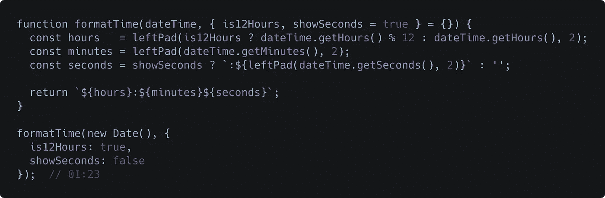

# JavaScript 中函数的可维护选项参数

> 原文：<https://medium.com/quick-code/maintainable-options-parameters-for-functions-in-javascript-9f7d5d207a65?source=collection_archive---------0----------------------->

我的朋友兼同事 [Sam Jesso](https://medium.com/u/46892d12359c?source=post_page-----9f7d5d207a65--------------------------------) 告诉我，他讨厌使用标志来修改函数的行为。有道理。功能应该遵循[单一责任原则](https://en.wikipedia.org/wiki/Single_responsibility_principle)并且只做一件事。它使测试和维护代码变得更容易，因为它保持了函数的简单和简洁。然而，深入几乎任何代码库都会发现，我们经常会出现例外并使用标志。

这些例外是否合理不是我想讨论的。因为每个人的代码都是不同的，所以不可能想出一套规则或指导方针来解释什么时候一个异常是有意义的。但是，如果您已经决定要将标志传递到函数中，有一个简单的技巧可以让您的函数的接口对开发人员更加友好。

我们可以将标志(或选项)组合成一个单独的`options`对象，而不是将它们视为独立的参数:

A function refactored to group flags into an options object.

与使用单独的参数相比，将选项分组到单个对象中有几个优点。为了更好地理解这些优势，让我们看一个不太抽象的例子…

# 格式化时间的例子

下面是一个从`Date`对象中获取格式化时间字符串的简单函数:

A simple function that takes in a Date object and returns a formatted time string.

*旁注:是的，我写了自己版本的* `*leftPad*` *，因为我不是为了一篇博文而引入简单的依赖关系。(* [*同样，如果你听到谈论*](https://www.theregister.co.uk/2016/03/23/npm_left_pad_chaos/) `[*leftPad*](https://www.theregister.co.uk/2016/03/23/npm_left_pad_chaos/)` [*时不畏缩，请花点时间读读这篇文章。*](https://www.theregister.co.uk/2016/03/23/npm_left_pad_chaos/) *)*

A function that fills empty positions to the left of a number with zeros. (Yes, I know how error-prone this is but it works for our implementation here.)

无论如何，回到例子。

## 新要求

我们有一个格式化时间的函数，它做得很好。但是现在我们想让选项在 12 小时制和 24 小时制之间切换。我们还想在某些情况下排除秒。

没问题，我们可以给函数添加一些额外的参数:

A function that takes in a Date object and returns a formatted time string in either 12-hour or 24-hour time, and with seconds optionally hidden.

这种方法有几个问题:

*   **参数必须按特定顺序传递。**如果我们想要隐藏秒，我们仍然必须在为`showSeconds`指定一个值之前为`is12Hours`传递一个值。
*   **参数未命名。**如果在远离定义的地方调用函数，可能不清楚参数的含义。我们必须查看函数定义，找出各种`true` / `false`值的作用。

这些问题使得函数界面很难阅读和理解，它们放大了人为错误的可能性，特别是当函数有许多选项时，因为很容易意外地跳过参数或混淆它们的顺序。

## 使用选项对象进行重构

解决这些问题的一个简单方法是重构函数，将对象用于标志/选项:

这种方法通过以下方式解决了将标志作为单独参数传递所存在的问题:

*   向接口公开标志名。
*   迫使开发人员正确标记这些标志。
*   使得标志的排序变得无关紧要。
*   当我们需要默认行为时，允许排除标志。

除了提高函数的可读性，我们还提高了它的可维护性，因为现在可以更容易地向我们的`formatTime`函数添加许多标志，而不用添加越来越多的无名布尔，使函数调用不可读。我们可以为`showMinutes`、`showMilliseconds`添加标志，甚至可以指定一个自定义分隔符来替换默认的冒号。无论我们添加什么标志或选项，函数都将保持相对的可读性。

## 还有一件事…

尽管我们已经使函数的接口易于使用和添加，但这并不意味着这些参数的所有功能都应该聚合到一个函数中。使用您的最佳判断，决定何时将功能委托给助手功能。