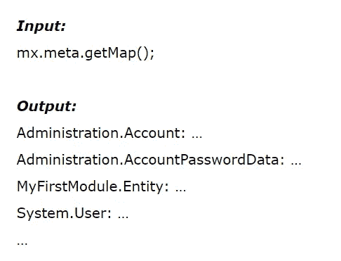
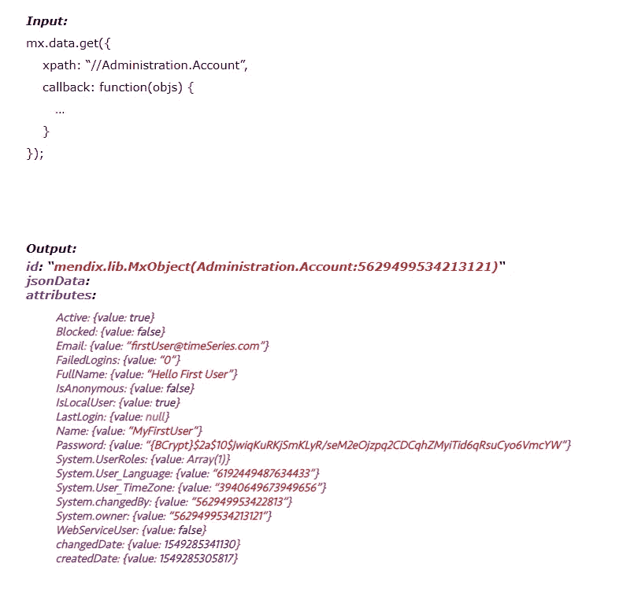

# 在低代码开发中维护安全性

> 原文：<https://medium.com/mendix/maintaining-security-in-low-code-development-8d221370e?source=collection_archive---------2----------------------->

罗·范·阿伦多克、**米凯尔·维尔霍夫**、&、**阿德南·拉姆劳一世**的博客

Mendix 让开发人员的生活变得更加轻松。它使我们开发应用程序的时间只需正常时间的一小部分。很多安全性是由平台本身处理的。然而，有些方面是开发者需要考虑的。由于这有时会令人困惑和被忽视，本博客致力于以下主题:

1.  概述:Mendix 中的安全特性
2.  常见陷阱
3.  Mendix 数据 API

# 概述:Mendix 中的安全特性

开箱即用，Mendix 已经有相当多的安全特性。例如，除了 Mendix 应用程序之外，任何其他应用程序都无法访问默认数据库。另一个特性是主要的业务逻辑保存在应用服务器上，平台本身支持不同的用户角色。访问可以在不同的层次上配置:从微流，一直到实体属性。

Mendix 中的业务逻辑主要是在微流中捕获的，但是并不是所有的微流都可以被客户端访问。对于可以通过客户端访问的每个微流，开发人员必须指定允许哪些用户角色调用该微流。此外，您可以对微流应用实体访问。应用实体访问的微流将考虑在域模型中指定的用户权限。诸如检索和变更对象之类的微流操作将受到为执行业务逻辑的用户指定的实体访问的限制。这是可能的，因为平台将用户会话数据传递给微流。

除了调用微流，用户还可以对对象执行操作。对象上可用的操作有:更改值、创建、删除和提交。用户在应用程序前端执行的所有动作都是上述动作和调用微流的组合。在实体级别，使用访问规则指定每个用户角色的不同权限。在某些情况下，您希望根据对象的状态(例如，普通用户只能根据枚举值更改实体的值)或对象的所有权来提供不同的权限。通过这样做，您可以获得用户想要的功能限制。请记住，如果多个访问规则应用于同一个对象的单个用户，则用户被授予每个访问规则指定的所有权限:每个访问规则授予用户更多的访问权限，而不是限制用户！

# 常见陷阱

大多数应用程序都有多个用户角色。不仅仅是为了限制操作，还为了控制谁可以查看或更改特定的数据集。这实际上取决于应用程序的类型，是否存在安全风险。然而，一旦您开始开发多租户应用程序或公司外部人员可以访问的应用程序，信息安全突然变得非常重要。一旦您允许匿名用户访问您的应用程序(即地球上知道您的应用程序的每个人)，这就成了头等大事。尤其是像 GDPR 这样的新法规。

在这篇博客中，我们假设 Mendix 平台完美地实现了基于角色的访问控制:用户不能自行增加权限，只能使用 Mendix 业务工程师配置的权限。然而，作为一名 Mendix 业务工程师，仍然有一些陷阱需要避免。

条件可见性并不安全
一个常见的误解是，在前端应用条件可见性或条件可编辑性也是保护应用程序的一种方式。当你只看应用程序的前端时，这似乎是正确的，但事实恰恰相反。Mendix(前端)应用通过 REST 调用与应用服务器通信。只要对 REST 有一点了解，用户就可以对您的数据执行比预期更多的操作。如果用户拥有完全的实体访问权限，那么该用户可以通过使用 REST 调用来执行所有的操作，比如创建、删除、更改值和保存对象。通过这样做，用户能够在不调用微流的情况下对数据库进行更改和提交，因此不需要对数据执行必要的验证。因此，条件可见性和可编辑性是管理应用程序 UX 的好方法。但是，它与保护您的数据以及用户可以对数据执行的操作没有任何关系。在以后的博客中会有更多的介绍。

**配置错误的实体访问**这句简单的话包含了很多类的问题。最明显的一点是实体访问规则中缺少 XPath 约束。XPath 约束确保用户只能访问数据集的一部分，而不是全部。考虑一个订购办公用品的应用程序。对于公司的内部应用程序，这可以限制用户可以访问的订单，例如，只能访问其业务部门的订单。对于多租户应用程序，这可能会将订单限制在他公司的订单上。对于有匿名用户的应用程序，这通常只允许匿名用户访问他们当前的订单。未能对敏感数据设置 XPath 约束是迟早会发生的数据泄露。

第二类问题是过于宽泛地配置读写访问。Mendix 让 Mendix 业务工程师可以选择对一组用户角色进行“默认访问”,从而对实体的每个新添加的属性或关联进行该级别的访问。此外，Mendix 为您提供了一个按钮，用于将所有属性设置为 read 或 read and write。永远不要使用这些选项:授予对属性的访问权(尤其是授予写访问权)应该始终是业务工程师为每个属性做出的有意识的决定。

所以，假设你有一个大的生产项目，也许你没有遵循我们上面提到的两点。你如何能容易地检查这个？我们已经为此创建了一个方便的工具，稍后会详细介绍！

# Mendix 数据 API

Mendix 为我们提供了一个客户端 [API](https://apidocs.mendix.com/7/client/) ，使开发人员能够定制 Mendix 窗口小部件或对我们的 Mendix 应用程序进行其他客户端扩展。对 API 的深入研究告诉我们，它是可以使用的不同函数的广泛列表。厉害！

第一个引起我们兴趣的是 getMap 函数，它使域模型的元数据在前端可用。

有了这些信息，我们可以找到项目中所有领域模型的所有元数据的完整概述。这本身并不能给我们提供大量的信息，但是，我们可以使用 data.get 函数通过 XPath 来检索这些对象，因为我们现在知道了可用的对象，并查看数据库中存储了什么数据！例如，如果我们想查看系统中的帐户，我们可以使用下面的 get 语句:

使用这种方法，我们可以通过控制台获得您在前端无法获得的信息。如您所见，仅使用两次 javascript 调用，我们就能够找到一个帐户的用户名和属于它的电子邮件地址。

Mendix 本身需要前面描述的功能来运行，并使客户端窗口小部件能够与应用程序交互。这不一定是问题。但是，如果访问级别设置不正确，就会出现问题。通过 mx.data.get()获取数据受到为用户配置的访问规则的限制。

要查找访问规则设置中的漏洞或错误，您可以使用 JavaScript 来查找错误。由于这很麻烦，我们在 TimeSeries 开发了[安全检查器](https://appstore.home.mendix.com/link/app/106594/)。此工具为您提供了您有权访问的所有对象的概述。在客户端，以您登录的用户身份，它还将为您提供哪些对象是只读的，哪些是可编辑的概述。

请务必注意，该工具不会向 TimeSeries 或其他第三方发送任何信息。该应用程序触发的请求与 Mendix 使用的请求相同，并且只对使用该工具的人可用。

# 结论

这篇博客介绍了 Mendix 中一些基本的安全原则。正如在开始时提到的，Mendix 是一个开发应用程序的好工具，它只需要传统开发的一小部分时间。Mendix 在许多安全方面帮助开发人员，但是允许开发人员根据应用程序的需要自由设置安全性。开发人员有责任将此作为开发过程中不可或缺的一部分。

请记住，实施太多严格的实体访问规则会影响性能，而太少则会给用户带来不必要的访问。我们希望下一次你开发一个应用程序时，你能想到这个博客，并做出一些明智的设计/安全决策，这将使你(和你的客户)长期受益！

这是安全性博客系列的第 1 部分。

*原载于 2019 年 5 月 7 日*[*【https://www.timeseries.com】*](https://www.timeseries.com/maintaining-security-in-rapid-application-development/)*。*