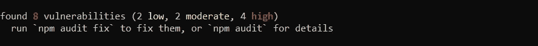
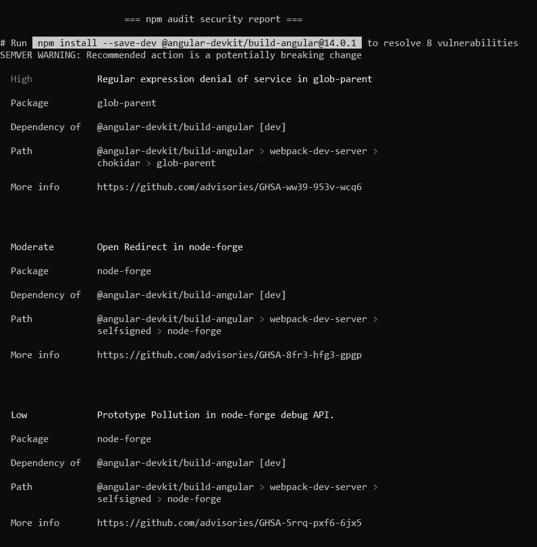

# 维护你的图书馆:NPM 系列(下)

> 原文：<https://medium.com/globant/maintaining-your-library-an-npm-series-part-ii-57f320ce2176?source=collection_archive---------3----------------------->

Photo by [AbsolutVision](https://unsplash.com/@freegraphictoday?utm_source=medium&utm_medium=referral) on [Unsplash](https://unsplash.com?utm_source=medium&utm_medium=referral)

正如我们在上一篇文章[创建你的图书馆:NPM 系列(第一部分)](/@abhijeetgiram/creating-your-own-library-an-npm-series-part-i-b75bd6f8431d)中看到的，创建你的图书馆很容易。维持是困难的部分。在你的图书馆的生命周期中，它将经历许多改进。但是，您的库无意中依赖于许多其他库，不可避免地，它可能会以漏洞和失败而告终。

我们来谈谈这个吧！

# NPM 的弱点

found 8 vulnerabilities on npm install

*   你认为为什么我们每次运行 *npm 安装*时都会看到这个警告信息？原因是 NPM v6 之后，NPM 注册表自动运行 *npm audit* 命令检查漏洞。
*   如果我们手动运行 *npm audit* 命令，我们可以看到一份关于已发现漏洞的详细审计报告，以及如何修复这些漏洞的步骤。

npm audit security report

*   为了解决这些漏洞，我们可以运行命令 *npm audit fix* 或 *npm audit* 来获得手动修复这些漏洞的步骤。
*   NPM 将脆弱性分为三种类型。高、中和低。

# 防范漏洞

*   如果我们忽视这些 NPM 漏洞，它可能会导致我们的数据被盗，攻击者可以窃取敏感信息。
*   这些著名的事件记录了攻击者的 11 行 JavaScript 代码由于左填充包而破坏了 Node、Babel 和数千个项目。像‘colors . js’和‘faker . js’这样的 JavaScript 库把 JavaScript 程序炸了。
*   注意域名仿冒或网址劫持(例如，“Gooogle.com”而不是“Google.com”)
*   使用 *npm 更新*更新软件包。从废弃或不推荐使用的包中迁移。
*   检查每周下载和软件包许可(麻省理工学院等。)安装任何软件包之前。不要使用新包装。尝试探索代码和包的相应存储库的问题。
*   每当您在 GitHub 上的包的相应存储库中发现意外行为和不一致时，请报告问题。

# 常见漏洞列表

*   glob-parent:对[@ angular](http://twitter.com/angular)-dev kit/build-angular 的依赖。[glob-parent 中的正则表达式拒绝服务](https://github.com/advisories/GHSA-ww39-953v-wcq6)。
*   node-forge:对[@ angular](http://twitter.com/angular)-dev kit/build-angular 的依赖。[node-forge](https://github.com/advisories/GHSA-cfm4-qjh2-4765)中加密签名验证不正确。
*   ansi-html:[@ angular](http://twitter.com/angular)-dev kit/build-angular 的依赖关系。[ansi-html 中不受控制的资源消耗](https://github.com/advisories/GHSA-whgm-jr23-g3j9)。
*   tar:popper 的依赖。[由于目录缓存中毒，通过不充分的符号链接保护创建/覆盖任意文件](https://github.com/advisories/GHSA-r628-mhmh-qjhw)。
*   jquery:jquery 的依赖项。jQuery 中潜在的 XSS 漏洞。

GitHub 咨询数据库上的漏洞列表。

# NPM 命令:精神食粮

*   [*npm all*](https://docs.npmjs.com/cli/v7/commands/npm-ls) 命令将打印已安装软件包的所有版本及其依赖项。
*   [*npm doctor*](https://docs.npmjs.com/cli/v7/commands/npm-doctor) 命令验证我们的环境的版本和配置，以管理软件包并提出建议(如果有)。
*   [*npm ping*](https://docs.npmjs.com/cli/v7/commands/npm-ping) 命令检查已配置的 npm 注册表并验证身份验证。

更多 [NPM CLI 命令](https://docs.npmjs.com/cli/v7/commands)覆盖！

 [## CLI 命令| npm 文档

### 国家预防机制登记册、网站和命令行界面的文件

docs.npmjs.com](https://docs.npmjs.com/cli/v7/commands) 

# 摘要

在上一篇文章[创建你的图书馆:NPM 系列(第一部分)](/@abhijeetgiram/creating-your-own-library-an-npm-series-part-i-b75bd6f8431d)中，我们已经探讨了关于发布图书馆的一切。在本文中，我们试图了解 NPM 漏洞和防范漏洞。我们还讲述了一些很酷的 npm 命令。

这里特别要提到 Mukund，因为他帮我写了这篇文章。

编码快乐！！