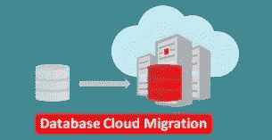

# 让克隆 9 不那么浑浊

> 原文：<https://medium.com/oracledevs/make-cloud-9-less-cloudy-9af798779cbb?source=collection_archive---------7----------------------->



我不时会遇到没有正确克隆的 Oracle 数据库。这意味着我看到了以下内容:

*   多个主机中具有相同名称的数据库。
*   具有相同 DBID 的不同数据库。

当您发现登录了错误的数据库时，这一点变得很明显。此外，RMAN 使用 DBID 来跟踪备份，因此在整个生态系统中拥有唯一的 dbid 非常重要。

您可以从 v$database 动态视图中确定当前的名称和 DBID:

```
SQL> select name, dbid from v$database;NAME DBID
---- ---------- 
ORCL 1556913366SQL>
```

当您将混合本地云添加到组合中时，降低紧迫性变得更高。持家的机会应该被看作是一个好得不能错过的机会。

分配新的数据库名称和 DBID 的最初想法可能围绕导出和导入，或者重新创建控制文件。事实上，新的名字和 DBID 并不涉及这些。

相反，关键工具是经常被忽略的 Oracle DBNEWID 实用程序。

然而，DBNEWID 不改变密码文件、spfile 和 DB_NAME 等参数，所以这些需要单独处理。要为新数据库准备 spfile，可以创建一个新的 pfile，如下所示:

```
SQL> create pfile from spfile;File created.SQL>
```

第一步是将数据库置于装载模式:

```
SQL> shutdown immediate
Database closed.
Database dismounted.
ORACLE instance shut down.
SQL> startup mountORACLE instance started.Total System Global Area 2248146000 bytes
Fixed Size 9030736 bytes
Variable Size 587202560 bytes
Database Buffers 1644167168 bytes
Redo Buffers 7745536 bytesDatabase mounted.SQL> exit
```

现在，我们从命令提示符启动 DBNEWID 实用程序。在本例中，ORCL 数据库将被重命名为 CLOUD9，这也将更改默认的 DBID:

```
> set ORACLE_SID=orcl
> nid TARGET=/ DBNAME=cloud9
```

执行日志如下所示:

```
DBNEWID: Release 19.0.0.0.0 - Production on Wed Jan 8 17:37:10 2020Copyright (c) 1982, 2019, Oracle and/or its affiliates.  All rights reserved.Connected to database ORCL (DBID=1556913366)Connected to server version 19.3.0Control Files in database:
    C:\APP\ORACLE\ORADATA\ORCL\CONTROLFILE\O1_MF_H10NPZ84_.CTL
    C:\APP\ORACLE\FAST_RECOVERY_AREA\ORCL\CONTROLFILE\O1_MF_H10NPZD4_.CTLChange database ID and database name ORCL to CLOUD9? (Y/[N]) => yProceeding with operation
Changing database ID from 1556913366 to 2967585568
Changing database name from ORCL to CLOUD9
    Control File C:\APP\ORACLE\ORADATA\ORCL\CONTROLFILE\O1_MF_H10NPZ84_.CTL - modified
    Control File C:\APP\ORACLE\FAST_RECOVERY_AREA\ORCL\CONTROLFILE\O1_MF_H10NPZD4_.CTL - modified
    Datafile C:\APP\ORACLE\ORADATA\ORCL\DATAFILE\O1_MF_SYSTEM_H10NFX76_.DB - dbid changed, wrote new name
    Datafile C:\APP\ORACLE\ORADATA\ORCL\DATAFILE\O1_MF_SYSAUX_H10NJFJC_.DB - dbid changed, wrote new name
    Datafile C:\APP\ORACLE\ORADATA\ORCL\DATAFILE\O1_MF_UNDOTBS1_H10NKXJ2_.DB - dbid changed, wrote new name
    Datafile C:\APP\ORACLE\ORADATA\ORCL\DATAFILE\O1_MF_USERS_H10NL15O_.DB - dbid changed, wrote new name
    Datafile C:\APP\ORACLE\ORADATA\ORCL\DATAFILE\O1_MF_TEMP_H10NT8N6_.TM - dbid changed, wrote new name
    Control File C:\APP\ORACLE\ORADATA\ORCL\CONTROLFILE\O1_MF_H10NPZ84_.CTL - dbid changed, wrote new name
    Control File C:\APP\ORACLE\FAST_RECOVERY_AREA\ORCL\CONTROLFILE\O1_MF_H10NPZD4_.CTL - dbid changed, wrote new name
    Instance shut downDatabase name changed to CLOUD9.
Modify parameter file and generate a new password file before restarting.
Database ID for database CLOUD9 changed to 2967585568.
All previous backups and archived redo logs for this database are unusable.
Database is not aware of previous backups and archived logs in Recovery Area.
Database has been shutdown, open database with RESETLOGS option.
Succesfully changed database name and ID.
DBNEWID - Completed succesfully.
```

对于本例，数据库驻留在 Windows 10 上，因此需要使用 oradim 命令为实例创建一个新服务。否则，对于 GNU/Linux 没有额外的步骤。

然后登录:

```
> set ORACLE_SID=cloud9
> sqlplus / as sysdba
```

编辑在调用 DBNEWID 之前创建的 pfile，并确保 DB_NAME 已经更改为 CLOUD9，以及对原始名称的任何其他引用。

为 CLOUD9 创建一个新的 spfile，用 resetlogs 打开数据库:

```
SQL> create spfile from pfile;
SQL> startup mount
SQL> alter database open resetlogs;
```

现在验证数据库的新名称和新 DBID:

```
SQL> select name, dbid from v$database;NAME   DBID
------ ----------
CLOUD9 2967585568SQL>
```

最后，更改全局数据库名称:

```
SQL> ALTER DATABASE RENAME GLOBAL_NAME TO cloud9.skies.com;
SQL> SELECT * FROM GLOBAL_NAME;GLOBAL_NAME
----------------------------------------
CLOUD9.SKIES.COMSQL>
```

这就是 DBNEWID 实用程序的作用。

DBNEWID 是您的工具箱的一部分，供您下次提起和移动时使用。

Paul Guerin 是一名专注于 Oracle 数据库的国际顾问。Paul 在东南亚的全球交付中心工作，但他的客户来自澳大利亚、欧洲、亚洲和北美。此外，他还出席了一些世界领先的甲骨文会议，包括甲骨文 2013 年世界开放大会。自 2015 年以来，他的工作一直是 IOUG 最佳实践技巧小册子以及 AUSOUG、Oracle Technology Network 和 Oracle Developers (Medium)出版物的主题。2019 年，他被授予 My Oracle 支持社区最有价值贡献者。他是一名 DBA OCP，并将继续参与 Oracle ACE 计划。