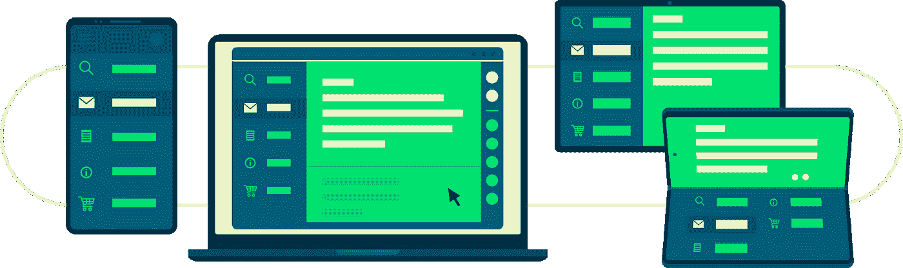
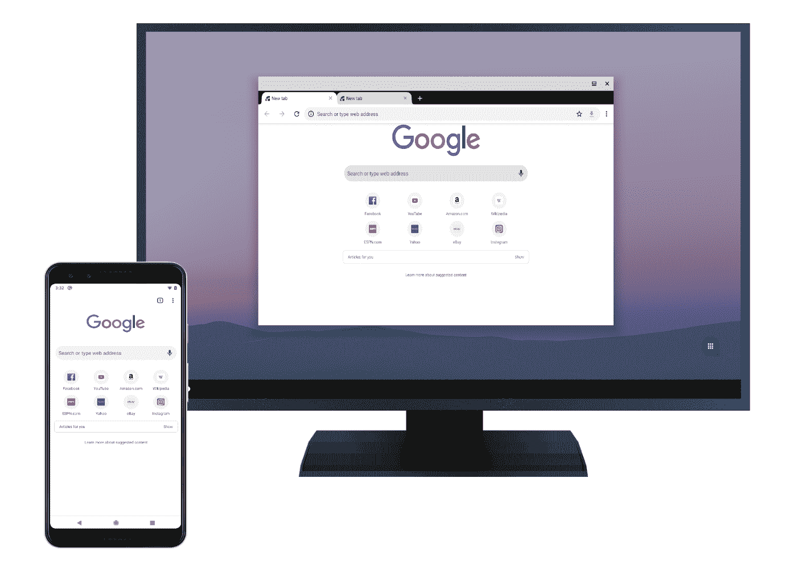
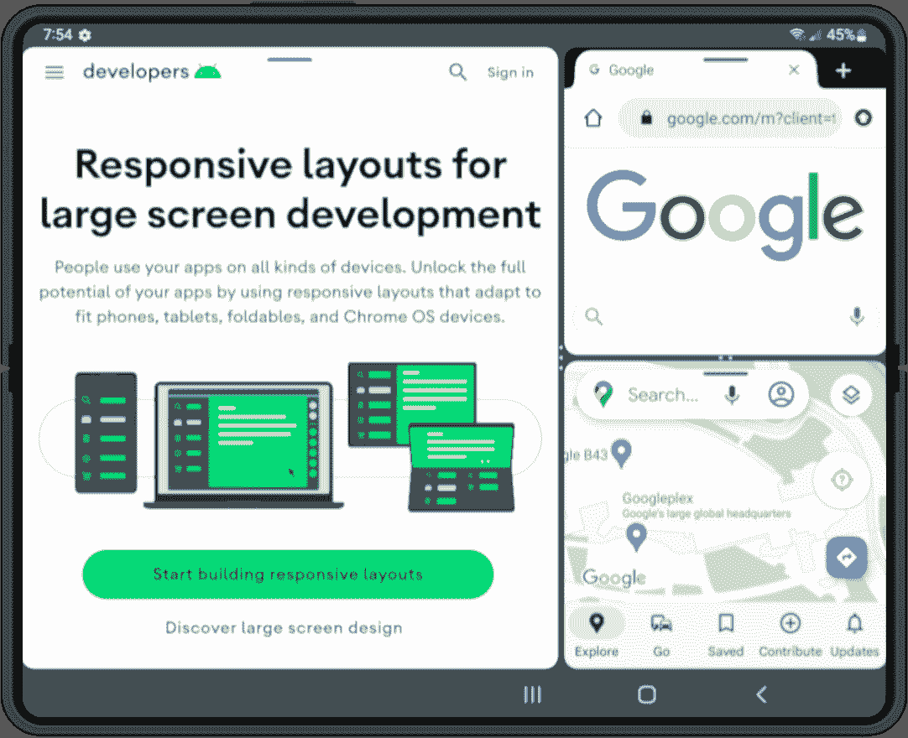
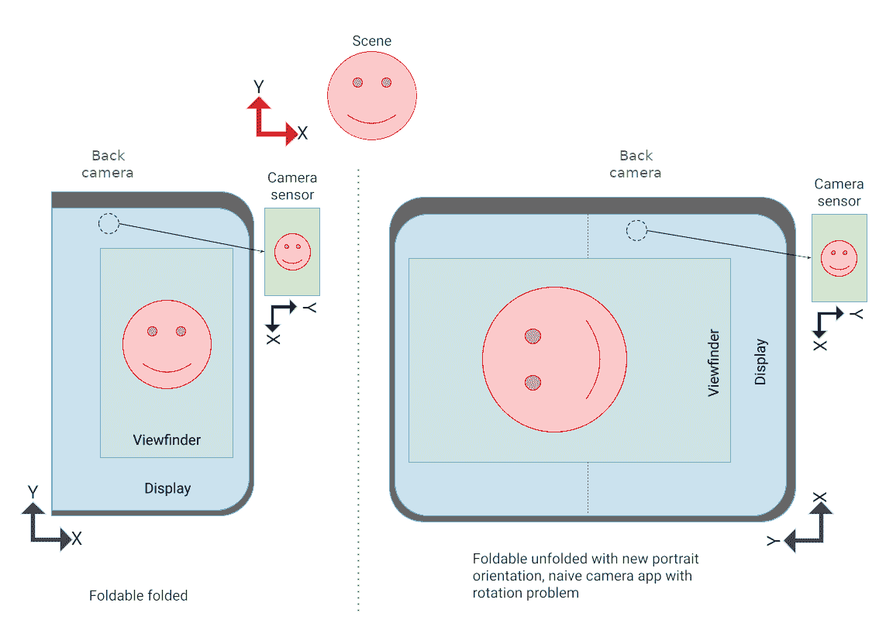
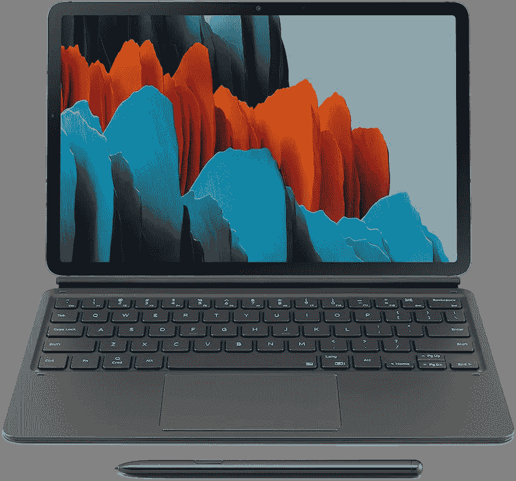

# 让您的应用程序大屏幕就绪

> 原文：<https://medium.com/androiddevelopers/make-your-app-large-screen-ready-baf8fe505ae7?source=collection_archive---------5----------------------->

如今，Android 运行在数十亿台设备上，手机只是这个生态系统的一部分。平板电脑、可折叠设备，甚至笔记本电脑和台式机都支持 Android 应用，因此您可以在各种外形规格上运行您的应用。

在本文中，您将了解如何开始使用大屏幕支持，以及为什么它如此重要:准确处理方向变化、长宽比和自适应布局可能看起来具有挑战性，但考虑到新的大屏幕体验，多种外形规格为您的用户带来了极好的新可能性。

为了帮助人们充分利用他们的设备，[我们对 Google Play](https://android-developers.googleblog.com/2022/03/helping-users-discover-quality-apps-on.html) 进行了重大改变，使用户能够发现并参与高质量的应用程序和游戏，更深入地关注适用于大屏幕的应用程序。此外，Android 12L 让设备制造商可以选择覆盖应用程序对首选方向的请求，你可以[在这里](https://developer.android.com/about/versions/12/12L/summary)查看这个和其他变化。

支持每一个屏幕是很难的，它需要改变你如何考虑让你的应用适应每一个屏幕:这就是为什么我们在不同的层面上分解了对大屏幕的支持。[你的应用可以提供三种级别的支持](https://developer.android.com/docs/quality-guidelines/large-screen-app-quality)。最基本的一个，*Tier 3——大屏幕*就绪，要求你的应用程序在任何表面上全屏运行都没有问题。下一步是为大屏幕优化你的应用程序。在 *Tier 2 —大屏幕优化*中，您的应用需要显示优化的布局和增强的外部输入支持。最后，还有顶部支撑位。*第 1 层—大屏幕差异化*希望您的应用在大屏幕上提供完全差异化的体验。

在本文中，您将了解如何开始使用第 3 层，以及为什么针对大屏幕进行优化对您的应用程序非常重要。

第三层是让应用程序在大屏幕设备上运行良好的第一步。遵循本指南，确保您的应用程序通过每项要求，您的用户可以完成关键流程。

# 配置和连续性

Phone in portrait orientation and large screen in landscape.

[处理配置更改](https://developer.android.com/guide/topics/resources/runtime-changes)一直是 Android 应用程序开发的基石，但对于大屏幕设备来说尤为重要。如前所述，用户总是可以覆盖方向，但这不是您应该关心的唯一配置更改:物理键盘被附加，窗口大小调整和更多的事件将频繁出现在大屏幕上。随着新外形的出现，用户不会像拿智能手机一样拿着设备。首先要考虑的是，应用程序不应该崩溃，而是应该在配置更改期间保持其状态，包括滚动位置和在文本字段中键入的文本。媒体回放也有望从启动配置更改时停止的地方恢复。

有多种方法可以实现这一点。用`[ViewModel](https://developer.android.com/topic/libraries/architecture/viewmodel)` 来维护状态并将其下推到 UI 是一个好的开始，但是这个任务也可以用[其他 API 来解决](https://developer.android.com/guide/topics/resources/runtime-changes)。

# 多窗口和多简历

A foldable device in multi-window mode

多种外形，尤其是大屏幕设备，挑战了用户在给定时间只能运行一个应用程序的想法。对于大多数应用程序来说，在大屏幕上与其他应用程序一起运行将成为新的规范，所以最好做好准备！

多窗口带来了新的挑战，因为您可能不得不重新审视您的应用程序的生命周期，并调查任何导致的资源损失，但它是这个旅程中的另一个重要步骤。

查看[多窗口支持](https://developer.android.com/guide/topics/large-screens/multi-window-support)以了解多窗口和多简历。

# 相机预览和媒体投影

Camera orientation on folded and unfolded devices

处理相机功能无疑是这条道路上非常重要的一部分，也可能是最具挑战性的部分之一。用户可以在任何可能的方向、窗口大小甚至可折叠状态下使用该组件。你甚至可以考虑利用像桌面模式这样的独特姿势，或者根据我们还没有想到的其他因素提供不同的体验。

能够正确显示来自相机的预览或简单地以正确的方向和宽高比播放媒体对您的用户来说是至关重要的，我们在此提供帮助！我们刚刚发布了[一个新的 codelab](https://developer.android.com/codelabs/android-camera2-preview#0) 来帮助你在你的相机应用中处理可调整大小的表面，如果你不需要访问低级 API，你可以使用 [CameraX](https://developer.android.com/codelabs/camerax-getting-started#0) 。请务必使用 ExoPlayer 查看[媒体流上的 codelab，以及](https://developer.android.com/codelabs/exoplayer-intro#0)[媒体投影 API](https://developer.android.com/guide/topics/large-screens/media-projection) 指南。

# 键盘、鼠标和触控板

An Android tablet with keyboard, trackpad, and stylus

想想大屏幕外形如何为用户提供比以往更多的选择。例如，许多新平板电脑都配有键盘和触控板，或者用户可能会决定利用更大的屏幕来使用外部蓝牙键盘。重要的是，你的应用程序可以在虚拟和物理键盘之间切换，而无需重新启动。

让我们不要忘记鼠标和键盘导航。在上述场景中，你的用户可能需要将这些设备作为唯一的输入来源，比如没有触摸支持的 Chromebooks。

查看 Android 开发者网站上的[处理外部输入](https://developer.android.com/training/keyboard-input)，了解如何导航所有这些可能性以及更多信息。

# 包扎

在每一个表面上提供美丽的体验可能会挑战你对应用程序开发的假设，但为大屏幕形状因素构建提供了一个令人兴奋的机会来创建一个更强大和更容易访问的应用程序。确保检查第 3 级[清单](https://developer.android.com/docs/quality-guidelines/large-screen-app-quality#large_screen_ready)和[测试](https://developer.android.com/docs/quality-guidelines/large-screen-app-quality#large_screen_ready_tests)，以确保您满足所有要求，使您的应用程序大屏幕就绪，并为大屏幕之旅的下一部分做好准备！