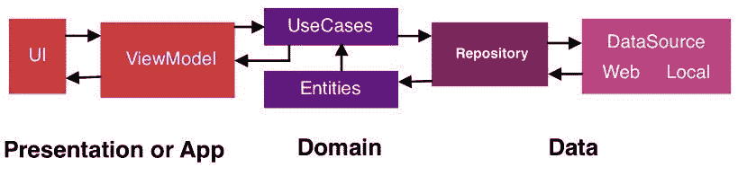
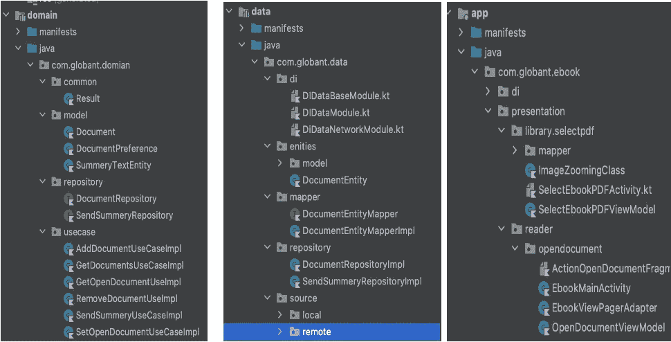
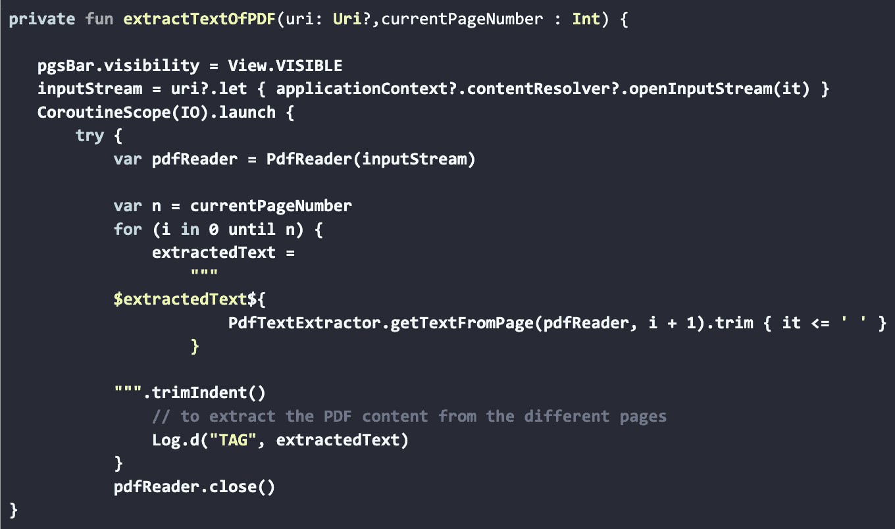

# 制作你自己的电子书阅读器应用程序

> 原文：<https://medium.com/globant/make-your-own-e-book-reader-app-cd1b9deb5771?source=collection_archive---------3----------------------->

合著者: [Sumedha Kulkarni](https://www.linkedin.com/in/sumedha-kulkarni-80762a169/) ，Android 应用程序开发人员

# 我们将会建造什么

我们将使用科特林 MVVM 架构在 Android 中构建一个电子书阅读器应用程序。我们将赋予它一些独特的特性(如下所列)。

# 这款应用与众不同的关键特性:

*   **获取摘要:**根据用户的请求，提供一个简短的或描述性的摘要。摘要是通过 Python 脚本从后端获取的。在这里阅读更多关于 Python 脚本[的内容](/@miteshdewda783/cdbe4b27ee6)
*   **导航到您离开的页面**
*   **缩放功能**

这里是一个高级架构图，可以清楚地了解我们正在构建的应用程序。

前端用 Android 编写，开发了一个交互式应用程序，用户可以阅读任何 pdf 格式的书籍。

*   每当用户希望获得一本书的摘要，直到最后一页，应用程序从 pdf 中提取文本，并使用提取的文本向服务器发送 getSummary()请求。[阅读更多](/@miteshdewda783/cdbe4b27ee6)
*   后端服务器是用 Kotlin 写的，用的是 Ktor 框架。
*   在后端，Python 脚本有助于从前端获得提取文本的有意义的摘要。后端以此摘要作为响应。
*   这个概要通过 Kotlin UI 显示给用户。

在这篇文章中，我们将关注电子书阅读器的前端，所以让我们更深入地研究我们使用的应用程序架构。

我们在 Android 开发中使用了最新的架构，即下图中解释的 MVVM Clean。

参考:[https://www . raywenderlich . com/3595916-clean-architecture-tutorial-for-Android-getting-started](https://www.raywenderlich.com/3595916-clean-architecture-tutorial-for-android-getting-started)

从上面的图表中，我们对 MVVM 建筑有了一个基本的概念，

MVVM 架构主要是将视图与业务逻辑分离，ViewModel 包含了所有的业务逻辑，但是在大型且更复杂的应用中，ViewModel 会过载所有的业务逻辑，所以最好使用干净的架构。

参考:[https://androidexample 365 . com/clean-architecture clean-architecture-kot Lin-mvvm-use-cases/](https://androidexample365.com/clean-architectureclean-architecture-kotlin-mvvm-use-cases/)

清洁架构有三个主要层:

**表示层，**

**域层，**

**和数据层。**

为了简化，表示层包含所有的视图，即活动/片段和视图模型。

领域层包含所有的业务逻辑，即用例、实体。

数据层包含所有存储库和数据源(远程或本地)。

下面是我们如何使用干净的建筑。我们为每一层创建了三个独立的模块。

最简单和最流行的 KOIN 依赖注入框架用于依赖注入。在此架构中，片段和活动包含所有向用户显示的 UI 组件，即 PDF 阅读器、CTA/按钮，以获取摘要。活动/片段与视图模型通信，以获取数据，即在 UI 上显示的摘要。ViewModel 包含在领域层接口中编写的函数调用。ViewModel 与域层通信以获取所需的数据。远程 API 调用存在于数据层。本地和远程存储库也在这一层。

# 能够进行 HTTP 调用

为了支持客户机和服务器之间的通信，有必要包含一个库来帮助我们调用 API。例如，在我们的应用程序中，我们需要发出一个调用来获取这本书直到最后一页的摘要。现在，为了适应这一点，我们使用了一个流行且易于使用的**改进库**。改造库为 API 的交互和认证提供了一个强大的框架。

下面是我们如何使用网络电话改造来获得一个总结

首先，我们需要在注释的帮助下创建一个 API 服务接口，即在改进库中提供的注释。我们使用这个 ApiService 在存储库中进行调用，一旦调用成功，我们就将响应存储在实体中。然后，通过 ViewModel，我们在 UI 上显示这个摘要响应。

# 显示 pdf 的能力

为了有效地阅读书籍，我们需要以用户友好的方式显示用户选择的 pdf。此外，为了获得摘要，我们需要将文本从 pdf 提取到当前页面。为了实现以上几点，Android 中有一个库，即“com . github . barteksc:Android-pdf-viewer:2 . 8 . 2”。我们只需要传递一个上下文并记录 URI。然后可以自由使用这个库中的任何函数，如下所示。

类似地，我们使用库**com . itext pdf:itextg:5 . 5 . 10**来提取文本

# 协同程序

协程用于在后台获取摘要。

# 单元测试

测试是应用程序开发过程中不可或缺的一部分。通过对你的应用进行持续的测试，你可以在公开发布之前验证你的应用的正确性、功能行为和可用性。

# 信用

使用第三方库提取存储库下使用的 PDF 数据

[https://mvn repository . com/artifact/com . itext pdf/itext pdf/5 . 5 . 10](https://mvnrepository.com/artifact/com.itextpdf/itextpdf/5.5.10) [https://github.com/itext/itextpdf/releases](https://github.com/itext/itextpdf/releases)

[https://github.com/InsertKoinIO/koin
T7](https://github.com/InsertKoinIO/koin)[https://developer . Android . com/topic/libraries/architecture/datastore？gclid = cj0kcqwymitbhdkarisaaj-9 vvqnbw 8 hyjoxwl qddlvswtyvxoumrfw 2 vab 74 hppimk 3 _-AgOTeOFwaAjFuEALw _ wcB&gcl src = aw . ds](https://developer.android.com/topic/libraries/architecture/datastore?gclid=Cj0KCQjwyMiTBhDKARIsAAJ-9VvqNBw8hyJOxWlqDDlvsWtyvxOumRfW2vaB74hpPiMk3_-AgOTeOFwaAjFuEALw_wcB&gclsrc=aw.ds)

[https://androidexample 365 . com/clean-architecture clean-architecture-kot Lin-mvvm-use-cases/](https://androidexample365.com/clean-architectureclean-architecture-kotlin-mvvm-use-cases/)

 [## Android 清洁架构教程:入门

### 在本教程中，你将学习如何在 Android 上使用干净的架构来构建健壮、灵活和可维护的…

www.raywenderlich.com](https://www.raywenderlich.com/3595916-clean-architecture-tutorial-for-android-getting-started) 

# 摘要

我们以一个交互式的 android 应用程序结束，它让用户阅读一本书的 pdf 格式，并给出一个摘要，这是一个关于这本书的简短解释，包含直到当前页码的关键点。

这个概念需要让用户在阅读这本书的同时保持参与，并让用户了解到目前为止他已经阅读过的书中的要点。因为。例如:自动将用户带到他们正在阅读的页码。此外，每当用户请求时，他将获得当前页面的摘要。

特别感谢 [**穆昆德·夏尔马**](https://www.linkedin.com/in/mukund-sharma/) 、 [**希夫哈尔·加尔科特**](https://www.linkedin.com/in/shivhar-jalkote-b69906aa/) 和 [**米特什·杜达**](https://www.linkedin.com/in/miteshdewda/) 构思和编辑本文。