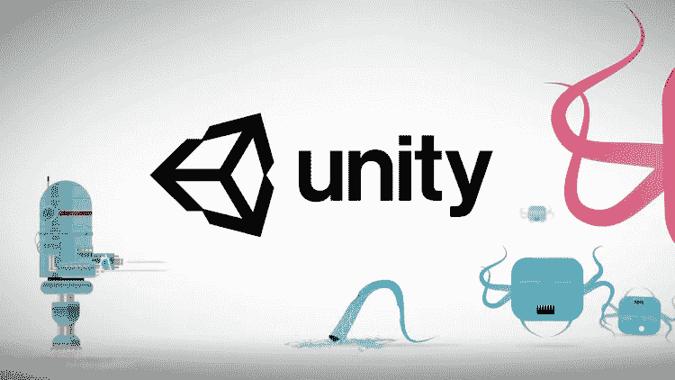

# 用 Unity 的学习路径制作自己喜欢的游戏！

> 原文：<https://medium.com/quick-code/make-your-own-favorite-game-with-unitys-learning-path-83a0744237d1?source=collection_archive---------0----------------------->

## Unity 游戏开发入门

Unity 是当今市场上最知名的游戏开发引擎。这是由 Unity Technologies 开发的跨平台引擎，于 2005 年首次发布。他们在 2D 有两个独立的游戏开发引擎和 3D 引擎。

## 工作机会

游戏开发是一个强大而小众的领域。因此，该领域的工作也是小众的。然而，候选人的数量通常也少于典型的 web 开发或软件程序员。值得欢呼的一件事是，越来越多的公司进入游戏开发，将学习、培训、动画入职体验等游戏化。该领域正在经历发展，对于一个典型的程序员或该领域的初学者来说并不重要。所以，只要你对你选择的工作行业持灵活态度，学习游戏开发可以帮助你推进你的职业生涯。

## Unity 游戏开发的初学者主题- 3D[第 1-5 天]

1.  简介，用户界面概述
2.  创建项目、布局、平移、选项卡
3.  场景、层次、项目、检查器、游戏
4.  操纵对象-选择、移动、旋转、缩放、捕捉、父对象
5.  了解不同的资产类型
6.  导入 3D 模型，导入音频，
7.  导入纹理、脚本和资源包

 [## 统一折扣优惠在线课程的游戏开发|快速代码

### 本课程将带您逐步了解 Unity 环境，学习您将学习如何集成的每个工具…

www.quickcode.co](https://www.quickcode.co/free/course/learn/Game-Development-on-Unity/3052?utm_source=mediumPub&utm_medium=social&utm_campaign=LG_Unity&utm_term=GameDevUnity) 

## Unity 游戏开发中级主题- 3D[第 6-13 天]

1.  设置场景，向游戏对象添加组件
2.  真实地形，场景边界
3.  捕捉区
4.  物理学-刚体和对撞机
5.  物理材料-衣服，破布，房子等。
6.  组合资产-纹理地图集、3D 建模程序
7.  组合资产-预制品和材料
8.  为场景填充添加网格

 [## skillshare 免费课程-游戏开发-绝对初学者的 Unity 入门 2…

### 如果你正在寻找一个免费的 Unity 3D 游戏引擎入门课程，那么这个课程就是为你准备的。拥有…

www.quickcode.co](https://www.quickcode.co/free/course/learn/Game-Development---An-Introduction-To-Unity--For-Absolute-Beginners-/1456?utm_source=mediumPub&utm_medium=social&utm_campaign=LG_Unity&utm_term=GameDevUnity) 

## Unity 游戏开发高级主题- 3D[第 14-21 天]

1.  行为脚本语言
2.  游戏对象-程序对象实例化
3.  捡球和得分
4.  剔除-相机，距离，遮挡
5.  动画-程序角色动画
6.  动画- Mecanim 角色动画
7.  灯光设置-太阳，月亮，点光源和局部照明
8.  GUI

 [## 95%折扣- Unity 游戏开发-在 Unity - Udemy 优惠券中创建 10 个游戏

### 建立 10 个游戏。学习分形基础，对象池，网格，渲染，六边形地图，噪声模拟，体素网格

www.quickcode.co](https://www.quickcode.co/free/course/learn/Unity-Game-Development---Build-10-Games-in-Unity/2617?utm_source=mediumPub&utm_medium=social&utm_campaign=LG_Unity&utm_term=GameDevUnity)  [## 100%折扣- Unity 3D 课程:无编码、构建和营销视频游戏 Fast - Udemy 免费课程优惠券

### 没有编程需要如何从零开始建立和营销你的游戏完全指南

www.quickcode.co](https://www.quickcode.co/free/course/learn/Unity-3D-Course--No-Coding--Build---Market-Video-Games-Fast/2928?utm_source=mediumPub&utm_medium=social&utm_campaign=LG_Unity&utm_term=GameDevUnity) 

## 互补技能

游戏开发是一项创造性的工作。因此，游戏开发中需要的一些技能不仅仅是编程技能，也是创造性技能。我们相信这些技能将帮助任何人成为更好的全面游戏开发者:

1.  创意写作，故事策划
2.  动画
3.  HTML 5，CSS-3
4.  java 描述语言
5.  对游戏的热情！

## 具有 Unity 游戏开发技能的热门职位

1.  Unity 游戏开发商
2.  软件工程师-游戏
3.  Unity 2D 或 Unity 3D 开发商
4.  生产部经理

**结论**

这让我们结束了 Unity 平台上游戏开发的学习之路。我们希望这条学习路径对您有所帮助。如果有任何进一步的问题或反馈，请在这里告诉我们，QuickCode 团队将在这里帮助您满足学习需求。

*原载于 2019 年 3 月 30 日*[*【www.quickcode.co*](http://www.quickcode.co/learning-guide/learn-game-development-guide-for-beginners)*。*