# 与 Mendix 一起创造不同

> 原文：<https://medium.com/mendix/making-a-difference-with-mendix-33e581adced7?source=collection_archive---------3----------------------->

我最近向 Mendix 应用商店发布了模块 [Diff](https://appstore.mendix.com/link/app/113326/) 。它允许您获取两段文本，并返回它们之间的差异列表。

该模块附带了一个名为`Diff_PrettyHTML`的 Java 动作，它接受两个字符串并返回一些突出显示差异的 HTML。这是一个简单的过程，所以我想向您展示如何在 Mendix 中使用底层的`Diff_Semantic` Java 操作来实现这一点。

Diff_Semantic 接受两个字符串，并返回包含差异的 Diff 实体列表。这是一个简单的实体，它包含操作(类型为`ENUM_Operation` ，可以是插入、删除或等于)，以及一个文本字符串。

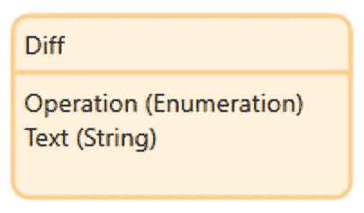

The Diff entity

为了构建我们的 HTML 生成微流，我们首先需要创建它。姑且称之为`SUB_PrettyHTML`。

我们知道这个微流需要将 Diff 实体的列表作为输入参数，所以我们可以称之为`$DiffList`。我们还知道它需要返回一个 HTML 字符串。我们可以把这个字符串叫做`$vHTML`，它将只是一个空白开始。

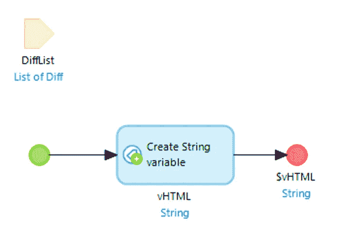

Step 1

接下来，我们需要迭代`$DiffList`,看看实际上有什么不同。

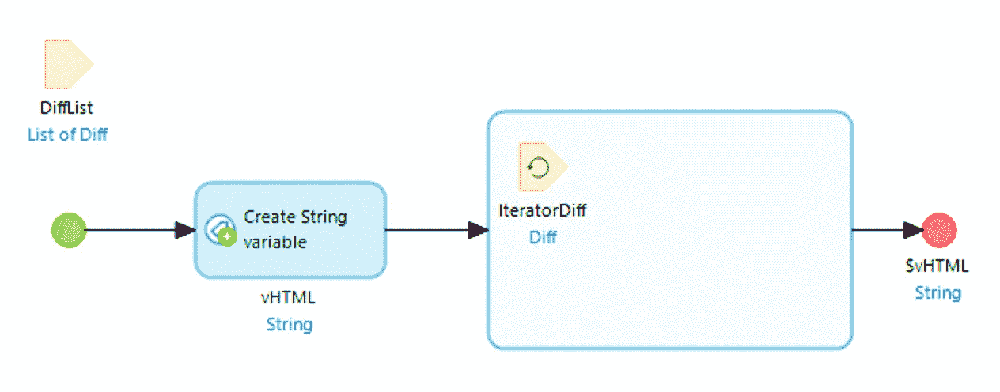

Step 2

在循环中，`$IteratorDiff`将是我们当前正在处理的 Diff 的实例。

我们需要看看这个 Diff 中的操作是什么，并相应地修改`$vHTML` 。如果是删除，我们需要用一个`<del>`标签将文本包装起来，并将其添加到`$vHTML`的末尾。如果是插页，我们用一个`<ins>`标签将文本包装起来，并将其添加到`$vHTML`。最后，如果是其他内容，我们只需用一个``标签包装文本，并将其添加到`$vHTML`。

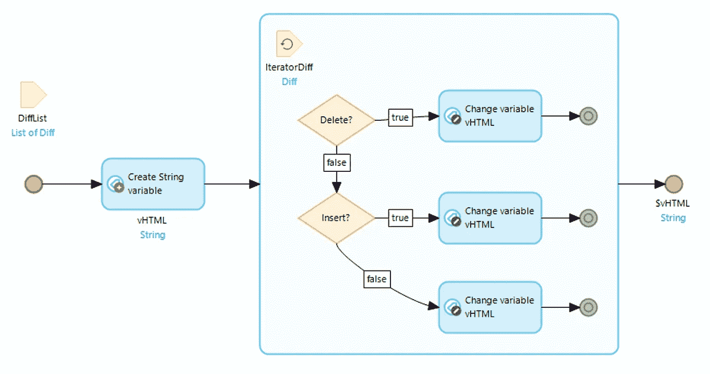

Step 3

“删除变更变量”操作如下所示。

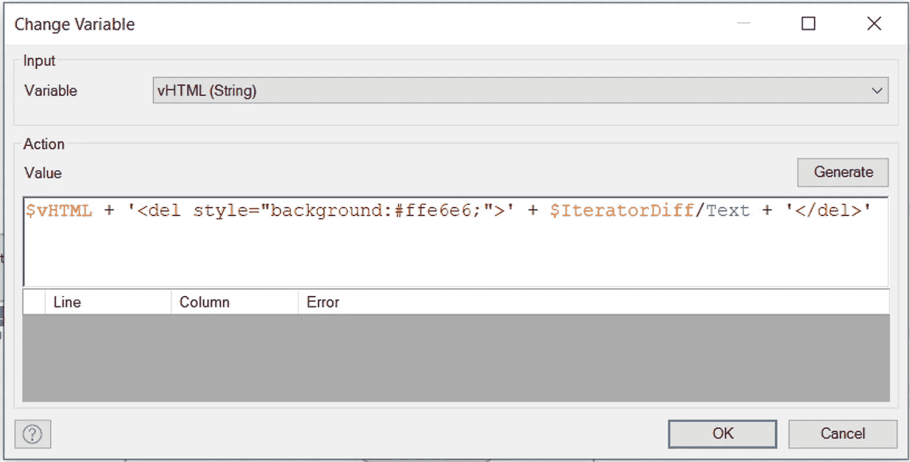

Adding the DELETE to vHTML

我们也添加了红色的背景色，但是如果你想要一个干净的代码，这可以很容易地添加到你的 CSS 中。我们为 INSERT 做了类似的事情，但是把它变成了绿色。

由于输出的是 HTML，我们需要确保输入的文本不包含任何 HTML 标签。我们可以使用 Community Commons 模块中的 EscapeHTML 操作来避免这种情况。我们也可以把`&`变成`&amp;`、`<`变成`&lt;`、`>`变成`&gt;`，换行符变成` `来滚动自己的。这可以使用`replaceAll`来完成。

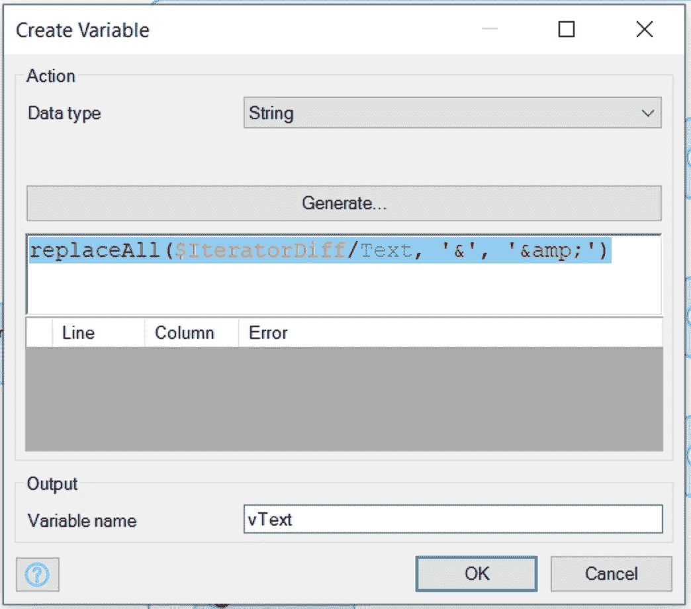

Escaping any & we find in the Text

我们逃跑的顺序很重要，因为我们不想逃跑。应该是`&`、`<`、`>`，然后换行。最终的微流应该是这样的。

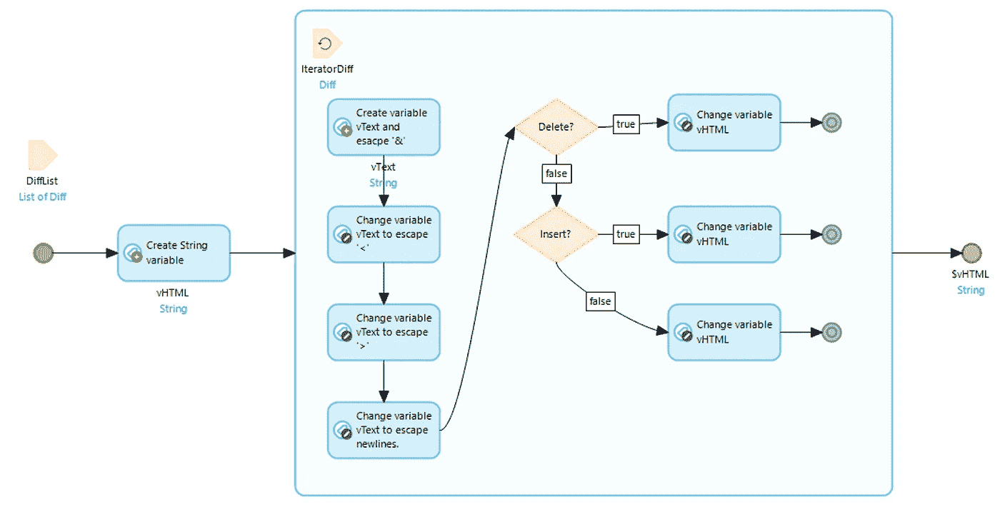

# 测试我们的微流

我们想看看我们的微流是否可行。为此，我们可以构建一个简单的测试页面来获取两个字符串，并在按钮被按下时显示它们之间的差异。

首先，我们创建一个实体来保存原始文本、新文本和我们生成的 diff HTML。我们称这个实体为 DiffHTML。

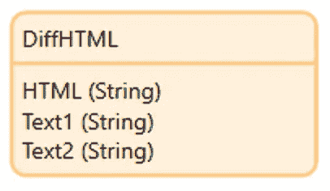

我们的页面可以获取一个 DiffHTML 实例，并使用 Mendix 应用商店中的[格式字符串小部件](https://appstore.mendix.com/link/app/264/)在屏幕上呈现生成的 HTML。

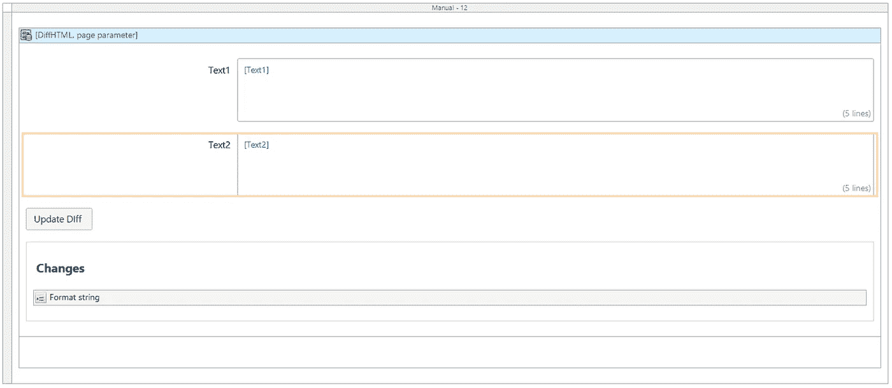

我们运行 difference 的微流需要在两段文本上运行`Diff_Semantic`，将它传递给我们新的`SUB_PrettyHTML`微流，更新 DiffHTML 实例，最后显示页面。

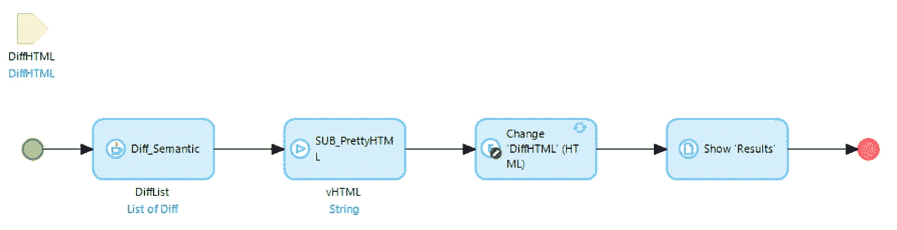

运行应用程序并添加一些示例文本，我们的最终输出如下所示。

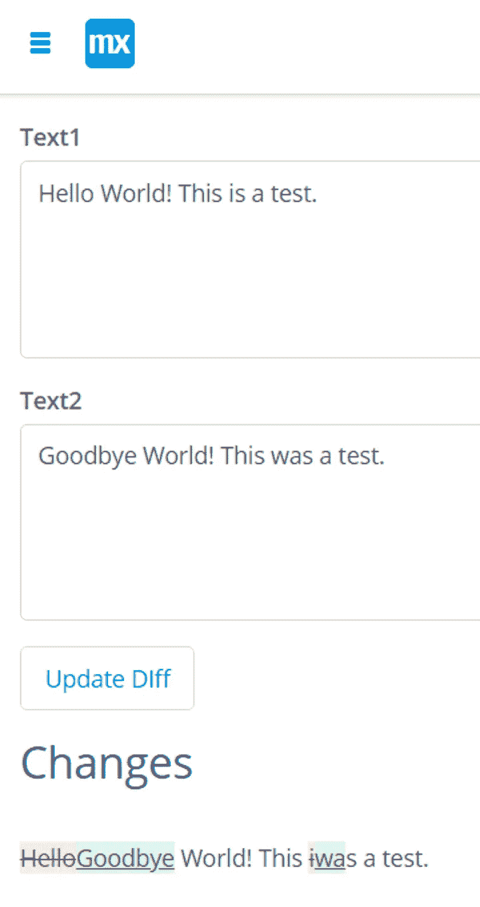

The output from our test

我们可以看到，删除的文本以红色突出显示并加了下划线，而更改的文本以绿色突出显示并加了下划线。未更改的文本保持中立。

# 结论

在本文中，我们已经看到了如何在 Diff 模块中使用`Diff_Semantic` Java 动作来重新创建微流中的`Diff_PrettyHTML`动作。我们已经看到了三种不同，并用它们来突出两段文字之间的变化。