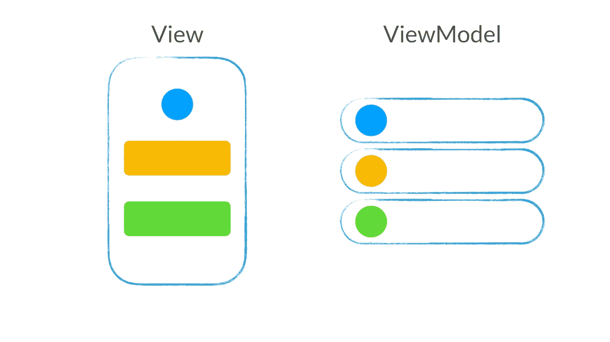
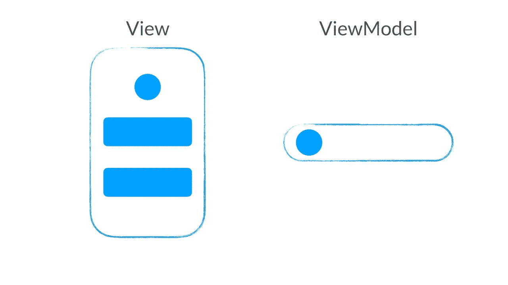
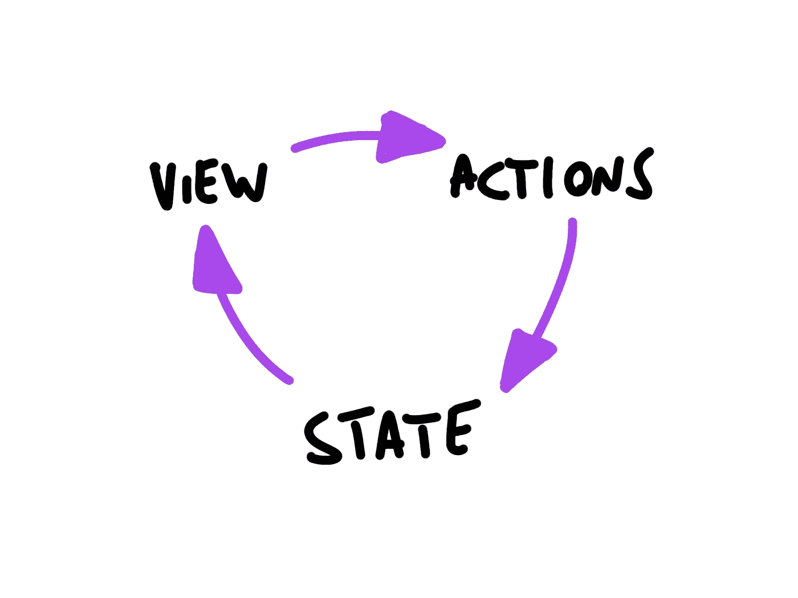
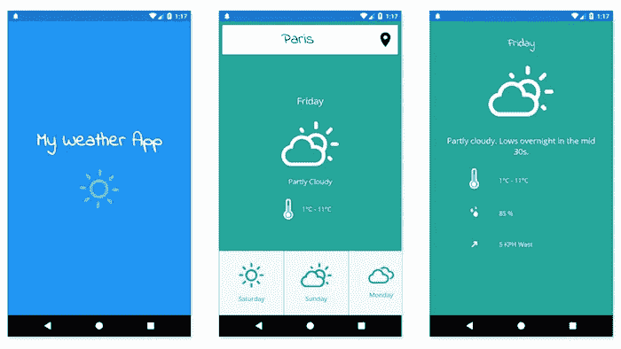

# 用 Kotlin 协同程序制作 Android 单向数据流🦄

> 原文：<https://blog.kotlin-academy.com/making-android-unidirectional-data-flow-with-kotlin-coroutines-d69966717b6e?source=collection_archive---------2----------------------->


Photo from [Emiliano Arano](https://images.pexels.com/photos/1295138/pexels-photo-1295138.jpeg?cs=srgb&dl=barrel-blue-daytime-1295138.jpg&fm=jpg)

几年前，我分享了一些关于依赖注入的想法。今天，我想分享一些关于围绕 ViewModel 构建开发的想法。我们如何将它设置为状态和事件？借助[科特林协同程序](https://github.com/Kotlin/kotlinx.coroutines)、[莫克](https://mockk.io)甚至 [Arrow-kt.io](http://arrow-kt.io) ？

TL；DR:所有这些都被打包成一个小库: [**Uniflow🦄**](https://github.com/arnaudgiuliani/uniflow-kt)

2017 年，谷歌发布了 [Android 架构组件](https://developer.android.com/topic/libraries/architecture)，为开发者构建应用提供了真正的支持。自从第一次发布以来，我一直在为许多公司使用这些组件。自 2018 年以来，这也是为欧洲的几个会议举办[研讨会的好机会。](https://medium.com/@giuliani.arnaud/presentations-6b91f53899ac)

众所周知的 [MVP 架构](https://medium.com/upday-devs/android-architecture-patterns-part-2-model-view-presenter-8a6faaae14a5?source=post_page-----e7eeee76b73b----------------------)在 1-1 契约中保存事物，通过契约链接视图及其控制器，而 MVVM 架构方法提供了一种观察控制器并以数据流形式获得结果的方式。但是在某个地方，我们正在失去视图和视图模型之间的一种“正式契约”。没有什么强迫你以这种或那种方式构造你的视图模型。我们只是在“更新”视图。

早在 2016 年，这个话题就有了一些非常好的反馈。那两篇来自[弗洛里纳·蒙特内斯库](https://medium.com/u/d5885adb1ddf?source=post_page-----d69966717b6e--------------------------------)和[露西娅·帕约](https://medium.com/u/d866ff513d08?source=post_page-----d69966717b6e--------------------------------)的文章仍然是很好的参考: [Android 架构模式第三部分:模型-视图-视图模型](https://medium.com/upday-devs/android-architecture-patterns-part-3-model-view-viewmodel-e7eeee76b73b) & [MVVM + RxJava:常见错误](https://upday.github.io/blog/mvvm_rx_common_mistakes/)。

即使它用 RxJava plumbery 涵盖了“前 Android 架构组件”的风格，主要思想仍然是相同的:视图模型应该主要以状态的形式发布数据，而不是在不同的事件流中传播。为什么？我们需要确保随着时间的推移，我们的数据在视图中保持一致。



Several streams of data to define the view data?



One stream of data, to define the view state

从这种方法中产生的可测试性真的很棒。因为您的视图模型一次只有一个状态，所以测试只是测试状态序列的问题！更重要的是，你现在可以重放任何状态，然后轻松模拟任何场景！

ViewModel 处理视图的所有逻辑抽象。视图只是在这里绑定动作并呈现状态和事件。有没有让你想到别的事情？[反应单向数据流](https://flaviocopes.com/react-unidirectional-data-flow/)！



Unidirectional data flow — [https://flaviocopes.com/react-unidirectional-data-flow/](https://flaviocopes.com/react-unidirectional-data-flow/)

我们还可以考虑另一个好主意:MVI。这是 http://hannesdorfmann.com/android/mosby3-mvi-1 的汉尼斯·多尔曼的优秀系列

…但是对不起，我的课太多了😱😭！我希望我们可以用几行代码编写一些东西，并坚持使用我的 ViewModel 类。我们如何做到这一点？🤔

# 视图模型、操作和状态🔄

让我们用一些定义来形式化所有这些东西:

*   **状态**定义了一组数据，将由视图模型一次性公开
*   **动作**是 ViewModel 提供的一个功能，它允许您创建一个新的 ViewModel 状态
*   ViewModel **公开动作**，并且是唯一允许改变其状态的组件

**视图观察状态流**(数据类，从`UIState`继承的密封类)。

那些潜在的**状态代表了视图将要使用的契约**。ViewModel 向视图公开操作，并以状态流的形式提供结果。

# 让我们来看一个示例应用程序

让我们来看一个用例(有些人从我的工作室中认出了下面的截图)。让我们关注最后一个屏幕:它**显示一天的天气**。



Weather App — the Last screen is about to show weather for one day

让我们写下我们希望向视图公开的**状态**(我们的契约):

*   初始状态(我们还没有任何数据)
*   “天气”状态(针对我们的主要数据)
*   一个失败的国家，以防任何事情出错

现在让我们创建一个扩展`AndroidDataFlow`的类，并定义`getWeatherOfTheDay`动作来推送一些状态:

DataFlow exposing getWeather action and setting initial state in init block

`getWeatherOfTheDay`将检索给定日期的天气(字符串)，并将`Weather`状态更新推送到视图。

每个状态都是不可变的 Kotlin 数据(数据类或对象)，只由 ViewModel 发出。

视图只调用 ViewModel 操作并绑定观察到的 UI 呈现结果。活动的功能`onStates`允许观察进入的状态。这里我们是直接“手工”装订。

最后，您可以使用[mock](https://mockk.io/)非常容易地测试您的流程:

> 随着时间的推移，我们的系统拥有可预测的数据状态！即使您有几个并行触发的操作，我们也能确保一次只有一个状态。

您的应用程序更容易调试:每个状态更新都由 Uniflow 跟踪。这种状态记录可以很容易地重定向到任何记录系统(Crashlytics…)。最后，很容易理解生产中发生了什么，并重放任何错误情况。

Uniflow 允许我们为一个给定的状态设置一个守卫:它确保我们只有在一个给定的状态下才触发一个动作，然后我们有一个一致的状态流。

有时候，你不想只推送新的 UI 更新。在这种情况下，我们将使用**事件**到**事件**触发“副作用”。它们的用法与状态非常相似，[查看文档](https://github.com/arnaudgiuliani/uniflow-kt/blob/master/Documentation.md#side-effects--events)。

# 准备好 Kotlin 协程了吗👍

正如您可能已经看到的，我们[可以在任何动作代码块中直接编写 Kotlin 协程](https://github.com/arnaudgiuliani/uniflow-kt/blob/master/Documentation.md#coroutines-the-easy-way)。只需使用`setState`或任何其他[动作生成器](https://github.com/arnaudgiuliani/uniflow-kt/blob/master/Documentation.md#actions-states--events-)，它将让你在 IO Dispatcher 上默认运行任何协程代码。

一个动作函数只需要返回一个 UIState 对象，它会在主线程上用 LiveData 推送给你。

太好了！但是……任何使用过 Kotlin 协同程序的人都知道，您必须小心处理错误。为什么？因为协程依赖于异常，然后您必须使用旧的“try/catch”块来捕捉周围的任何问题。

Uniflow 提供的一种方法是通过提供一个后备 lambda 函数为您创建这个“try/catch”块，让您在出错时处理您的操作。下面，`setState`允许第二个 lambda 表达式捕捉任何错误:

# 使用函数式编程✨实现更安全的流程

您可以完美地编写命令式代码，并使用 Uniflow 提供的错误处理来编写您的操作。但是您可能需要更精确地控制代码流，而不需要在特定的块上使用 try/catch。

另一种处理可能导致错误的表达式的方法(也称为“副作用”)，是用 [Arrow-kt.io](https://arrow-kt.io/) 引入一些功能性的优点。我们在这里用`[safeCall](https://github.com/arnaudgiuliani/uniflow-kt/blob/master/Documentation.md#wrapping-unsafe-expression)` [把一个有风险的表达式](https://github.com/arnaudgiuliani/uniflow-kt/blob/master/Documentation.md#wrapping-unsafe-expression)用`[Try](https://arrow-kt.io/docs/arrow/core/try/)` [类型](https://arrow-kt.io/docs/arrow/core/try/)包装起来:

Wrapping unsafe expression with Arrow

从任何一个函数表达式中，您都可以用`toState`轻松地呈现成功和失败状态:

Rendering state, the FP way!

Uniflow 将所有这些想法捆绑到一个小型 Kotlin/Android 库中。我每天和我的团队一起使用它。我们将在生产中使用它几个月。

检查[单流](https://github.com/arnaudgiuliani/uniflow-kt)🦄GitHub 项目与 Gradle 一起安装。这只是添加到依赖项中的一行:

```
// Jcenter()// Core
implementation 'io.uniflow:uniflow-core:$version'
testImplementation 'io.uniflow:uniflow-test:$version'

// Android
implementation 'io.uniflow:uniflow-android:$version'
testImplementation 'io.uniflow:uniflow-android-test:$version'

// AndroidX
implementation 'io.uniflow:uniflow-androidx:$version'
testImplementation 'io.uniflow:uniflow-androidx-test:$version'
```

我将发布一个更完整的应用程序示例来详细说明它。我们可以想象与 Arrow-kt.io 的更多集成，或者直接与未来的 Android Compose 组件集成。✨

我希望你会喜欢这些想法！🙂不要犹豫，给一些反馈👍🦄🎉

# 单击👏说“谢谢！”并帮助他人找到这篇文章。

了解卡帕头最新的重大新闻。学院，[订阅时事通讯](https://kotlin-academy.us17.list-manage.com/subscribe?u=5d3a48e1893758cb5be5c2919&id=d2ba84960a)，[观察推特](https://twitter.com/ktdotacademy)并在媒体上关注我们。

如果你需要一个科特林工作室，看看我们如何能帮助你: [kt.academy](https://www.kt.academy/) 。

[](https://kotlin-academy.us17.list-manage.com/subscribe?u=5d3a48e1893758cb5be5c2919&id=d2ba84960a)