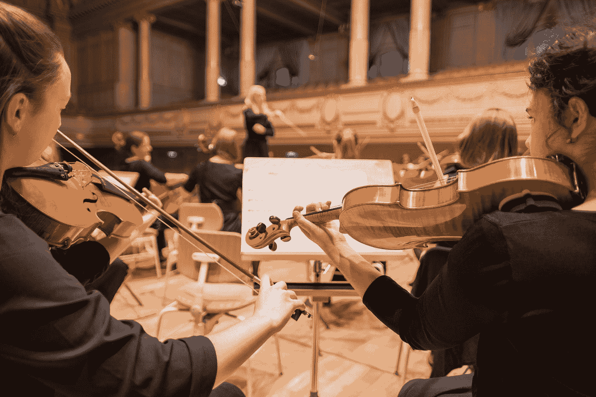
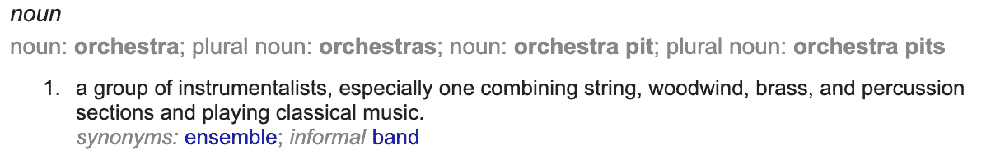
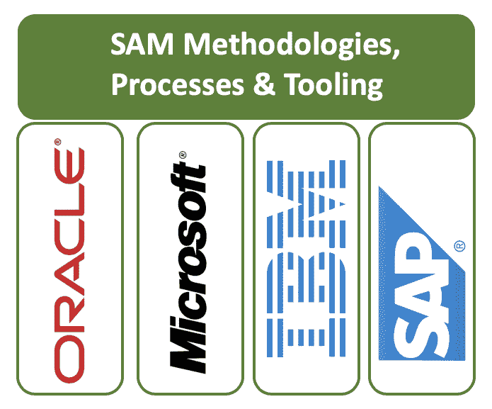

# 和萨姆一起创作美妙的音乐

> 原文：<https://medium.com/version-1/making-beautiful-music-with-sam-f5462da43f14?source=collection_archive---------6----------------------->

Photo by [Manuel Nägeli](https://unsplash.com/@gwundrig?utm_source=medium&utm_medium=referral) on [Unsplash](https://unsplash.com?utm_source=medium&utm_medium=referral)

SAM 和审计答辩有什么区别？

它们是一回事吗？它们是共生的吗？一个学科包含另一个学科吗？你为什么要在乎？

简单的回答是，是的，应该可以...让我解释一下！

让我们考虑一个管弦乐队。这样的东西是由什么构成的？这是一群音乐家，他们在自己的专业领域拥有独特而独立的技能，他们结合在一起创作出美妙的音乐，正如《牛津英语词典》所说:

管弦乐队中有一些部门专门从事特定乐器的分类，例如铜管乐器、木管乐器、打击乐器和弦乐器。每个小组都专注于他们个人演奏的质量和成功，但也对他们所在部门的成功以及最终乐队的成功有既得利益。当他们一起演奏时，音乐会是一件美妙的事情。

如果我们把音乐家稍微调换一下，让他们演奏一种不同的乐器，会发生什么？音乐还会很美吗，或者输出的质量会受到影响吗？

显然，产量会受到影响。可能会有一些成功，因为有理由假设一个小号手可能会很好地演奏 flugelhorn 号，但是长号呢？小提琴？萨克斯管？一架大钢琴？

可能再也做不出美妙的音乐了！

即使我们不把音乐家们弄得团团转，让他们演奏不同的乐器，但如果没有一个关键因素，即指挥，他们仍然无法做出优美的音乐。

指挥是指挥音乐表演的艺术，如管弦乐或合唱音乐会。它被定义为“用手势指挥几个演奏者或歌手同时演奏的艺术”

# 这与 SAM 和软件许可有什么关系？

简而言之，它很好地说明了 SAM 方法和流程与许可证顾问的独特技能和知识之间的关系。

了解诸如主要用途等复杂情况的 Oracle 授权顾问专家也不太可能知道他们何时需要核心 cal、服务器 cal、软件保障等，或者知道如何处理分许可授权的复杂性！只是信息量太大了。当然，有些人会告诉你他们是多学科的，我肯定他们是，但没有达到他们需要的深度。每个许可证专家都有一个首选的供应商，他们通常都是从这个供应商开始接触的，让他们与另一个他们没有经验的供应商合作是对宝贵资源的浪费。

让多个人熟悉每个供应商的复杂性是很好的，但是如何协调他们的工作呢？你如何衡量他们的价值？如何控制软件管理中非特定于供应商的部分？

SAM 方法和流程是将这些东西结合在一起的粘合剂。由 SAM 经理实施，他对计划的结果负有最终责任。

一个有凝聚力的 SAM 战略依赖于三样东西:人员、流程和技术。

或者我应该说，音乐家，音乐和乐器？

你需要这三者来创作美妙的音乐。

**关于作者** Jason Pepper 是 SAM Practice 版的负责人。