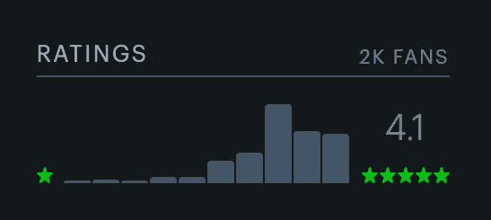
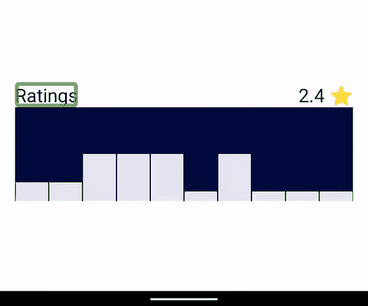
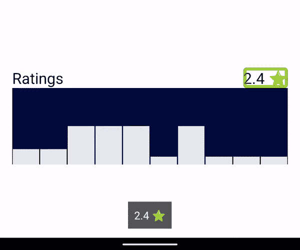
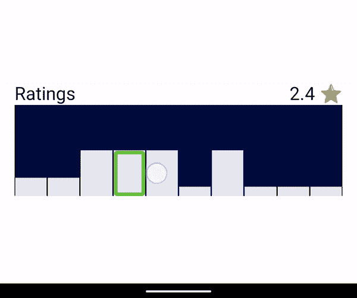
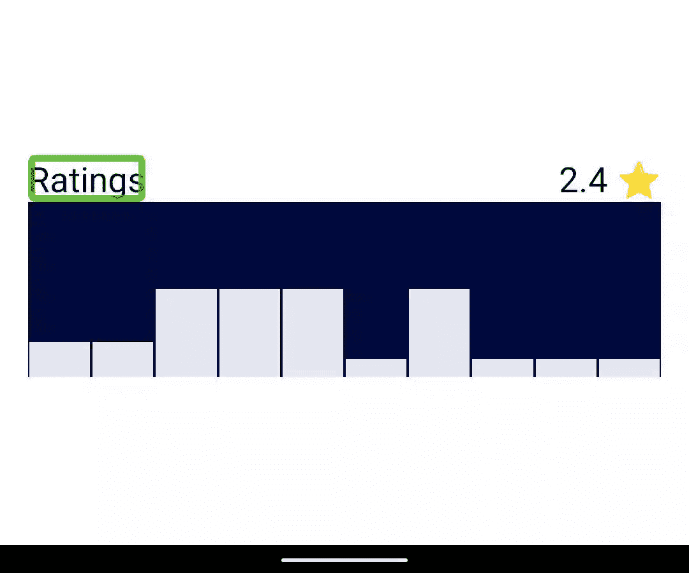

# 让 Android 上的自定义视图变得可访问

> 原文：<https://medium.com/google-developer-experts/making-custom-views-on-android-accessible-76b8d577be53?source=collection_archive---------0----------------------->

## 在本帖中，我们将在 MovieRatings 自定义视图中添加对 Google TalkBack(和其他 Android 辅助服务)的支持

我一直在业余时间非常缓慢地开发一款 Android 应用程序。这是 Letterboxd(类似 Goodreads，但用于电影)的客户端，我目前正在复制网站上的一个功能:你可以看到每部电影的用户评级分布。

The rating distribution for Marriage Story (2019) tends towards more favorable reviews // [https://letterboxd.com/film/marriage-story-2019/](https://letterboxd.com/film/marriage-story-2019/)

API 提供了我们自己构建它所需的一切，所以我创建了一个快速原型，直接在画布上绘制图表，然后用 Google TalkBack 测试它，这是一个为盲人和视障用户提供的 Android 辅助功能服务。

下面的屏幕截图显示了启用对讲的导航(白色圆圈显示了“移动到下一个元素”手势)。

Screen capture showing that the text elements are focusable using Google TalkBack, but the ratings distribution view is not.

它被忽略了。可访问性服务依赖于通过`[AccessibilityNodeInfo](https://developer.android.com/reference/android/view/accessibility/AccessibilityNodeInfo)`的实例公开的关于每个视图的信息。因为我们直接在画布上绘制，所以这个视图的元数据是空的；对于对讲用户来说，图表是不存在的。

> 从一个`AccessibilityService`的角度来看，一个窗口的内容表现为一个可访问性节点 infos 的树，这个树**可能或者不可能一对一地映射到视图层次结构。换句话说，自定义视图可以自由地将自己报告为可访问性节点信息树。**

让我们创建*虚拟视图层次结构，而不是为每个间隔使用单独的视图来重新创建图表。*我们可以保留我们的画布，并使其易于访问。

要使这个视图可访问，我们需要做两件事:

1.  描述每个间隔
2.  指出每个间隔的位置

幸运的是，我们可以使用`ExploreByTouchHelper`，一个来自 [Jetpack Customview](https://developer.android.com/jetpack/androidx/releases/customview) 库的类，它为我们做了所有困难的事情。

# 使用 ExploreByTouchHelper

`ExploreByTouchHelper`是一个抽象类，扩展了`AccessibilityDelegateCompat`。

我们将助手创建为自定义视图的内部类，这样我们就可以访问`onDraw()`函数使用的相同属性，然后我们可以将其设置为`init`块中的委托。

我们需要实现四个功能，它们听起来很复杂，但是让我们一个一个来看。

1.  `fun getVisibleVirtualViews(virtualViewIds: MutableList<Int>)`

我们需要用所有可见虚拟视图的 id(图表中的间隔)填充列表。在我们的例子中，所有间隔总是可见的，所以我们将返回所有 id 的列表。

身份证真的很简单。我们只是用区间的指数。

2.`fun getVirtualViewAt(x: float, y: float): Int`

对于这个函数，我们需要返回在`x, y`位置下的虚拟视图的 ID，或者如果在这些坐标上没有项目，返回`ExploreByTouchHelper.HOST_ID`。

我们在这里稍微变通了一下规则，忽略了`y`值来增加触摸面积。即使用户触摸了工具条上方的空间(但仍在`RatingsView`内)，我们也报告工具条被触摸了:

3.`fun onPopulateNodeForVirtualView(virtualViewId: Int, node: AccessibilityNodeInfoCompat)`

这是我们为虚拟视图提供所有元数据的地方。

我们需要设置内容描述(或者文本，如果它是可视化的)并在 parent 中设置边界。

父类中的边界应该与`onDraw()`函数中的逻辑相匹配。

4.`fun onPerformActionForVirtualView(virtualViewId: Int, action: Int, arguments: Bundle?): Boolean`

因为我们在步骤 3 中没有添加任何辅助功能动作，所以永远不应该调用它。我们可以在这里返回`false`。

就是这样！再次用 TalkBack 测试它，现在我们可以使用“移动到下一个元素”手势来选择每个间隔，并大声朗读每个间隔的描述。

Screen capture showing intervals in the ratings distribution view being focused by Google TalkBack

# 我的触摸探索呢？

Google TalkBack 用户浏览内容的另一种方式是使用触摸浏览。请注意，当用户触摸文本视图时，它们是如何获得可访问性焦点的，但间隔却没有:

Screen capture showing that the intervals (virtual views) are resistant to focus when using Explore-by-Touch

为了解决这个问题，我们需要在自定义视图中覆盖一个函数:

最后，一切都按预期运行:

Screen capture showing that both text views and each interval is accessible to TalkBack and Explore-by-Touch

也许应该把内容描述更新成有用的东西。

# 试试吧！

我发现官方文档很难找到和使用，但是在 [Jetpack 库](https://cs.android.com/androidx/platform/frameworks/support/+/androidx-master-dev:samples/Support4Demos/src/main/java/com/example/android/supportv4/widget/ExploreByTouchHelperActivity.java;l=68?q=ExploreBy&sq=)和 [MDC for Android](https://github.com/material-components/material-components-android/blob/5fb796437291ce6b7d43b3beba13a42256db6eac/lib/java/com/google/android/material/slider/BaseSlider.java#L2218) 库中有很好的示例。

你可以[在这里](https://github.com/ataulm/android-skeleton/compare/virtual-views-a11y?expand=1)看到这个演示的代码——多亏了这个助手类，它只用了不到 50 行代码！

让我知道你是如何在 Twitter 上找到这篇文章[的，或者在下面留下评论。](/google-developer-experts/twitter.com/ataulm/)