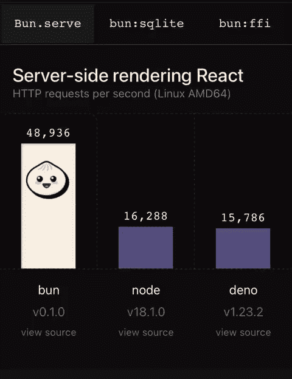

# 制作更快的 Javascript——BUN 意在！！！

> 原文：<https://medium.com/walmartglobaltech/making-faster-javascript-bun-intended-d31f2e012cbd?source=collection_archive---------8----------------------->

BUN JS

# JS 和工具的发展

JavaScript 是由 Brendan Eich 在 1995 年发明的。它是为 Netscape 2 开发的，并在 1997 年成为 ECMA-262 标准。2009 年发布的 Nodejs。这时，在 Gmail 等“Web 2.0”应用程序向世界展示了现代网络体验之后，JavaScript 成了一种更严肃的语言。

JS 引擎变得更好。所有主流浏览器都开始为 JavaScript 提供更好的支持，并努力提供更好的性能。节点使用的是 V8 引擎(Chrome V8)，这是迄今为止最好的引擎之一。

我们开始构建大型项目，并觉得有必要解决我们的捆绑问题。我们在 2012 年迎来了 Webpack。现在少了一件需要担心的事。

我们开始谈论聚合填料。我们知道 indexOf 可以跨浏览器工作，但是 includes 不能。在面试中写简历成为一种趋势。然后我们在 2014 年迎来了巴贝尔。快进到 2022 年，polyfill 就过时了。我已经因为这个觉得自己老了！

**不是所有的事情都和 JS 有关！我们要快！**

就在我们开始觉得自己像 JS 神的时候(有时候跛脚很酷！)，webpack 和 babel 之类的工具开始感受到热度了！有竞争对手。

像 **Rust** 和 **Go** 这样的语言被引入。事实证明，在捆绑、传输和编译过程中，它们比 JavaScript 更具性能。它们是多线程的，可以处理大量文件。这些工具运行在开发者的机器上。他们不需要使用 JS。酷！我们能走快点吗？

# 欢迎面包！

[BUN Logo](https://bun.sh/)

*JS 快。无意双关！！嗯（表示踌躇等）..可能是也可能不是。看情况。但是我们确实喜欢在我们“小”的 JS 世界中引入新的东西。*

*’****发髻*** ***意在！！****’*

We want fast…more fast…blazing fast!!!

## 我们想要快…更快…快得惊人！！！

2022 年，Jarred Summer 刚刚宣布了它的测试版，并声称*比 node* 快得多。

更快？多少钱？快几个数量级！！后 covid 场景肯定会有很大的不同。:)

BUN claims exceptional performance

**Bun 声称表现优异**

对创建者提供的基准有点怀疑总是一个好主意，但正如我们在上面看到的，当服务器渲染反应，运行数据库查询或运行本机代码时，它几乎快了 3 倍。绝对令人印象深刻！！

[Source](https://giphy.com/explore/impressive)

我们知道 Google 的 V8，这是最强大的 JS 引擎之一，它支持 chrome、node 等，并通过即时编译使 JavaScript 速度极快。现在我们有了一个新的球员包，看起来很有前途，原因很明显，性能！

**什么让它快？**

[SOURCE](https://tenor.com/view/so-fast-esam-panda-global-speedy-quick-gif-20939062)

**Bun 不使用 V8 发动机**

Source: [WEBKIT](https://github.com/WebKit)

它使用来自 webkit 的 JavaScript 核心，这通常被认为是更快但更难操作的。此外，它是用一种叫做 Zig 的低级编程语言编写的。Zig 是一种相对较新的语言，类似于 C 或 rust。

正如面包的创造者所说:

> 大量的时间花费在分析、基准测试和优化上。对于 Bun 的每个部分，答案都是不同的，但有一个总的主题:Zig 对内存的低级控制和缺乏隐藏的控制流使得编写快速软件变得简单得多。

# 它提供什么？

[Source](https://www.123rf.com/photo_29226705_stamp-with-text-all-in-one-inside-illustration.html)

走得快才好玩！但更重要的是 Bun 是一个一体化的**运行时**。

**原生捆绑器**:它有一个原生捆绑器来取代 WebPack 等工具，也有一个原生传输器，这样你就可以用顶级 await 等很酷的功能编写现成的打字代码。

**trans file:**Bun 也将传输 JSX 文件。此外，像 Dino 一样，它优先考虑 web api，如 fetch，并且还支持许多节点核心模块以及节点 api，这将允许许多节点包也在 Bun 中运行。

**节点包:**它实现了节点的模块解析算法，这意味着，您可以将 npm 中的包安装到 Bun 中，这些包的安装速度提高了 20 倍。神奇！！

他们说:

> **‘多合一’快速&易用工具。您只需要一个 bun，而不是 1000 个 node_modules 用于开发。**

**环境变量:**另一个特点是环境变量自动加载。所以，。env 不需要安装到每个项目中。

**测试跑者:**也自带类似 Jest 的测试跑者。同样，它很快。惊人的快！

# 结论

还在实验阶段！是贝塔。我们可以期待错误。即使这个工具还没有准备好投入生产，这样的新工具和度量标准的出现也是令人敬畏的。哦，伙计，引起肾上腺素激增！

另外， **Bun 不是万能的工具。一定要检查一下 https://github.com/Jarred-Sumner/bun，你可以找到一个链接来检查那些还没有运行的东西。**

下一步是什么？让我们把手弄脏，感受力量。