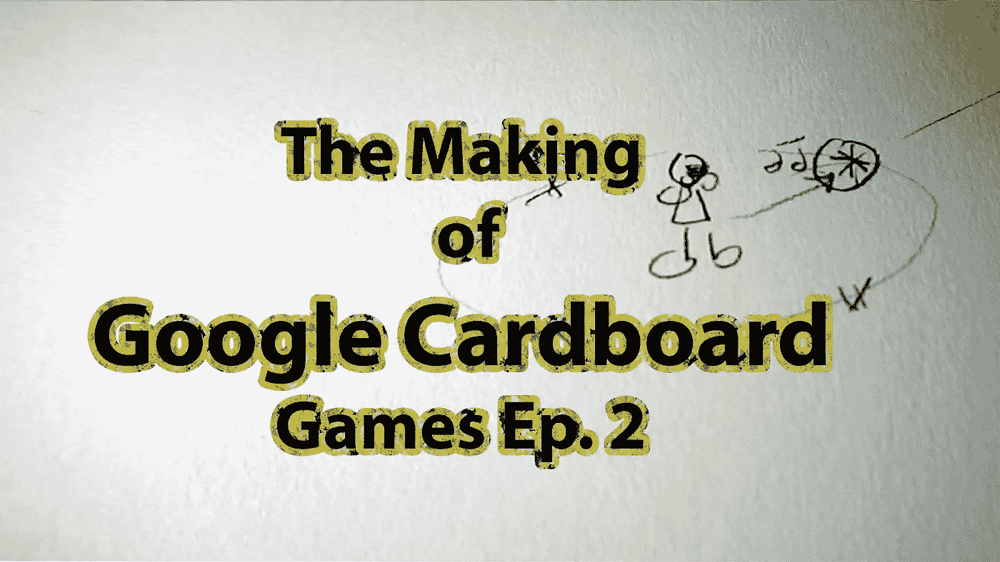

# 为谷歌 Cardboard Ep 制作游戏。2 —游戏理念

> 原文：<https://medium.com/google-developer-experts/making-games-for-the-google-cardboard-ep-2-the-game-idea-8df38808a52?source=collection_archive---------2----------------------->

在这个视频中，我将解释我对 Google Cardboard 项目的游戏想法。

游戏玩法类似于打鼹鼠。用户将能够通过音频定位敌人，并通过聚焦其中一个并扣动扳机来攻击他们。

这个游戏类似于现有的谷歌 Cardboard Unity 演示，因此很容易制作。此外，我们正在利用 3D 空间，这可以利用虚拟现实的经验。