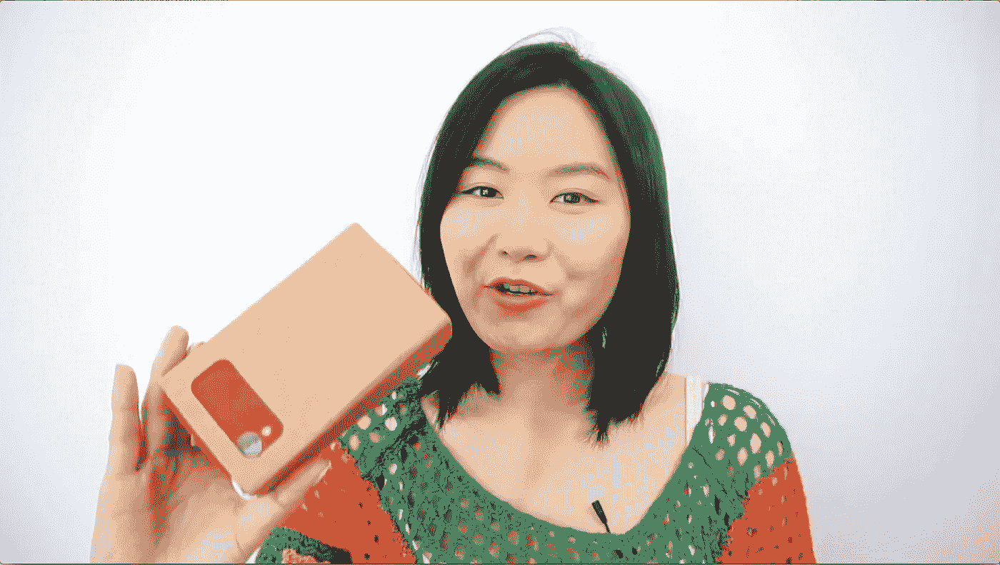
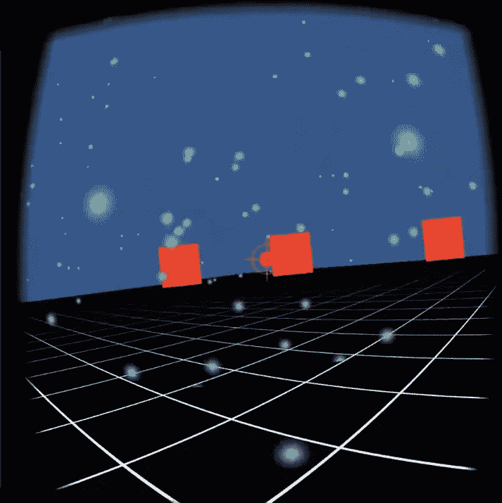
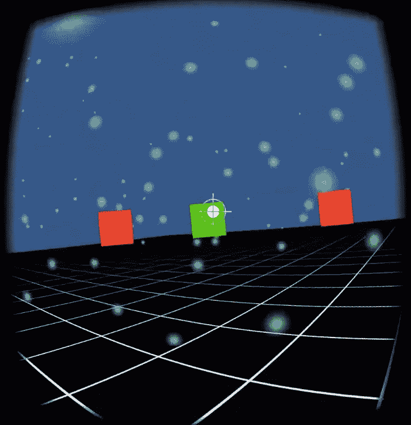

# 为谷歌 Cardboard Ep 制作游戏。3 —找到目标

> 原文：<https://medium.com/google-developer-experts/making-games-for-the-google-cardboard-ep-3-find-the-target-befe80274881?source=collection_archive---------2----------------------->

我们正在制作一个基于目标的游戏，游戏目标点需要一直可见。在这个视频中，我将向您展示如何在 Photoshop 中创建一个 2D 透明图像，并将其导入 Unity 3D。此外，我们正在使用新的统一 2D UUI 创建新的目标点精灵。

这个视频的第二部分，我们将动画的目标点。我们将创建一个脚本，动画的目标点。

