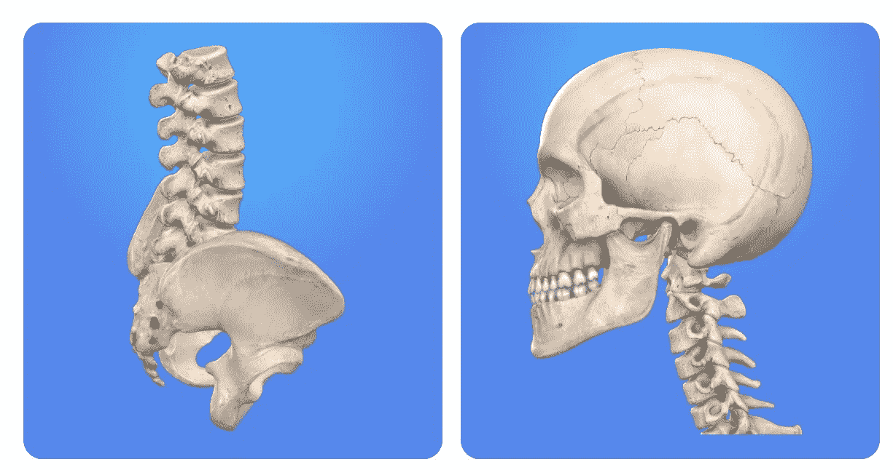
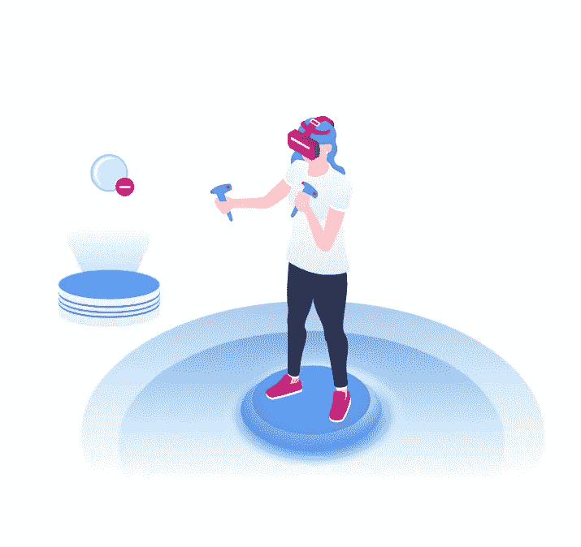

# 让帮助成为现实:医疗保健中的增强现实

> 原文：<https://medium.com/quick-code/making-help-real-augmented-reality-in-healthcare-b355076f82f4?source=collection_archive---------2----------------------->

增强现实不再被认为是纯粹的娱乐。它在医疗保健中的应用引入了更有效的治疗病人的方法。

真实世界有多真实？现代科技的进步使得现实世界和虚拟世界之间的界限越来越模糊。数字创新的当代阶段带来了被称为增强现实(AR)的现象，它包括使用显示器、监视器、相机和传感器将数字数据和图像集成到我们的物理环境中。

当历史上最成功的应用之一上市时，AR 在全球各地的胜利进军蓬勃发展。不久之后，神奇宝贝猎人们挤满了城市街道，寻找手里拿着手机的虚拟生物。

今天，增强和虚拟现实不仅仅是娱乐。这项技术越来越多地应用于[的各个领域](https://www.inc.com/james-paine/10-real-use-cases-for-augmented-reality.html)，如商业物流、课堂教育、维修和保养、设计和建模，甚至旅游业。无论在这些领域有多么有益，在医疗领域使用增强现实可能是人类最大的福音。自然，健康是人们最看重的。这就是为什么医学逐渐成为当代科学的重中之重，特别强调进一步推进未知领域的前沿。

# 增强现实和虚拟现实:重要的区别

在我们进一步了解医疗保健中的 AR 之前，重要的是要认识到它与另一种相同羽毛的鸟——虚拟现实(VR)有什么不同。尽管这两者都是我们数字时代的近亲和大脑产物，但它们并不完全相同。

[虚拟现实](https://en.wikipedia.org/wiki/Virtual_reality)提供一种身临其境的体验，让你置身于一个人造世界，一个模拟的环境中。为了能够欣赏它生成的逼真图像，你需要特殊的设备——一个包含头戴式显示器的 VR 耳机，在你的眼睛前面有一个小屏幕。一旦你戴上它，你会发现自己置身于一个人造现实中，你不仅可以看到和听到，还可以四处旅行，与虚拟物体互动。

把一个人放在一个墙上挂满大屏幕的特殊房间里，也可以达到同样的效果。

相比之下，医学或任何领域的增强现实不会让你远离现实世界——它增加了虚拟物体，从而增强了现实世界。与虚拟现实不同，AR 不需要任何专门的设备或前提，也不会导致急剧的学习曲线。

它以应用程序的形式在智能手机和平板电脑上运行，面向更广泛的受众，这解释了它比 VR 更受欢迎的原因。

正如 eMarketer 声称的那样，去年仅在美国，ar 用户数量就达到了惊人的 7000 万，远远高于 4300 万 VR 用户。

在各种医疗移动应用中实施，AR 技术正在大规模进入医疗保健行业。

# 增强现实在医学中的优势

医疗增强现实对[医生和患者来说都是真正的天赐之物](https://thinkmobiles.com/blog/augmented-reality-medicine/)。

医生将在以下方面得到极大的帮助:

*   **教育和训练。**任何教育过程都可以通过利用增强现实得到极大的促进，医疗培训肯定会从中受益匪浅。没有风险和互动的性质使 AR 成为一个完美的教学工具。
*   **常规医疗任务。头戴式显示器、各种耳机，最后还有简单的谷歌眼镜(如果在这种情况下使用“简单”这个词是正确的话)，让医生不用手，同时向他们展示他们正在处理的事情的完整画面。**
*   **增强紧急帮助机会。如果一个人突然倒在街上，路人通常会目瞪口呆，不知道如何帮助他或她。帮助必须尽可能及时。一个特殊的浏览器与相应的 AR 应用程序相结合，不仅可以存储所有的紧急号码，还可以显示最近的自动体外除颤器的位置，并向您显示到达那里的最短路径。**

## 对病人来说，它意味着:

*   **更安全的侵入性手术。** AR 智能眼镜可以替代显示图像或关键数据的监视器，这些图像或关键数据通常由内窥镜摄像机提供。
*   **关于疾病预防和治疗的更多信息。AR 可以提供关于我们身体工作方式的事实，因此它可以让我们为做出正确的医疗决定做好准备。虽然还不能识别疾病或其症状，但增强现实医疗应用可以为许多类别的患者或未来的父母提供教育目的。**
*   简化一些医疗程序。帮助检测患者静脉的位置可以让他们更容易接受血液样本或注射(也简化了护士的工作)。
*   **改善调养。**即使患者不在医院，AR 应用程序也可以帮助他们了解他们将在家中接受的治疗方式。

除了这两类使用 AR 的人之外，医疗保健行业还包括药品制造商。任何制药公司也会发现这种顶级技术非常有用，可以提供药物在我们体内工作方式的 3D 图像。此外，这是一个赢得客户的万全之策，他们会认为这样的视频比通读冗长乏味(而且往往难以理解)的药品说明更有帮助(而且更有趣)。

鉴于医疗保健行业相关各方的这些好处，难怪医疗 AR 市场会经历快速繁荣，到 2023 年可能会扩大到 23%。根据在医疗保健中采用增强现实的大致估计，统计数据显示，就 2020 年的收入机会而言，其收入将达到惊人的 12 亿美元。无论这个数字看起来多么巨大，到 2025 年，它甚至可能增长 3.5 倍，达到令人难以置信的 51 亿美元。

目前在医疗保健中使用 AR 的最显著趋势是什么？

# 增强现实在医学上是如何使用的？

有几个主流趋势，医疗 AR 取得了最大的进步。

## 增强手术

一个外科医生可能是一个超级天才和经验丰富的专业人士，处理大多数手术就像 20 分钟的小菜一碟。然而，任何手术都是充满挑战的冒险。AR 被称为最大限度地降低与这种侵入生物体相关的风险，甚至拯救生命，谁知道呢。

首先，骨骼、肌肉和血管可以在 3D 图像中出现在外科医生的眼前，这样医生就可以在几个小时前决定应该做什么，而不是在病人被切开的时候。医生所要做的就是戴上 AR 耳机，让患者免于切割自己的身体。当然，在此之前，相应的 MRI 数据和 CT 扫描被输入到耳机中，但随后外科医生将有足够的时间来决定切口或注射的精确位置。其次，医生可以实时访问关于患者的所有关键数据，而无需在任何地方搜索记录，这是我们公司的一个可理解的体验。这种数据在紧急情况下至关重要，因为任何第二次损失都可能给病人带来许多问题。

## 治疗和预防

虽然前三个领域在增强现实医疗保健中占据主导地位，但这项技术的应用并不限于此。它不仅能对人们治疗疾病有价值的帮助，而且还能治愈一些疾病。例如，焦虑症和恐惧症可以通过产生人工刺激来有效地治疗，这将最终使患者习惯于引起这种疾病的环境。

人们普遍认为，预防疾病比试图治疗患病的病人要好得多。如果把任何预防变成一场游戏，效果会好得多。意识到这一点，网络开发人员设计了一款名为鼓励初露头角的慢跑者努力的应用程序。下载完僵尸，快跑！他们会发现自己被奇怪的呻吟生物追赶，这足以让任何人加快试图逃离它们的速度。在这里，增强现实在医疗和娱乐领域的应用重叠，将健康维护变成了乐趣——这是我们公司擅长的领域。

## AR 医学教育和培训

Requestum 专家认为，这项技术提供的实践学习体验将在不久的将来彻底改变医学教育。模拟手术和疾病诊断将让学生们遇到几十个案例来处理。这是一个很好的方法来处理治疗虚拟病人的错误，而不是危及真实的人。医疗保健中一个典型的增强现实用例是将解剖数据投影到 3D 骨架上，以可视化各种器官的工作。AR 技术的另一个优势是确保系统的学习方法。解剖实验室中可用的随机训练阻碍了学生获得一致的图像。利用增强现实，他们可以获得与某个器官或疾病相关的详尽体验。

## 诊断问题

准确描述症状对病人来说从来都不是一件容易的事情，尤其是老人和婴儿。在增强现实的帮助下，医疗诊断将变得更加容易，使患者能够更好地解释他们的担忧。例如，开发了 EyeDecide 应用程序，向患者显示白内障或年龄相关性黄斑变性的影响，以便他们可以挑出类似的症状。

此外，可以简化一些传统的程序。例如，40%的静脉注射操作不当，因为护士不能用第一棒击中静脉。AccuVein 消除了这些问题，使护士可以轻松找到静脉。

# 增强现实医学:未来一瞥

最近软件和硬件的进步大大降低了 AR 技术的成本，这预示着它们将在医疗保健领域得到更广泛的应用。数字设计师发现了他们可以利用的新领域。

例如，2014 年，谷歌宣布了开发智能隐形眼镜的大胆计划，这种眼镜将能够测量眼泪中的葡萄糖水平，从而对数百万糖尿病患者有用。我们肯定会看到大量的其他进步，这些进步最终会使人类更加健康，延长他们的寿命。

# 结论

在当今的数字世界中，增强现实正日益成为工业和娱乐业许多分支不可分割的一部分，因此医疗保健也不例外。由于它为诊断、治疗和训练提供了更多的机会，AR 完全有机会发展成为改善生活质量的强大工具。

*最初发表于*[*【https://requestum.com】*](https://requestum.com/augmented-reality-healthcare)*。*