# 让水母在构图中移动:动画图像矢量和应用 AGSL 渲染效果🐠

> 原文：<https://medium.com/androiddevelopers/making-jellyfish-move-in-compose-animating-imagevectors-and-applying-agsl-rendereffects-3666596a8888?source=collection_archive---------1----------------------->

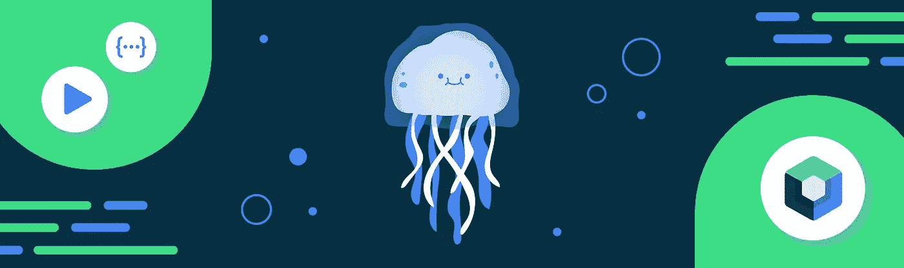

我喜欢在互联网上关注鼓舞人心的人，看看他们做了什么——其中一个人是[卡西码](https://www.cassie.codes/)，她为网络制作了令人难以置信的动画。她的一个鼓舞人心的例子是这个可爱的动画水母。

Animated Jellyfish by Cassie Codes

看到这个并痴迷了一段时间后，我一直在想，这个可爱的小生物也需要在 Compose 中活过来。这篇博文描述了我是如何在 Jetpack Compose 中完成的，最终代码可以在这里找到。这里的技术当然不仅仅适用于水母……任何其他鱼类也可以！开个玩笑——这篇博文将涵盖:

*   自定义图像向量
*   动画图像矢量路径或组
*   在可组合的 AGSL 渲染效果上应用扭曲噪波效果。

让我们开始吧！🤿

# 分析 SVG

要实现这个水母，我们首先需要了解 SVG 是由什么组成的——并尝试复制它的不同部分。弄清楚 svg 在画什么的最好方法是注释掉它的各个部分，并查看 SVG 的每个部分呈现的视觉效果。为此，您可以在上面链接的 codepen 中更改它，或者下载并在文本编辑器中打开一个 SVG(这是一种文本可读格式)。

所以让我们来看一下这个 SVG:

```
<!-- 
    Jellyfish SVG, path data removed for brevity 
--> 
<svg  viewBox="0 0 530.46 563.1">
  <defs>
  <filter id="turbulence" filterUnits="objectBoundingBox" x="0" y="0" width="100%" height="100%">
    <feTurbulence data-filterId="3" baseFrequency="0.02 0.03" result="turbulence" id="feturbulence" type="fractalNoise" numOctaves="1" seed="1"></feTurbulence>
    <feDisplacementMap id="displacement" xChannelSelector="R" yChannelSelector="G" in="SourceGraphic" in2="turbulence" scale="13" />
  </filter>    
  </defs>
  <g class="jellyfish" filter="url(#turbulence)">
    <path class="tentacle"/>
    <path class="tentacle"/>
    <path class="tentacle" />
    <path class="tentacle" />
    <path class="tentacle"/>
    <path class="tentacle"/>
    <path class="tentacle"/>
    <path class="tentacle"/>
    <path class="tentacle"/>
    <path class="face" />
    <path class="outerJelly"/>
    <path id="freckle" />
    <path id="freckle"/>
    <path id="freckle-4"/>
  </g>
  <g id="bubbles" fill="#fff">
    <path class="bubble"/>
    <path class="bubble"/>
    <path class="bubble" />
    <path class="bubble"/>
    <path class="bubble"/>
    <path class="bubble"/>
    <path class="bubble" />
  </g>
  <g class="jellyfish face">
    <path class="eye lefteye"  fill="#b4bebf" d=""/>
    <path class="eye righteye" fill="#b4bebf" d=""/>
    <path class="mouth" fill="#d3d3d3" opacity=".72"/>
  </g>
</svg>
```

SVG 由以下元素组成:

1.  构成 SVG 的路径和路径组:

*   触须
*   面部——斑点和外部果冻
*   眼睛——睁开和闭上的动物
*   泡泡——在水母周围随机产生动画——大小和 alpha 产生动画

2.总的来说，水母的身体也应用了`feTurbulence`(噪波)作为`feDisplacementMap`，这给了它不稳定的外观。

既然我们已经了解了这个 SVG 是由什么组成的，那么让我们开始在 Compose 中呈现静态版本。

# 创建自定义图像向量

Compose 有一个 [ImageVector](https://developer.android.com/jetpack/compose/graphics/images/compare#image-vector) 的概念，您可以通过编程构建一个向量——类似于 SVG。对于你只想渲染而不想改变的 vector/SVG，你也可以使用 painter resource(r . drawable . vector _ image)加载一个 VectorDrawable。这将会把它转换成 Compose 将要渲染的 ImageVector。

现在你可能会问自己——为什么不把水母作为 SVG 导入 xml 文件，然后用`painterResource(R.drawable.jelly_fish)`加载它呢？

这是一个很好的问题——以这种方式加载水母是可能的，去除 SVG 的湍流方面，图像将呈现加载的 XML(如这里的[文档中所解释的](https://developer.android.com/jetpack/compose/graphics/images/compare#image-vector))。但是我们想对路径的单个部分做更多的工作，比如点击时动画部分和对身体应用噪声效果，所以我们将以编程方式构建我们的`ImageVector`。

为了在 Compose 中渲染这个水母，我们可以复制组成鱼的路径数据(或者路径上的“`d`”标签)，例如，第一个触手有以下路径数据:

```
M226.31 258.64c.77 8.68 2.71 16.48 1.55 25.15-.78 8.24-5 15.18-7.37 23-3.1 10.84-4.65 22.55 1.17 32.52 4.65 7.37 7.75 11.71 5.81 21.25-2.33 8.67-7.37 16.91-2.71 26 4.26 8.68 7.75 4.34 8.14-3 .39-12.14 0-24.28.77-36 .78-16.91-12-27.75-2.71-44.23 7-12.15 11.24-33 7.76-46.83z
```

如果你是第一次接触路径/矢量/SVG，上面的内容可能会有点让人不知所措。但是不要担心，这些只是指定如何画东西的数学指令的命令。例如， **M** 是将虚拟光标移动到新位置而不进行绘制的命令， **L** 是在指定位置绘制一条线的命令，还有一些其他命令，例如:

*   **M，m** :移动到
*   **L，L，H，H，V，v** :行到
*   **C，C，S，s** :三次贝塞尔曲线
*   **Q，Q，T，t:** 二次贝塞尔曲线
*   **A、a:** 椭圆弧曲线向
*   **Z，z** —关闭路径

命令**区分大小写**，大写字母表示视口空间中的绝对坐标，而小写字母表示命令相对于当前位置。

现在你可能在想——我是不是必须在脑子里画图，并且用手知道所有的位置和命令？不——一点也不。您可以在大多数设计程序(如 Figma 或 Inkscape)中创建一个矢量，并将绘图结果导出到 SVG 中，以便自己获取这些信息。咻！😅

在 Compose 中创建向量:我们调用`rememberVectorPainter`，它创建一个`ImageVector`，我们创建一个叫做`jellyfish`的`Group`，然后创建另一个叫做`tentacles`的`Group`，我们将第一个`Path`放入其中作为第一个触手。我们还设置了一个`RadialGradient`作为整个水母的背景。

和下面的结果是一个小触手绘制在屏幕上与径向梯度背景！

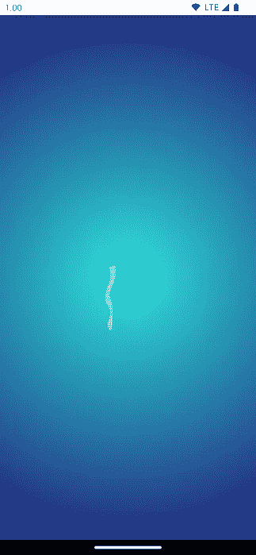

First tentacle rendered

我们对 SVG 的所有元素重复这一过程——从 SVG 文件中提取路径位，并将颜色和 alpha 应用于将要绘制的路径，我们还将路径逻辑分组为触角、面部、气泡等:

我们现在已经用上面的`ImageVector`渲染了整个水母:

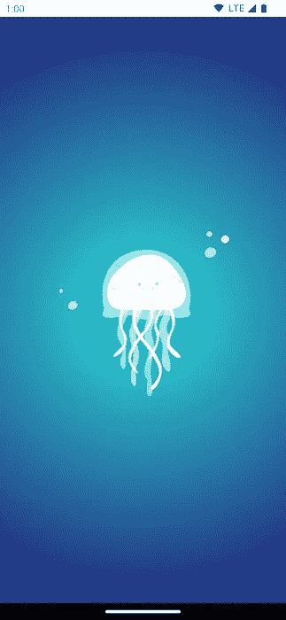

Whole static Jellyfish rendering in Compose

# 动画图像矢量路径和组

我们想制作这个向量的动画部分:

*   水母应该慢慢地上下移动
*   点击水母时，眼睛会眨一下
*   水母的身体应该有一个抖动/噪音效果。

用 XML 文件做这件事很困难:制作动画很棘手，我们需要使用 XML，而且如果不把它转换成一个`AnimatedVectorDrawable`，我们就不能对文件内部的部分应用其他效果。例如，我们想引入一个交互，点击水母时眼睛会眨眼。我们能够更好地控制我们的元素，并以编程方式创建自定义动画。

因此，让我们看看我们如何能够动画的`ImageVector`的个别位。

# 上下移动水母

查看 codepen，我们可以看到水母在上下平移(y 平移)。为了在 compose 中做到这一点，我们创建了一个无限过渡和一个超过 3000 毫秒的动画`translationY`，然后我们设置包含水母的组，并且面部有一个`translationY`，这将产生上下动画。

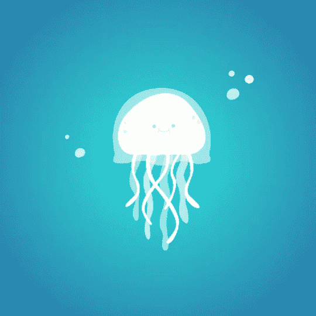

Translation Up and down

棒极了——`ImageVector`的一部分现在上下移动，你会注意到气泡保持在相同的位置。

# 眨眼睛👁️

查看 codepen，我们可以看到每只眼睛上都有一个`scaleY`和`opacity`动画。让我们创建这两个变量，并将比例应用于`Group`和`Path`上的 alpha。我们也将只在点击水母时应用这些，以使这成为一个更具互动性的动画。

我们创建了两个保存动画状态的[动画对象](https://developer.android.com/jetpack/compose/animation#animatable)和一个点击水母时调用的暂停函数——我们制作了这些属性的动画来缩放和淡化眼睛。

我们现在有了一个可爱的眨眼动画——我们的水母差不多完成了！

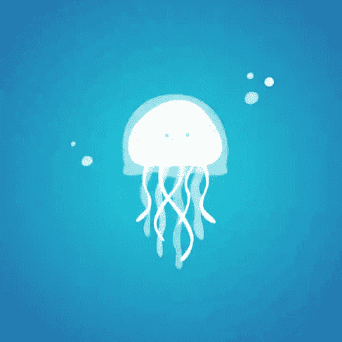

Blinking on click of ImageVector

# 应用失真/噪声效果📯

所以我们已经得到了大部分我们想要动画的东西——上下运动和眨眼。让我们来看看水母的身体是如何应用这种摇摆效果的，身体和触须在应用噪声的情况下移动，以给它一种运动的感觉。

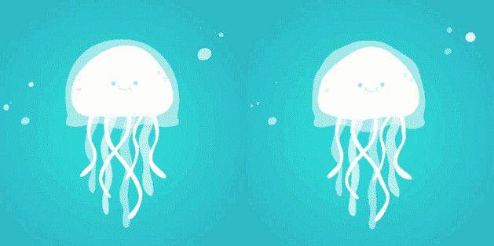

Codepen: Jellyfish without noise vs with noise applied

查看 SVG 和动画代码，我们可以看到它使用`feTurbulence`生成噪声，然后作为`feDisplacementMap`应用于 SVG。

```
 <filter id="turbulence" filterUnits="objectBoundingBox" x="0" y="0" width="100%" height="100%">
    <feTurbulence data-filterId="3" baseFrequency="0.02 0.03" result="turbulence" id="feturbulence" type="fractalNoise" numOctaves="1" seed="1"></feTurbulence>
    <feDisplacementMap id="displacement" xChannelSelector="R" yChannelSelector="G" in="SourceGraphic" in2="turbulence" scale="13" />
  </filter>    
  </defs>
  <g class="jellyfish" filter="url(#turbulence)">
```

不幸的是，目前 Android 不支持这些原语(见[这个公开的 bug](https://issuetracker.google.com/257007553) )，但是我们确实有其他工具可以帮助解决这个问题。`feTurbulence`正在生成噪声，然后将其用作位移图来移动 SVG。

我们可以使用 [AGSL](https://developer.android.com/develop/ui/views/graphics/agsl/using-agsl#using_runtimeshader_with_jetpack_compose) 着色器来实现这一点，值得注意的是，这仅在提拉米苏和更高版本(API 33+)上受支持。首先，我们需要创建一个着色器，作为一个摆动，我们不会使用噪音在第一-只是一个简单的映射函数。

着色器的工作方式是它们作用于单个像素——我们得到一个坐标(`fragCoord`)，我们期望产生一个将在该坐标处渲染的颜色结果。下面是我们将用于转换可组合的初始着色器:

在我们的例子中，我们将使用的输入是我们当前在屏幕上渲染的像素。我们通过作为输入发送的`uniform shader contents;`变量来访问它。我们获取输入坐标(`fragCoord`)，并对该坐标应用一些变换——随时间移动它，并对它执行一些数学运算来移动它。

这产生了一个新的坐标，所以我们不是在`fragCoord`位置返回精确的颜色，而是移动输入像素的位置。例如，如果我们有`return contents.eval(fragCoord)`，它不会产生任何变化——它将是一个传递。我们现在从可组合内容的不同点获取像素颜色，这将对可组合内容产生不稳定的失真效果。

要在我们的可组合组件上使用它，我们可以将这个着色器作为`RenderEffect`应用于可组合组件的内容:

我们使用`[createRuntimeShaderEffect](https://developer.android.com/reference/android/graphics/RenderEffect#createRuntimeShaderEffect(android.graphics.RuntimeShader,%20java.lang.String))`，传入`WOBBLE_SHADER`作为输入。它获取可组合对象的当前内容，并将其作为着色器的输入，参数名为“`contents`”。然后我们查询`WOBBLE_SHADER`中的内容。`time`变量随时间改变摆动(创建动画)。

运行这个，我们可以看到整个`Image`现在扭曲了，看起来有点不稳定——就像水母一样。

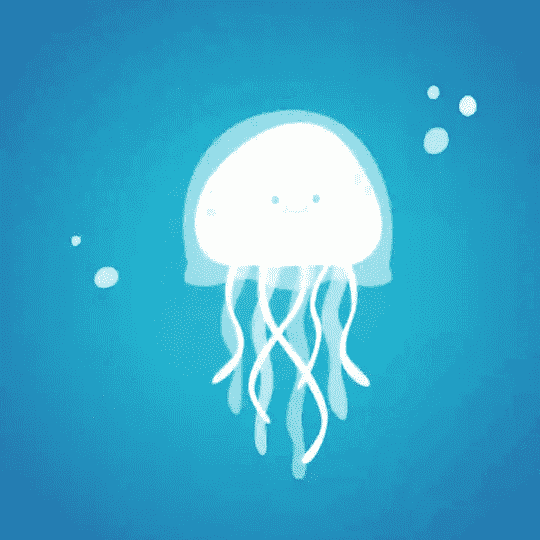

Wobble applied all over the whole jellyfish

如果我们不想让效果应用到脸和泡泡上，我们可以将它们提取到单独的`ImageVectors`中，然后跳过将渲染效果应用到这些矢量上:

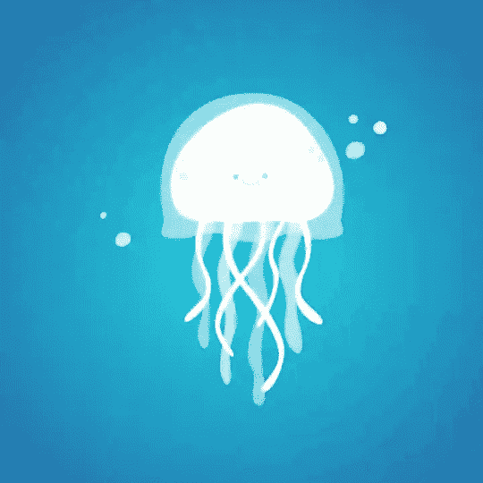

Wobble Applied without affecting the face

# 应用噪波效果🙉

我们上面指定的着色器没有使用噪波函数来对可组合内容应用位移。噪波是一种应用置换的方式，具有更结构化的随机函数。其中一种类型的噪声是柏林噪声(这是`feTurbulence`在幕后使用的)，这是我们渲染运行柏林噪声函数的结果时的样子:

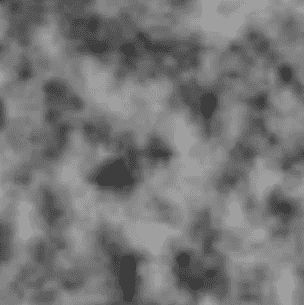

Perlin Noise output

我们使用空间中每个坐标的噪波值，并使用它来查询“`contents`”着色器中的新坐标。

让我们更新我们的着色器，使用一个柏林噪声函数(改编自[这个 Github repo](https://github.com/ashima/webgl-noise/blob/master/src/classicnoise2D.glsl) )。然后，我们将使用它来确定从输入坐标到输出坐标的坐标映射(即位移映射)。

应用这个噪声函数，我们得到一个更好的结果！水母看起来好像在水中移动。

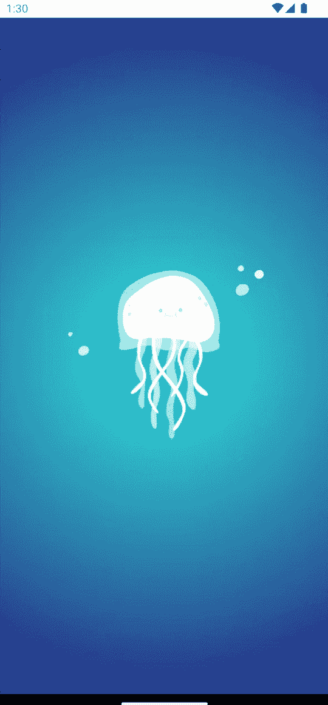

Perlin Noise applied to the jellyfish body

# 但我为什么要用这个？

在这一点上，你可能想知道，这很酷——但在其用例中非常合适，丽贝卡。当然——也许你不会每天在工作中制作一个动画水母(我们可以做梦，对吗？).但是`RenderEffects`可以应用于任何可组合的树——允许你对任何你想要的东西应用效果。

例如，为什么你不希望你的渐变文本或整个可组合屏幕有一个噪声效果或任何其他你想要的 AGSL 效果呢？

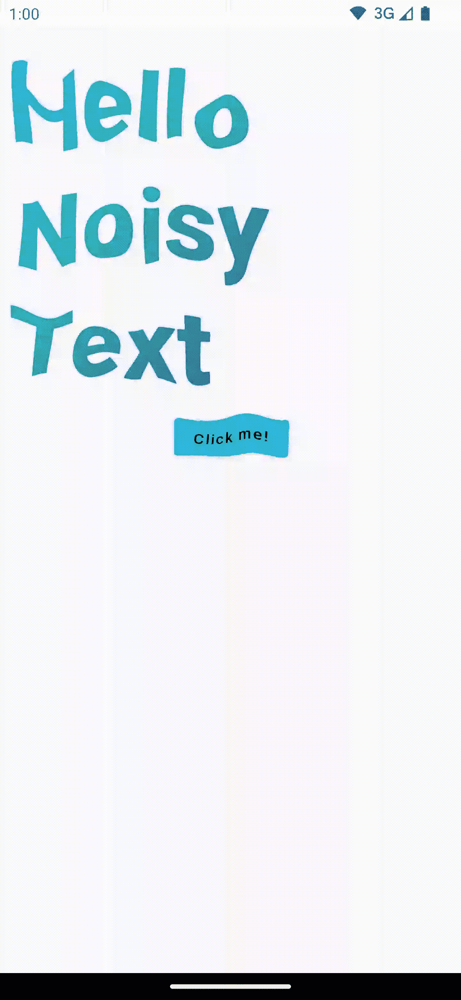

Perlin Noise applied to whole Composable

# 包裹🌯

因此，我们已经在这篇博文中涵盖了许多有趣的概念——从 SVG 创建自定义的`ImageVectors`,制作`ImageVector`的部分动画，以及在 Compose 中将 AGSL 着色器作为`RenderEffects`应用于我们的 UI。

水母的完整代码——点击查看完整的[要点。关于](https://gist.github.com/riggaroo/b139b0dfbf1fee932862dc52d1b08950) [AGSL 渲染效果](https://developer.android.com/develop/ui/views/graphics/agsl/using-agsl#using_runtimeshader_with_jetpack_compose)的更多信息——查看文档，或者[时差样本](http://goo.gle/compose-jetlagged)的另一个使用示例。

如果你有任何问题，请随时联系乳齿象[androiddev.social/@riggaroo](https://androiddev.social/@riggaroo)或[推特](https://twitter.com/riggaroo)。

*感谢* [*约兰达·维尔霍夫*](https://medium.com/u/7c4e8b4f1538?source=post_page-----3666596a8888--------------------------------) *，* [*尼克·布彻*](https://medium.com/u/22c02a30ae04?source=post_page-----3666596a8888--------------------------------) *，* [*弗洛里纳·芒特内斯库*](https://medium.com/u/d5885adb1ddf?source=post_page-----3666596a8888--------------------------------) *，* [*罗曼·盖伊*](https://medium.com/u/c967b7e51f8b?source=post_page-----3666596a8888--------------------------------) *，纳德·贾瓦德对本帖的宝贵反馈。*