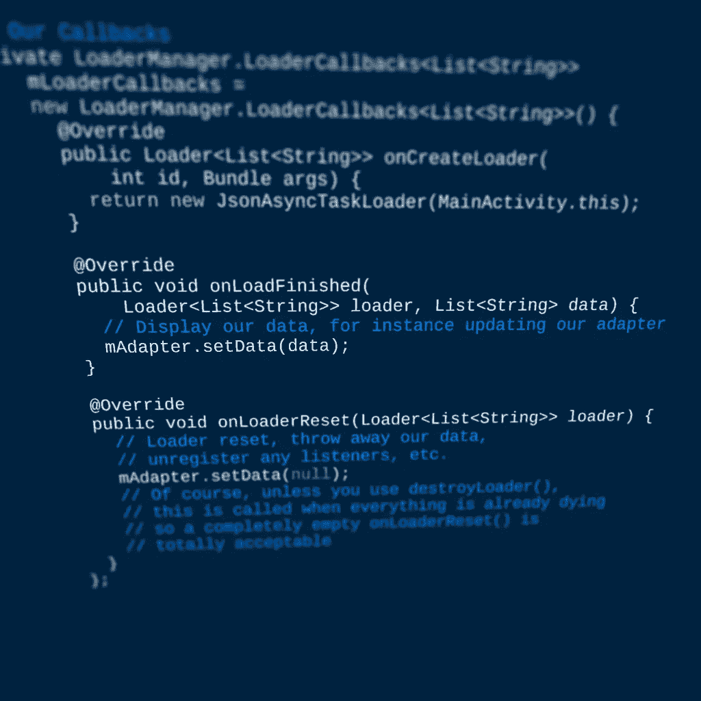

# 让加载数据具有生命周期意识

> 原文：<https://medium.com/androiddevelopers/making-loading-data-on-android-lifecycle-aware-897e12760832?source=collection_archive---------0----------------------->

> 注意:如果你正在寻找一个不依赖于加载器的现代、灵活的解决方案(这里选择的解决方案)，看看 [**生命周期感知数据加载与架构组件**博客文章](/google-developers/lifecycle-aware-data-loading-with-android-architecture-components-f95484159de4)。



构建一个动态的 Android 应用程序需要动态数据。但是我希望我们都已经超越了在 UI 线程上加载数据(#perfmatters 或类似的东西)。关于[季和](https://www.youtube.com/playlist?list=PLWz5rJ2EKKc9CBxr3BVjPTPoDPLdPIFCE&utm_campaign=adp_series_loaders_020216&utm_source=medium&utm_medium=blog)季的讨论可以继续，但是让我们关注一种情况:用 [**加载器**](http://developer.android.com/guide/components/loaders.html?utm_campaign=adp_series_loaders_020216&utm_source=medium&utm_medium=blog) 专门加载数据以显示在您的活动或片段中。

关于加载器的很多讨论都是围绕着 [*游标加载器*](http://developer.android.com/reference/android/support/v4/content/CursorLoader.html?utm_campaign=adp_series_loaders_020216&utm_source=medium&utm_medium=blog) 展开的，但是加载器比仅仅使用游标要灵活得多。

虽然加载器作为 API 11 和更高版本框架的一部分存在，但它们也是[支持 v4 库](http://developer.android.com/tools/support-library/features.html?utm_campaign=adp_series_loaders_020216&utm_source=medium&utm_medium=blog#v4)的一部分，并带来了最新的特性(和错误修复！)到每个 API 4 和更高的设备。

# 装载机有什么特别之处？

默认情况下，[设备配置更改](http://developer.android.com/guide/topics/resources/runtime-changes.html?utm_campaign=adp_series_loaders_020216&utm_source=medium&utm_medium=blog)如旋转屏幕涉及重新启动您的整个*活动*(这是不保留对您的活动或任何视图的引用如此重要的众多原因之一)。装载机最好的一点是**装载机能经受住配置变化**。你刚刚取回的昂贵数据？当活动恢复时，仍然可以立即检索。数据排队等待交付，因此您也不会在设备配置期间丢失数据。

但是更好的是:**装载机不会永远留在附近**。当请求的活动或片段被永久销毁时，它们将被自动清除。这意味着没有挥之不去的，不必要的负荷。

这两个事实合在一起意味着它们完美地匹配了你真正关心的生命周期:*当你有数据要展示的时候。*

# 我不相信你

或许举个例子会有启发。假设您正在将一个常规的 [*AsyncTask*](http://developer.android.com/reference/android/os/AsyncTask.html?utm_campaign=adp_series_loaders_020216&utm_source=medium&utm_medium=blog) 转换为加载器等价物，恰当地命名为[*async task loader*](http://developer.android.com/reference/android/support/v4/content/AsyncTaskLoader.html?utm_campaign=adp_series_loaders_020216&utm_source=medium&utm_medium=blog):

```
public static class JsonAsyncTaskLoader extends
    AsyncTaskLoader<List<String>> { // You probably have something more complicated
  // than just a String. Roll with me
  private List<String> mData; public JsonAsyncTaskLoader(Context context) {
    super(context);
  } @Override
  protected void onStartLoading() {
    **if (mData != null) {
      // Use cached data
      deliverResult(mData);
    } else {
      // We have no data, so kick off loading it
      forceLoad();
    }**
  } @Override
  public List<String> loadInBackground() {
    // This is on a background thread **// Good to know: the Context returned by getContext()
    // is the application context**
    File jsonFile = new File(
      getContext().getFilesDir(), "downloaded.json");
    List<String> data = new ArrayList<>();
    // Parse the JSON using the library of your choice
    // Check **isLoadInBackgroundCanceled()** to cancel out early
  return data;
} @Override
  public void deliverResult(List<String> data) {
    // We’ll save the data for later retrieval
    mData = data;
    // We can do any pre-processing we want here
    // Just remember this is on the UI thread so nothing lengthy!
    super.deliverResult(data);
  }
}
```

看起来非常类似于一个 *AsyncTask* ，但是我们现在可以将结果保存在一个成员变量中，并在配置更改后通过立即调用我们的[*【onstart loading()*](http://developer.android.com/reference/android/support/v4/content/Loader.html?utm_campaign=adp_series_loaders_020216&utm_source=medium&utm_medium=blog#onStartLoading%28%29)方法中的*【deliver result()*立即将它们返回。请注意，如果我们已经缓存了数据，我们**不会** 调用[*forceLoad()*](http://developer.android.com/reference/android/support/v4/content/Loader.html?utm_campaign=adp_series_loaders_020216&utm_source=medium&utm_medium=blog#forceLoad())——这就是我们避免不断重新加载数据的方法！

> 在声明 *JsonAsyncTaskLoader* 时，您可能已经注意到了 ***静态*** 关键字。**非常重要的一点是，你的*加载器*不包含对任何包含*活动*或*片段*** 的任何引用，这包括由非静态内部类创建的隐式引用。显然，如果你没有将你的*加载器*声明为内部类，你就不需要 static 关键字。

# 不够好—如果我的数据发生变化怎么办？

这个简单的例子没有注意到的是，您并不局限于只加载一次——您的*加载器*也是放置广播接收器的最佳位置，一个 [*内容观察者*](http://developer.android.com/reference/android/database/ContentObserver.html?utm_campaign=adp_series_loaders_020216&utm_source=medium&utm_medium=blog) (一个*光标加载器*为您做的事情)，一个 [*文件观察者*](http://developer.android.com/reference/android/os/FileObserver.html?utm_campaign=adp_series_loaders_020216&utm_source=medium&utm_medium=blog) ，或者一个[*onsharepreferencechangelistener*](http://developer.android.com/reference/android/content/SharedPreferences.OnSharedPreferenceChangeListener.html?utm_campaign=adp_series_loaders_020216&utm_source=medium&utm_medium=blog)。突然之间**你的*加载器*可以对其他地方的变化做出反应并重新加载它的数据**。让我们用一个*文件观察者*来扩充我们之前的*加载器*:

```
public static class JsonAsyncTaskLoader extends
    AsyncTaskLoader<List<String>> { // You probably have something more complicated
  // than just a String. Roll with me
  private List<String> mData; **private FileObserver mFileObserver;** public JsonAsyncTaskLoader(Context context) {
    super(context);
  } @Override
  protected void onStartLoading() {
    if (mData != null) {
      // Use cached data
      deliverResult(mData);
    } **if (mFileObserver == null) {
      String path = new File(
          getContext().getFilesDir(), "downloaded.json").getPath();
      mFileObserver = new FileObserver(path) {
          @Override
          public void onEvent(int event, String path) {
            // Notify the loader to reload the data
            onContentChanged();
            // If the loader is started, this will kick off
            // loadInBackground() immediately. Otherwise,
            // the fact that something changed will be cached
            // and can be later retrieved via takeContentChanged()
          }
      };
      mFileObserver.startWatching();
    }** **if (takeContentChanged() || mData == null) {**
      // Something has changed or we have no data,
      // so kick off loading it
      forceLoad();
    }
  } @Override
  public List<String> loadInBackground() {
    // This is on a background thread
    File jsonFile = new File(
        getContext().getFilesDir(), "downloaded.json");
    List<String> data = new ArrayList<>();
    // Parse the JSON using the library of your choice
    return data;
  } @Override
  public void deliverResult(List<String> data) {
    // We’ll save the data for later retrieval
    mData = data;
    // We can do any pre-processing we want here
    // Just remember this is on the UI thread so nothing lengthy!
    super.deliverResult(data);
  } **protected void onReset() {
    // Stop watching for file changes
    if (mFileObserver != null) {
      mFileObserver.stopWatching();
      mFileObserver = null;
    }
  }**
}
```

所以通过挂钩到[*【onstart loading()*](http://developer.android.com/reference/android/support/v4/content/Loader.html?utm_campaign=adp_series_loaders_020216&utm_source=medium&utm_medium=blog#onStartLoading())回调来启动我们的处理和最终的[*【on reset()*](http://developer.android.com/reference/android/support/v4/content/Loader.html?utm_campaign=adp_series_loaders_020216&utm_source=medium&utm_medium=blog#onReset())，我们可以与底层数据保持完美的同步。我们本来可以使用[*onStopLoading()*](http://developer.android.com/reference/android/support/v4/content/Loader.html?utm_campaign=adp_series_loaders_020216&utm_source=medium&utm_medium=blog#onStopLoading())作为结束回调，但是 *onReset()* 确保了我们有连续的覆盖(甚至是中间的配置更改)。

您会注意到在 *onStartLoading()* 中[*takeContentChanged()*](http://developer.android.com/reference/android/support/v4/content/Loader.html?utm_campaign=adp_series_loaders_020216&utm_source=medium&utm_medium=blog#takeContentChanged())的用法——这是您的*加载器*知道某些事情已经改变(即，有人调用了[*onContentChanged()*](http://developer.android.com/reference/android/support/v4/content/Loader.html?utm_campaign=adp_series_loaders_020216&utm_source=medium&utm_medium=blog#onContentChanged()))而*加载器*已经停止，因此即使有缓存的结果，仍然需要进行数据加载。

> **注意**:在加载新数据之前，我们仍然会提供旧的缓存数据——确保这是你的应用程序的正确行为，并根据需要更改 *onStartLoading()* 。例如，您可能会检查 *takeContentChanged()* 并立即丢弃缓存的结果，而不是重新交付它们。

# 使用应用程序的其余部分:LoaderManager

当然，如果不连接到某个东西，即使是最好的加载程序也将一无是处。活动和片段的连接点以[***loader manager***](http://developer.android.com/reference/android/support/v4/app/LoaderManager.html?utm_campaign=adp_series_loaders_020216&utm_source=medium&utm_medium=blog)的形式出现。您将调用[*fragmentation activity*](http://developer.android.com/reference/android/support/v4/app/FragmentActivity.html?utm_campaign=adp_series_loaders_020216&utm_source=medium&utm_medium=blog)的[*getSupportLoaderManager()*](http://developer.android.com/reference/android/support/v4/app/FragmentActivity.html?utm_campaign=adp_series_loaders_020216&utm_source=medium&utm_medium=blog#getSupportLoaderManager())或[*Fragment*](http://developer.android.com/reference/android/support/v4/app/Fragment.html?utm_campaign=adp_series_loaders_020216&utm_source=medium&utm_medium=blog)[*getLoaderManager()*](http://developer.android.com/reference/android/support/v4/app/Fragment.html?utm_campaign=adp_series_loaders_020216&utm_source=medium&utm_medium=blog#getLoaderManager())来获取您的实例。

几乎在所有情况下，你只需要调用一个方法:[***【init loader()***](http://developer.android.com/reference/android/support/v4/app/LoaderManager.html?utm_campaign=adp_series_loaders_020216&utm_source=medium&utm_medium=blog#initLoader(int, android.os.Bundle, android.support.v4.app.LoaderManager.LoaderCallbacks<D>))**。这通常在**[***onCreate()***](http://developer.android.com/reference/android/support/v4/app/FragmentActivity.html?utm_campaign=adp_series_loaders_020216&utm_source=medium&utm_medium=blog#onCreate(android.os.Bundle))**或**[***on activity created()***](http://developer.android.com/reference/android/support/v4/app/Fragment.html?utm_campaign=adp_series_loaders_020216&utm_source=medium&utm_medium=blog#onActivityCreated(android.os.Bundle))中调用——基本上只要你知道你需要加载一些数据。您将传入一个惟一的 id(尽管只在那个*活动* / *片段*中——不是全局惟一的),传入一个可选的 Bundle，以及一个[*loader callbacks*](http://developer.android.com/reference/android/support/v4/app/LoaderManager.LoaderCallbacks.html?utm_campaign=adp_series_loaders_020216&utm_source=medium&utm_medium=blog)的实例。

> 注意:如果您想要在片段的 *onCreate()* 中调用 *initLoader()* ，请确保升级到 Android 支持库的版本 24.0.0 或更高版本——以前版本的支持库(以及所有框架片段< API 24)中存在问题，加载程序将在片段间共享，如 [this Lint request](https://code.google.com/p/android/issues/detail?id=94081&utm_campaign=adp_series_loaders_020216&utm_source=medium&utm_medium=blog) 和 [this related Google+ post](https://plus.google.com/+JonFHancock/posts/bgXh4XEAeui?utm_campaign=adp_series_loaders_020216&utm_source=medium&utm_medium=blog) 中所述。

您可能会注意到在 *LoaderManager* 中有一个 [*restartLoader()*](http://developer.android.com/reference/android/support/v4/app/LoaderManager.html?utm_campaign=adp_series_loaders_020216&utm_source=medium&utm_medium=blog#restartLoader(int, android.os.Bundle, android.support.v4.app.LoaderManager.LoaderCallbacks<D>)) 方法，它让您能够强制重新加载。在大多数情况下，如果加载程序正在管理自己的侦听器，这应该是不必要的，但是在您想要传入不同的*包*的情况下，这是有用的——您会发现您现有的*加载程序*被销毁，并且对 *onCreateLoader()* 的新调用已经完成。

在上面的 *FileObserver* 示例中，我们提到使用 *onReset()* 而不是*on stoploading()*——在这里我们可以看到这与正常生命周期的交互。仅仅通过调用 *initLoader()* ，我们就挂接了*活动* / *片段*生命周期，当相应的 *onStop()* 被调用时 *onStopLoading()* 也会被调用。但是， *onReset()* 只有在您专门调用[*destroy loader()*](http://developer.android.com/reference/android/app/LoaderManager.html?utm_campaign=adp_series_loaders_020216&utm_source=medium&utm_medium=blog#destroyLoader(int))或者在*Activity*/*Fragment*被完全销毁时才会被调用。

## loader 回调

*LoaderCallbacks* 是一切*实际上*发生的地方。我们所说的“一切”是指三次回访:

*   [*oncreate Loader()*](http://developer.android.com/reference/android/support/v4/app/LoaderManager.LoaderCallbacks.html?utm_campaign=adp_series_loaders_020216&utm_source=medium&utm_medium=blog#onCreateLoader(int,%20android.os.Bundle))—在这里您可以构造实际的加载器实例
*   [***【onload finished()***](http://developer.android.com/reference/android/support/v4/app/LoaderManager.LoaderCallbacks.html?utm_campaign=adp_series_loaders_020216&utm_source=medium&utm_medium=blog#onLoadFinished(android.support.v4.content.Loader<D>, D))**—这是您交付的结果出现的地方**
*   [*【onLoaderReset()*](http://developer.android.com/reference/android/support/v4/app/LoaderManager.LoaderCallbacks.html?utm_campaign=adp_series_loaders_020216&utm_source=medium&utm_medium=blog#onLoaderReset(android.support.v4.content.Loader<D>))—您有机会清除对现在已重置的加载程序数据的任何引用

所以我们之前的例子可能看起来像:

```
// A RecyclerView.Adapter which will display the data
private MyAdapter mAdapter;// Our Callbacks. Could also have the Activity/Fragment implement
// LoaderManager.LoaderCallbacks<List<String>>
private LoaderManager.LoaderCallbacks<List<String>>
    mLoaderCallbacks =
    new LoaderManager.LoaderCallbacks<List<String>>() {
      @Override
      public Loader<List<String>> onCreateLoader(
          int id, Bundle args) {
        return new JsonAsyncTaskLoader(MainActivity.this);
      } **@Override
      public void onLoadFinished(
          Loader<List<String>> loader, List<String> data) {
        // Display our data, for instance updating our adapter
        mAdapter.setData(data);
      }** @Override
      public void onLoaderReset(Loader<List<String>> loader) {
        // Loader reset, throw away our data,
        // unregister any listeners, etc.
        mAdapter.setData(null);
        // Of course, unless you use destroyLoader(),
        // this is called when everything is already dying
        // so a completely empty onLoaderReset() is
        // totally acceptable
      }
    };@Override
protected void onCreate(Bundle savedInstanceState) {
  super.onCreate(savedInstanceState);
  // The usual onCreate() — setContentView(), etc. **getSupportLoaderManager().initLoader(0, null, mLoaderCallbacks);**
}
```

当然，使用 *LoaderManager* 并没有硬性要求，尽管如果你这么做了，你会发现生活变得容易多了。请随意查看 [*碎片活动*源](https://android.googlesource.com/platform/frameworks/support/+/refs/heads/master/v4/java/android/support/v4/app/FragmentActivity.java?utm_campaign=adp_series_loaders_020216&utm_source=medium&utm_medium=blog)和 [*加载器管理器*源](https://android.googlesource.com/platform/frameworks/support/+/refs/heads/master/v4/java/android/support/v4/app/LoaderManager.java?utm_campaign=adp_series_loaders_020216&utm_source=medium&utm_medium=blog)以详细了解它给你的一切。

# 酷，但我不需要一个背景线程

*AsyncTaskLoader* 试图让脱离后台线程变得容易，但是如果你已经完成了自己的后台线程或者依赖于事件总线/订阅模型的话， *AsyncTaskLoader* 就有些矫枉过正了。让我们举一个例子，在不把所有代码扔进你的*活动* / *片段*的情况下，载入位置变化:

```
public static class LocationLoader extends Loader<Location>
    implements GoogleApiClient.ConnectionCallbacks,
    GoogleApiClient.OnConnectionFailedListener,
    LocationListener { private GoogleApiClient mGoogleApiClient;
  private Location mLastLocation;
  private ConnectionResult mConnectionResult; public LocationLoader(Context context) {
    super(context);
  } @Override
  protected void onStartLoading() {
    if (mLastLocation != null) {
      deliverResult(mLastLocation);
    } **if (mGoogleApiClient == null) {
      mGoogleApiClient = 
            new GoogleApiClient.Builder(getContext(), this, this)
            .addApi(LocationServices.API)
            .build();
      mGoogleApiClient.connect();
    }** else if (mGoogleApiClient.isConnected()) {
      // Request updates
      LocationServices.FusedLocationApi.requestLocationUpdates(
          mGoogleApiClient, new LocationRequest(), this);
    }
  } @Override
  protected void onStopLoading() {
    // Reduce battery usage when the activity is stopped
    // This helps us handle if the home button is pressed
    // And the loader is stopped but not yet destroyed 
    if (mGoogleApiClient.isConnected()) {
      LocationServices.FusedLocationApi.requestLocationUpdates(
        mGoogleApiClient,
        new LocationRequest()
            .setPriority(LocationRequest.PRIORITY_NO_POWER),
        this);
    }} @Override
  protected void onForceLoad() {
    // Resend the last known location if we have one
    if (mLastLocation != null) {
      deliverResult(mLastLocation);
    }
    // Try to reconnect if we aren’t connected
    if (!mGoogleApiClient.isConnected()) {
      mGoogleApiClient.connect();
    }
  } @Override
  public void onConnected(Bundle connectionHint) {
    mConnectionResult = null;
    // Try to immediately return a result
    mLastLocation = LocationServices.FusedLocationApi
        .getLastLocation(mGoogleApiClient);
    if (mLastLocation != null) {
      deliverResult(mLastLocation);
    }
    // Request updates
    LocationServices.FusedLocationApi.requestLocationUpdates(
        mGoogleApiClient, new LocationRequest(), this);
  **}** **@Override
  public void onLocationChanged(Location location) {
    mLastLocation = location;
    // Deliver the location changes
    deliverResult(location);
  }** @Override
  public void onConnectionSuspended(int cause) {
    // Cry softly, hope it comes back on its own
  } @Override
  public void onConnectionFailed(
      @NonNull ConnectionResult connectionResult) {
    mConnectionResult = connectionResult;
    // Signal that something has gone wrong.
    deliverResult(null);
  } /**
   * Retrieve the ConnectionResult associated with a null 
   * Location to aid in recovering from connection failures.
   * Call startResolutionForResult() and then restart the
   * loader when the result is returned.
   * @return The last ConnectionResult
   */
  public ConnectionResult getConnectionResult() {
    return mConnectionResult;
  } **@Override
  protected void onReset() {
    LocationServices.FusedLocationApi
        .removeLocationUpdates(mGoogleApiClient, this);
    mGoogleApiClient.disconnect();
  }** }
```

这里我们可以看到三个主要组件:

*   *onStartLoading()* 启动订阅过程(在本例中，通过连接到 Google Play 服务)
*   *onStopLoading()* 是指当我们进入后台时(或者是暂时旋转，或者是按下 Home 键，加载程序进入后台)，这样我们可以减少电池/处理器的使用
*   当我们得到结果时，我们调用 *deliverResult()*
*   最后，我们在 *onReset()* 中断开并清理

在这里，加载器框架对 Google Play 服务一无所知，但是**我们仍然可以将该逻辑封装在一个地方，并依靠一个带有更新位置的单个 *onLoadFinished()*** 。这种类型的封装还有助于切换出位置提供者——代码的其余部分不关心位置对象是如何或从哪里来的。

> **注意**:在这种情况下，通过发送一个空的*位置*来报告故障。这向侦听*活动* / *片段*发送信号，以调用 *getConnectionResult()* 并处理失败。请记住， *onLoadFinished()* 包含了对*加载器*的引用，因此您拥有的任何状态都可以在该点被检索到。

# 加载器:仅用于数据

所以一个加载器有一个人生目标:给你最新的信息。它通过保存设备配置更改并包含自己的数据观察器来实现这一点。这意味着你的*活动* / *片段*的其余部分不需要知道那些细节。(你的*加载器*也不应该知道数据是如何被使用的！)

如果您一直使用保留片段(那些调用[](http://developer.android.com/reference/android/support/v4/app/Fragment.html?utm_campaign=adp_series_loaders_020216&utm_source=medium&utm_medium=blog#setRetainInstance(boolean))*setRetainInstance(true)】)的片段)来存储跨配置更改的数据，**强烈考虑从保留片段切换到加载器**。保留的片段，虽然知道整个活动生命周期，但应该被视为完全独立的实体，而加载器直接绑定到活动或片段生命周期(甚至子片段！)并因此更适合于准确检索显示所需的数据。以动态添加或删除片段为例——加载器允许您将加载过程与生命周期联系起来，同时避免配置更改破坏加载的数据。*

*这种单一焦点也意味着你可以独立于用户界面测试加载。这里的例子只是在上下文中传递的，但是你当然可以传递任何必需的类(或者模拟类！)来简化测试。由于完全是事件驱动的，还可以随时准确地确定加载程序处于什么状态，以及只为测试而显示其他状态。*

> ***注意**:虽然有一个为框架类设计的 [LoaderTestCase](http://developer.android.com/reference/android/test/LoaderTestCase.html?utm_campaign=adp_series_loaders_020216&utm_source=medium&utm_medium=blog) ，但是如果你想用支持 v4 加载器做类似的事情(有些事情 [Nicholas Pike](https://medium.com/u/295ee3666612?source=post_page-----897e12760832--------------------------------) [已经做了](http://www.npike.net/2016/unit-testing-loaders?utm_campaign=adp_series_loaders_020216&utm_source=medium&utm_medium=blog))，你需要从 [LoaderTestCase 源代码](https://android.googlesource.com/platform/frameworks/base/+/master/test-runner/src/android/test/LoaderTestCase.java?utm_campaign=adp_series_loaders_020216&utm_source=medium&utm_medium=blog)中创建一个支持库等价物！).这也给了你一个在没有 *LoaderManager* 的情况下如何与 *Loader* 交互的好主意。*

*现在，重要的是要提到**加载器是被动的，是数据的接收者。**他们不负责改变底层数据。但就它们的作用而言，它们确实填补了生命周期感知组件的空白，这些组件能够在配置更改后存活下来，并将您的数据传送到您的 UI。*

*# BuildBetterApps*

*加入关于 [Google+帖子](https://plus.google.com/u/0/+AndroidDevelopers/posts/96FWwtN2Vhr)的讨论，关注 [Android 开发模式集合](https://plus.google.com/collection/sLR0p?utm_campaign=adp_series_loaders_020216&utm_source=medium&utm_medium=blog)了解更多！*

**