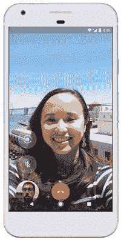
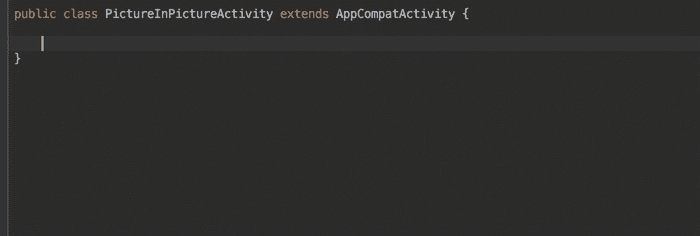
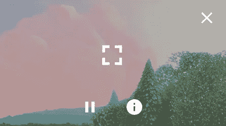
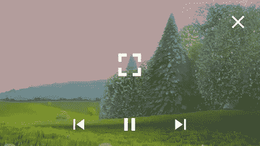
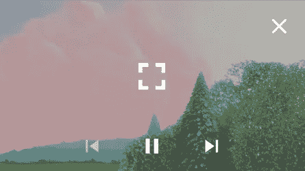

# 用画中画创造神奇时刻

> 原文：<https://medium.com/androiddevelopers/making-magic-moments-with-picture-in-picture-e02964bf75ae?source=collection_archive---------2----------------------->

## 匹普，匹普，万岁

画中画(PIP)是一个有趣的功能，给用户带来神奇的体验。画中画是多窗口用户界面的一个特例。使用画中画通常可以增强视频回放和相机活动。例如，在观看 YouTube 时，您可以选择另一个视频添加到您的播放列表，同时继续观看当前视频，因为正在播放的视频会进入画中画模式。这是一个神奇的时刻，让你舒服地同时做两件事。



Switching with PIP to check your calendar

PIP 的另一个重要用途是在视频聊天时查看您的日历。视频可以缩小并移开，让您可以查看您的约会。你可以在完成另一项任务的同时继续参与对话。

# 在应用中使用画中画

从 Android 8.0 (API 级别 26)开始，你可以轻松地将你的活动置于 PIP 模式。

您的活动必须声明它支持 PIP。在您的清单中，您应该将`supportsPictureInPicture`标志设置为`true`。

```
<activity 
    android:name=".MediaSessionPlaybackActivity"
    ...
    android:supportsPictureInPicture="true" />
```

# 故意进入画中画

有几个合适的时间进入画中画模式。最简单的方法是使用按钮或菜单项。材质设计提供标准 PIP [图标](https://material.io/icons)；然而，菜单选项可能对你的应用更有意义。


Picture in Picture [icon](https://material.io/icons/#ic_picture_in_picture)


Alternative Picture in Picture [icon](https://material.io/icons/#ic_picture_in_picture_alt)

该图标应指示进入画中画时会发生什么。例如，如果你的画中画窗口显示在屏幕的右上角，使用图标给用户一个微妙的暗示。

# PIP 作为切换应用程序的替代方案

进入 PIP 而不是离开应用程序通常很有用，例如当用户按下 home 或 back 按钮时。

> PIP 可能是比关闭应用程序更好的体验。

当用户选择后退时，进入画中画模式可能比关闭正在播放的视频有用。例如，用户可能正在浏览更多要观看的内容，并且可以继续以 PIP 模式观看原始节目。如果您以这种方式进入画中画模式，请确保提供一个关闭画中画窗口的选项。

如果用户在处理视频通话或观看视频时选择了主页、最近的应用程序或打开了通知，那么进入 PIP 可能比离开应用程序更有意义。

Android 活动生命周期有一个回调钩子，可以用来检测用户何时离开应用。您可以覆盖 [onUserLeaveHint()](https://developer.android.com/reference/android/app/Activity.html#onUserLeaveHint()) ，如下所述，并进入画中画模式而不是离开。

# 潜得更深

当你在画中画模式下，你应该隐藏除了最重要的东西。在大多数情况下，这将是视频或相机。

在进入 PIP 之前，您应该通过执行以下任务进行准备:

1.  隐藏视图上的任何控件或覆盖。例如，隐藏视频播放控件或摄像机选项菜单。
2.  创建一个[图片。建造者](https://developer.android.com/reference/android/app/PictureInPictureParams.Builder.html)
3.  [根据您的视角设置宽高比](https://developer.android.com/reference/android/app/PictureInPictureParams.Builder.html#setAspectRatio(android.util.Rational))。例如，谷歌地图导航有一个垂直的画中画窗口，而 YouTube 视频出现在一个水平的窗口。
4.  可选地[添加自定义动作](https://developer.android.com/reference/android/app/PictureInPictureParams.Builder.html#setActions(java.util.List%3Candroid.app.RemoteAction%3E))。例如，为视频播放提供倒带/快进，或者为视频通话提供静音操作。
5.  可选地设置一个[矩形边界](https://developer.android.com/reference/android/app/PictureInPictureParams.Builder.html#setSourceRectHint(android.graphics.Rect))来平滑活动到 PIP 的过渡。

下面是一个响应按钮进入画中画模式的示例:

```
void minimize() {
    if (mMovieView == null) {
        return;
    }
    // Hide the controls in picture-in-picture mode.
    mMovieView.hideControls();
    // Calculate the aspect ratio of the PIP screen.
    Rational aspectRatio = new Rational(
                mMovieView.getWidth(), mMovieView.getHeight());
    PictureInPictureParams params = mPictureInPictureParamsBuilder
        .setAspectRatio(aspectRatio)
        .build();
    enterPictureInPictureMode(params);
}
```

这里有一个`onUserLeaveHint()`的例子，捕捉应用程序切换并输入 PIP 作为副作用，不需要用户操作。

```
public class MyPictureInPictureActivity extends AppCompatActivity {
    ... @Override
    protected void onUserLeaveHint() {
        super.onUserLeaveHint();
        PictureInPictureParams params = 
            new PictureInPictureParams.Builder()
                // Set actions or aspect ratio.
                .build();
        enterPictureInPictureMode(params);
    }
    ...
}
```

您应该创建一个`PictureInPictureParams`来传递给`enterPictureInPictureMode()`。有一个不推荐使用的不带参数的重载方法。Android Studio 有助于确保您没有使用过时的 API。



# 在图像模式下切换图像的输入和输出

进入画中画模式很容易，但是如果用户把你的窗口恢复到全屏呢？您应该将您的活动恢复到进入 PIP 之前的状态。例如，显示您隐藏的播放控件。活动有一个回调函数，[onPictureInPictureModeChanged()](https://developer.android.com/reference/android/app/Activity.html#onPictureInPictureModeChanged(boolean,%20android.content.res.Configuration))，您可以覆盖它来监听此类事件。还有一个片段的[回调](https://developer.android.com/reference/android/app/Fragment.html#onPictureInPictureModeChanged(boolean,%20android.content.res.Configuration))。

如果用户将窗口恢复为全屏，`isInPictureInPictureMode`将为假。您希望将视图恢复到进入画中画模式之前的状态。例如，显示视频播放控件或恢复摄像机的选项菜单覆盖。

```
@Override
public void onPictureInPictureModeChanged (
        boolean isInPictureInPictureMode, Configuration newConfig) { if (isInPictureInPictureMode) {
        // Hide the full-screen UI (controls, etc.) while in
        // picture-in-picture mode.
        ... } else {
       // Restore the full-screen UI.
        ...
    }
}
```

请注意，您将获得对新配置的引用，就像配置本身发生变化时一样。

# 添加自定义操作

即使您应该在 PIP 模式下简化 UI，您仍然可以允许用户与远程操作进行交互。[图片输入图片参数。构建器](https://developer.android.com/reference/android/app/PictureInPictureParams.Builder.html)有 [setActions()](https://developer.android.com/reference/android/app/PictureInPictureParams.Builder.html#setActions(java.util.List%3Candroid.app.RemoteAction%3E)) ，它接受一个 [RemoteActions](https://developer.android.com/reference/android/app/RemoteAction.html) 的列表。如果有超过[个 getMaxNumPictureInPictureActions()](https://developer.android.com/reference/android/app/Activity.html#getMaxNumPictureInPictureActions())操作，输入列表将被截断为该数目。

您可以添加自定义的简化动作，保留一些全屏功能，如播放/暂停切换。示例应用程序，定义了[两个自定义动作](https://github.com/googlesamples/android-PictureInPicture/blob/master/app/src/main/java/com/example/android/pictureinpicture/MainActivity.java#L130)；播放/暂停切换和请求信息。



Custom PIP actions

如果您使用 [MediaSession](https://developer.android.com/reference/android/media/session/MediaSession.html) 进行视频播放，框架会自动识别会话并添加播放/暂停、跳过下一个和跳过上一个动作。动作由 [MediaSession 中相应的方法处理。回调](https://github.com/googlesamples/android-PictureInPicture/blob/master/app/src/main/java/com/example/android/pictureinpicture/MediaSessionPlaybackActivity.java#L264)。



Default actions with MediaSession

根据 MediaSession 状态自动启用和禁用这些操作。在下图中，媒体会话状态被设置为`PlaybackStateCompat.ACTION_PLAY_PAUSE | PlaybackStateCompat.ACTION_SKIP_TO_NEXT`



Actions update based on MediaSession state

如果您不需要 MediaSession 提供的任何或所有操作，请调用`setActions()`来指定您想要的操作。

# 概括起来

决定何时进入 PIP 是最难的部分。PIP 可以通过推断用户意图让你的应用程序感觉神奇，也可以让你的应用程序感觉笨重和烦人。一旦你理解了用户的意图，那么代码就会到位。

进入画中画模式最常见的流程如下:

1.  从按钮触发

*   `onClicked(View)`、`onOptionsItemSelected(MenuItem)`等。

2.因有意离开应用程序而触发

*   `onUserLeaveHint()`

3.发现触发

*   `onBackPressed()`

# 继续学习

查看以下文章和培训文档，继续了解 PIP。

*   [支持画中画](https://developer.android.com/guide/topics/ui/picture-in-picture.html)
*   [PIP 最佳实践](https://developer.android.com/guide/topics/ui/picture-in-picture.html#best)
*   [支持多窗口](https://developer.android.com/guide/topics/ui/multi-window.html)

要使用 PIP，请下载[示例](https://github.com/googlesamples/android-PictureInPicture)。

要深入了解 PIP，请阅读我的第二篇关于 PIP 导航的文章。

[](/@benbaxter/navigation-patterns-with-pip-2c5b6a446ba0) [## 带画中画的导航模式

### 处理后堆栈

medium.com](/@benbaxter/navigation-patterns-with-pip-2c5b6a446ba0) 

我们希望听到您的反馈！如果您想继续讨论，请在 [Twitter](https://twitter.com/benjamintravels) 上留下您的回复或与我交谈。