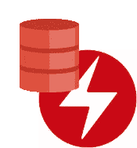

# 使 Oracle 数据库成为本地数据库

> 原文：<https://medium.com/oracledevs/making-oracle-database-kubernetes-native-401233c02780?source=collection_archive---------0----------------------->

Oracle Database & Operator Framework — GitHub

Kubernetes 已经成为自动化持续集成和持续交付(CI/CD)管道的最流行和最普遍的开源框架。其核心功能与 Helm Charts(即模板 YAML 文件和其他功能的包管理器)相结合，管理简单和无状态应用程序的生命周期(即定义、安装、部署和删除)。另一方面，运营商通过定制资源定义(即复杂和有状态的应用程序，如数据库)和控制器来扩展 Kubernetes 的核心功能，控制器封装了管理这些定制资源的生命周期所涉及的知识或业务逻辑。

Oracle 发布了用于 Kubernetes 的 [Oracle 数据库操作器(又名 *OraOperator* ),该操作器通过自定义资源定义和控制器扩展了 Kubernetes API，从而实现了 Oracle 数据库操作的自动化。](https://github.com/oracle/oracle-database-operator)

# OraOperator 为开发人员、DBA、DevOps 和 GitOps 团队提供了什么？

通过让 Kubernetes 以类似于其本机对象的方式操作 Oracle 数据库，OraOperator 帮助开发人员、DBA、DevOps 和 GitOps 团队减少了部署和管理 Oracle 数据库的时间和复杂性。它消除了大多数数据库操作对操作员或管理员的依赖。

这个第一版支持部署在 Kubernetes 集群内外的 Oracle 数据库，更具体地说:OCI 的自治数据库(共享基础设施)，它们不在 Kubernetes 上运行；OCI Kubernetes 引擎(OKE)和 Oracle Linux Cloud Native Environment(ol CNE)中的容器化单实例数据库；最后，容器化的 Oracle 在 OKE 和 OLCNE 对数据库进行分片。

以下是每个控制器支持的生命周期操作的简要描述。

## 用 OraOperator 管理自治数据库

[Oracle 自治数据库](https://docs.oracle.com/en-us/iaas/Content/Database/Concepts/adboverview.htm) (ADB)目前部署在 Oracle 云基础设施(OCI)中，而不是 Kubernetes 集群中。
在此版本中，自治数据库控制器支持共享 OCI 基础设施上的所有当前工作负载(相对于专用基础设施)。工作负载包括自主事务处理(ATP)、自主数据仓库(ADW)、自主 JSON 数据库(AJD)和 Oracle APEX 应用程序开发(APEX 服务)。
ADB 控制器允许预配新实例或将操作员绑定到现有实例，然后可以执行以下操作:启动、停止、终止、删除、重命名、扩展/缩减(CPU、存储)、启用/禁用自动扩展、下载与数据库实例关联的 wallet(区域 wallet 是一个替代选择)，以及管理数据库管理员用户的密码。

## 用 OraOperator 管理容器化的单实例数据库

[Oracle 数据库单实例](https://docs.oracle.com/en/database/oracle/oracle-database/) (SIDB)是标准版(se)或企业版(EE)数据库的实例。这些可以通过 Kubernetes 集群(OKE 和 OLCNE，从这个版本开始)进行容器化和部署，并由运营商进行管理。
SIDB 控制器提供以下生命周期操作:预配新的数据库实例、克隆现有实例、就地或异地修补更高版本的更新，或者回滚到更低版本的更新。

## 用 OraOperator 管理容器化的 Oracle 数据库分片

[Oracle 数据库分片](https://docs.oracle.com/en/database/oracle/oracle-database/21/shard/index.html) (SDB)由目录数据库、全局数据服务和分片(即数据库)组成。所有这些(也称为分片数据库拓扑)都可以作为一个 Statefulset 在 Kubernetes 集群中进行容器化和部署(从这个版本开始为 OKE 和 OLCNS ),并由运营商进行管理。
SDB 控制器提供以下生命周期操作:提供分片数据库拓扑、分片扩展/缩减、分片数据库拓扑清理。

# 安全考虑

Kubernetes 的秘密是存储凭证或密码的常用手段。操作员以编程方式读取机密，这限制了敏感数据的暴露。但是，Oracle 强烈建议您从 Oracle Cloud Infrastructure Vault 或第三方 Vault 设置和获取敏感数据。

以下 YAML 文件片段指定 Oracle Cloud Infrastructure Vault 作为管理员密码的存储库。 `adminPassword:
ociSecretOCID: ocid1.vaultsecret.oc1...`

# 社区贡献

Oracle 数据库社区的成员了解了该产品后都非常兴奋。我们渴望采纳建议和贡献。
见[对此库的贡献](https://github.com/oracle/oracle-database-operator/blob/main/CONTRIBUTING.md)

# 期待…

在即将发布的版本中，OraOperator 将扩展现有控制器的功能，增加对更多 Kubernetes 集群内外部署的支持，支持更多 Kubernetes 集群或等效平台，以及其他服务。

**@kmensah** 和 **#OraOperator** 用于通知、提问和讨论。

感谢阅读。