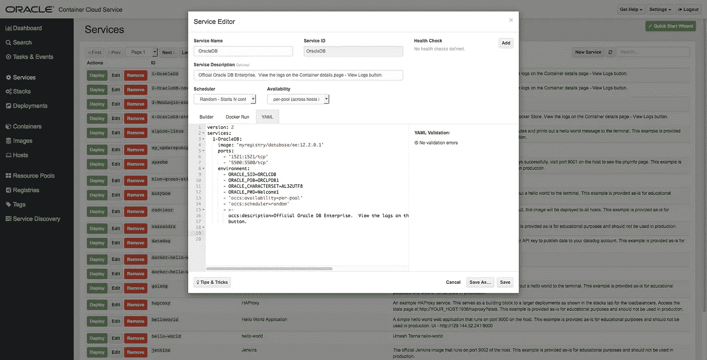
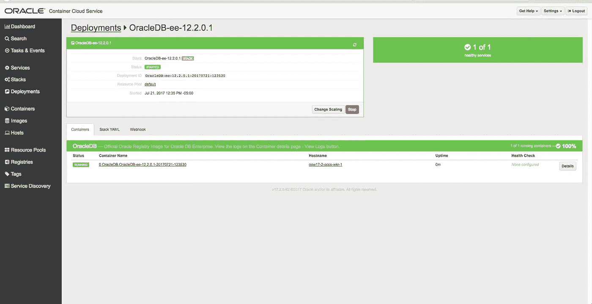
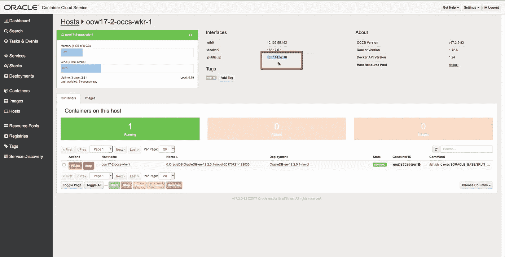
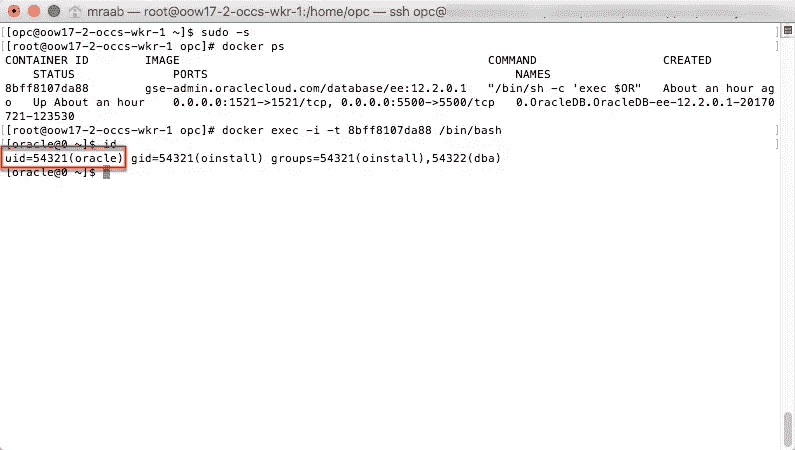
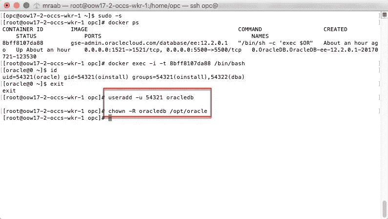
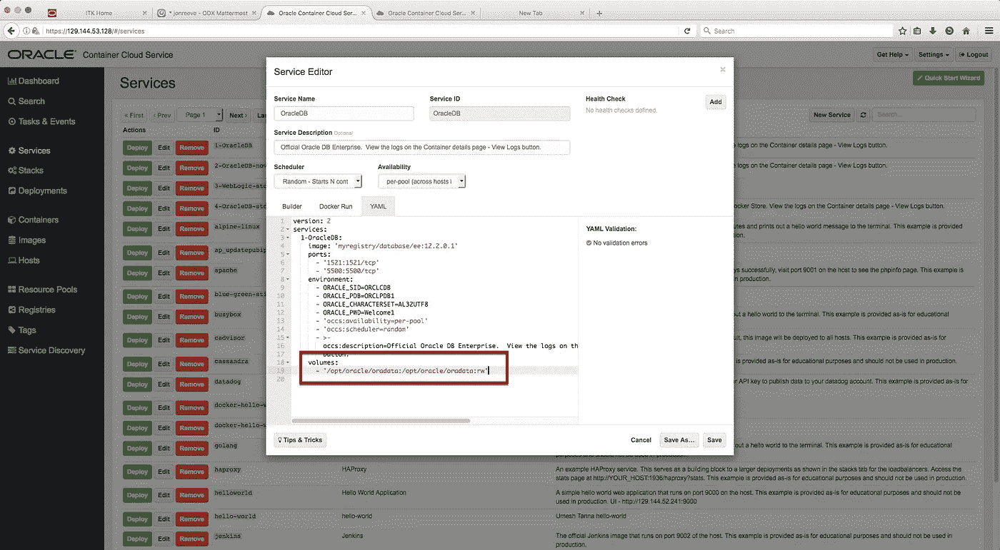
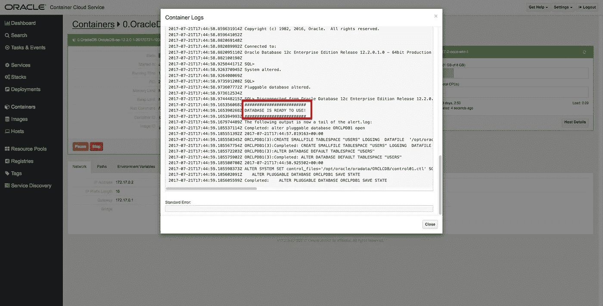

# 用 Docker 使 Oracle 数据库持久化

> 原文：<https://medium.com/oracledevs/making-oracle-database-persistent-with-docker-bb186a08e965?source=collection_archive---------0----------------------->

所以你已经从 GitHub 构建了最新的 [Oracle 数据库 EE v12.2.0.1。现在，您希望将其部署在 Oracle Container Cloud Service(OCCS)中。](https://github.com/oracle/docker-images/tree/master/OracleDatabase)

除了创建服务 YAML 之外，如果希望 Oracle DB 容器在 Worker 节点卷上拥有持久数据，还需要执行一些额外的步骤:/opt/oracle/oradata

*注意——也许有其他方法可以达到同样的目的，下面只是一个例子。*

让我们回顾一下这个示例的步骤，包括在 Worker 节点中设置一个用户，以便 Docker 容器中的 Oracle DB 可以写入本地卷。如果您不采取这些步骤，那么如果您的容器有一个 volume 参数，它就不能成功运行。这是因为数据库容器中的默认用户“oracle”没有足够的权限写入本地主机卷，出于安全原因，您需要启用它。

这种情况并非 OCCS 独有。如果您只是在任何 Docker 主机上通过命令行运行映像，情况也是如此。

下面是怎么做的。

创建服务 YAML。利用 GitHub 中的[设置您的服务。在第一次迭代中，还不包括体积参数。](https://github.com/oracle/docker-images/tree/master/OracleDatabase#running-oracle-database-in-a-docker-container)



部署新服务。



一旦容器开始运行，您将需要使用 Docker exec 命令来查找用户“ *oracle* ”的用户 id。

为此，首先，SSH 进入运行数据库容器的 Worker 节点。您可以在 Hosts 页面上找到 Worker 节点的公共 IP。



SSH 进入 Worker 节点，运行以下命令进入容器以获取用户 id:

```
$ ssh opc@<host ip address> -i path_to/privateKey
```

在工作节点上以 root 用户身份运行:

```
$ sudo -s
```

找到容器 ID 并执行到其中:

```
# docker ps
# docker exec -i -t <imageID> /bin/bash
$ id
```



在这个例子中，用户 id 是 54321，这是相当典型的。

现在，退出容器，在 Worker 节点上创建一个名为“oracledb”的新用户，使用相同的用户 id，并授予该用户对 */opt/oracle* 的权限。

*注意—用户“oracle”已经存在于 Worker 节点上，但是与容器中的用户“oracle”使用不同的用户 id。因此，您只需要使用与容器用户相同的用户 id，创建一个具有任何唯一名称的新用户。*

```
$ exit
# useradd -u <userID> oracledb
# chown -R oracledb /opt/oracle
```



接下来，停止并删除部署。编辑数据库服务以添加回卷参数:

卷:
-'/opt/Oracle/oradata:/opt/Oracle/oradata:rw '



保存服务并再次部署。几分钟后(取决于您的 Worker 节点有多少 OCPU ), DB 容器就完全设置好了，并将持久化它的数据。要查看数据库设置的进度，只需使用容器页面上的查看日志按钮，直到看到数据库可以使用的消息。

