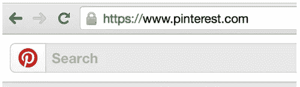

# 制作 Pinterest HTTPS

> 原文：<https://medium.com/pinterest-engineering/making-pinterest-https-637ec925a8ad?source=collection_archive---------4----------------------->

Paul Moreno | Pinterest 安全工程负责人，云计算

Pinner [安全](https://engineering.pinterest.com/post/111577153239/fighting-spam-at-pinterest)对我们来说是重中之重，所以今年早些时候，我们加入了越来越多的完全 HTTPS 网站的行列。随着我们与 Pinners 建立信任，它一下子就显著提高了安全性。从寻找合适的 CDN 提供商合作伙伴开始，迁移到 HTTPS 带来了许多意料之中和意料之外的工程挑战。

## 预期挑战

我们发现并缓解了迁移发现过程中的许多技术挑战。最大的挑战之一是与我们的 CDN 提供商合作，他们支持 HTTPS 和我们的证书。我们还知道在 HTTPS 分发 CDN 图像的成本可能会高得多。其他技术挑战包括:

*   在源文件中显示硬编码的 HTTP URLs 和函数
*   性能影响
*   旧浏览器支持
*   从 HTTPS 到 HTTP 站点的引用标头删除
*   混合内容警告(浏览器栏中的锁被破坏)

## 意想不到的挑战

一旦我们觉得可以开始测试了，我们就在英国启动了一项测试，在那里我们有一个活跃的 Pinner 社区。我们的测试显示对 SEO 的影响很小，对任何一个浏览器的影响都很小。直到我们将更大的网撒向全球观众，我们才看到以下其他挑战:

*   错过的 CDN 内容使“锁定”按钮坏了几个小时
*   并非所有的站点地图文件都被更新为指向 HTTPS 域名
*   未知的 Safari 问题

## 应对挑战

尽管我们预料到了一些挑战，但我们能够用一支精干而快速的团队来应对这些意想不到的挑战。我们是这样做的:

*   *坏了的“别住它”按钮。*我们能够通过将 DNS 快速更换为新的 CDN 提供商来快速缓解这一问题。
*   *推荐割台拆除器问题。*我们使用了一个 [meta referrer 头](https://wiki.whatwg.org/wiki/Meta_referrer)来支持对 HTTP 站点的 HTTPS 跟踪。
*   *未知的 Safari 问题。*我们在英国的实验提供的数据显示，一小部分用户在迁移后出现登录问题。我们向 Safari 用户指出了这一点，这使我们能够开始调查根本原因。

此外，拥有多家支持 HTTPS 的 CDN 提供商为我们提供了性能选择和商业杠杆。

最后，我们通过启用加密增强了 Pinners 的隐私，同时也阻止了中间人攻击、会话劫持、内容注入等方式的利用。这也为未来可能需要 HTTPS 推出的产品铺平了道路。最后，迁移到 HTTPS 导致注册量一天增加了 10 %(最大值),因为我们能够消除从 HTTP 到 HTTPS 注册页面的重定向流。

我们将继续我们的 HTTPS 之旅，进一步增强包括 HTTP 严格传输安全(HSTS)，这将防止 SSL 剥离。我们还计划与 Chromium 合作预加载我们的域名，以防止用户第一次访问 Pinterest 时 SSL 被剥离。

## 介绍我们的付费昆虫赏金计划

在 HTTPS 迁移之前，我们犹豫要不要开放一个[付费的 bug 奖励计划](https://bugcrowd.com/pinterest)，因为只有 HTTP 存在一些已知的漏洞。现在，由于迁移，许多差距已经消除，我们很高兴地宣布，我们已经升级了具有支付结果的[计划](https://engineering.pinterest.com/post/87023541604/introducing-our-bug-bounty-program)，自推出付费计划以来，报告数量增加了 10 倍。我们高度鼓励 whitehat 黑客社区使用我们的程序并报告错误，这有助于我们保持 Pinners 的安全并提高我们的安全态势。

如果你对这样的安全工程挑战感兴趣，[加入我们的团队](https://about.pinterest.com/en/careers/engineering)！

*Paul Moreno 是云团队的安全工程主管。*

移居 HTTPS 并不是一帆风顺的。这需要不同团队的几个成员来完成，并且有许多活动部件。特别感谢工程师 Amine Kamel、Chris Danford、Danilo 斯蒂法诺维奇和 Anna Majkowska，他们努力工作，让 Pinterest 成为一个更安全的地方。

*获取 Pinterest 工程新闻和更新，关注我们的工程*[*Pinterest*](https://www.pinterest.com/malorie/pinterest-engineering-news/)*，* [*脸书*](https://www.facebook.com/pinterestengineering) *和* [*推特*](https://twitter.com/PinterestEng) *。有兴趣加入团队吗？查看我们的* [*招聘网站*](https://about.pinterest.com/en/careers/engineering-product) *。*