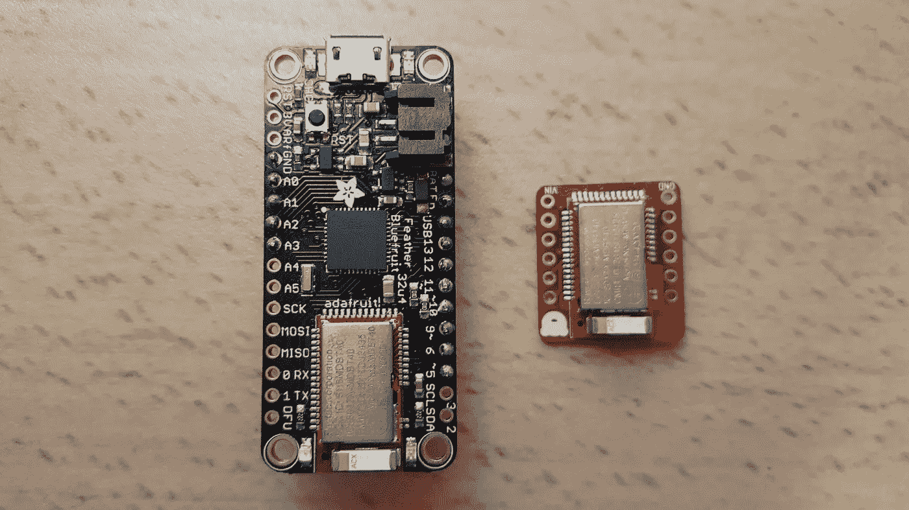
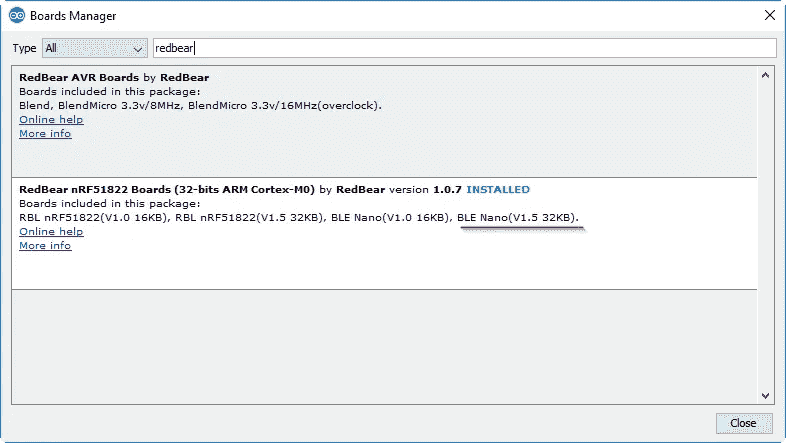

# 制作紫眼 DIY 跳舞机器人

> 原文：<https://medium.com/google-developer-experts/making-purple-eye-diy-dancing-robot-fa03d0f658e2?source=collection_archive---------5----------------------->

## 用跳舞的紫色机器人演示网络蓝牙和物理网络

在过去一年左右的时间里，我已经就像网络蓝牙 T2 和物理网络 T4 这样的技术做了很多演讲和研讨会。在这些演示过程中，我喜欢给人们一个玩技术的机会，让他们专心致志地研究代码，通常会玩得很开心。我也喜欢使用像 [ng-simon](/@urish/building-simon-with-angular2-iot-fceb78bb18e5#.afwk8lctc) 游戏和[智能灯泡](/ionic-and-the-mobile-web/smart-bulbs-in-the-angularconnect-iot-workshop-845a41882dfb#.di9zungks)这样的道具来真正“接触”这项技术。本着这种精神，我制造了一个机器人！

见见[紫眼](https://twitter.com/PurpleEyeBot)，一个 3D 打印的蓝牙低能耗机器人，我用它来演示网络蓝牙是如何工作的:

Yum, candy!

整洁，对不对？我根据我在 [Thingiverse](http://www.thingiverse.com/thing:39263) 上找到的一个模型设计了这个机器人，并在 [M3D Micro](https://printm3d.com/themicro/) 上打印了它。

该机器人有四个伺服系统为其运动提供动力，所有这些都可以通过 ble 控制，每条腿都由两个伺服系统提供动力，一个控制腿的角度，一个控制脚的旋转。

紫眼公开了两项服务:电池服务，报告电池剩余电量的百分比，以及另一项控制伺服系统的服务(编号`5100`)。此外，它使用物理网络广播控制机器人的 web 应用程序的地址，因此周围的每个人都会收到关于其存在的通知，可以单击它打开网页，连接到机器人并控制它:

Purple Eye’s Physical Web notification

你可以在 GitHub 上找到这个机器人背后的所有代码:[https://github.com/urish/purple-eye](https://github.com/urish/purple-eye)

## 部件和零件

虽然紫眼最酷的部分可能是它的网络蓝牙和物理网络演示功能，但它仍然很有趣。

“We can rebuild him. We have the technology.”

这些部件组成了机器人:

*   3D 打印的身体(头顶，头底，两个膝盖，两条腿，眼白，眼睛虹膜，瞳孔)，基于我在 Thingiverse 上找到的一个模型:[http://www.thingiverse.com/thing:39263](http://www.thingiverse.com/thing:39263)
*   微控制器板(详情如下)
*   电机板(用于将电源分配给电机)
*   一束连接线
*   4 个微伺服电机——我用的是 PowerHD [HD-1600A](https://www.pololu.com/product/2145)
*   [500 毫安脂电池](https://www.adafruit.com/products/1578)和一个 [2 针 JST 连接器](https://www.adafruit.com/product/261)
*   12 个用于安装伺服系统的螺钉

## 3D 打印和一种特殊的紫色

为了让紫色眼睛更加有趣，我使用了一种特殊的紫色细丝来进行 3D 打印:一种当被触摸时会从紫色变成粉红色的细丝，或者通常被加热到 30 摄氏度以上。这也意味着如果你将机器人放在阳光下几分钟，它就会变成粉红色(与它的创造者没有什么不同)。

由于喷嘴的热量，零件在离开打印机时已经是粉红色的了。它们需要一两天才会变成紫色(除非你把它们放在冰箱里几分钟)。

如果你想复制这个造型，你可能会想用白色细丝印出白色的眼睛，黑色印出瞳孔，其他颜色(可能是蓝色或绿色)印出虹膜——我用的是青色。在 M3D Micro 上打印所有东西总共需要大约 24 小时，尽管它不是市场上最快的打印机。

此外，我不得不改变一些部分的尺寸，以便获得紧密的配合:特别是，头顶部(ShellTop_fixed.stl)是按原始大小的 102%打印的，瞳孔是按原始大小的 90%打印的。

打印完所有东西后，我用强力胶把眼睛、瞳孔和虹膜粘在一起，然后把整个单元粘在头部底座上。头顶部通过摩擦安装在所有东西的顶部，当我需要访问它的大脑时，这很方便:

Brain surgery! Photo credit to my friend [François](https://plus.google.com/+FrancoisBeaufort/posts/E2fC7sKXKLF)

以下是打印/构建过程中的一些照片:

Fresh-printed body piece

The foot on the right is fresh from the printer, while the foot on the left has had time to cool

Another top view

## 机器人大脑:选择微控制器板

最初我使用的是[Adafruit Feather 32u 4 blue fruit LE](https://learn.adafruit.com/adafruit-feather-32u4-bluefruit-le/overview)，这是一块结合了 [ATmega32](http://www.atmel.com/devices/atmega32.aspx) 微控制器(与 Arduino 使用的相同)和 nRF51822(一种高性价比的 BLE 芯片，简称 nRF51)的小电路板。

虽然它做到了，但我对结果并不满意——我需要大量代码来在 ATmega32 微控制器和 nRF51 芯片之间进行通信。你可以在这里找到我为那块板[使用的固件代码](https://github.com/urish/purple-eye/blob/master/firmware/purple-eye/purple-eye.ino)。

我去寻找一种替代解决方案，并发现 nRF51 芯片实际上可以编程，这意味着我应该能够在没有 ATMega 微控制器的情况下使用它。这将降低功耗(给机器人更长的电池寿命)，也减少了电路板的尺寸(毕竟，我们在机器人头部内的空间有限)。它还通过消除两个微控制器相互通信和同步的需要，简化了代码。

Brain #1 on the left, Brain #2 on the right. Brain #2 fits much better!

在寻找只携带 nRF51 而没有一堆额外东西的电路板后，我找到了 [RedBearLab BLE 纳米](http://redbearlab.com/blenano/)，我用它对机器人的硬件进行了第二次修订。该板的优点是它带有一个 USB 编程器 MK20，允许您使用熟悉的 Arduino 软件直接对其进行编程，因此您不需要复杂的设置。如果您设置了 Arduino 开发环境，您可以在几分钟内启动并运行。

Add BLE Nano support through Arduino’s Board Manager

你可以找到 nRF51 专用固件的源代码，它运行在 BLE 纳米[这里](https://github.com/urish/purple-eye/tree/master/firmware/purple-eye-nano)(别担心！下面我来解释代码)。

## 接线图

这是显示如何将 CPU 板与 4 个伺服系统和外部 LiPo 电池连接的连接图:

连接非常简单 P28、P29、P15、P07 引脚连接到不同的伺服电机，电池正极连接到 VIN 引脚，负极连接到 GND 引脚。

我用一对 10KΩ的电阻组成了一个[分压器](https://en.wikipedia.org/wiki/Voltage_divider)——将电池的电压分压 2，并将结果连接到 BLE Nano 的 P06 引脚。你需要将电压除以 2，因为 LiPo 电池可以产生高达 4.2 伏的电压，这可能会损害 BLE 纳米(仅 3.3 伏)。P06 是一个模拟输入引脚，它允许我们读取电池的电压水平，并通过 BLE 电池服务报告。

## 伺服+电源板

我决定制作一个 PCB 来分割电机的电源，并添加一个小开关，让我可以打开/关闭机器人，而不必每次都连接/断开电池，而不是手动连接所有东西，这将在机器人的头部内造成混乱。

我从 [OSH Park](https://oshpark.com/) 订购了这块电路板，它非常适合紫眼公司——因为他们生产紫色 PCB:

你可以在这里找到棋盘[，在这里](https://oshpark.com/shared_projects/8y2vaFC5)找到老鹰源文件[。](https://github.com/urish/purple-eye/tree/master/pcb)

An early revision of the PCB boards (the assembled version is on the right)

Hooked up and ready to go!

## 功率消耗

我为机器人设定的目标之一是能够长时间使用电池(几天以上)。

我测得修订版 1 的功耗(使用 Adafruit Feather 32u4 Bluefruit LE 芯片)在空闲状态下约为 10mA，而修订版 2 的 Nano BLE 板功耗约为 1.4mA，只需关闭板上的 LED 即可进一步降至 1.1mA。

然而，电路上还有另一个饥饿的消费者:伺服消耗约 26mA，而闲置。这意味着总功耗约为 27mA。电池的容量为 500 毫安时，这意味着我们可以在空闲模式下运行机器人 500/27，或 18.5 小时。

这还不算太糟糕，但在下一版电路板中，我计划添加一个 MOSFET 晶体管，允许在空闲时切断电机的电源，这将导致 300-400 小时的空闲时间，或大约两周。

## 代码分解

*这是一个针对 BLE Nano 的分解固件，在这里可以找到***。**

*源代码由两部分组成:实际的固件和一个用于控制 nRF51 伺服系统的小库。BLE nano 附带的 Arduino 库包括一个内置的伺服库，但它不能很好地与蓝牙无线电配合使用——在某些情况下，蓝牙无线电代码在发送伺服控制脉冲的过程中发生作用，它打乱了脉冲的定时，导致机器人不情愿地扭曲。因此，我编写了自己的兼容实现，它使用 nRF51 无线电功能来安排“安静时间”，这时它可以向伺服系统发送控制信号，而不会被无线电中断。*

*至于实际的机器人逻辑，`[setup()](https://github.com/urish/purple-eye/blob/3d53cd315897919a7ec53d500fc1a8d1951fc6b9/firmware/purple-eye-nano/purple-eye-nano.ino#L84)`函数初始化一切。它设置了一个用于调试的串行控制台，并关闭内置的 LED 以节省电能。*

*如上所述，机器人使用物理网络来宣布其存在，并共享控制它的网页的链接。你可以[在这里](https://github.com/urish/purple-eye/blob/3d53cd315897919a7ec53d500fc1a8d1951fc6b9/firmware/purple-eye-nano/purple-eye-nano.ino#L19)看到实际的 Eddystone 广告有效载荷——机器人定期广播的那个，这就是我们如何实现物理网络的。*

*可能有点令人困惑的一件事是`*accumulateAdvertisingPayload*`。这配置了设备向附近的设备通告什么数据。它公布了机器人提供的服务列表(见第 101 行)，因此 Web Bluetooth 将能够看到这些服务，并让网页与设备连接。它还向全世界发送物理网络(eddystone)有效载荷(第 102 行)。如果你想了解更多关于这种方法与传统蓝牙扫描的对比，这里有一个关于扫描响应与广告有效载荷的[解释。](http://PurpleEye)*

## *控制机器人*

*我建立了一个简单的网页来控制机器人，它利用网络蓝牙连接到 nRF51 芯片并命令它。通过向服务号`5100`的特征号`5200`写入 4 个字节来控制伺服系统(如代码中的[所示)，每个字节控制单个伺服系统的位置。](https://github.com/urish/purple-eye/blob/3d53cd315897919a7ec53d500fc1a8d1951fc6b9/firmware/purple-eye-nano/purple-eye-nano.ino#L33)*

*网页包括一个[连接按钮](https://github.com/urish/purple-eye/blob/3d53cd315897919a7ec53d500fc1a8d1951fc6b9/web/purple-eye.js#L24)，一个显示电池当前状态的小电池指示器([使用字体 Awesome](https://github.com/urish/purple-eye/blob/3d53cd315897919a7ec53d500fc1a8d1951fc6b9/web/purple-eye.js#L10) )，两个让机器人站直或张开腿的按钮，一个关闭电机的休息按钮，还有一个让机器人摇摆的[舞蹈按钮](https://github.com/urish/purple-eye/blob/3d53cd315897919a7ec53d500fc1a8d1951fc6b9/web/purple-eye.js#L118)，以及一个由我的朋友[汤姆·特曼](/@tomteman)贡献的[摆振按钮](https://github.com/urish/purple-eye/blob/3d53cd315897919a7ec53d500fc1a8d1951fc6b9/web/purple-eye.js#L100)。*

**

*Using Web Bluetooth to pair with the robot: this is what you see if you click the Physical Web notification*

*正如您通过上面的链接所看到的，Dance 和 Shimmy 实际上都是在浏览器中使用计时器实现的，这意味着这些运动的实际时间取决于您的手机有多忙，还取决于机器人和手机之间的蓝牙链接质量:*

*一个有趣的结果是，如果你锁定设备的屏幕或切换到不同的应用程序，Chrome 标签的优先级会很低，机器人会开始缓慢移动——因为计时器会每秒钟左右触发一次，而不是每隔几毫秒。*

*该网页是超级基本的，可以使用一些 CSS 爱。这是一个开源项目，所以如果你愿意，你可以发送一个 pull 请求，让它看起来更漂亮，或者甚至分叉它，建立你自己的控制页面，也许有一些新的动作:)*

## *未来的增强*

*如上所述，我想通过在不使用时切断伺服系统的电源来降低机器人的功耗，从而接近一次电池充电连续运行几周的时间。*

*在展示机器人时，我收到了许多其他的改进建议，包括在眼睛里放一个小摄像头，并添加一个小扬声器，这样它就可以在跳舞时播放音乐或发出声音。这两个肯定都很有趣，但我不认为 nRF51 将能够处理相机或合成有趣的声音。此外，BLE 不适合流视频，因为带宽低，每秒只有几千字节。也就是说，我可以使用我在 Kickstarter 上支持的一个 [Onion Omega 2](https://onion.io/) 板，通过 WiFi 播放视频。*

*我可以走的另一个方向——我认为这将是非常有趣和有趣的工作——是添加一些传感器:加速度计、磁力计或陀螺仪，这样机器人就可以感知其方向并采取相应的行动。最终，我甚至可以根据这些传感器的输入数据教它如何行走，这将会是*非常*酷。*

*不过，在那之前，紫色机器人和我会继续去工作室，观光，交朋友！*

**

*Purple Eye surveys the crowd in Chrome Dev Summit*

**

*Purple Eye visits the London Eye*

**

*Robots just wanna have fun, too!*

**一如既往，如果你有其他的建议，或者关于紫眼的问题，请在评论中告诉我:)**