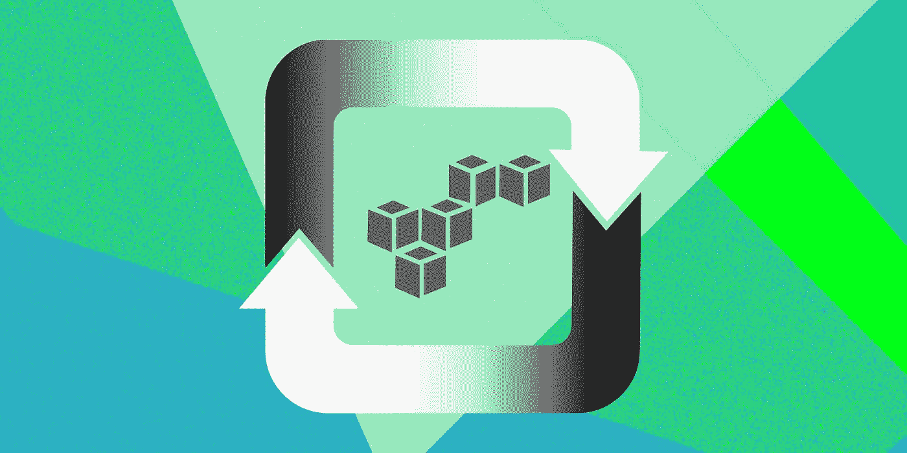
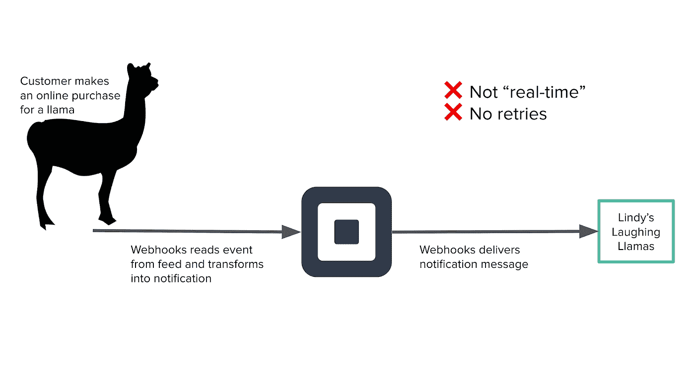
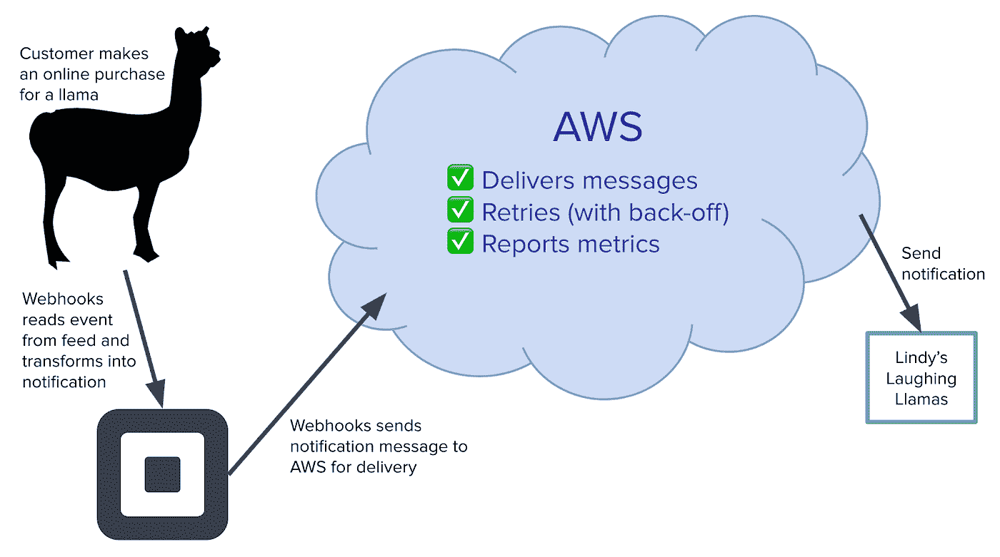
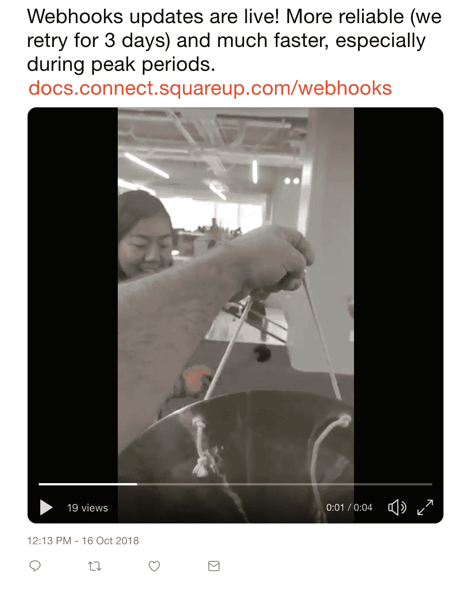

# 让不可见的变得可见

> 原文：<https://medium.com/square-corner-blog/making-the-invisible-visible-a-look-at-building-tools-for-square-developers-bae30a212950?source=collection_archive---------3----------------------->

## Square 开发人员的构建工具

> 注意，我们已经行动了！如果您想继续了解 Square 的最新技术内容，请访问我们的新家[https://developer.squareup.com/blog](https://developer.squareup.com/blog)

在 Square，开发人员团队公开了允许第三方开发人员构建定制业务处理解决方案的 API。10 月 18 日，我们向使用我们 API 的开发者宣布，webhooks 现在将支持重试。如果一个 webhook 无法交付，我们的系统现在将能够重试多次，直到成功交付。

Square 的 webhook 交付系统是一项我称之为 Webhooks 的服务。提高 Webhooks 的可靠性是我作为一名大学毕业生在 Square 开始工作的第一周有机会深入研究的一个项目。从一开始，我们就希望我们的 Webhooks 升级不需要我们的外部开发人员做任何改变，这与项目中的大量研究、规划和工作形成了鲜明的对比。事实上，我们发出的公告向开发者保证，他们*“不需要做任何改变来支持重试 webhooks。*“我的经理说这是“有史以来最看不见的变化”——本来就应该如此。我们团队的重点是让开发人员能够轻松地与 Square 的 API 集成，并为他们提供可靠且易于使用的体验。也许是我的经理对我们的“无形”项目的评论启发了我，让我不仅分享了我们的 webhooks 可靠性项目，还分享了我们在 Square 的一些“可见性”实践。

## Webhooks

在 web 开发中，webhooks 被定义为由特定事件触发的代码片段(HTTP 回调)。一旦事件发生，开发人员就会收到通知，并可以实时处理它。使用传统的 API，开发人员可能必须不断轮询端点以检测事件。我想介绍我们在 Square 是如何设计 Webhooks 的，以及我们为提高可靠性所做的改变。如果你想在 Square 上了解更多关于 Webhooks 的技术细节，请查看我们的[早期博客文章](/square-corner-blog/reliable-webhooks-using-serverless-architecture-e009a2096732)。解释 webhooks 最吸引人的方式是通过 Square 的基础设施跟踪单个 webhook 通知的生命周期。

假设我拥有一家名为“呼唤的笑骆驼”的在线商店，它使用 Square 的 API。运行我的在线商店的应用程序接收来自 Square 的 webhook 通知。当一位喜爱美洲驼的顾客从呼唤的笑驼那里购买了一只美洲驼时，我会收到一个 webhook 通知，告诉我有人刚刚付款了。从购买到收到通知，发生了很多事情，将这个支付“事件”转换成我收到的 webhook 通知。客户购买骆驼后，支付事件被发布到一个 feed，Square 的许多内部服务都会读取这个 feed。我们团队拥有的 Webhooks 服务从提要中读取这个支付事件，将这个事件转换成 webhook 通知，并将这个通知传递给呼唤的 Laughing Llamas 应用程序指定的端点。但是，在高流量期间，事件可能会堆积在提要中，后续通知可能会延迟。

直觉上，我们需要一种方法来将事件的读取和通知的发送分开。虽然有许多方法可以解决这个问题，但是最简单的方法是创建单独的线程池，用于从提要中读取事件和发送通知。我们的解决方案是使用[亚马逊网络服务(AWS)](https://aws.amazon.com) 将我们的 Webhooks 交付机制转移到云中。我们将 Webhooks 迁移到云的主要动机是降低 Square 的系统复杂性和成本(而不是在我们自己的数据中心维护 Webhooks)。我们可以通过使用记录良好且常用的云基础设施来提高 Webhooks 的可靠性。

*Using AWS allows Webhooks to decouple event reading and notification delivery.*

在我们新的 webhooks 系统中，呼唤的笑羊驼支付事件变成 webhooks 通知的生命周期略有变化。在客户购买了一只美洲驼之后，支付事件被发布到一个提要上，我们的 Webhooks 服务会像以前一样读取它。一旦事件被转换成 webhook 通知，我们的服务就会将通知作为消息发送给 AWS。我们在 AWS 中的工具包含将消息传递到呼唤笑羊驼的应用服务器的逻辑。如果呼唤的笑羊驼花了太长时间来响应信息，或者无法在递送时记录信息，AWS 将重试。在每一次后续传递尝试中，AWS 都会增加重试间隔时间；这种回退策略确保消息会不断重试，而不会使服务器不堪重负。此外，AWS 会将所有交付尝试的指标发送回 Square。

最终结果？呼唤的 Laughing Llamas 应用程序的开发者可以停止轮询 Square 的 API，因为 webhook 通知会及时到达。如果应用服务器很忙，开发人员不必担心错过通知，因为会重试通知。从开发人员的角度来看，获得新的及时通知和重试是不必要的。

## 能见度和影响

这个项目结束时让我惊讶的是它在 Square 以及其他项目中的可见性。在发布的前一天，我们向全公司发送了产品更新电子邮件。我的团队仔细地梳理了旧的电子邮件、工作项目和文档注释，给我留下了深刻的印象。从代码审查到设计建议，这些人的贡献没有被遗忘。几分钟后，邮件收到了“回复所有人”，表达了祝贺，并提供了更好的 webhooks 对 Square 开发者平台的影响的背景。

*A “Product Updates” email sent to everyone at Square.*

我的团队也有机会分享我们的学习经验。开发人员团队每两周召开一次“午餐和学习”会议，我们在会上介绍新技术、框架以及我们正在开发的各种服务和项目。这些午餐和学习会议突出了 Square 对组织内部知识共享的重视。通过建立对 Webhooks 和我们团队采用的技术的认识，我们最密切合作的团队可以利用我们的学习经验来开发他们自己的项目。

哦，Webhooks 不仅仅是可见的，它也是可闻的。发布后，敲响锣是 Square 的传统，我们让办公室响亮而清晰地知道我们发布了新的产品。

*Ringing the gong after launching a better Webhooks.*

能够在 Square 内外分享我们的知识和学习经验是很有意义的，但是听到来自我们开发人员的反馈也同样重要。一位开发人员赞赏我们的后退重试策略，因为它避免了“在服务器遇到困难时敲打它”在我们推出改进的 Webhooks 后的一周内，我们成功地发送了超过 31，000 个第一次发送失败的通知。能够迅速对 Webhooks 产生影响——作为一名仍在学习诀窍的新员工——激励我继续改进 Webhooks，并开始其他项目，这些项目不仅帮助我们虚构的呼唤的笑骆马，还帮助希望使用 Square 无缝处理在线和面对面支付的现实世界开发者。