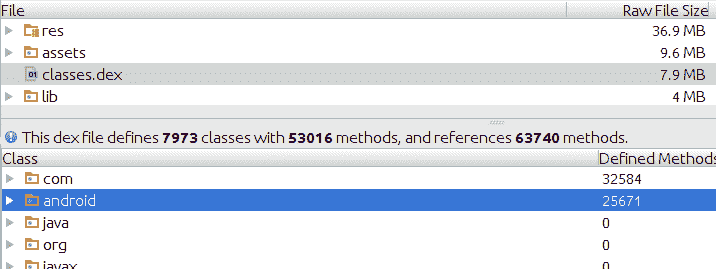

# 充分利用 APK 分析仪

> 原文：<https://medium.com/androiddevelopers/making-the-most-of-the-apk-analyzer-c066cb871ea2?source=collection_archive---------1----------------------->

Android Studio 中我最喜欢的新增功能之一是 APK 分析器，你可以在顶部菜单的**构建** → **分析 APK** 下找到它。

Pro-tip: you can also drag and drop APK files into the editor to open them

APK 分析器允许您打开并检查您计算机上的任何 APK 文件的内容，无论是从您的本地 Android Studio 项目构建的，还是从您的构建服务器或其他工件存储库中获取的。它不必从你在 Android Studio 中打开的任何项目中构建，你也不需要那个特定 APK 的源代码。

> **注意:** APK 分析器最适合发布版本。如果您需要分析应用程序的调试版本，请确保您使用的 APK 不是为即时运行而设计的。要获得它，您可以使用**构建** → **构建 APK** 命令。您可以通过检查归档文件中是否存在 instant-run.zip 文件来查看是否打开了 Instant-Run instrumented APK。

使用 APK 分析器是一种很好的方式，可以浏览 APK 文件，了解它们的结构，在发布之前验证文件内容，或者调试一些常见的问题，包括 APK 大小和索引问题。

# 使用 APK 分析器减少应用程序大小

APK 分析器可以为您提供许多关于应用程序大小的有用、可操作的信息。在屏幕顶部，您可以看到**原始文件大小**，这正是 APK 磁盘上的大小。**下载大小**显示了考虑到 Play Store 应用的压缩后，下载您的应用程序所需的估计数据量。

文件和文件夹列表按总大小降序排列。这使得它非常适合识别 APK 规模优化的低挂果实。每次深入到一个文件夹时，您都可以看到在 APK 中占用空间最多的资源和其他实体。

Resources sorted in descending order according to size

在这个例子中，当检查一个 APK 的可能尺寸减少时，我能够立即注意到一个 3 帧的 PNG 动画是我们可绘制资源中最大的一个，重 1.5MB，而且这只是针对 *xxhdpi* 密度！

由于这些图像看起来很适合存储为矢量，我们找到了艺术作品的源文件，并使用 Android Studio 2.2 中矢量资源导入工具中新的 [PSD 支持将它们导入为 VectorDrawables。](https://developer.android.com/studio/write/vector-asset-studio.html)

通过对其他剩余动画( *instruction_touch_*)进行相同的过程。png)* 通过删除所有密度的 png 文件，我们可以节省超过 5MB 的空间。为了保持向后兼容性，我们使用了支持库中的[*VectorDrawableCompat*](/@chrisbanes/appcompat-v23-2-age-of-the-vectors-91cbafa87c88)。

查看其他资源文件夹，很容易发现一些未压缩的 *WAV* 文件，它们可以转换成 *OGG* ，这意味着甚至不用动一行代码就可以节省更多。

Browsing other folders in the APK

接下来要检查的是 *lib/* 文件夹，它包含我们支持的三个 ABI 的本地库。

我们决定在 Gradle build 中使用 [APK 拆分支持](https://developer.android.com/studio/build/configure-apk-splits.html)，为每个 ABI 创建单独的应用版本。

接下来我快速浏览了一下 AndroidManifest.xml，注意到 *<应用程序>* 缺少了[*Android:extractNativeLibs*](https://developer.android.com/reference/android/R.attr.html#extractNativeLibs)属性。将该属性设置为 *false* 可以节省设备上的一些空间，因为它可以防止将本地库从 APK 复制到文件系统。唯一的要求是文件是页面对齐的，并以未压缩的形式存储在 APK 中，Android Gradle plugin 版本 2.2.0+中的[新打包器](http://android-developers.blogspot.com/2016/11/understanding-apk-packaging-in-android-studio-2-2.html)支持这一点。

The full AndroidManifest.xml as viewed in APK Analyzer

在我做了这些修改后，我很好奇这个应用程序的新版本与之前的版本相比如何。为此，我从我开始使用的 git commit 中检查了源代码，编译了 APK 并将其保存在另一个文件夹中。然后我使用 **Compare with…** 特性来查看新旧版本之间的大小差异。

APK comparison — access it through the button on the top-right

我们在资源和原生库方面取得了很大进展，在应用程序几乎没有变化的情况下，总共节省了 17MB。然而，我可以看到我们的 DEX 大小在倒退，class 2 . DEX 增长了 400KB。

# 调试 DEX 问题

在这种情况下，差异来自于将我们的依赖项升级到较新的版本和添加新的库。Proguard 和 [Multidex](https://developer.android.com/studio/build/multidex.html) 已经在我们的构建中启用，所以对于我们的 dex 大小已经没有什么可做的了。尽管如此，APK 分析仪是一个伟大的工具来调试任何问题，与此设置，尤其是当你启用多指数或 Proguard 为您的项目第一次。

Exploring the contents of classes.dex

当你点击任何一个 DEX 文件时，你会看到它定义了多少个类和方法的摘要，以及它包含了多少个引用(在一个单独的 DEX 文件中，这些引用被计入了 [64K 限制](https://developer.android.com/studio/build/multidex.html#about))。在这个示例截图中，该应用程序即将达到极限，这意味着在不久的将来，它将需要 MultiDex 来将这些类分成单独的文件。

您可以深入到包中，查看哪些包用完了所有的引用。在这种情况下，我们可以看到支持库和 Google Play 服务是造成这种情况的主要原因:

Reference counts per package

启用 MultiDex 并编译应用程序后，您会注意到第二个 classes2.dex 文件(可能还有 classes3.dex，以此类推)。Android gradle 插件中的 MultiDex 解决方案会计算出启动应用程序需要哪些类，并将它们放入 primary classes.dex 文件中，但在极少数情况下，当它不起作用时，您会得到一个 ClassNotFoundException，您可以使用 APK 分析器来检查 Dex 文件，然后[强制将缺失的类放入 primary DEX 文件](http://google.github.io/android-gradle-dsl/2.2/com.android.build.gradle.internal.dsl.ProductFlavor.html#com.android.build.gradle.internal.dsl.ProductFlavor:multiDexKeepFile)。

当启用 Proguard 并通过反射或从 XML 布局使用类或方法时，您会遇到类似的问题。APK 分析器可以帮助您验证您的 Proguard 配置是正确的，通过让您轻松地检查您需要的方法和类是否存在于 APK 中，以及它们是否被重命名(混淆)。您还可以确保您想要删除的类确实被删除了，并且不会占用您宝贵的引用方法计数。

我们很想知道 APK 分析仪的其他用途，以及您希望在该工具中集成的其他功能。