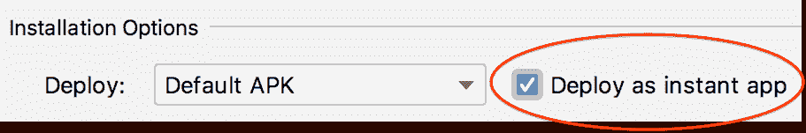
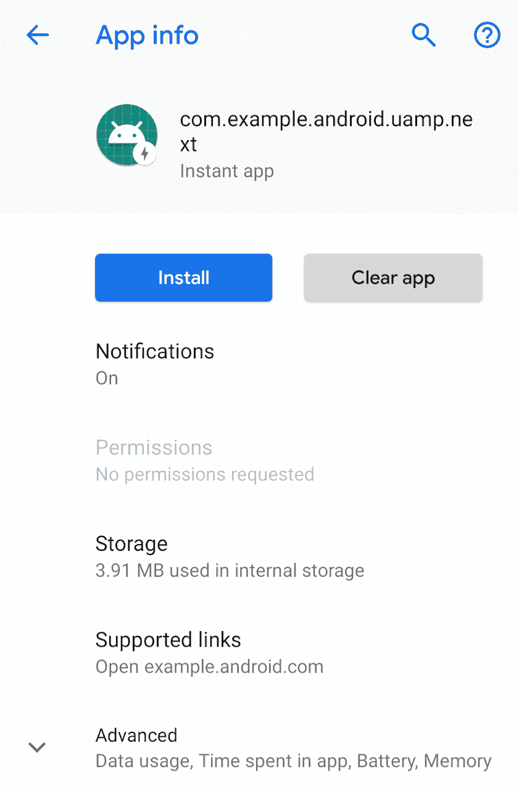
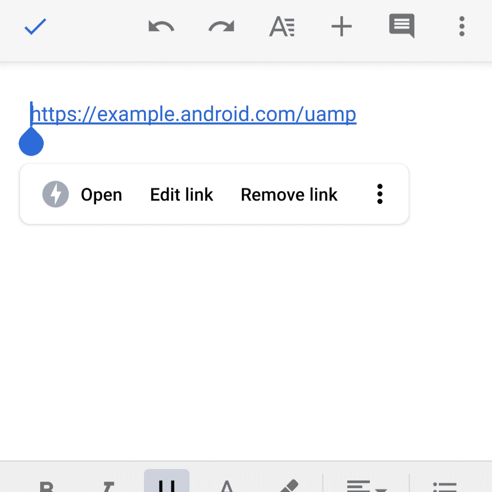

# 让 UAMP 样本成为即时应用

> 原文：<https://medium.com/androiddevelopers/making-the-uamp-sample-an-instant-app-30c3f0a050af?source=collection_archive---------5----------------------->

从 Android Studio 3.3 开始，IDE 将为即时应用程序提供工具支持。(在撰写本文时，Android Studio 3.3 作为[预览版](https://developer.android.com/studio/preview)推出。)在这篇博文中，我们将讲述[将](https://github.com/googlesamples/android-UniversalMusicPlayer/commit/fc569696dd5dcaf7a8e1fa6bdeea82b30cf5f9d9)[通用 Android 音乐播放器](https://github.com/googlesamples/android-UniversalMusicPlayer) (UAMP)样本转换为即时应用的步骤。对于第一次听说即时应用的人来说，可以看看 Android 开发者峰会的[会议，或者](https://www.youtube.com/watch?v=L9J2e5PYXNg)[阅读之前发布的关于这个主题的文档](https://developer.android.com/topic/google-play-instant/)。


# 要求

要在不使用命令行的情况下构建和部署即时应用，我们至少需要 Android Studio 3.3。非常重要的是**也要更新 Android Gradle 插件以匹配 Android Studio 的版本。例如，在撰写本文时，Android Studio 是 3.3 版本的 RC1——所以我们使用了下面的 Gradle 插件版本:`com.android.tools.build:gradle:3.3.0-rc01`。**

# 更新清单

在清单的应用程序标签中，我们需要添加`<dist:module dist:instant=”true” />`。我们可能会看到一个错误，说明“名称空间‘dist’未绑定”，在这种情况下，我们需要将`xmlns:dist=”[http://schemas.android.com/apk/distribution](http://schemas.android.com/apk/distribution)"`添加到根清单标签中。或者，我们可以按照 Android Studio 的提示自动为我们解决错误。

我们还可以添加意图过滤器来处理与我们的应用程序相关联的 URL 的视图意图，尽管这不是触发即时应用程序启动的唯一方式。对于 UAMP，更新版本的清单如下所示:

```
<application ...> <!-- Enable instant app support -->
    <dist:module dist:instant="true" /><activity android:name=".MainActivity">
        <intent-filter>
            <action android:name="android.intent.action.MAIN" />
            <category android:name="android.intent.category.LAUNCHER" />
        </intent-filter><!-- App links for http -->
        <intent-filter android:autoVerify="true">
            <action android:name="android.intent.action.VIEW" />
            <category android:name="android.intent.category.DEFAULT" />
            <category android:name="android.intent.category.BROWSABLE" />
            <data
                android:scheme="http"
                android:host="example.android.com"
                android:pathPattern="/uamp" />
        </intent-filter><!-- App links for https -->
        <intent-filter android:autoVerify="true">
            <action android:name="android.intent.action.VIEW" />
            <category android:name="android.intent.category.DEFAULT" />
            <category android:name="android.intent.category.BROWSABLE" />
            <data
                android:scheme="https"
                android:host="example.android.com"
                android:pathPattern="/uamp" />
        </intent-filter>
    </activity>
</application>
```

# 构建和部署即时启用的捆绑包

我们可以遵循 [Google Play 即时文档](https://developer.android.com/topic/google-play-instant/getting-started/instant-enabled-app-bundle)中解释的过程，但是我们可以在 Android Studio 中更改运行配置。要启用部署为即时应用程序，我们可以选中**部署为即时应用程序**复选框，如下图所示:



Enable app deployment as an instant app using the Android Studio UI

现在，剩下要做的就是点击 Android Studio 中非常令人满意的**运行**按钮，如果前面的所有步骤都正确完成，就可以看到即时应用程序被自动部署和启动了！

在这一步之后，我们将不会看到我们的应用程序列在启动器的任何地方。要找到它，我们必须进入**设置>应用**，这里列出了已部署的即时应用:



Instant app info under Settings > Apps

# 启动即时应用程序

Android 将以多种方式触发即时应用的推出。在与 Play Store 相关的机制之外，启动即时应用程序通常是通过向清单中定义为意图过滤器的 URL 之一发送 ACTION_VIEW 来完成的。对于 UAMP，运行以下 ADB 命令会触发我们的应用程序:

```
adb shell am start -a android.intent.action.VIEW "[https://example.android.com/uamp](https://example.android.com/uamp)"
```

然而，Android 也会建议从任何其他从 URL 触发 ACTION_VIEW 的应用程序启动我们的应用程序，这基本上是除了 web 浏览器之外的每个应用程序:



UAMP is launched when the **Open** button is pressed

有关应用程序链接的更多信息，请参见该主题的[相关文档](https://developer.android.com/training/app-links/instant-app-links)，包括如何[验证您的应用程序处理的链接](https://developer.android.com/training/app-links/verify-site-associations)的所有权。

# 已知问题

对于运行 API 级别 28 的设备(或仿真器)，当我们清除**部署为即时应用**复选框并尝试再次部署时，会出现以下错误:

```
Error while executing: am start -n “com.example.android.uamp.next/com.example.android.uamp.MainActivity” -a android.intent.action.MAIN -c android.intent.category.LAUNCHERStarting: Intent { act=android.intent.action.MAIN cat=[android.intent.category.LAUNCHER] cmp=com.example.android.uamp.next/com.example.android.uamp.MainActivity }Error type 3Error: Activity class {com.example.android.uamp.next/com.example.android.uamp.MainActivity} does not exist.Error while Launching activity
```

解决方案是从设备上删除即时应用程序，要么从设备或模拟器上的**设置>应用程序**菜单中删除，要么从 Android Studio 终端标签中运行`./gradlew uninstallAll`。