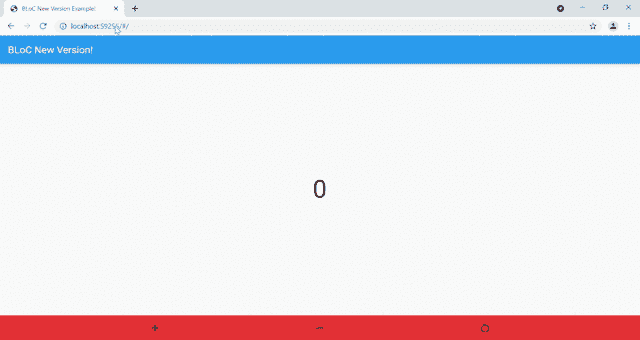

# 使用 state notifier-Flutter 管理应用程序的状态💙

> 原文：<https://medium.com/google-developer-experts/manage-the-state-of-your-app-using-statenotifier-flutter-cf0ed89984b2?source=collection_archive---------3----------------------->

## 我们已经看到了 Bloc、Redux 和许多可能已经使用了 Provider。有一种类似于 Provider 的东西叫做 StateNotifier，但是形式更简单。你可以说 StateNotifier 是 Provider 的包装器！因此，让我们看看如何使用 StateNotifier 来管理应用程序的状态🎉


状态管理是颤振中最重要的概念之一。但是为什么国家管理是重要的呢？基本上，当你的应用变得越来越复杂，越来越大的时候，应用的状态就变得越来越难以维护。我们希望从一个屏幕传递到另一个屏幕的数据变得更加复杂。这就是国家管理发挥作用的地方🚀

有很多状态管理包和技术可以帮助你管理你的状态。最近，我偶然发现了 **StateNotifier** ，并想检查一下。我发现它超级容易理解和实现！在工作时，它具有相同的 ValueNotifier 和 Provider 概念。

## StateNotifier 有 2 个主要的小部件:

**StateNotifier provider:**state notifier provider 相当于`ChangeNotifierProvider`但对于 state notifier 来说。它的主要任务是创建 StateNotifier，当小部件从树中移除时，它会自动处理它！

state notifierbuilder:state notifierbuilder 相当于来自 Flutter 的`ValueListenableBuilder`。您可以基于 StateNotifier 中更改的值重新构建小部件！

然而，StateNotifier 还提供了其他一些小部件。现在，让我们看看同样的代码实现。我们将使用 StateNotifier 实现计数器应用程序！

## 第 0 步:在你的 pubspec.yaml 文件中添加 [flutter_state_notifier](https://pub.dev/packages/flutter_state_notifier) 和 [state_notifier](https://pub.dev/packages/state_notifier) 。

flutter_state_notifier 用于访问各种小部件，如 StateNotifierProvider、StateNotifierBuilder 等。

步骤 1:创建一个名为 **counter_service.dart** 的文件来创建我们的功能助手类！

这里，我们扩展了 **StateNotifier** ,因为我们的状态将只是整数，所以我们提供的类型是 int。我们需要将初始值传递给超类。当我们用 **StateNotifier、**扩展我们的 **CounterService** 类时，我们可以访问一个名为`**state**` 的 setter，我们可以操纵它的值。

## 步骤 2:用 StateNotifierProvider 包装 MaterialApp

这里我们用 **StateNotifierProvider 包装了我们的 **MaterialApp** 。**有两个必需参数:create 和 child。我们需要在创建参数中传递扩展 StateNotifier 的类。这里我们有 **CounterService** 类，需要提供给整个窗口小部件树。我们将 0 作为状态的初始值。

## 步骤 3:在 home.dart 文件中，创建一个 **CounterService** 类的对象。

```
final CounterService _counterService = CounterService(0);
```

## 步骤 4:用 StateNotifierBuilder 包装将要显示计数的文本小部件

```
StateNotifierBuilder(
          stateNotifier: _counterService,
          builder: (BuildContext context, int value, Widget? child){
            return Text(
              '$value',
              style: TextStyle(fontSize: 50.0),
            );
          },
        ),
```

这里有两个参数:stateNotifier 和 builder。stateNotifier 接受状态更改为 listen 的 StateNotifier 类。这里，它将是我们在步骤 3 中创建的 CounterService 对象。构建器接受上下文、状态和子元素。这里我们的状态是一个整数值。

## 第五步:现在，点击增量图标，就可以直接调用 incrementCounter()函数了！

```
IconButton(
    onPressed: () => _counterService.incrementCounter(),
    icon: Icon(Icons.add),
    splashRadius: 0.1,
),
```

让我们看看我们的 home.dart 是怎样的，它有递增、递减和重置功能！

## 输出:



这是一篇关于如何使用 StateNotifier 管理应用程序状态的小文章。希望你喜欢这篇文章！

如果你喜欢，你可以 [**给我买杯咖啡**](https://www.buymeacoffee.com/abhishekdoshi26) **！**

[](https://www.buymeacoffee.com/abhishekdoshi26)

# 不要忘记通过以下方式与我联系:

*   [**Instagram**](https://www.instagram.com/abhishekdoshi26/)
*   [**推特**](https://twitter.com/AbhishekDoshi26)
*   [**领英**](https://www.linkedin.com/in/AbhishekDoshi26)
*   [**GitHub**](https://github.com/AbhishekDoshi26)

> 不要停止，直到你呼吸！💙
> -阿布舍克·多希