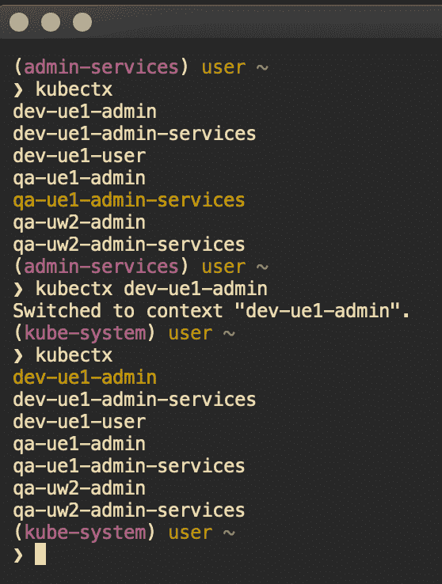
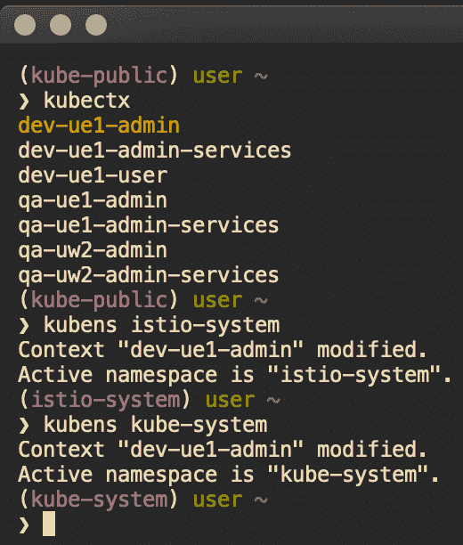

# 从终端有效管理 Kubernetes 访问

> 原文：<https://medium.com/capital-one-tech/managing-kubernetes-contexts-for-multiple-clusters-eed174288efe?source=collection_archive---------1----------------------->

## 使用 Kubectx 和 Kube-ps1 定制您的终端


有很多方法可以管理对 Kubernetes 集群的访问。这些都不难，但是如果您必须在一个集群上管理多个用户和上下文，该怎么办呢？这变得有点挑战性。除此之外，我确信我们中的许多人都在管理多个集群，并且我们中的一些人可能在多个集群上管理多个用户和上下文。管理所有这些会变得非常麻烦，而且会占用我们的时间。

我将讲述我个人是如何决定给自己一个更好的管理 Kubernetes 集群的体验的。我会根据我的个人喜好，涵盖高点、低点以及中间的一切。

## **研究、中断、修复、重复**

在我在 Capital One 的工作中，我每天与大约三个集群进行交互，每个集群可能有三个用户和上下文。最终，改变环境变量和运行冗长的命令耗尽了我的耐心。很自然，作为一名系统管理员，我开始编写一些简单的 bash 函数放入我的`*.*bashrc`中。这在一段时间内有效，但并不完美。我不得不运行多个命令来更改 kubeconfigs 和上下文/用户。这满足了我一点点，但我想要一个更好的解决方案，因为每次它不像预期的那样工作时，它仍然会触动神经。

最终，我告诉自己，我要花一个下午(最终更像是一天+)来为我的需求找到一个好的解决方案。我的意思是，如果我花了谁知道多长时间编写可行的行动手册来管理我所有的点文件和软件包安装，这应该很容易吧？

*剧透……不是的。*

在研究了管理 Kubernetes 访问的工具之后，我决定使用 kubectx 它似乎符合我的需要。它管理名称空间切换，可由`brew`安装，并拥有 4k+ GitHub stars。当我浏览`README`时，就像其他项目的好用户一样，我注意到了对另一个工具的引用，我很快决定也实现这个工具: [kube-ps1](https://github.com/jonmosco/kube-ps1) 。这是一个漂亮的小应用程序，允许您将 Kubernetes 集群和名称空间信息添加到您的`PS1`行(您的终端命令提示符)中。这有明显更少的星星，但我是一个摆弄我的终端吸盘，快乐的一天。

现在我需要弄清楚如何解决我的实际访问问题。我有三个集群，每个集群有三个用户，有两种不同的身份验证方法。其中两个用户在集群之间没有被唯一命名，但是集群被唯一命名。将凭证映射到用户应该很简单。

*剧透……不是的。*

我首先开始正式查看用于管理多个集群的 Kubernetes 文档。这让我大概完成了 80%,但是对于集群中的同名用户，它没有答案。我不断破坏我的 kubeconfig，因为上下文不知道在哪里寻找用户认证。

挫败感随之而来。愤怒的谷歌搜索随之而来。失败开始了。

当我开始到达我的线的末端并与船一起下沉，即将称我的尝试失败并让自己失望时，我拿出了最后的努力，并在 MagicCityTech `#kubernetes` Slack 频道(我的伯明翰朋友)中询问是否有人已经发现了这一点。我得到了一个回复，就是回答 Kubernetes 所有问题的那个人，它是一个[链接](http://docs.shippable.com/deploy/tutorial/create-kubeconfig-for-self-hosted-kubernetes-cluster/)，为我解决了所有问题。

## 让一切运转起来

我做的第一件事是从我的`gopass`存储库中检索我所有的 kubeconfigs 和服务帐户令牌；如果你没有 gopass，你会错过很多。从那里，我开始构建我的“主”kubeconfig，我将在以后的所有访问中使用它。它最终看起来有点像这样:

```
apiVersion: v1
clusters:
- cluster:
    certificate-authority-data: <data>
    server: <server>
  name: dev-ue1
- cluster:
    certificate-authority-data: <data>
    server: <server>
  name: qa-ue1
- cluster:
    certificate-authority-data: <data>
    server: <server>
  name: qa-uw2
contexts:
- context:
    cluster: dev-ue1
    namespace: kube-system
    user: dev-ue1-admin
  name: dev-ue1-admin
- context:
    cluster: dev-ue1
    namespace: admin-services
    user: dev-ue1-admin-services
  name: dev-ue1-admin-services
- context:
    cluster: dev-ue1
    namespace: user
    user: dev-ue1-user
  name: dev-ue1-user
- context:
    cluster: qa-ue1
    namespace: kube-system
    user: qa-ue1-admin
  name: qa-ue1-admin
- context:
    cluster: qa-ue1
    namespace: admin-services
    user: qa-ue1-admin-services
  name: qa-ue1-admin-services
- context:
    cluster: qa-uw2
    namespace: kube-system
    user: qa-uw2-admin
  name: qa-uw2-admin
- context:
    cluster: qa-uw2
    namespace: admin-services
    user: qa-uw2-admin-services
  name: qa-uw2-admin-services
kind: Config
preferences: {}
users:
- name: dev-ue1-admin
  user:
    client-certificate-data: <client certificate>
    client-key-data: <client key>
- name: dev-ue1-admin-services
  user:
    token: <token>
- name: dev-ue1-user
  user:
    token: <token>
- name: qa-ue1-admin
  user:
    client-certificate-data: <client certificate>
    client-key-data: <client key>
- name: qa-ue1-admin-services
  user:
    token: <token>
- name: qa-uw2-admin
  user:
    client-certificate-data: <client certificate>
    client-key-data: <client key>
- name: qa-uw2-admin-services
  user:
    token: <token>
```

这个 kubeconfig 允许我通过一个配置文件在所有集群中使用所有的上下文和用户。这也允许我使用非唯一命名的服务帐户 admin-services 来访问每个集群。我可以这样做，因为在 kubeconfig 中，我在我的上下文中唯一地命名了我的所有用户。然后，我可以查找每个用户的特定访问令牌，并使用特定集群的 certificate-authority-data 进行身份验证。如果集群块中没有证书-授权-数据，这将不起作用。现在困难和复杂的部分已经完成，并且安全地保存在`gopass`中，我可以继续让它变得可用了。

我做的第一件事是在我的`.bashrc`中添加一行，将`KUBECONFIG`环境变量导出到我新创建的 kubeconfig 中。然后`brew`安装了`kubectx`和`kube-ps1` *、*并开始调整我的`PS1`线和显示方式。自然，股票`kube-ps1`输出不是我想要的，所以是时候开始修改了。我应该注意到，如果你已经在使用一个工具来管理你的`PS1`线，你可能需要做一些稍微不同的事情来让它工作。

我的队伍已经很长了；我有 git 状态和分支的助手，以及 Terraform 工作区。所以当我看到`kube-ps1`显示了我的整个上下文和名称空间时，它就不工作了。幸运的是，我是一个`tmux`用户(再次感谢 MagicCityTech 让我搭上了`tmux`列车),可以在我的终端底部访问一个漂亮的小状态行。我决定在我的 tmux 状态行中显示集群和用户，并且在我的`PS1`行中只显示名称空间。

*定制配置随即开始。*

首先，我关闭了愚蠢的 Kubernetes 符号`kube-ps1`的使用，删除了前缀和后缀，并删除了名称空间文本颜色配置(我有自己的颜色偏好)。这很容易通过通读`README`并在我的`.bashrc`中设置一些环境变量来完成。

```
KUBE_PS1_SYMBOL_ENABLE=false
KUBE_PS1_PREFIX=""
KUBE_PS1_SUFFIX=""
KUBE_PS1_NS_COLOR=""export \
  KUBE_PS1_SYMBOL_ENABLE \
  KUBE_PS1_PREFIX \
  KUBE_PS1_SUFFIX \
  KUBE_PS1_NS_COLOR
```

接下来，我需要编写一个自定义函数，只获取我想要的信息并设置我的颜色。在我的`.bashrc`中，我写了一个简单的函数，并将其作为我的`PS1`行的一部分来执行。

```
kube_ns() {
  purple='\033[0;35m'
  nocolor='\033[0m'
  kube_ps1=$(kube_ps1)
  namespace=$(echo ${kube_ps1} | cut -d ':' -f 2)
  echo -e "${nocolor}(${purple}${namespace}${nocolor})"
}PS1="\$(kube_ps1) \[\033[32m\]\u\[\033[0m\] \[\033[36m\]\w\[\033[0m\]\$(git_prompt_info '\[\033[34m\]%b\[\033[0m\]') \$(terraform_workspace_info '\[\033[95m\]%b\[\033[0m\]')\n❯ "
```

现在我已经有了一个视觉上吸引人的终端，我试着使用`kubectx.`

剧透…成功了。



kubectx changing contexts and clusters

您可以看到`kube-ps1`正在填充我的命令提示符的`(namespace)`部分，这正是我想要的。您还可以看到，只需一个命令，切换上下文和集群是多么容易。

`kubectx`还允许您使用`kubens`更改名称空间。该命令将列出所有名称空间，然后更改为您指定的名称空间。



kubens changing namespaces within a context

请注意，当我更改名称空间时，我的命令提示符会更新，但我的上下文保持不变。

还记得我说过我是`tmux`用户吗？这是更简单的附加配置。在我的`.tmux.conf`文件中，我必须配置我的 tmux 环境，以了解我的`KUBECONFIG`环境变量和我的`status-left-length`和`status-left`；我用右边来显示日期。我将所有配置保存在`${HOME}/.config`中。

```
set-environment -g KUBECONFIG ${HOME}/.config/kube-master.configset-option -g status-left-length 100
set-option -g status-left "#[fg=red]#(kubectl config current-context | cut -d '-' -f 1–2)#[fg=white]#(echo :)#[fg=blue]#(kubectl config current-context | cut -d '-' -f 3–4)"
```

*根据上下文命名约定，根据需要调整剪切命令。*

这三行文字在终端的左下角给了我想要的确切信息。正如您所期望的，当您使用`kubectx` *，*更改集群/上下文/用户时，它也会更新。


tmux status line showing cluster and user information

## 值得吗

至于你是否应该这样做，答案取决于你，取决于你想在你的当地环境中投资多少。这并不是做好我的工作所必需的，但它确实让我更有效率。我在本地配置上投入了很多，因为我喜欢拥有一个能够满足我所有需求的微调开发环境。如果你也是这样，那么这可能也适合你。

## 相关:

*   [建筑特征切换成地形](/capital-one-tech/building-feature-toggles-into-terraform-d75806217647)
*   [使用 Terraform 部署多个环境](/capital-one-tech/deploying-multiple-environments-with-terraform-kubernetes-7b7f389e622)
*   [采用地形的多区域部署](/capital-one-tech/multi-region-deployments-with-terraform-kubernetes-a1f51bb96974)

披露声明:2019 首创一。观点是作者个人的观点。除非本帖中另有说明，否则 Capital One 不隶属于所提及的任何公司，也不被这些公司认可。使用或展示的所有商标和其他知识产权是其各自所有者的财产。