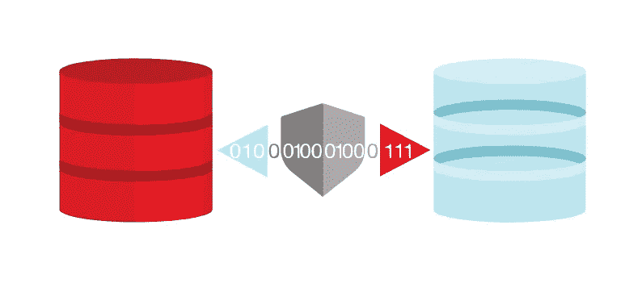

# 在 Oracle 数据库服务重新定位和切换期间管理 ODP.NET 连接:消除最终用户丢失的工作和错误

> 原文：<https://medium.com/oracledevs/managing-odp-net-cb888c32987c?source=collection_archive---------0----------------------->



ODP.NET and Oracle Database service relocations and switchovers

在之前的【ODP.NET 快速连接故障转移 (FCF)博文中，我描述了 FCF 如何在数据库计划停机期间自动排出即将失效的连接。读者就相关的高可用性挑战提出了后续问题:

*   在计划内故障切换期间，如何保留最终用户在活动连接上的工作？

用户不希望在故障转移期间丢失正在进行的事务或连接。

*   如何在数据库故障转移期间处理新的连接尝试？

如果没有实例准备好为连接提供服务，在故障转移期间连接的新用户可能会遇到超时错误。通常，ODP.NET 连接超时值比故障转移周期短。最终用户可能会再次尝试连接，但只会看到另一次超时。

这些故障转移挑战通常发生在数据库服务重新定位和 Oracle Data Guard 切换的环境中。在新的数据库服务开始服务连接之前，先关闭现有的数据库服务。在这些情况下，ODP.NET 和 Oracle 数据库能够保留最终用户的工作并消除超时错误，只需很少甚至不需要代码。

# **在服务重新定位期间保留用户正在进行的工作**

只要还有一个活动的数据库服务成员，FCF 就能确保最终用户在尝试连接时不会遇到错误。对于已经连接的用户，当服务离线时，FCF 不会防止错误或丢失工作，但 Oracle 数据库可以配置为这样做。因为数据库管理员启用了这些功能，所以**零**。使用它们需要更改. NET 应用程序代码。

简而言之，只有在所有连接的用户完成他们的工作之后，数据库管理员才能指导服务重新定位。例如，可以指示服务仅在所有活动事务完成后才开始重新定位(`TRANSACTIONAL`选项)。FCF 确保在此期间没有新用户连接到服务，这样数据库只需处理剩余的用户。不需要其他动作或改变。

以下 Oracle 服务器控制实用程序(SRVCTL)命令演示了如何在将`-stopoption`参数设置为`TRANSACTIONAL`的情况下重新定位数据库服务:

`srvctl relocate service -database <DATABASE NAME> -service <SERVICE NAME> **-stopoption TRANSACTIONAL** -oldinst <EXITING INSTANCE> -force`

最终，终端用户不会丢失他们的事务性工作，管理员也不需要监控适当的时间来停止服务，从而最大限度地减少中断。Oracle 数据库会自动处理这些问题。

如果重新定位过程必须在特定时间段内发生，管理员可以添加排空间隔/超时(`-drain_timeout`)。然后，Oracle 数据库让当前用户继续工作，直到耗尽超时。此时，服务位置启动。

以下是如何使用 SRVCTL 命令在 2 分钟(120 秒)耗尽超时的情况下重新定位数据库服务的示例:

`srvctl relocate service -database <DATABASE NAME> -service <SERVICE NAME> **-drain_timeout 120** -stopoption TRANSACTIONAL -oldinst <EXITING INSTANCE> -force`

在两分钟的超时时间内，服务继续运行，但不允许新的连接。这两分钟允许现有用户完成他们的工作并注销，以便可以更优雅地重新定位服务。一旦超时，即使用户保持连接，服务也会关闭。应该将耗尽超时设置得足够大，以便根据业务需求合理地容纳尽可能多的用户。

如果用户在耗尽超时后仍在使用服务，则可以启用[ODP.NET 应用连续性](/oracledevs/oracle-net-application-continuity-getting-started-34e7045e863) (AC)来自动重新连接，并在新的数据库服务上以无中断和快速的方式重放用户事务性和非事务性操作。最终结果是，在重新定位后，用户仍然可以恢复他们正在进行的工作，并最大限度地减少中断。

要指定开始服务重定位，直到所有连接都耗尽，管理员使用 SRVCTL 中的`-wait YES`参数和值。最终用户现在不会被非自愿地断开连接。缺点是，新用户通常需要等待更长时间才能完成服务迁移。

除 AC 之外，所有这些功能都可用于 ODP.NET 核心、托管和非托管驱动程序。AC 目前仅在非托管的 ODP.NET 可用。我们计划将来在 ODP.NET 核心和管理驱动程序中提供它。

# 在数据保护**切换**期间保护用户正在进行的工作

Oracle Data Guard 在计划的故障转移场景中执行从主数据库到备用数据库的切换。在切换期间，管理员可以限制终端用户中断，就像服务重新定位一样。FCF 指示 Data Guard 主数据库停止允许传入连接。管理员为现有连接配置一个时间限制，以在主数据库关闭之前完成它们的工作。一旦所有会话耗尽或时间限制到期，无论哪种情况先发生，实际的切换就会开始。

下面介绍如何使用 Data Guard 命令行界面(DGMGRL)命令在主数据库和备用数据库之间切换角色，以及设置连接消耗时间限制:

```
SWITCHOVER TO <DATABASE NAME> WAIT <TIMEOUT>;
```

`WAIT`选项指定在继续切换之前等待会话耗尽的秒数。

典型的切换过程是让 FCF 从池中删除空闲的 ODP.NET 连接。随后签入的连接将被销毁，直到主数据库不再有活动连接。如果设置了`WAIT`，用户就有时间完成工作并断开连接。然后关闭主数据库，启动备用数据库。当切换完成时，一个 FCF 启动事件通知 ODP.NET，它可以开始打开到备用实例的连接。

注意:不同的 Oracle 数据库版本之间，DGMGRL 和 SRVCTL 命令的确切语法可能会有所不同。有关正确的命令语法，请参考您的数据库版本的文档。前面使用的示例反映了 Oracle 数据库 19c 的语法。

# 消除服务重新定位和切换期间的连接超时

当发生数据库服务重新定位或 Data Guard 切换时，在新的数据库服务运行之前，不会接受连接请求。有一段时间没有数据库可用于服务连接请求。如果重新定位或切换需要一段时间，连接请求在过程的早期发出，排出超时值很高，或者这些因素的组合，传入的连接请求通常会遇到超时错误。

ODP。NET 通过指示传入的连接请求暂停它们的尝试和超时时钟，直到新的数据库服务可用，从而解决了这一挑战。最终结果是，在发生重新定位或切换时，最终用户不会遇到连接超时错误。当重新定位或切换完成时，连接请求尝试将在新实例上继续。最终用户体验到的唯一区别是连接尝试花费的时间比通常情况下稍长。

ODP.NET 应用程序使用。NET 配置文件和`OracleConfiguration`类。

这种能力适用于 FCF。当收到 FCF 关闭事件时，ODP.NET(核心、受管和非受管)会发起阻塞新的连接尝试，直到数据库服务恢复正常(FCF 启动事件)或超时时间到期。在此期间，传入的连接请求保持暂停状态，最终用户不会遇到超时错误。

使用这些技术时，ODP.NET 最终用户在数据库服务重新定位和切换过渡期间不会遇到任何错误、应用程序宕机和工作丢失。这意味着更好的整体端到端应用体验。与其他 Oracle 高可用性功能一样，在这些数据库更改之一期间，无需更改应用程序代码即可保留用户工作。使用服务重定位连接超时只需稍作更改，即可轻松使用现有的 ODP.NET 应用程序。