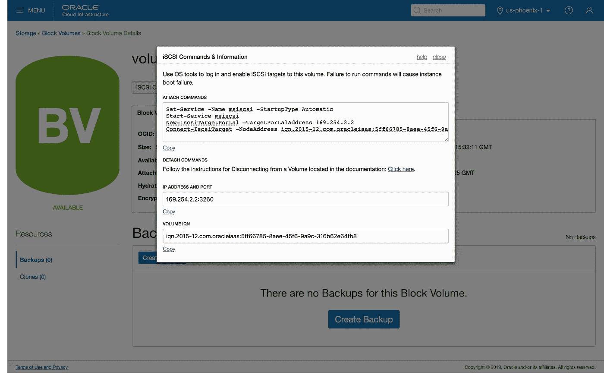

# 使用 Terraform 管理 Oracle 云基础架构 iSCSI 数据块卷附件。第 2 部分:Windows 实例

> 原文：<https://medium.com/oracledevs/managing-oracle-cloud-infrastructure-iscsi-block-volume-attachments-with-terraform-16ae46fdf3b4?source=collection_archive---------0----------------------->

我的第一篇关于使用 Terraform 管理 Oracle 云基础设施 iSCSI 块卷附件的帖子只涵盖了 Oracle Linux 实例的步骤。在本文中，我们将了解如何使用相同的方法将 iSCSI 数据块卷连接到 Windows 实例。

# 使用 WinRM 启用远程执行资源调配

首先，我们需要在创建时为远程资源调配启用实例。Oracle 云基础架构 Windows 映像支持`cloudbase-init`和 WinRM(参见 [**Oracle 提供的映像**](https://docs.cloud.oracle.com/iaas/Content/Compute/References/images.htm?Highlight=cloudbase-init#winDetails) **)，**但是在能够将 Terraform remote-exec provisioner 用于 WinRM 之前，必须满足一些网络和实例配置先决条件。

## 启用入站 WinRM 流量

配置您的子网安全规则以允许 WinRM 流量进入端口 **5986** 。例如，可以将下面的规则添加到将在其中创建实例的子网的`oci_core_security_list`中。

```
 # allow inbound winrm traffic
  ingress_security_rules {
    protocol  = "6"
    source    = "0.0.0.0/0"
    stateless = false
    tcp_options { 
      "min" = **5986**
      "max" = **5986**
    }
  }
```

## 启用远程访问管理员帐户

我们需要启用合适的远程管理帐户。**在创建和管理远程访问帐户时，您应该遵循自己公司的安全指导方针和政策**。

为 Oracle 提供的 Windows 服务器映像创建的默认`opc`管理员帐户启用了密码过期，这要求用户在首次登录时更改帐户密码，这将阻止任何远程执行，直到手动更改密码。要在配置期间使用`opc`帐户启用远程访问，我们需要在`cloudbase-init`启动脚本中禁用密码过期。

```
#ps1_sysnative
cmd /C 'wmic UserAccount where Name="opc" set PasswordExpires=False'
```

有关如何在实例配置中包含云初始化脚本的详细信息，请参见 [**在 Oracle 云基础设施上使用 Terraform 自动化实例初始化:第 2 部分**](/oracledevs/automating-instance-initialization-with-terraform-on-oracle-cloud-infrastructure-part-2-e1aa1a8710d)

## terra form remote-exec provisioner WinRM 连接设置

使用以下设置为远程执行置备程序配置资源`connection`块

```
 connection {
    type     = **"winrm"**
    insecure = **true**
    https    = **true**
    port     = **5986**
    host     = "${oci_core_instance.instance1.public_ip}"
    user     = "${data.oci_core_instance_credentials.instance1.username}"
    password = "${data.oci_core_instance_credentials.instance1.password}"
  }
```

因为我们使用的是`opc`帐户，所以我们可以从`oci_core_instance_credentials`数据源获取初始密码。

```
data "oci_core_instance_credentials" "instance1" {
  instance_id = "${oci_core_instance.instance1.id}"
}
```

# iSCSI 块卷附件

正如我在 [**使用 Terraform**](/oracledevs/managing-oracle-cloud-infrastructure-iscsi-block-volume-attachments-with-terraform-97726691b842)**管理 Oracle 云基础设施 iSCSI 块卷附件中所介绍的，将块卷附加到实例的过程涉及多个步骤，包括**附加**块卷资源、**连接**操作系统中的 iSCSI 设备，以及最后**挂载**卷。**

**Oracle 云基础架构控制台提供了在**块卷**详细信息页面中附加卷后需要执行的 iSCSI PowerShell 命令的详细信息。**

****

**Oracle Cloud Infrastructure Block Volume iSCSI Commands and Information**

**前两个命令只需要执行一次就可以启用 iSCSI 服务，这些命令可以添加到实例`cloudbase-init`脚本中，以便在启动时初始化。**

```
#ps1_sysnative
Set-Service -Name msiscsi -StartupType Automatic
Start-Service msiscsi
```

**设备特定的命令包含在用于`oci_core_volume_attachment`资源的远程执行供应器中，因此它们只在实例启动后在附件上运行。为了在分离数据块卷时完全断开连接，我们还提供了销毁时间资源调配器。对于 Windows Server 2008 和 Windows Server 2012/2016，iSCSI 命令有所不同**

****Windows Server 2012/2016****

```
 # register and connect the iSCSI block volume
  provisioner "remote-exec" {
    inline = [
      "  Powershell New-IscsiTargetPortal –TargetPortalAddress **${self.ipv4}**",
      "  Powershell Connect-IscsiTarget -NodeAddress **${self.iqn}** -TargetPortalAddress **${self.ipv4}** -IsPersistent $True",
    ]
  } # disconnect and unregister on destroy
  provisioner "remote-exec" {
    when       = "destroy"
    on_failure = "continue" inline = [
      "  Powershell Disconnect-IscsiTarget -NodeAddress **${self.iqn}** -Confirm:$false",
      "  Powershell Remove-IscsiTargetPortal -TargetPortalAddress **${self.ipv4}** -Confirm:$false",
    ]
  }
```

***注意:* `Powershell` *命令前的空格看似随意，但实际上很重要。不知道为什么，但是很管用:-)***

****Windows Server 2008****

**在 Windows 2008 上，我们需要使用`iscsicli.exe`命令**

```
 # register and connect the iSCSI block volume
  provisioner "remote-exec" {
    inline = [
      "iscsicli.exe QAddTargetPortal **${self.ipv4}**",
      "iscsicli.exe QLoginTarget **${self.iqn}**",
      "iscsicli.exe PersistentLoginTarget **${self.iqn}** * **${self.ipv4}** **${self.port}** * * * * * * * * * * * * * *"
    ]
  } # unregister on destroy
  provisioner "remote-exec" {
    when       = "destroy"
    on_failure = "continue"inline = [
      "iscsicli.exe RemovePersistentTarget **Root\iScsiPrt\0000_0** **${self.iqn}** * **${self.ipv4}** **${self.port}**"
      "iscsicli.exe RemoveTarget **${self.iqn}**",
      "iscsicli.exe RemoveTargetPortal **${self.ipv4}** **${self.port}**",
    ]
  }
```

# **装载块卷**

**在我关于块卷附件的原始文章中，我介绍了如何使用唯一的 iSCSI 设备 id 确定性地挂载卷，以确保每次挂载都被一致地分配到相同的挂载点/驱动器。老实说，我的 Powershell 技能充其量只能算是最低限度的，我只是不知道如何在 Windows 上做到这一点，所以这一部分主要是留给读者作为练习。**

> **与其提供坏建议，不如什么建议都不提供。**

**但是，对于一个非常基本的用例，如果您只需要初始化和格式化一个新的附加卷，您可以使用以下 Powershell 命令。**不要将这些命令添加到没有附加脚本的** `oci_core_volume_attachment` **资源供应器，以防止破坏已经初始化的卷上的数据。****

```
Initialize-Disk **-Number 1**
New-Partition **-DiskNumber 1** -UseMaximumSize -AssignDriveLetter
Powershell Format-Volume **-DriveLetter D** -Confirm:$false"
```

# **最终配置**

**这是一个完整的示例，用于启动带有连接的 iSCSI 数据块卷的 Windows Server 2016 Standard Edition 实例**

# **相关文章**

**[](https://blogs.oracle.com/cloud-infrastructure/windows-custom-startup-scripts-and-cloud-init-on-oracle-cloud-infrastructure) [## Oracle 云基础架构上的 Windows 自定义启动脚本和云初始化

### 我们很高兴宣布推出一种在 Oracle 上配置和定制 Microsoft Windows Server 计算实例的简单方法…

blogs.oracle.com](https://blogs.oracle.com/cloud-infrastructure/windows-custom-startup-scripts-and-cloud-init-on-oracle-cloud-infrastructure) [](/oracledevs/managing-oracle-cloud-infrastructure-iscsi-block-volume-attachments-with-terraform-97726691b842) [## 使用 Terraform 管理 Oracle 云基础架构 iSCSI 数据块卷附件

### 将额外的块存储数据卷附加到实例是许多云部署的常见用例。这个…

medium.com](/oracledevs/managing-oracle-cloud-infrastructure-iscsi-block-volume-attachments-with-terraform-97726691b842)  [## 在 Oracle 云基础设施上使用 Terraform 自动化实例初始化:第 2 部分

### 作为上一篇关于在 Oracle 计算云上使用 Terraform 自动化实例初始化的文章的后续…

medium.com](/oracledevs/automating-instance-initialization-with-terraform-on-oracle-cloud-infrastructure-part-2-e1aa1a8710d)**