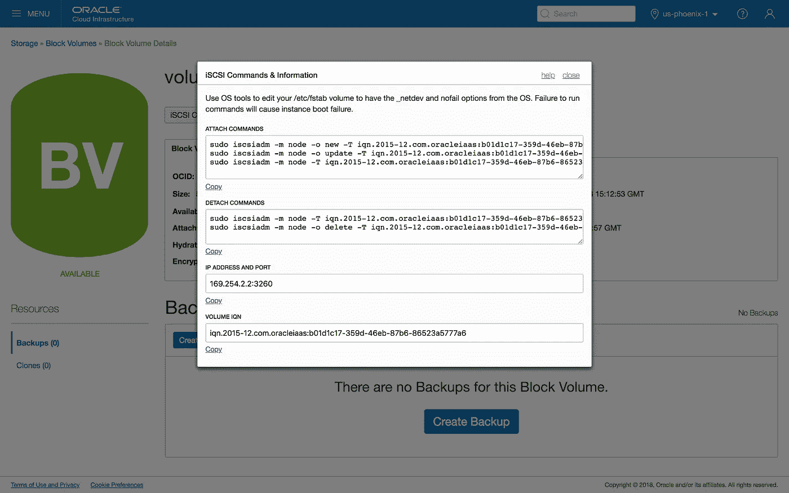

# 使用 Terraform 管理 Oracle 云基础架构 iSCSI 数据块卷附件

> 原文：<https://medium.com/oracledevs/managing-oracle-cloud-infrastructure-iscsi-block-volume-attachments-with-terraform-97726691b842?source=collection_archive---------0----------------------->

将额外的块存储数据卷附加到实例是许多 [IaaS](https://www.oracle.com/cloud/what-is-iaas/) 云部署的常见用例。本文概述了一种使用 **Terraform** 在 **Oracle 云基础架构** (OCI)计算实例上管理 **iSCSI 数据块卷**的附件和连接详细信息的方法。

| `*Terraform 0.11.10*` *，*，`*provider.oci 3.5.0*`，*，*，`*Oracle Linux 7.4*`

将附加块存储数据卷连接到实例时，需要考虑 4 个关键步骤:

1.  **创建** —创建块存储卷资源。这是使用`[**oci_core_volume**](https://www.terraform.io/docs/providers/oci/r/core_volume.html)` **资源**在 Terraform 中创建的。如果您正在使用现有的存储卷，您可以使用`[**oci_core_volume**](https://www.terraform.io/docs/providers/oci/d/core_volume.html)` **数据源。**
2.  **附加** —将卷与特定实例相关联。这在 Terraform 中管理，创建一个`[**oci_core_volume_attachment**](https://www.terraform.io/docs/providers/oci/r/core_volume_attachment.html)`资源。
3.  **连接** —使客户操作系统能够访问存储设备。
4.  **挂载** —将存储设备挂载为可用的文件系统。对于新的存储卷，这可能还包括创建分区表和初始化文件系统。

步骤 **1** 和 **2** 直接使用`oci_core_volume`和`oci_core_volume_attachment`地形资源处理。对于本文，我们将特别关注将步骤 **3** 和 **4** 合并到我们的地形配置中。

## iSCSI 音量连接

[iSCSI](https://docs.cloud.oracle.com/iaas/Content/Block/Concepts/overview.htm#iSCSI) 是一种基于 IP 的标准，用于连接的存储和裸机或虚拟机实例之间的通信，可以提供比[半虚拟化](https://docs.cloud.oracle.com/iaas/Content/Block/Concepts/overview.htm#Paravirtualized)卷附件更好、更一致的 IOPS(参见[块卷性能](https://docs.cloud.oracle.com/iaas/Content/Block/Concepts/blockvolumeperformance.htm))

使用半虚拟化卷附件时，连接步骤是自动的，但是对于 iSCSI 卷附件，您需要在设备可用之前在来宾操作系统中执行一些附加命令

*   用`iscsiadm`工具注册卷
*   将 iSCSI 配置为在重新启动后自动连接到数据块存储卷
*   (可选)配置 CHAP 身份验证
*   登录 iSCSI

Oracle 云基础设施控制台在**块卷**详细信息页面中提供了需要执行的确切`iscsiadm`命令的详细信息。



Oracle Cloud Infrastructure Block Volume iSCSI Commands and Information

## 体积附件和与地形的连接

上面显示的所需 iSCSI 连接命令可以作为使用`remote-exec`供应器创建`oci_core_volume_attachment`资源的一部分来执行。每个附件的 **IQN** 、iSCSI **IP 地址**和**端口**的必需值都可以作为附件资源的属性。

```
resource "oci_core_volume_attachment" "attachment1" {
 **attachment_type = "iscsi"**  instance_id     = "${oci_core_instance.instance1.id}"
  volume_id       = "${oci_core_volume.volume1.id}" connection {
    type        = "ssh"
    host        = "${oci_core_instance.instance1.public_ip}"
    user        = "opc"
    private_key = "${file("~/.ssh/id_rsa")}"
  } provisioner "remote-exec" {
    inline = [
      "sudo iscsiadm -m node -o new -T **${self.iqn}** -p **${self.ipv4}**:**${self.port}**",
      "sudo iscsiadm -m node -o update -T **${self.iqn}** -n node.startup -v automatic",
      "sudo iscsiadm -m node -T **${self.iqn}** -p **${self.ipv4}**:**${self.port}** -l",
    ]
  }
}
```

为了防止潜在的数据丢失，我们还希望在销毁附件之前完全断开数据块存储，方法是添加一个销毁时间资源调配器，并提供所需的断开连接命令。

```
 provisioner "remote-exec" {
 **when       = "destroy"** on_failure **=** "continue" inline = [
      "sudo iscsiadm -m node -T **${self.iqn}** -p **${self.ipv4}**:**${self.port}** -u",
      "sudo iscsiadm -m node -o delete -T **${self.iqn}** -p **${self.ipv4}**:**${self.port}**",
    ]
  }
```

注意:使用销毁时间置备程序有一些注意事项。更多详情参见[地形文件](https://www.terraform.io/docs/provisioners/index.html#destroy-time-provisioners)

> 销毁时置备程序只有在销毁资源时仍在配置中才能运行。如果从配置中完全删除带有销毁时置备程序的资源块，其置备程序配置也会随之删除，因此销毁置备程序将不会运行

## 使用 CHAP 身份验证阻止卷附件

使用 CHAP 身份验证时，需要包括三个额外的`iscsiadm`命令，如下所示。

```
resource "oci_core_volume_attachment" "attachment2" {
 **attachment_type = "iscsi"**  **use_chap        = true
**  instance_id     = "${oci_core_instance.instance1.id}"
  volume_id       = "${oci_core_volume.volume2.id}" connection {
    type        = "ssh"
    host        = "${oci_core_instance.instance1.public_ip}"
    user        = "opc"
    private_key = "${file("~/.ssh/id_rsa")}"
  } provisioner "remote-exec" {
    inline = [
      "sudo iscsiadm -m node -o new -T ${self.iqn} -p ${self.ipv4}:${self.port}",
      "sudo iscsiadm -m node -o update -T ${self.iqn} -n node.startup -v automatic",
 **"sudo iscsiadm -m node -T ${self.iqn} -p ${self.ipv4}:${self.port} -o update -n node.session.auth.authmethod -v CHAP"
      "sudo iscsiadm -m node -T ${self.iqn} -p ${self.ipv4}:${self.port} -o update -n node.session.auth.username -v ${self.chap_username}"
      "sudo iscsiadm -m node -T ${self.iqn} -p ${self.ipv4}:${self.port} -o update -n node.session.auth.password -v ${self.chap_secret}"**      "sudo iscsiadm -m node -T ${self.iqn} -p ${self.ipv4}:${self.port} -l",    ]
  }
}
```

# **安装块卷**

成功将 iSCSI 数据块卷与实例连接后，通常需要装载设备以供文件系统使用。

**注意:如果您的部署脚本采用设备名称，如** `**/dev/sdb**` **或** `**/dev/sdc**` **，请注意，不能保证设备将被一致地分配预期的通用设备 id，或者多个附件将总是以相同的顺序创建。**以下介绍如何使用唯一的设备特定 id 安装存储设备。

当您挂载一个新创建的卷时，您还需要初始化文件系统。在下面的示例中，我们将了解以下步骤:

*   用 GPT 分区表初始化新卷
*   用一个`xfs`文件系统创建一个新分区
*   更新`/etc/fstab`以自动挂载分区

**注意:分区和文件系统步骤将破坏块卷上的任何现有数据。**

## 1.通过路径找到 iSCSI 设备

连接的 iSCSI 设备映射到`/dev/disk/by-path`下的唯一设备名称。设备名称基于 **IQN** 、 **IP 地址**和**端口**，格式如下:

```
/dev/disk/by-path/ip-***IPADDRESS***:***PORT***-iscsi-***IQN***-lun-1
```

## 2.初始化分区

使用`fdisk`我们初始化分区表，并为设备上的可用存储创建一个分区。

```
$ fdisk /dev/disk/by-path/ip-***IPADDRESS***:***PORT***-iscsi-***IQN***-lun-1
```

*   `g`创建一个新的空 GPT 分区表
*   `n`添加新分区(默认分区号、默认第一个扇区和默认最后一个扇区)
*   `w`将表格写入磁盘并退出

新分区由附加了`-part1`的设备路径标识。

```
/dev/disk/by-path/ip-***IPADDRESS***:***PORT***-iscsi-***IQN***-lun-1-part1
```

现在我们可以初始化分区上的文件系统。对于这个例子，我们使用`**xfs**`。

```
$ sudo mkfs.xfs \
  /dev/disk/by-path/ip-***IPADDRESS***:***PORT***-iscsi-***IQN***-lun-1-part1
```

## 3.自动挂载分区

首先创建一个合适的挂载点，例如`/mnt/vol1`

```
$ sudo mkdir -p /mnt/vol1
```

分区的 UUID 用于唯一标识挂载。使用`blkid`找到 UUID

```
$ blkid -s UUID -o value \
  /dev/disk/by-path/ip-***IPADDRESS***:***PORT***-iscsi-***IQN***-lun-1-part19ff8c2eb-4b54–4a81-bf4c-9b040663e172
```

将下面一行添加到`/etc/fstab`中，使用 UUID 在重启时自动挂载卷。如果与`**/mnt/vol1**`不同，请设置适当的挂载点位置，如果您使用的是与`**xfs**`不同的文件系统，请更改文件系统类型。iSCSI 设备需要`_netdev`选项。

```
UUID=9ff8c2eb-4b54–4a81-bf4c-9b040663e172 /mnt/vol1 xfs defaults,_netdev,nofail 0 2
```

最后，挂载文件系统:

```
$ sudo mount -a
```

# 最终配置

以上步骤可以添加到`oci_core_volume_attachment`资源`remote-exec`置备程序中。通过一些额外的保护措施来防止初始化已经存在的分区，并在断开连接之前卸载卷，我们完成的自连接 iSCSI 块卷附件资源现在看起来像这样:

```
resource "oci_core_volume_attachment" "attachment1" { attachment_type = "iscsi"
  instance_id     = "${oci_core_instance.instance1.id}"
  volume_id       = "${oci_core_volume.volume1.id}" connection {
    type        = "ssh"
    host        = "${oci_core_instance.instance1.public_ip}"
    user        = "opc"
    private_key = "${file("~/.ssh/id_rsa")}"
  } ***# register and connect the iSCSI block volume***  provisioner "remote-exec" {
    inline = [
      "sudo iscsiadm -m node -o new -T ${self.iqn} -p ${self.ipv4}:${self.port}",
      "sudo iscsiadm -m node -o update -T ${self.iqn} -n node.startup -v automatic",
      "sudo iscsiadm -m node -T ${self.iqn} -p ${self.ipv4}:${self.port} -l",
    ]
  } ***# initialize partition and file system***  provisioner "remote-exec" {
    inline = [
      "set -x",
      "export DEVICE_ID=ip-${self.ipv4}:${self.port}-iscsi-${self.iqn}-lun-1",
      "export HAS_PARTITION=$(sudo partprobe -d -s /dev/disk/by-path/$${DEVICE_ID} | wc -l)",
      "if [ $HAS_PARTITION -eq 0 ] ; then",
      "  (echo g; echo n; echo ''; echo ''; echo ''; echo w) | sudo fdisk /dev/disk/by-path/$${DEVICE_ID}",
      "  while [[ ! -e /dev/disk/by-path/$${DEVICE_ID}-part1 ]] ; do sleep 1; done",
      "  sudo mkfs.xfs /dev/disk/by-path/$${DEVICE_ID}-part1",
      "fi",
    ]
  } ***# mount the partition***  provisioner "remote-exec" {
    inline = [
      "set -x",
      "export DEVICE_ID=ip-${self.ipv4}:${self.port}-iscsi-${self.iqn}-lun-1",
      "sudo mkdir -p /mnt/vol1",
      "export UUID=$(sudo /usr/sbin/blkid -s UUID -o value /dev/disk/by-path/$${DEVICE_ID}-part1)",
      "echo 'UUID='$${UUID}' /mnt/vol1 xfs defaults,_netdev,nofail 0 2' | sudo tee -a /etc/fstab",
      "sudo mount -a",
    ]
  } ***# unmount and disconnect on destroy***  provisioner "remote-exec" {
    when       = "destroy"
    on_failure = "continue" inline = [
      "set -x",
      "export DEVICE_ID=ip-${self.ipv4}:${self.port}-iscsi-${self.iqn}-lun-1",
      "export UUID=$(sudo /usr/sbin/blkid -s UUID -o value /dev/disk/by-path/$${DEVICE_ID}-part1)",
      "sudo umount /mnt/vol1",
      "if [[ $UUID ]] ; then",
      "  sudo sed -i.bak '\\@^UUID='$${UUID}'[@d](http://twitter.com/d)' /etc/fstab",
      "fi",
      "sudo iscsiadm -m node -T ${self.iqn} -p ${self.ipv4}:${self.port} -u",
      "sudo iscsiadm -m node -o delete -T ${self.iqn} -p ${self.ipv4}:${self.port}",
    ]
  }
}
```

# 进一步阅读

*   [块体积概述](https://docs.cloud.oracle.com/iaas/Content/Block/Concepts/overview.htm)
*   Oracle 云基础架构[连接到卷](https://docs.cloud.oracle.com/iaas/Content/Block/Tasks/connectingtoavolume.htm)
*   Oracle 云基础设施 [/etc/fstab 选项](https://docs.cloud.oracle.com/iaas/Content/Block/References/fstaboptions.htm)