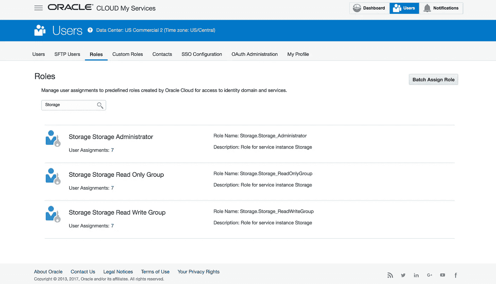

# 使用 Terraform 管理 Oracle 云基础架构对象存储经典容器和对象

> 原文：<https://medium.com/oracledevs/managing-oracle-cloud-infrastructure-object-storage-classic-containers-and-objects-using-terraform-9b1a44fdb8b?source=collection_archive---------1----------------------->

在本文中，我们将快速了解一下`[opc](https://www.terraform.io/docs/providers/opc/index.html)` Terraform provider 对使用 Oracle 云基础架构对象存储经典资源的支持

## 提供商设置

在使用存储资源之前，您需要确保提供者配置了适当的`storage_endpoint` URL，这在主`provider`块中声明。如果存储服务 ID 不同于默认的`identity_domain`，也可以设置可选的`storage_service_id`

完整的 storage cloud REST API 端点 URL 可以在 Oracle Cloud MyServices 仪表板中找到。例如，如果 REST 端点是

```
**https://a000001.storage.oraclecloud.com**/v1/Storage-**a000001**
\_________________ ___________________/            \__ __/
                  V                                   V
           storage_endpoint             storage_service_id
```

然后在提供者配置中设置值:

```
provider "opc" {
  ...
  storage_endpoint   = "[https://](https://usorclptsc53098.storage.oraclecloud.com/v1/Storage-usorclptsc53098)[a000001](https://a480066.storage.oraclecloud.com/v1/Storage-a480066)[.storage.oraclecloud.com](https://usorclptsc53098.storage.oraclecloud.com/v1/Storage-usorclptsc53098)"
  storage_service_id = "[a000001](https://a480066.storage.oraclecloud.com/v1/Storage-a480066)"
}
```

# 存储容器

`opc_storage_container`资源可以用来创建一个新容器。最简单的是，存储容器只需要一个名称。

```
resource "opc_storage_container" "container" {
  name = "my-storage-container"
}
```

## 访问控制

可以设置`read_acls`和`write_acls`属性来控制对特定容器的访问。

使用 Oracle Cloud My Services 控制台中定义的标准或自定义角色，可以根据角色将访问权限限制到特定用户或用户组。



在 ACL 配置中，每个角色名称必须以身份域 ID 为前缀，例如

```
resource "opc_storage_container" "container" {
  name       = "my-storage-container"
 **read_acls  = [ "${var.domain}.Storage.Storage_ReadOnlyGroup", 
                 "${var.domain}.Storage.Storage_ReadWriteGroup" ]
  write_acls = [ "${var.domain}.Storage.Storage_ReadWriteGroup" ]**
}
```

还可以根据引用的主机或域来限制读取权限。引用 ACL 采用格式`.r:*value*`，其中*值*是主机或域。*值*前的减号(`-`表示必须拒绝指定的主机或域访问容器。如果指定了`.r:*`，容器中的对象将是公共可读的，无需认证。

要允许列出容器中的对象，请在 ACL 中包含`.rlistings`指令。

```
resource "opc_storage_container" "container" {
  name       = "my-storage-container"
 **read_acls  = [ ".r:host1.example.com,host2.example.com",
                 ".rlistings" ]
  write_acls = [ "${var.domain}.Storage.Storage_ReadWriteGroup" ]**
}
```

有关对象存储经典 ACL 的更多详细信息，请参考[设置容器 ACL](https://docs.oracle.com/en/cloud/iaas/storage-cloud/cssto/setting-container-metadata.html#GUID-EAFEF8A7-9988-4332-B969-FF3CBE1B8E7C)文档

## 克-奥二氏分级量表

为了支持[容器和对象的跨源资源共享](https://en.wikipedia.org/wiki/Cross-origin_resource_sharing)，可以设置属性`allowed_origins`、`exposed_headers`、`max_age`。CORS 元数据在容器中设置，但也适用于容器中的所有对象。

```
resource "opc_storage_container" "container" {
  name            = "my-storage-container"
**allowed_origins = [ "**[**https://www.example.com**](https://storageconsole.us2.oraclecloud.com)**" ]** **exposed_headers = [ "****Content-Length****" ]
** **max_age         = 60**
}
```

## 临时 URL

管理用于访问容器内内容的临时 URL 需要设置用于生成临时 URL 的加密密钥。可以使用`primary_key`属性设置容器特定的键。另外`secondary_key`也可以设置为支持按键旋转。

```
resource "opc_storage_container" "container" {
  name          = "my-storage-container"
 **primary_key   = "secret1"
  secondary_key = "secret2"**
}
```

Terraform 不支持创建实际的临时 URL。有关生成临时访问 URL 的详细信息，请参考[使用临时 URL 下载对象](https://docs.oracle.com/en/cloud/iaas/storage-cloud/cssto/downloading-object-using-temporary-url.html)文档

# 存储对象

`opc_storage_object`资源表示并创建容器中的数据对象。在 Terraform 配置中包含存储对象对于部署实例初始化所需的共享配置文件和安装程序或上传应用程序的静态内容非常有用。

有三种不同的方式为新的存储对象提供内容，即来自本地文件和来自另一个存储对象的内联内容。对于简单的对象和数据文件，内联提供内容可能很有用。

```
resource "opc_storage_object" "from-content" {
  name      = "my-object-from-content.txt"
  container = "${opc_storage_container.container.name}"
  **content   = "The quick brown fox jumps over the lazy dog"**
}
```

***然而*** ，在处理较大的对象/文件时要小心，虽然使用插值函数`content = "${**file(**"./source_file.txt"**)**}"`简单地从文件加载内容可能很诱人，但这将导致文件内容成为地形状态的一部分。

幸运的是，还有另一个选择，使用`file`属性来创建对象，而不用在 Terraform 状态下存储内容。当使用`file`属性时，建议也用文件的 MD5 散列设置`etag`，这将确保如果本地文件改变，对象将被重新创建

```
resource “opc_storage_object” “from-file” {
 name = “my-object-from-file.txt”
 container = “${opc_storage_container.container.name}”
 **file = “./source_file.txt”**
 **etag = “${md5(file(“./source_file.txt”))}”**
 content_type = “text/plain;charset=utf-8”
}
```

第三个选项是使用`copy_from`选项从同一个存储服务中的*现有的*对象创建新的存储对象。源对象由要复制的对象的完整`container/object_name` id 标识。

```
resource "opc_storage_object" "copy-from-object" {
  name = "my-object-from-object"
  container = "${opc_storage_container.container.name}"
  **copy_from = "my-container/my-existing-object"**
}
```

# 元数据头

`opc_storage_container`和`opc_storage_object`资源都支持设置额外的定制元数据头，这将导致在相应的容器和对象资源上设置`X-Container-Meta-{name}`和`X-Object-Meta-{name}`头，其中`{name}`是定制元数据名称。

额外的头被定义为`metadata`块中的任意键值对，例如

```
resource "opc_storage_container" "container" {
  name = "my-storage-container"
 **metadata {
    "Foo"    = "Bar"
    "MyTags" = "tag1,tag2,tag3"
  }**
}
```