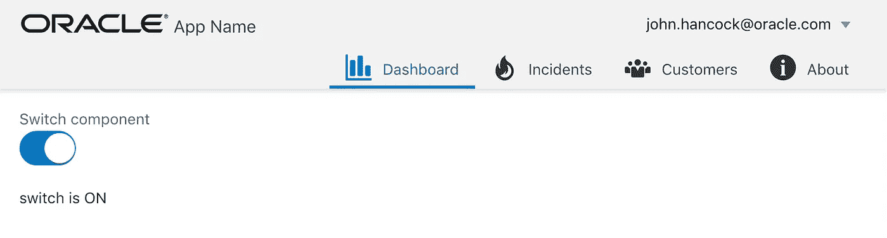
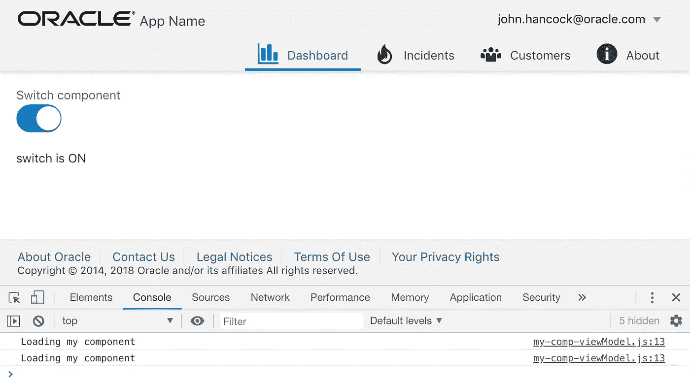

# 使用写回属性管理 Oracle JET Web 组件变量的持久状态

> 原文：<https://medium.com/oracledevs/managing-persisted-state-for-oracle-jet-web-component-variable-with-writeback-property-e1bedda4c6ff?source=collection_archive---------1----------------------->

从 JET 6.0.0 开始，复合组件(CCA)被重命名为 Web 组件(我更喜欢这个新名字，对我来说听起来更简单)。在今天的帖子中，我将谈论 Web 组件*写回*属性及其重要性。

当离开并导航回包含 Web 组件的模块时，Web 组件中定义的所有变量(可观察的或不可观察的)都将被重置。这意味着您不能在 Web 组件中存储任何值，因为这些值将在导航过程中丢失。每次当我们导航回该模块时，该模型中使用的所有 Web 组件都将被重新加载，这意味着 Web 组件的 JS 脚本将被重新加载，变量将重新执行，丢失以前的值。此行为仅特定于 Web 组件，在所属模块中创建的变量值不会被重置。

如果您想保留 Web 组件变量值，您将需要在 Web 组件之外存储变量状态。这可以通过使用支持*写回*的 Web 组件属性来实现。

让我们看看 Web 组件在运行时的行为。源代码可以在我的 [GitHub](https://github.com/abaranovskis-redsamurai/writebackwebcomponent) 回购上获得。

在这里，我将基本 Web 组件包含在仪表板模块中:

除了 JET switcher 之外，Web 组件不实现任何东西。一旦切换器状态改变，JS 脚本中的变量就会更新:

在 Web 组件中保存切换器状态的变量:

每次我们离开并回到模块时，Web 组件都会被重新加载，这意味着变量将被重置。这是看起来的样子——想象我们第一次打开模块，切换器位置是关闭的:

将其更改为打开:

导航到任何其他模块并返回—您将看到切换器被重置回默认关闭状态，这意味着变量被重置(否则我们应该看到打开状态):

如果你想保持可变状态，那么它应该在 Web 组件之外维护。要实现这一点，创建 Web 组件属性以保存变量值，确保使用*写回*支持设置该属性:

出于调试目的，将日志记录添加到 Web 组件中，这将有助于了解它何时被重新加载:

切换器变量必须从 Web 组件属性初始化。第一次它会是空的，但是一旦用户更改了切换器状态，下次重新加载 Web 组件时，它会分配之前选择的正确值:

当切换器状态改变时，我们需要处理该事件，并确保 Web 组件属性用新值更新:

*写回*属性必须用模块中创建的可观察变量赋值。变量引用必须是可写的，带{{}}括号:

一旦 Web 组件中的值发生变化，这种变化将传播到模块中定义的可观察变量。下次当我们离开并回到模块时，我们将把最近的值传递给 Web 组件:

现在是这样运作的。加载模块，更改切换器状态(请参见日志— Web 组件已加载一次):

导航到任何其他模块:

回到包含 Web 组件的模块。查看日志— Web 组件被重新加载，但是 switcher 变量值没有丢失，因为它通过 Web 组件*写回*属性保存到模块可观察变量中:

*原载于 2018 年 11 月 8 日*[*【andrejusb.blogspot.com】*](https://andrejusb.blogspot.com/2018/11/managing-persisted-state-for-oracle-jet.html)*。*