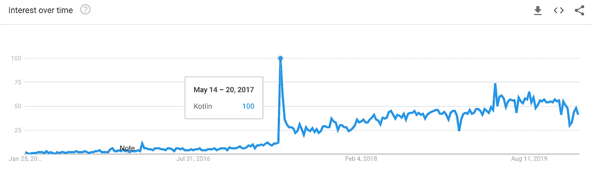

# 管理科特林周刊

> 原文：<https://medium.com/google-developer-experts/managing-the-kotlin-weekly-7212d3da35a4?source=collection_archive---------3----------------------->


我刚发了第 182 期科特林周刊。#182 表示这是《科特林周刊》存活的第 182 周。自 2017 年 8 月 7 日第一版发送给 200 多名初始订户的 5 篇文章[以来，许多事情都发生了变化。](https://us12.campaign-archive.com/?u=f39692e245b94f7fb693b6d82&id=7776379469)

在一些第一版中，内容非常匮乏，以至于我最终写了自己的文章来收录它们，或者添加一些我在 Twitter 上发布的代码片段。从那以后，Kotlin 的演变缓慢而稳定地遵循着一个明确的趋势。



Trends for Kotlin according to Google trends. The spike in [May 2017](https://trends.google.com/trends/explore?date=today%205-y&geo=US&q=%2Fm%2F0_lcrx4) corresponds to the Google I/O, where Kotlin official support for Android was announced.

几年后的今天，Kotlin 已经成为一种趋势。它定期调整大多数语言流行指数中的一些位置，并且社区正在产生更多的内容。Kotlin Weekly 是一个很好的温度计，用来确定语言的健康状况，我们可以统计订户、与邮件列表的互动、提交出版的问题等。


PYPL PopularitY of Programming Language [index](http://pypl.github.io/PYPL.html)

《科特林周刊》一直在增加其影响力和服务科特林社区的能力。去年，我们是[kotlincon](https://kotlinconf.com/partners/)、 [Droidcon India](https://www.in.droidcon.com/) 和 [Droidcon](http://droidcon.com/) 的媒体合作伙伴。在一些书中，我们被引用为学习和了解科特林世界所有新闻的核心资源。在科特林的推进者[状态中，科特林周刊被认为是 JetBrains 泡泡之外的首选*科特林来源。*](https://pusher.com/state-of-kotlin)


Excerpt of [Kotlin Blueprints](https://books.google.com.vn/books?id=aMxPDwAAQBAJ&pg=PA17&lpg=PA17&dq=%22kotlin+weekly%22&source=bl&ots=VzxKUMt-_J&sig=ACfU3U1gssY4XE8CbvBQB3TLBmA7nr-3Fw&hl=en&sa=X&ved=2ahUKEwiZ3Ojg0J7nAhXSc94KHZxWCnA4ChDoATAGegQIChAB#v=onepage&q=%22kotlin%20weekly%22&f=false)

自最初版本以来，《科特林周刊》经历了一些变化。该网站从一个非常基本的 HTML 变成了一个体面的网站(感谢 47 度邮件列表的专业设计)，包括类别的聚集和改进的 UX。

我一直在调整我用来出版《科特林周刊》的流程，遵循的原则是*现在工作是为了将来少工作(*又名自动化)。最初，这是一个手工制作的项目，我习惯于在过滤后填写我收到的文章。随着时间的推移，增加了一些步骤，使这个过程更容易，更愉快，更不容易出错。今天我想和大家分享一些我做的事情。

# 接收内容

现在，我有三种主要的方式来接收内容:通过网站、电子邮件和 Twitter。大约 71%的内容是通过网站发送的，大约 26%的内容是通过电子邮件接收的，2%是通过 Twitter，其余的是通过不同的渠道接收的。

在我的一些 [Pomodoro 课间休息](https://en.wikipedia.org/wiki/Pomodoro_Technique)中，或者在常规课间休息时，我会阅读每一篇文章或图书馆发送的内容。我后来将它添加到我在亚马逊云中托管的 SQL 数据库中，在那里我存储了收到文章的*作者*、 *URL* 、*日期*、*频道*、文章是否已经*发表*、关于该链接的*评论*以及一个名为*质量*的字段。最后一个字段从 1 到 3，非常简单:1 是最低值，3 是最高值。

我确实有效地阅读了所有文章，并根据个人感觉给出了这个值:

*   3 表示它是即将发布的候选对象。
*   2 意味着可能需要重新评估(如果有质量问题，我会联系作者，建议他们做一些修改)。
*   1 表示现在不能考虑发布该文章。这些不仅仅是质量问题，还可以指任何东西(主题不符合《科特林周刊》的文章、垃圾邮件等)。

保留这个数据库的目的是为了能够提取统计数据。我可以很容易地查看哪个 URL 最突出显示，哪个作者发布了更多的内容，等等。这些信息可以在以后用于改善 Kotlin Weekly 的运营方式，更好地为订户服务。

# **发布内容**

现在事情变得更有趣了。我使用 Mailchimp 发布 Kotlin Weekly，内容存储在 Firebase 静态页面中。我用 CircleCI 做 CI/CD。Firebase 页面需要每周生成，Mailchimp 问题也需要每周精心制作。由于我现在正在处理一个涉及类别和更好的 UX 设计的设计，我决定编写一个脚本来生成所有这些 HTML/CSS 内容，而不是手动编写问题。

我已经创建了这个库， [Kotlin Weekly GenScript](https://github.com/kikoso/Kotlin-Weekly-GenScript) ，其中包含了我使用的 GenScript(显然是用 Kotlin 编写的)。

GenScript 获取一个. yaml 文件，创建一个将在网站上使用的. MD 文件，并生成将在 Mailchimp 中用于编写问题的所有 HTML 代码。

```
val filename = "2020-01-26"
val file = File("src/yamls/" + filename + ".yaml")
val result = Yaml.default.parse(Issue.serializer(), file.*readText*())

*createMdFile*(result, filename)

var html = *createHeader*(result.number.toString(), result.date)
html += *createTitle*(result.title)
result.announcements?.*let* **{** html += *createAnnouncements*(result.announcements) **}** result.articles?.*let* **{** html += *createArticles*(result.articles) **}** result.sponsored?.*let* **{** html += *createSponsored*(result.sponsored) **}** result.android?.*let* **{** html += *createAndroid*(result.android) **}** result.kotlinMultiplatformArticles?.*let* **{** html += *createMultiplatform*(result.kotlinMultiplatformArticles) **}** result.videos?.*let* **{** html += *createVideos*(result.videos) **}** result.jobs?.*let* **{** html += *createJobs*(result.jobs) **}** result.podcast?.*let* **{** html += *createPodcast*(result.podcast) **}** result.conferences?.*let* **{** html += *createConferences*(result.conferences) **}** result.libraries?.*let* **{** html += *createLibraries*(result.libraries) **}**
```

的。MD 文件被自动复制到我存储用 Jekyll 创建的静态页面的文件夹中，该页面稍后将被上传到 Firebase:

```
//Copy file to the kotlin-weekly project
Runtime.getRuntime().exec("cp src/mds/"+filename+"-title.md ../kotlin-weekly/_posts/")

*println*("Moving to kotlin-weekly directory")
Runtime.getRuntime().exec("cd ../kotlin-weekly")
```

作为一个很好的副作用，我将整个 HTML 直接复制到剪贴板，所以我只需要将它粘贴到 Mailchimp:

```
val clipboard = Toolkit.getDefaultToolkit().*systemClipboard* clipboard.setContents(StringSelection(html), null)
```

在我将 Jekyll 目录中的内容提交到 GitHub 之后，将会触发一个钩子。这个钩子将构建 Jekyll 页面，并自动将它发布到 Firebase 中。


CircleCI doing what is supposed to do.

有了这个机制，我可以专注于撰写问题，而不是处理发布、修复 CSS 问题(计算机科学中最难的问题)或其他任何事情。

# 未来的工作

我在《科特林周刊》的渠道上还有一些其他的改进:

1.  自动赞助问题:现在联系赞助商和开发票的过程是非常手工的。赞助商联系我，我发送价格，解释一些数字，屏蔽日期，并手动创建发票。我想设置这个项目自动通过贝宝支付。
2.  自动发布 Firebase 静态页面:我仍然需要手动提交 GitHub。我想通过 CircleCI 自动化这个过程。
3.  通过网站联系:通过网站联系仍然是一个 mailto:链接，我想删除 mailto:并通过一个 PHP 脚本。Firebase Pages 不支持 PHP，所以我可能需要将所有东西都转移到亚马逊或谷歌云。
4.  每周从我的内容数据库自动下载 10 个候选人。我想尝试用 ML 自动编写介绍，所以我的工作将仅限于决定每篇文章的质量(从 1 到 3)，让机器做剩下的工作。

你对如何改进科特林周刊有什么想法吗？我希望[听到](https://twitter.com/eenriquelopez)你的反馈。

我在我的[推特账户](https://twitter.com/eenriquelopez)上写下我对软件工程和生活的想法。如果你喜欢这篇文章或者它确实帮助了你，请随意分享它，♥它和/或留下评论。这是给业余作家加油的货币。