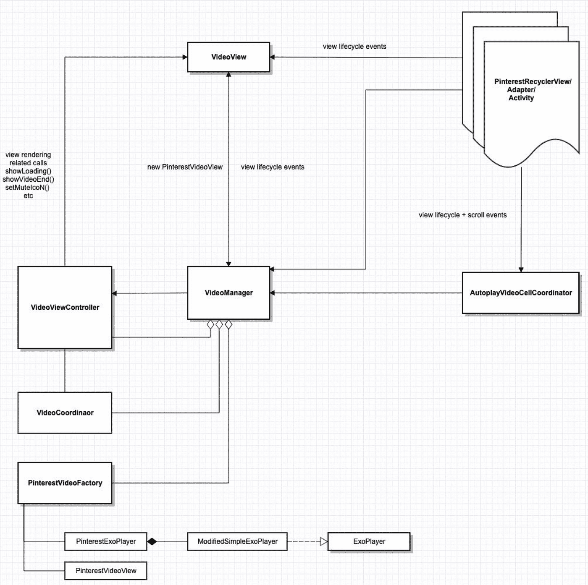
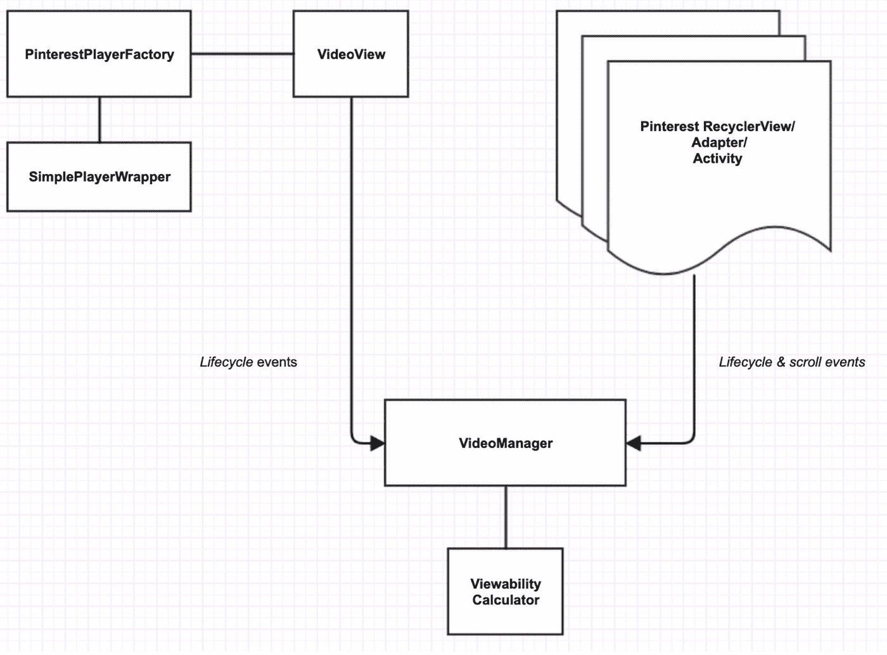

# 在 Android 上管理视频

> 原文：<https://medium.com/pinterest-engineering/managing-videos-on-android-f59da9601d5f?source=collection_archive---------2----------------------->

Grey Skold | Android 视频产品

视频于 2016 年在 Pinterest Android 应用程序上推出，目标是为应用程序带来无缝的视频体验。这包括支持每个屏幕多个视频的能力，同时通过在视频滚动出屏幕时自动暂停视频来动态控制视频的播放状态，或者控制允许同时播放的视频数量。

我们很快发现有许多技术难题需要解决，例如:

*   管理所有当前可用视频的播放状态
*   了解视频在屏幕上的可见性百分比
*   为我们的开发人员提供易于使用的视频组件

随着时间的推移，我们逐渐改造了我们的视频架构来满足这些要求，下面我们将深入探讨我们如何在最新的视频模块中应对这些挑战。

# 视频管理器

在高层次上，我们需要构建一个组件，它能够感知所有视频实例(即**视图** s)以及它们在屏幕上可用的相关表面(即**片段** s)。管理表面对于监控生命周期状态(即 **onStart()** 等)至关重要。)将应用于 surface 的子元素，并避免在消费者层添加过多的代码来将最新的状态更改应用于视图**s。**

为了跟踪这些关键的生命周期事件，Android 框架为我们提供了屏幕上显示的内容的当前状态，以及任何视觉上影响我们应用程序的变化。我们监听的关键生命周期事件是 UI 附件调用(例如 **onAttachedToWindow()** )以及我们的主机屏幕何时改变其显示状态(例如 **onPause()** 等)。).

通过这些回调方法，我们尝试注册任何提供了有效视频 URL 的视频。这将为我们提供当前界面中可用视频的初始列表。

在我们的视频框架的第一次迭代中，我们依赖于客户端代码调用这些调用本身，但是我们发现这是不可扩展的，因为它在构建视频功能时增加了更多的复杂性。相反，我们通过构建需要传入底层视频组件的方法，抽象出了在 **VideoManager** 后面注册视频的回调。从那里，**视频管理器**将在幕后进行适当的计算。这使得消费者不再需要预先了解视频注册流程，因为它现在只是“开箱即用”。

**在**之前

```
// FooBarFragment.class for FooBar featureoverride fun onResume() { super.onResume() // Required by consumers to implement videoView?.*apply* **{** viewability = Viewability.FullyVisible onActivate() onViewCompletelyVisible() **}**}override fun onPause() { // Required by consumers to implement videoView?.*apply* **{** viewability = Viewability.NotVisible onDeactivate() **}** super.onPause()}
```

后

```
// BaseFragment.class implemented by all screensoverride fun onResume() { super.onResume() videoManager.onResume(this)}override fun onPause() { videoManager.onPause(this) super.onPause()}// VideoManager.class internallyoverride fun onResume(videoSurface: VideoViewSurface) { videoSurface.videoViews.*forEach* **{** registerVideo(**it**) **}**}override fun onPause(videoSurface: VideoViewSurface) { videoSurface.videoViews.*forEach* **{** unregisterVideo(**it**) **}**}
```

**保持这个视频列表让我们能够根据应用程序的当前可见性动态设置播放状态。这也提供了根据视频注册时传入的某些元数据属性动态更改其他功能的灵活性。**

**例如，我们可能希望自动播放所有视频广告，但仅限于在同一表面上自动播放一个有机视频(即创作者生成的内容)。通过检查单个视频上注册的元数据，我们可以将这些限制应用到 UI 层。**

**我们还抽象出了所有 Pinterest 特定的分析代码，以保持视频管理器(管理和播放视频)的清晰焦点，并保持组件与应用程序无关。**

# **计算可视性**

****可见性**被定义为在屏幕上显示的 UI 组件的可见区域的百分比。这个度量对于我们理解当前显示给用户的是什么至关重要。有了这些信息，我们就能够为我们的合作伙伴收集有关其内容参与度的信息。**

**在一般情况下，由于**视频管理器**保存了对所有活动视频的引用，我们可以跟踪我们视图的准确坐标(即**getLocationInWindow()**)*和我们设备的屏幕大小(以像素为单位)(参见 **DisplayMetrics** )来推断它们在屏幕上的**可视性**。***

***我们还通过以下方式处理重叠的用户界面:***

*   ***为消费者提供选项，包括一个“障碍”视图列表**视图**，这些视图可能会覆盖我们的底层视频(例如，工具栏、浮动按钮等)。)***
*   ***正在显示的弹出窗口的回调(即 **onWindowFocusChanged()** )***
*   ***用于屏幕滚动的组件或脱离屏幕的 UI 组件(参见 *RecyclerView* listeners)***
*   ***当视频表面显示在屏幕上时的附加回调(即 **onResume()** 等)。).***

# ***为开发商而建***

***虽然我们希望减少开发人员面临的视频管理复杂性，但最大的困惑是实现新的视频界面。因此，我们既抽象了视频设置的复杂性，又利用了 Google player view 提供的 UI 组件:***

*****在**之前***

```
*// FooBar video feature, requires custom FooBarVideoView.class of 100+ linesobject : FooBarVideoView( *context*,     // application context analytics,   // Analytics object url,         // video url uid,         // unique ID false        // isAd flag) { // configuration flag for custom setup (mute, autoplay, controller, etc.) override val videoConfiguration = VideoConfiguration.FOO_BAR}.*apply* **{** shouldLoop = true videoAspectRatio = aspectRatio render(videoMetaData) // loads video, videoMetaData contains: url, isAd, uid**}***
```

*****在**之后***

```
*// Foobar video feature, no custom class required just set flagsPinterestVideoView(context).apply { // Optional params for setup/customization **this**.analytics = pinterestAnalytics **this.**mute = false **this.**autoPlay = true **this.**alwaysAutoplay = true **this.**alwaysPlay = true **this.**showMute = true **this.**looping = true **this.**bufferingRule = *SHOW_BUFFERING_ALWAYS*}.apply { render(videoMetaData) // loads video, videoMetaData contains: url, isAd, uid}*
```

***视频基础设施的另一个复杂性是实际的视频管理器架构本身。在我们的重写中，我们整合了大部分旧组件，只保留了支持正常运行所需的基本组件***

*****在**之前***

******

*****在**之后***

******

***我们新的 **VideoManager** 架构为事件和组件之间的关系提供了清晰的层次结构。这不仅在纸面上看起来不错，而且仅重构一项就删除了大约 4500 行代码(不到原始实现的 1/3)。***

# ***在夕阳下玩耍…***

***构建适当的“视频管理”是一个漫长而艰巨的过程，但多年来，我们已经建立了一些真正进化的东西，以帮助简化我们的开发过程和 Pinner 体验。在未来，我们希望开源我们的工作，以便其他开发人员可以为处理动态视频回放的持续努力做出贡献。我们将继续迭代我们的视频客户端架构，应对新的挑战，目标是为 Pinners 和开发者打造愉快的视频体验。***

> ***我们正在建造世界上第一个视觉发现引擎。全世界有超过 2.5 亿人使用 Pinterest 来梦想、计划和准备他们在生活中想做的事情。[来加入我们吧！](https://careers.pinterest.com/careers)***