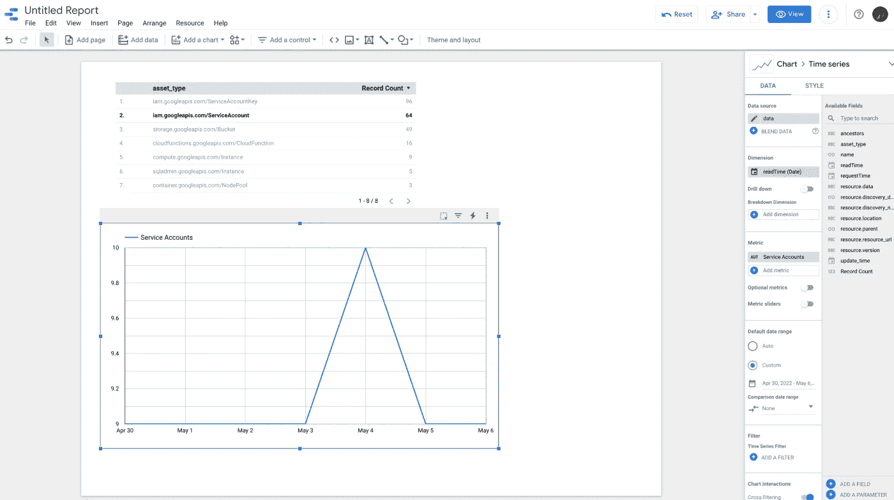

# 使用云资产 API 管理您的 GCP 库存

> 原文：<https://medium.com/google-developer-experts/managing-your-gcp-inventory-with-cloud-asset-api-fef257d82a4d?source=collection_archive---------1----------------------->

使用云资产 API 和 BigQuery 的云函数来跟踪你的谷歌云平台(GCP)库存。


Image from Google

# 介绍

本文的目的是在云中推广良好的内务管理习惯。我指的是确保资源得到清理，尤其是在较低的环境中，一旦项目进入生产阶段，这些资源有时会被遗忘。诚然，内务处理任务是云不那么性感的部分；工程师和建筑师只想建造东西和玩新玩具，而不是跟踪他们提供的资源。

我希望向您展示如何使用云函数调用[云资产 API](https://cloud.google.com/asset-inventory) ，并将数据导出到 BigQuery，您可以使用各种 BI 工具将这些数据可视化。Cloud Scheduler 可用于定期调用云功能，随着时间的推移，您可以构建足够多的数据集来帮助检测异常。

# 先决条件

为此，我们需要启用以下 API:

*   **云资产 API**
*   **云函数 API**
*   **云构建 API**
*   **云发布/订阅 API**
*   **云调度器 API**
*   **大查询 API**

由于我们将运行一个使用默认 App Engine 服务帐户(*PROJECT _ ID*@ appspot . gserviceaccount . com)的云函数，因此您需要将以下 IAM 角色添加到服务帐户的权限中:

*   **角色/cloudasset.viewer**
*   **角色/发布订阅者**
*   **roles/big query . data editor**

我们还将创建一个 BigQuery 数据集，将云资产数据导出到:

```
bq mk \
  --data_location northamerica-northeast1 \
  --dataset cloud_assets
```

因为我们将使用发布/订阅触发器，所以我将创建一个主题:

```
gcloud pubsub topics create cf-cloudasset-trigger
```

# 代码

用以下两个文件创建一个文件夹(我将使用 Python 运行时):

*   `requirements.txt`

```
google-cloud-asset==3.8.1
```

*   `main.py` ( *导出 _ 资产*功能)

我找不到明确说明如何设置分区键的 Python 包文档，但它在 *google-cloud-asset* 包[代码](https://github.com/googleapis/python-asset/blob/main/google/cloud/asset_v1/types/asset_service.py#L833)和 [Ruby](https://cloud.google.com/ruby/docs/reference/google-cloud-asset-v1/latest/Google-Cloud-Asset-V1-PartitionSpec-PartitionKey) 文档中。我强烈建议设置一个分区键，以利用 BigQuery 中的[分区表](https://cloud.google.com/bigquery/docs/partitioned-tables)(另一种方法是每天有一个单独的表)。对于导出，我将调用 [*exportAssets*](https://cloud.google.com/asset-inventory/docs/reference/rest/v1/TopLevel/exportAssets) 方法(如果您愿意，它也可以作为 JSON 文件导出到 GCS bucket)。

至于`asset_types`，如果不指定，将提取所有的资产类型，但是您可能不想提取所有的资产类型，因此您可以指定一个[资产类型](https://cloud.google.com/asset-inventory/docs/supported-asset-types#searchable_asset_types)的列表，它也支持正则表达式，正如我在我的例子中所做的那样。比如:*”。* . Google APIs . com . * Instance "*将匹配计算引擎实例、云 SQL 实例、文件存储实例等。

使用`gcloud`部署功能，并将我们之前创建的发布/订阅主题设置为触发主题:

```
gcloud functions deploy export-cloudasset-to-bq \
  --runtime python39 \
  --entry-point export_tasks \
  --trigger-topic cf-cloudasset-trigger \
  --region northamerica-northeast1 \
  --memory 256MB
```

# 云调度程序

我们将希望我们的云功能按计划运行，为此我们将使用[云调度器](https://cloud.google.com/scheduler)，它非常易于使用，并支持 cron 格式的调度，这对于像我这样具有系统管理员背景的人来说非常令人欣慰。

```
gcloud scheduler jobs create pubsub daily-cf-cloudasset-export-job \
  --location northamerica-northeast1 \
  --schedule "0 6 * * *" \
  --topic cf-cloudasset-trigger \
  --message-body "Cloud Asset to BigQuery"
```

默认情况下，时间是 UTC 时间，但是如果您愿意，可以指定不同的时区。

**注意:**我每天将我的云资产数据导出到 BigQuery 一次，但是您可能希望每 12 小时运行一次(即`0 */12 * * *`)。如果您决定以更高的频率导出，您将希望设置`output_config.bigquery_desintation.force = False`,以便它不会覆盖当天的任何现有数据(记住它是按日期分区的！).

# 其他使用案例

云资产 API 还可以用于定位不活动的资源，这些资源可能会被删除/清理。为此，我将使用[*search all resources*](https://cloud.google.com/asset-inventory/docs/reference/rest/v1/TopLevel/searchAllResources)方法——这是小型/特定搜索的理想方法，因为结果是分页的，如果您碰巧查询大型数据集，可能会导致大量 API 调用。以下示例将返回任何已被保留但未被使用的[全球或地区地址](https://cloud.google.com/compute/docs/reference/rest/v1/addresses)(因为 Google 会为此向您收费):

以上只是一个例子，但是有许多选项/条件可以传递到查询中，以帮助您发现项目或整个组织中浪费的资源。

# 后续步骤

如果您想了解更多信息，请参见以下链接中的示例:

*   [导出到 BigQuery](https://cloud.google.com/asset-inventory/docs/exporting-to-bigquery)
*   [导出到云存储](https://cloud.google.com/asset-inventory/docs/exporting-to-cloud-storage)
*   [搜索资源样本](https://cloud.google.com/asset-inventory/docs/searching-resources-samples)

# 可视化数据

我建议使用 BI 工具，如 [Data Studio](https://cloud.google.com/bigquery/docs/visualize-data-studio) 或 [Looker](https://cloud.google.com/bigquery/docs/looker) 来可视化正在导出到 BigQuery 的云资产数据。一张图片胜过千言万语，条形图或折线图可以帮助您快速检测 GCP 库存中的任何异常或峰值。

不幸的是，可视化方面不是我的强项，但这里有一个我在 Data Studio 中为我的示例项目创建的示例时间序列图:



它只花了我 5 分钟来创造，我相信有更多经验的人将能够更具视觉吸引力的东西。

**注意:**顶部的表格显示了收集数据的 7 天内的总记录数，而时间序列图表使用了每天的计数。