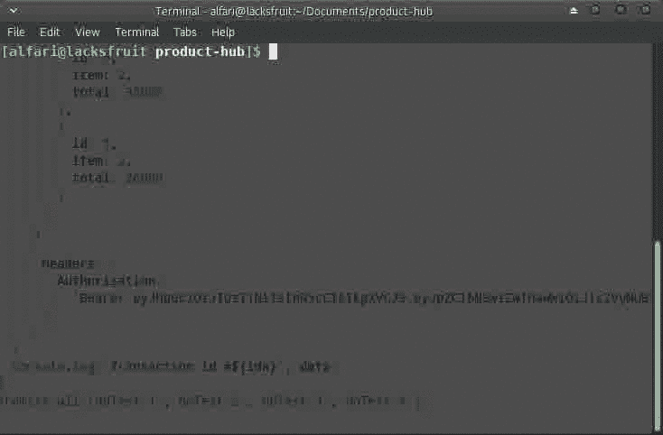
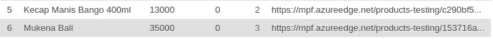
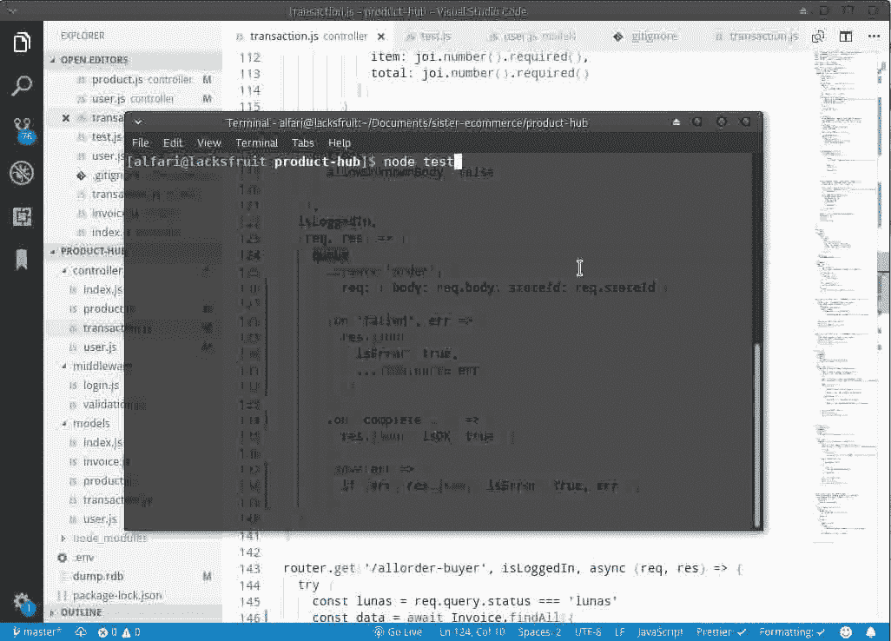

# Manajemen Queue untuk Menghandle Concurrent Request dengan Kue.js

> 原文：<https://medium.easyread.co/manajemen-queue-antrian-untuk-menghandle-concurrent-request-dengan-kue-di-node-js-94e87cc3eea6?source=collection_archive---------3----------------------->


Source Image from: javascripttuts.com

N ode.js adalah salah satu teknologi *server side* berbasis *javascript* yang bersifat *non-blocking* dan *asynchronous* . Hal tersebut berarti, setiap *request* yang diberikan dapat langsung dieksekusi tanpa harus menunggu *request* sebelumnya selesai dieksekusi. Lebih cepat dan responsif? Tentu. Tapi apakah semua *task* cocok dengan sifat ini? Jawabannya, tidak semua skenario proses cocok dengan sifat ini.

# P ercobaan Pertama

Mari kita melakukan eksperimen. Sebagai contoh, kita sedang membangun sebuah sistem *e-commerce* yang dapat melakukan transaksi pemesanan barang *.* Berikut data barang dalam database.


Dalam sistem ini, setiap transaksi pembelian kita harus mengurangi jumlah stok barang sesuai dengan jumlah item yang dipesan. Apabila stok habis atau tidak mencukupi jumlah item yang dipesan, maka pesanan tidak dapat dilanjutkan.

Berikut adalah kode *transaction-controller* untuk mengurangi jumlah stok.

Kemudian saya mensimulasikan sebuah tes untuk menjalankan transaksi pemesanan secara bersamaan. Berikut kode-nya.

Setelah menjalankan tes, beginilah hasilnya..



Dari hasil tes tersebut, kita mengetahui bahwa seluruh (empat) transaksi pemesanan berhasil dieksekusi. Padahal, produk dengan id 5 dan 6 hanya memiliki 2 stok barang yang tersisa.

Dan stok yang tersisa di database saat ini menjadi 0.



Dengan hasil eksperimen tersebut, kita memperoleh kesimpulan bahwa, jika kita menggunakan konsep *asynchronous* , apabila ada 2 atau lebih pengguna melakukan transaksi secara *concurrent* (bersamaan) dalam suatu waktu, maka sistem akan mengeksekusi seluruh *task* tersebut secara bersamaan. Hal ini menjadi tidak relevan, mengingat pada setiap transaksi pemesanan, kita harus melihat apakah stok barang yang dipesan masih tersedia (stok mencukupi) atau tidak.

# Lalu, bagaimana solusinya?

Solusinya adalah dengan menggunakan antrian (queue). Dimana *queue* memiliki konsep **FIRST-IN-FIRST-OUT** yang dapat memetakan pesanan yang dilakukan secara bersamaan ( *asynchronous* ) menjadi terurut dan bergiliran satu per satu ( *synchronous* ).

Ada banyak library yang dapat kita gunakan untuk menghandle queue. Seperti **Kafka, RabbitMQ, Bull, Kue** , dll. Namun, kali ini kita akan menggunakan **Kue** dan mengintegrasikannya ke dalam proyek *e-commerce* di atas.

## Langkah Pertama

Yang harus dilakukan adalah instalasi [redis](https://redis.io/) . Karena Kue membutuhkannya untuk melakukan *storing* *jobs* yang diberikan. Anda dapat langsung mengunduhnya [disini](https://redis.io/download) . Kemudian, melakukan instalasi module **Kue** itu sendiri dengan *command* **npm install** **— save kue** .

## Langkah Kedua

Mengintegrasikan **Kue** dengan *controller* transaksi kita.

```
//transaction.jsconst kue = require('kue');
const queue = kue.createQueue();
```

Kita harus mendefinisikan setiap request ke dalam sebuah *job* yang akan dimasukan ke dalam antrian dengan memanggil *object function* **.create()** .

```
const job = queue.create('order', { data });
```

Setiap *job* memiliki *events* yang dapat digunakan untuk melakukan *tracking­* dalam antrian. Kita menggunakan *object function* **.on()** untuk meregistrasikan *events* . Untuk melihat apa saja *events* yang dapat dipakai, anda dapat langsung mengunjungi [dokumentasi **Kue**](https://github.com/Automattic/kue) . Disini, kita hanya akan menggunakan event *failed* dan *complete* . Untuk mengetahui apakah sebuah *job* mengalami *error* atau sukses di eksekusi.

```
job.on('failed', err => { console.log(err) });job.on('complete', result => { console.log(result) });
```

J *ob* diakhiri dengan method **.save()** untuk memasukannya ke dalam antrian.

```
job.save();
```

Terakhir, kita harus mendefinisikan proses yang harus dijalankan ketika sebuah job masuk ke dalam *queue* (antrian).

```
queue.process('order', (job, done) => { /* doSomeTask(); */ done(); });
```

Berikut hasil akhir pengintegrasian **Kue** ke dalam *controller* .

# Percobaan Kedua

Mari kita uji lagi dengan melakukan *concurrent ordering test* sama seperti di atas, setelah kita mengintegrasikan kue dalam *project* *e-commerce* . NOTE: Saya telah menambah jumlah stok produk dengan id 5 dan 6 masing-masing 4 pcs.



Kali ini, tidak semua transaksi mengembalikan json **{ isOk: true }** . Hal ini terjadi karena setiap *request* dilakukan secara berurutan, satu per satu, tidak lagi bersamaan. Setiap *request* dimasukan ke dalam antrian, dan menunggu jika *request* sebelumnya belum selesai di eksekusi. Kemudian setiap *job* melakukan pengecekan, apakah stok barang masih tersedia. Jika tersedia, maka pesanan dapat dilanjutkan. Jika stok habis atau tidak mencukupi, maka akan mengembalikan pesan error.

Sekian sedikit penjelasan saya mengenai cara menghandle *concurrent task* dan solusi menggunakan antrian. Apabila ada kesalahan atau perlu penambahan, silakan isi kolom komentar.

Untuk *source code* lengkap *project* *e-commerce* diatas, anda dapat mengakses dan berkontribusi disini:

[](https://github.com/alfari16/microservices-ecommerce) [## alfari16/microservices-ecommerce

### An E-Commerce Platform that use microservices architecture - alfari16/microservices-ecommerce

github.com](https://github.com/alfari16/microservices-ecommerce) 

*Artikel ini di tulis oleh* [*Alif Irfan Anshory*](https://medium.com/u/6e41e9409c88?source=post_page-----94e87cc3eea6--------------------------------) *. Beliau sering menulis artikel mengenai Software Engineering. Follow profilnya untuk mendapatkan update-an terbaru artikel-artikel beliau.*

*Jika anda merasa artikel ini menarik dan bermanfaat, bagikan ke lingkaran pertemanan anda, agar mereka dapat membaca artikel ini.
Atau jika anda tertarik untuk membagikan cerita anda pada publikasi ini, anda boleh mengirimkan cerita anda ataupun mengikuti langkah-langkah yang ada* [***disini***](https://medium.com/easyread/about-easyread-74b20960e180) *.*