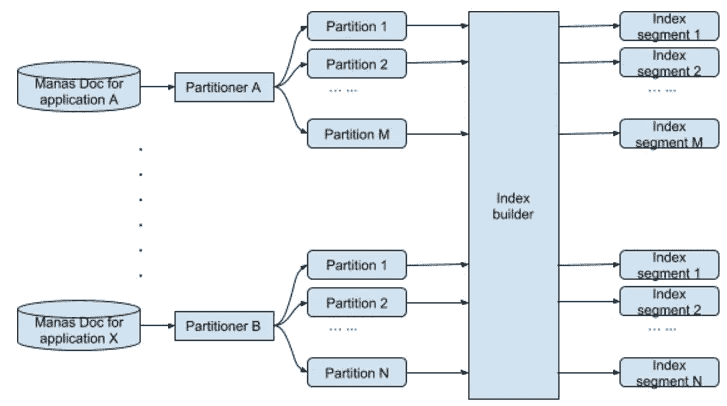
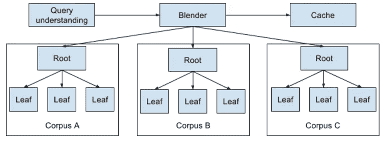
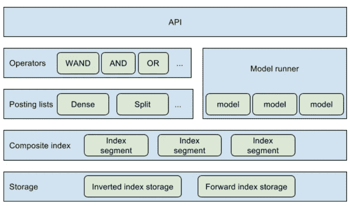
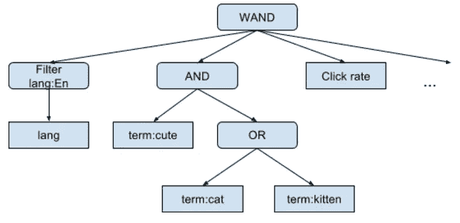

# Manas:一个高性能的定制搜索系统

> 原文：<https://medium.com/pinterest-engineering/manas-a-high-performing-customized-search-system-cf189f6ca40f?source=collection_archive---------1----------------------->

刘铮| Pinterest 搜索技术主管

Pinterest 搜索每月处理数十亿次查询，每天返回近 40 亿个 pin。在过去的一年里，每月的手机文本搜索增加了 40%，视觉搜索增加了近 60%。我们最近通过在 home feed 上发布应用程序，使[搜索和镜头](https://blog.pinterest.com/en/search-and-lens-move-front-and-center)更加突出和集中，因为现在近 85%的搜索发生在移动设备上。

为了继续扩展搜索，我们的系统需要在+1000 亿个引脚中为每个引脚找到最相关的结果。以前，我们的搜索系统是建立在 Lucene 之上，用 Java 编写的。但是，随着我们的发展和引入新的发现功能，我们的传统系统面临着挑战，无法再为我们提供支持。这就是为什么我们建立了 Manas，这是一个用 C++编写的定制的全栈搜索系统，它在增加容量的同时大大减少了延迟。在这篇文章中，我们将概述 Manas 的架构，并看看 Pinterest 搜索的下一步。

## **挑战**

随着 Pinterest 上搜索使用率的快速增长，我们基于 Lucene 的解决方案面临着越来越多的挑战，包括:

*   查询量和索引大小增长如此之快，以至于我们需要减少服务延迟并提高容量。
*   除了搜索，该系统还支持 Pinterest 中的多个用例，包括 Pinner 搜索、board 搜索、相关 pin、home feed 推荐等。我们需要定制搜索过程的灵活性，这在以前是不可能的。
*   我们希望将该系统应用于复杂而强大的排名模型，但是 Lucene 索引格式和 scorer 接口并不适合这些模型。
*   我们还想个性化搜索结果，这是标准 Lucene 系统所不支持的。
*   我们建造了 Manas 来解决这些挑战。Manas 是一个通用的搜索框架，具有高性能、高可用性和高可伸缩性。与旧系统相比，搜索后端延迟减少了一半，而容量增加了 30%。

## 概观

Manas 是一个全栈搜索索引和服务系统。服务系统包括几个阶段:查询理解、候选检索、轻量级评分、全面评分和混合。

## 索引

**指数格式** 玛纳斯指数包括反向指数和正向指数。

与普通的倒排索引一样，Manas 倒排索引存储了从术语到帖子列表的映射。每个过账记录内部文档 ID 和有效负载。为了优化索引大小和服务延迟，我们实现了密集发布列表和分割发布列表，这是两种基于所有文档中关键术语的分布来编码发布列表的方法。倒排索引用于候选生成和轻量级评分。

另一方面，Manas 的前向索引存储了从内部文档 ID 到实际文档的映射。为了优化数据局部性，前向索引支持列族，类似于 HFile。前向索引用于满分。

**Manas doc** 我们将 Manas doc 定义为不同应用程序的统一模式，以描述它们想要为每个文档索引什么数据。在 Manas doc 中，可以为检索指定匹配的术语，并且可以添加文档的属性以进行过滤和轻量级评分。例如，在按语言属性过滤结果后，系统可能只返回英语文档。

**索引构建器** 索引构建器获取一批 Manas 文档并构建一个索引。我们定义了统一的 Manas doc 模式，因此索引构建器可以为不同的用例所共享。

**索引管道**

上图说明了索引管道。

1.  不同的应用程序为它们的语料库生成 Manas 文档。
2.  Manas 文档被分成多个组。
3.  Index builder 将分区中的所有 Manas 文件转换为索引段。每个索引段都是完整索引的一小部分。

## 服务

下图说明了玛纳斯的搜寻生活。

当查询进入系统时，会发生以下情况:

1.  查询理解服务处理原始查询并生成执行计划。
2.  使用服务树来服务语料库。混合器将请求扇出到不同语料库的根，收集这些不同的结果并混合它们。我们将这些混合结果存储在缓存中用于分页。
3.  Root 是一个分散-聚集服务。它聚集叶子的结果并重新排序。
4.  叶通过加载由索引管道构建的索引段开始。它检索候选人，并做轻量级和全面评分。

## 树叶服务

Manas Leaf 是可扩展的，允许定制多个不同的应用程序。这是通过在索引中封装特定于应用程序的信息来实现的。可以嵌入特定于应用程序的评分逻辑，使得 Manas 在对文档评分时只执行应用程序执行的任务。

服务架构设计有多个层以及它们之间定义良好的接口，因此每一层都是可扩展的。叶节点的体系结构如下:

如上所述，存储层负责加载索引，并提供一种抽象，允许在给定标识符的情况下获得连续的大量二进制数据。该层允许我们轻松地更改索引的底层存储。在存储层之上，索引层解码二进制数据以建立索引，并提供读取索引的接口。发布列表层允许我们灵活地实现倒排索引。操作符层定义了实现查询操作符的接口，模型运行器定义了全面评分的模型接口。最后，API 层指定叶节点评估的查询格式。

## 候选人检索和轻量级评分

**WAND** 除了支持正常的“与”、“或”、“非”运算符，我们在 Leaf 中内置了“弱与”支持(基于此[论文](http://cis.poly.edu/westlab/papers/cntdstrb/p426-broder.pdf))。这允许我们快速跳过发布列表。

**Squery** 我们用 Squery 来表示一个树形格式的结构化查询。它描述了叶子如何从索引中检索候选项并对其进行轻量级评分。Leaf 理解 Squery 并在 index 上执行它。

上图是一个 Squery 请求 Leaf 检索只有英语的文档并匹配术语“可爱”和“猫”或“小猫”的例子。如果文档的点击率高，它会给出更高的分数。

**满分** 不同的应用使用不同的算法计算最终得分。为了使 Manas 通用，我们引入了前向索引，它是一个二进制 blob，可以是任何东西。实际上，前向索引是一个序列化的节俭对象。Manas 不解释前向索引，它将它注入到一个 DSL 模型中，并执行 DSL 模型来计算分数。DSL 是 Pinterest 使用的一种特定于领域的语言，用于定制从前向索引中提取特征，并选择一种机器学习模型来基于提取的特征计算分数。不同的应用程序可以创建不同的 DSL 模型，并指定应该注入哪个前向索引。

**SSD** 拥有相当大的前向索引来支持复杂的评分算法，总索引大小显著增加。为了支持未来更复杂的评分，我们将在指数中加入更多的信号。将所有索引加载到内存中是不可伸缩的，因此 Manas 只加载倒排索引用于候选检索和轻量级评分，并从 SSD 和本地缓存提供前向索引。

**索引交换** 周期性地，我们执行索引流水线来构建索引。一旦新索引准备好了，我们就从 AWS 分配新的实例来创建一个集群。我们将新索引部署到新创建的集群中。然后，blender 将流量切换到新的集群，旧的集群将被弃用。

## 下一步是什么

我们刚刚推出了 Manas 作为 Pinterest 搜索的支柱。它还支持基于嵌入的搜索和广告。这仅仅是开始，还会有更多的用例出现。与此同时，我们仍在通过正在进行的项目改进该系统，如原地索引交换、增量索引、实时索引更新和定制的重新排名。如果你热衷于建立一个世界级的搜索系统，[加入我们的团队](https://careers.pinterest.com/careers)！

*鸣谢:Pinterest 的许多工程师共同构建了 Manas，包括、、张、、Charlie Luo、胡承成、Lance Riedel、Mukund Narasimhan、Jan Gelin、洪家成、何金如、Keita Fuiji、Randall Keller、Roger Wang、Sonja Knoll、Tim Koh、Vanja Josifovski、Vitaliy、、Fu、Wenchang Hu、孙、、吴永生和赵铮。*