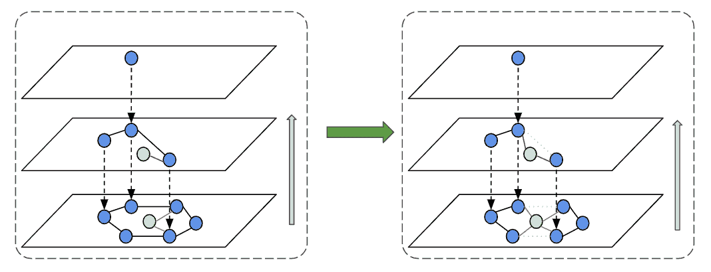

# Manas HNSW 实时:支持基于嵌入的实时检索

> 原文：<https://medium.com/pinterest-engineering/manas-hnsw-realtime-powering-realtime-embedding-based-retrieval-dc71dfd6afdd?source=collection_archive---------1----------------------->

Tim Koh |软件工程师，核心产品服务基础架构
吴仲强|软件工程师，核心产品服务基础架构
Michael Mi |技术主管，核心产品服务基础架构

在我们之前的[博客文章](/pinterest-engineering/manas-a-high-performing-customized-search-system-cf189f6ca40f)中，我们介绍了我们的内部搜索引擎——Manas——并分享了我们如何大规模提供基于术语的搜索。自推出以来，Manas 已经发展成为 Pinterest 的主要候选生成器之一，服务于许多超出其最初目的的用例。

特别是，基于嵌入的检索是 Pinterest 的发现和推荐引擎的关键组成部分。Manas 传统上支持通过基于倒排索引的位置敏感散列(LSH)的近似最近邻(ANN)搜索，这是基于搜索引擎的自然扩展。在发布了像[分层可导航小世界图(HNSW)](https://arxiv.org/abs/1603.09320) 这样的最新技术后，我们在 Manas 中建立了一个灵活的基于嵌入的检索框架，这使我们可以轻松地采用新的人工神经网络技术。我们使用新框架将 HNSW 应用于我们的批量索引集群(索引延迟从几分钟到几天不等),与 LSH 相比，在服务成本和延迟减少方面节省了大量成本。

我们计划中的下一个里程碑是将 HNSW 发布到我们的实时流集群(秒级索引延迟)。大规模实时服务 HNSW 并不是一项简单的任务，部分原因是我们正在开拓新的领域，而不能依赖任何开源实现。

在这篇博客中，我们将分享我们实时服务 HNSW 的旅程——我们解决这个问题的方法，我们面临的挑战，以及我们为生产该系统所做的一些优化。

# 玛纳斯实时报

该项目的本质是为 HNSW 构建实时组件，并将它们集成到 Manas Realtime 中。为了更好地理解这些组件如何融入更大的画面，让我们简要地看一下 Manas Realtime 的高层架构。

Manas Realtime 本质上是一个 [LSM](https://en.wikipedia.org/wiki/Log-structured_merge-tree) 引擎，它将随机 IO 写入转换为顺序 IO 写入。不是公开写端点，而是从 Kafka 中摄取写，允许我们简化系统并依赖 Kafka 作为 WAL。有三种类型的写入，下面是它们的处理方式:

1.  新文档被写入内存实时段，最终被密封并刷新到磁盘上的静态段
2.  删除使用内存中的标记应用，并在服务期间过滤掉
3.  通过删除旧文档并添加新文档来完成更新

后台压缩过程偶尔会组合各种静态段，以减少拥有过多段的服务开销。我们还依赖压缩过程通过从索引中删除文档来执行实际的删除。

从服务的角度来看，Manas Realtime 与 Manas Static 没有太大的不同。我们对索引进行了抽象，因此存储层对整个检索过程是透明的。因此，随着 HNSW 已经为 Manas Static 发布，大多数服务组件已经存在。我们的工作主要是与 Manas 实时 LSM 索引组件集成。我们需要构建和优化两个核心组件，我们将在下面的小节中详细讨论:

1.  实时 HNSW 图
2.  HNSW 图形压缩

## 实时 HNSW 图

实时段是系统中唯一可变的组件，因此这方面的优化对于确保良好的并发读写性能至关重要。

HNSW 索引本质上是一个多层稀疏图。我们选择了一个邻接表来表示这个图，其中的键是节点 id，值是邻居 id 列表。我们从基于锁的版本开始，每个节点拥有一个锁，在更新邻居列表之前，这个锁由读取器和写入器持有。它很容易实现和推理。然而，由于锁争用，高系统 CPU 使用率使我们别无选择，只能使用[无锁](https://en.wikipedia.org/wiki/Non-blocking_algorithm)技术。

## 无锁实现

让我们剖析一下我们如何以直观的方式处理写操作。HNSW 的想法源于众所周知的[跳表](https://en.wikipedia.org/wiki/Skip_list)结构。因此，HNSW 的无锁实现也类似于无锁跳转列表。一般来说，为了向图中添加新节点，每一层都涉及两个步骤，如下图所示。

1.  在图层中查找新节点的邻居，并将新节点连接到所选邻居
2.  更新所选邻居以连接到新节点。

同样，我们在 HNSW 图中从基础层到上层添加新节点，以避免新节点被选为上层中的入口点，但在下层中实际上没有为其建立连接，从而导致没有结果问题。

对于删除，我们避免了将它们应用到图中的成本和复杂性。相反，我们用内存中的删除标记在图外处理它们，依靠过滤器在服务期间过滤掉删除的节点。

一些详细的优化值得简单提一下:

*   **单写多读:**为了简单起见，我们延续了使用单写多读并发模式的传统，使得代码简洁且易于推理。
*   **预分配图形:**由于实时图形通常很小，大小固定，我们为图形预分配内存，以避免调整大小带来的复杂性。
*   **定制邻居选择算法:**利用标准邻居选择算法，对于更新邻居列表，有三种可能性:添加一个新邻居、减少邻居和替换一个邻居。当谈到无锁实现时，通过回填最近邻居来消除“减少邻居”的情况实际上简化了逻辑，使我们能够只使用原子运算符。
*   **`原子'变量:** c++ std::原子变量实际上是昂贵的，即使使用发布-获取排序。相反，我们使用对齐内存来保证原子性，并使用一个全局原子变量作为内存屏障，使我们能够只显式地提交一个节点的所有更改一次。仍然有可能一些部分更新泄漏到读取线程，在短时间内损害全局连接。由于观察到没有明显的召回率下降，我们将其视为性能和质量之间的合理权衡。

# HNSW 图形压缩

我们需要解决的主要压实问题是压实速度。如前所述，压缩是我们减少同时服务的数据段总数的方法。在最好的情况下，较长的压缩时间会导致较高的 CPU 使用率；最坏的情况是，系统停止接收，导致新的更新没有被反映和提供。

## 全新的合并

我们对 hnsw 的压缩算法的第一次尝试是我们称之为干净的石板；本质上，该算法从所有输入段的未删除嵌入中构建一个全新的图。这个方法对于我们的一些用例来说太慢了，所以我们需要优化算法。

## 附加合并

我们的下一个策略是尽可能多地重用索引；我们从所有要压缩的段中选择最大的段，并将索引转换成我们可以重用的内存结构。然后，来自其他片段的剩余嵌入被添加到重用的图上。

剩下的问题是如何处理从重用片段中删除的嵌入。我们尝试了两种不同的方法:1)持续删除和重新选择邻居，以及 2)将删除的嵌入与附近的活嵌入分组。虽然这两个选项都适合客户端，但是第一个选项在某些场景中太慢了。

## 持续删除

我们需要维护图的小世界属性，简单地删除已删除的节点和它们的入/出边可能会破坏图中的连通性。为了解决这个问题，我们使用一个称为邻居重选的过程，其中节点可能连接到已删除节点的邻居以保持连接。

我们发现，如果有大量被删除的节点，压缩时间实际上会比 clean slate 算法慢，这并不理想。

## 将已删除的节点与其最近的活动节点分组

有两个原因可以解释为什么持久化删除比使用清除算法要慢。

*   我们在重复使用的段中回填节点及其邻居之间的距离，导致大量昂贵的距离计算。
*   邻居重选过程可能非常昂贵，尤其是如果删除了许多节点。这是因为如果被删除节点的邻居也被删除，则需要更多的重选迭代。

我们的第二个优化是将删除的节点与附近的活动节点分组，从而避免昂贵的重选过程。原来的图和以前一样，但是现在多个节点映射到同一个嵌入。因为图没有改变，所以保持了连通性。此外，我们延迟计算节点与其邻居之间的距离，而不是主动回填它们，从而避免了不必要的距离计算。我们还需要在算法中添加一个去重复步骤，因为多个节点可以对应于同一个嵌入。

# 在线召回监控

到目前为止，我们一直关注如何构建和优化系统中的组件。但是生产一个系统还有一个非常重要的方面——质量验证。对于 HNSW，召回率是我们用来验证索引质量的指标。它是通过将近似最近邻(ANN)搜索的结果与精确最近邻(KNN)搜索返回的理想结果进行比较来计算的。

监控召回也是特别重要的，因为一些优化可能涉及到更好的系统性能的质量折衷。我们需要跟踪这些质量下降，以确保我们仍然为我们的客户提供良好的结果。

有了一组不可变的嵌入，计算给定查询的召回率就相对容易了。我们可以使用离线批处理作业预先计算 KNN，并通过生成索引和向其发出查询来计算 ANN。由于嵌入集是恒定的，KNN 结果永远不会改变，我们可以调整索引构建参数来优化召回。

然而，在实时场景中，嵌入被不断地添加和删除，使得预先计算的 KNN 集不可用。为了解决这个问题，我们开发了一个在线召回工具；我们在服务集群中添加了计算人工神经网络和 KNN 结果的功能，这使我们能够计算给定时间点的召回率。

# 下一步是什么

对我们来说，在批量索引集群上启动 HNSW，并通过实现 HNSW 的实时服务来拓展我们的能力，这是一段激动人心的旅程。但是 HNSW 只是我们基于嵌入的检索系统的第一步。

## 效率和实验

我们已经建立了一个系统，为生产基于嵌入的检索做繁重的工作，允许我们的 ML 工程师尝试新的嵌入或新的算法，而不必从头开始建立一个新的生产系统。我们将继续对系统进行迭代，改善服务性能、漏斗效率和简化实验。

## 流式过滤

当前的过滤方法是从 HNSW 图中预取 K 个 ann，然后应用过滤器来获得我们的最终候选集。这不是非常有效的漏斗，并且很难计算出 K 的值会给我们提供我们需要的最终候选人的数量。我们计划以流式方式实现 HNSW 算法，其中可以在提取期间应用过滤器，并且流式提取仅在我们已经检索到我们需要的候选数量时终止。

敬请期待！

*鸣谢:作者感谢以下人员的贡献:、Roger Wang、谢海滨、盛诚、Fu、、Pihui Wei、Pong Eksombatchai、Andrew Zhai、和 Vijai Mohan。*