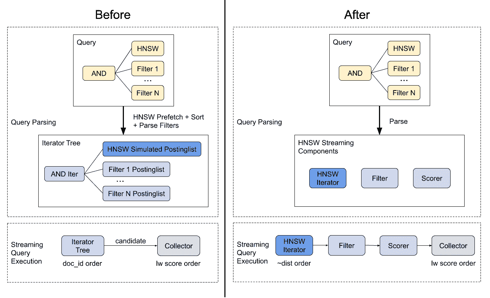
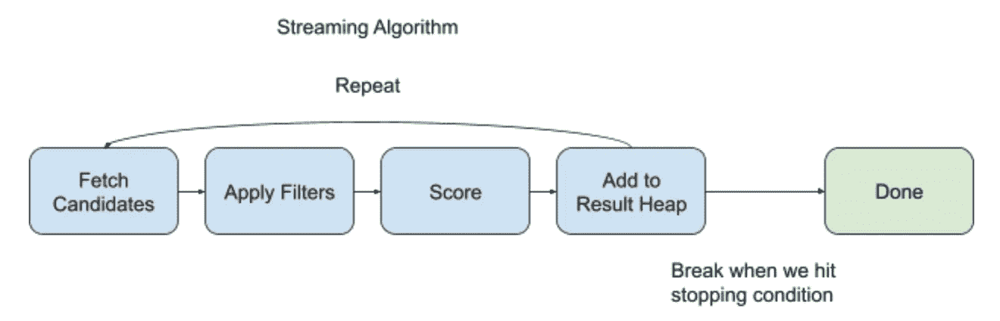

# Manas HNSW 流过滤器

> 原文：<https://medium.com/pinterest-engineering/manas-hnsw-streaming-filters-351adf9ac1c4?source=collection_archive---------1----------------------->

Tim Koh |软件工程师，核心产品服务基础架构；吴仲强|(前)软件工程师，核心产品服务于 Infra

# 介绍

基于嵌入的检索是我们 Pinterest 推荐引擎的核心部分。我们支持无数的用例，从基于内容相似性的检索到学习检索。它由我们的内部搜索引擎 [Manas](/pinterest-engineering/manas-a-high-performing-customized-search-system-cf189f6ca40f) 驱动，该引擎提供近似最近邻(ANN)搜索服务，主要使用[分层可导航小世界图(HNSW)](https://arxiv.org/abs/1603.09320) 。

传统的基于标记的搜索检索文档是基于在具有逻辑连接词(如 and 和 or)的术语树上的术语匹配，而人工神经网络搜索是基于嵌入相似性进行检索的。我们经常想做一个混合搜索查询，将两者结合起来。例如，“找到这双鞋的类似产品，价格低于 100 美元，评级为 4 星或以上，并运送到英国。”这是一个常见的问题，并没有完全解决，但是每个解决方案都有自己的注意事项和权衡。

# 现有解决方案

## 后置过滤

我们以前的方法是后过滤，本质上是先执行人工神经网络搜索，然后是限制在结果集内的基于标记的搜索。后置过滤受到漏斗效率的影响，我们使用过度蚀刻来解决这个问题。然而，这是不可扩展的，因为客户端需要不断地调整它们的过度提取，并且每个请求可以有不同的过滤速率。

## 预过滤

另一种方法是预过滤。首先，我们在索引期间或者通过首先评估令牌搜索查询，找出匹配基于令牌的过滤器的文档集。然后我们执行人工神经网络搜索，同时过滤掉这个集合中不存在的文档。然而，索引时间方法很难推广到任意树过滤器；对令牌搜索查询进行预先评估对于一组简单的过滤器或一小部分文档来说可能很有效，但是我们有不属于这两类的用例。即使是没有人工神经网络的传统搜索，由于提前终止，也经常只搜索我们大型语料库的很小一部分。

## 我们的解决方案

每种方法都有其优点，根据不同的场景，它们甚至可能是解决问题的最理想的方法。我们是一个通用平台，为 Pinterest 上的无数用例提供服务，每个用例都有不同的语料库大小、查询复杂性和过滤条件。因此，我们选择了一种通用的方法，在 HNSW 图遍历期间以流的方式应用过滤器。我们对用例不做任何假设，同时仍然提供一种在此框架上构建并根据需要应用优化的方法(例如，预评估可以作为预处理步骤添加到构建过滤器中)。

# 概观

上图总结了在流改变之前和之后，在我们的系统中如何处理 ANN 查询。有几点值得注意:

1.  HNSW 从查询解析阶段的批量预取变为查询执行阶段的流预取。
2.  查询执行从按 doc_id 顺序检索文档变为按近似距离顺序检索文档。这是一个需要解决的问题，因为作为一个搜索引擎，我们的索引格式针对 doc_id 顺序进行了优化。
3.  查询结构保持不变，提供了向后兼容性和无缝迁移。
4.  轻量级评分已经与在迭代器树中执行解耦。这对于 HNSW 流来说并不重要，但是这与我们从基于树的线性组合方法中推广评分的方向一致。

还有一些原则影响了我们的设计，大声说出来可能会有帮助:

1.  模块化:人工神经网络的检索、过滤和评分都应该相互分离。
2.  最小的变化:通过尽可能多地重用现有组件来快速构建和启动，并根据需要在以后进行优化。
3.  向后兼容性:客户端应该能够对其请求进行最小的修改。
4.  向前兼容:接口应该是通用的，每个组件(例如过滤器索引格式)应该很容易升级。

希望这一节给出了系统组件的一个很好的高层次的概述，以及为什么我们以这种方式构造东西。为了更深入地了解一切是如何工作的，我们需要打开两个黑盒 1)流算法，2)过滤器是如何工作的。让我们开始吧！

# 流式算法

流式算法实际上在高层次上非常简单:我们获取一些候选项，应用我们的过滤器，评分，将候选项添加到结果堆中，然后重复。下图从较高的层面展示了这一点。

以下是我们在实施过程中考虑的一些事情:

1.  最初，我们设计的流过程是一次检索一个候选项，但是我们很快意识到往返提取/过滤/评分效率不高，所以我们改用小批量。然后我们需要决定使用什么样的小批量。HNSW 实际上存储了每个节点的邻居列表，所以我们使用邻居列表作为小批量。
2.  为了继续流，我们需要存储来自内部 HNSW 算法的一些状态。因为我们使用邻居列表作为小批量，所以我们只存储我们已经处理过的候选项(已访问列表)和我们仍然需要处理的候选项(候选项集)。
3.  最后，我们必须弄清楚什么时候停止流搜索。这应该有它自己的一节，我们将在下面讨论。

# 停止条件

## HNSW 停止条件

退一步说，如果我们看原始的 HNSW 论文，当我们检索到足够多的候选项时，算法并没有终止；相反，当我们积累的候选人都比我们的候选人集中最接近的候选人更接近时，它就终止了。这背后的主要直觉是确保算法以高概率检索最佳(最接近)候选。我们在流搜索中应用了相同的概念，主要区别在于我们只对过滤后的候选人进行操作。

## 时间预算

在高过滤速率的情况下，我们可能会遍历整个图，但仍然找不到足够的候选对象，从而导致极高的延迟。由于大多数客户端都有延迟要求，我们使用时间预算来限制流搜索所用的时间。一旦我们达到预算，我们将返回我们已经积累的候选人。

# 过滤

我们设计过滤的方式受到上面列出的几个原则的很大影响:模块化和向前兼容。实现过滤的最简单方法是将代码直接添加到 HNSW 代码中。事实上，对于开源 HNSW 代码中的删除标记，已经做到了这一点。然而，这破坏了模块性，对于过滤器代码的可维护性和向前兼容性来说并不理想。这对我们来说尤其重要，因为我们为许多有不同过滤器要求的客户服务。

我们将接口设计为不采用任何底层过滤器结构或存储格式。我们实现了对主要用例的支持，在这种情况下，客户端可以在请求中指定任意的过滤树，用合取和析取连接词表示。

本着最小改动的精神，我们重用了倒排索引作为过滤器存储。所以本质上我们有一个过滤树，由叶子上的后置列表支持，在结构上非常类似于我们在基于令牌的搜索中使用的迭代器树。这便于重用，但效率较低，因为倒排索引针对 doc_id 有序迭代进行了优化，但 HNSW 流需要无序的逐点查找。我们通过使用位图和数组支持的后混合列表而不是 skiplist 支持的后混合列表来解决这个问题，用内存效率换取计算效率。这确实引入了一个明显的可伸缩性挑战:对于大量的过滤器，我们根本负担不起内存成本，但这不是我们近期需要解决的主要问题。我们有未来的工作计划来升级过滤器商店。

# 最佳化

## 如果我们已经有足够多的候选人，就放弃他们

在我们的一些客户端用例中，过滤器树非常复杂，导致过滤器阶段占用了最多的延迟。一个优化是当结果堆已满时，跳过距离比结果堆差的候选项，以避免过滤掉我们无论如何都不会选择的候选项。

## 用批处理初始化

我们不是从头开始流式处理，而是首先检索一个与客户想要的候选数相等的批量，因为我们最初至少需要检索那么多。

## 重新排序过滤器树节点

由于流式处理执行无序的逐点查找，因此过滤器树节点的排序变得很重要，因为首先评估最严格的过滤器会更有效。

# 未来的工作

## 用子图流式传输

上面要注意的关键点是，当前的流式方法实际上并没有减少检索所需的候选项的数量，它只是为每个请求自动计算出适当的过度提取。每个过滤的候选仍然是一个浪费的距离计算。

我们目前正在尝试用更大的过滤器将空间划分成单独的子图，例如我们或非我们。这对于我们有几个大过滤器的用例来说很好。一个更具可伸缩性的扩展是用过滤器给图加标签，并允许遍历标签的析取或合取。

## 高效过滤器存储

使用倒排索引作为过滤器存储在某些场景下工作得很好，但是它实际上是针对传统搜索而不是针对图遍历过滤进行优化的。我们可以从头开始设计一个针对基于图形的过滤进行优化的过滤器库，并与其他基于图形的检索系统共享，如 [Pixie](/pinterest-engineering/an-update-on-pixie-pinterests-recommendation-system-6f273f737e1b) 。

## 量化

非常高的过滤场景可以用蛮力解决，但是仍然有一系列情况具有非常高的过滤速率，但是用蛮力会很昂贵。这些情况的瓶颈是大量浪费的距离计算。量化可以大大降低这一成本。我们可以转向不同的算法，比如 PQ IVF，或者用 HNSW 引入 PQ。

# 结论

我们已经实现了流过滤，它抽象出了过滤如何执行的实现细节，并减轻了客户端过度调整的负担。从系统的角度来看，我们有一个通用的过滤器解决方案，它足够灵活，可以支持我们所有的使用案例，并可以支持未来的优化，如预过滤和过滤器存储升级。我们已经看到，仅仅通过消除不精确的过度提取调整，就可以节省大量成本并提高质量，并且我们还了解到了许多未来优化的机会。

敬请期待！

*鸣谢:作者感谢以下人员做出的贡献:Ahmed Thabet、Apoorv Sharma、Hari Venkatesan、谢海滨、、Michael Mi、Pak Ming Cheung、Peifeng Yin、Pihui Wei、Roger Wang、Sheng Cheng、Ge、Van Lam、、*

*要在 Pinterest 了解更多工程知识，请查看我们的* [*工程博客*](https://medium.com/pinterest-engineering) *，并访问我们的*[*Pinterest Labs*](https://www.pinterestlabs.com/?utm_source=medium&utm_medium=blog-article-link&utm_campaign=wu-kohn-may-5-2022)*网站。要查看和申请空缺职位，请访问我们的* [*招聘*](https://www.pinterestcareers.com/?utm_source=medium&utm_medium=blog-article-link&utm_campaign=wu-kohn-may-5-2022) *页面*