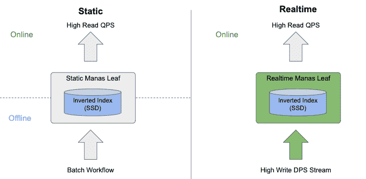

# Manas Realtime —能够在一瞬间搜索到变更

> 原文：<https://medium.com/pinterest-engineering/manas-realtime-enabling-changes-to-be-searchable-in-a-blink-of-an-eye-36acc3506843?source=collection_archive---------0----------------------->

Michael Mi |技术主管，核心产品服务于基础设施

Pinterest 的内部搜索引擎 Manas 是一个通用的信息检索平台。正如我们在[上一篇文章](/pinterest-engineering/manas-a-high-performing-customized-search-system-cf189f6ca40f)中所讨论的，Manas 被设计成一个具有高性能、可用性和可伸缩性的搜索框架。今天，Manas 为 Pinterest 的大多数产品提供搜索功能，包括广告、搜索、Homefeed、相关 pin、视觉和购物。

搜索系统的一个关键指标是索引延迟，即更新搜索索引以反映变化所需的时间。随着我们不断增加系统功能和新用例的出现，即时索引新文档的能力变得越来越重要。Manas 已经支持增量索引，它能够在几十分钟内提供索引延迟。不幸的是，这无法满足我们不断增长的广告和后续订阅源业务需求。我们决定在 Manas 中构建一个新的模块，进一步将索引延迟减少到几分之一秒。

在这篇博文中，我们描述了该系统的架构及其关键挑战，并提供了我们所做权衡的细节。

# 挑战

新的要求伴随着新的挑战。以下是我们面临的几个主要挑战。

## 索引潜伏期

小批量方法，也称为近实时，是开源项目最受欢迎的选择，如 [Lucene](https://lucene.apache.org/) 、 [Vespa](https://vespa.ai/) 等。使用这种方法，在调用 index commit 之前，新编写的文档是不可搜索的。因此，您需要在索引延迟和吞吐量之间进行权衡。不幸的是，我们不能利用这种方法将索引延迟减少到秒级。

## 索引刷新能力

实时服务的缺点之一是缺乏索引刷新的灵活性。对于批处理管道，重新运行索引作业来一次选取所有的模式更改是微不足道的。然而，当涉及到实时服务管道时，有效的索引刷新支持就变得复杂了。

## 不断变化的数据的纵向扩展

为了避免过度配置，使用了自动扩展来根据实际查询负载调整副本。如果索引是不可变的，那么创建新的副本就相对容易了:只需要将索引复制到新的节点上，就大功告成了。所有的困难都在于处理不断变化的索引:如何确保所有副本最终都有相同的索引？

## 错误校正

Manas 是一种数据密集型服务，其中每台主机可以提供高达数百 GB 的索引。Manas 也是有状态系统；一个坏的二进制文件可能会引入回滚无法修复的数据问题。我们需要构建一个支持容错和错误恢复的系统，以便能够从二进制错误和数据损坏中恢复。

# 从静态走向实时

让我们简单看一下传统静态服务和实时服务之间的区别。如上图所示，实时服务的主要工作是将索引管道从离线转移到在线。

对于静态服务，索引是通过批处理工作流离线生成的，然后被复制到 leaf 进行在线服务。对于批处理工作流，由于较高的框架开销，几乎不可能在几分之一秒内构建一个可服务的索引。对于实时服务，所有写入都在服务中动态处理，而不是使用离线工作流。此外，实时索引管道处理写入的方式可以生成与静态索引管道相同的索引格式，从而允许我们重用整个索引读取逻辑。记住这一点，让我们继续了解实时服务是如何工作的。

## 索引接口

不直接使用 [RPC](https://en.wikipedia.org/wiki/Remote_procedure_call) ，[， **Kafka** ，](https://kafka.apache.org/)作为我们的高写吞吐量流。叶服务器不断拉取突变来构建增量索引。事实证明，这个决定从多方面极大地简化了我们的系统:

*   Kafka 会处理数据复制和写入故障。
*   有了回寻能力，卡夫卡队列还可以充当[墙](https://en.wikipedia.org/wiki/Write-ahead_logging)。
*   由于每个分区都有严格的排序保证，系统可以盲目地应用删除，而无需担心正确性。

# 架构概述

因为服务逻辑可以通过共享索引格式重用，所以我们将重点放在索引数据流上。

从本质上讲，realtime Manas leaf 是一个 [LSM](https://en.wikipedia.org/wiki/Log-structured_merge-tree) 引擎，它将随机 io 写入转换为顺序 io，并为读取放大和写入放大应用提供高效服务。如下所示，整个索引过程包括三个关键步骤。让我们逐一讨论。

## 实时分段构建

除了现有的静态段，我们还引入了实时段。如上所示，系统中有两种类型的实时段:活动实时段和密封实时段。

*   活动实时段**，**唯一可变的组件，用于累积从 Kafka 提取的突变(添加/删除)。值得指出的是，在将文档添加到实时片段之后，在文档级提交之后，它会立即变得可搜索。
*   一旦活动实时段达到可配置的阈值，它就会被密封，变得不可变，并被放入刷新队列。同时，创建一个新的活动实时段来继续累积突变。

在服务重启的情况下，可以通过重放来自 Kafka 的消息来重建实时段。

## 索引刷新

索引刷新是将实时段中的内存数据保存到紧凑索引文件中的过程。当实时段被密封时，会自动触发刷新，也可以使用 debug 命令手动触发刷新。

索引刷新是一个有益的操作符，它可以保证数据的持久性，这样我们就不需要在重启时从头开始重建内存段。此外，刷新减少了段的内存占用，并通过紧凑的不可变索引提高了服务效率。

## 索引压缩

随着时间的推移，多个生成的小段会损害服务性能。为了克服这个问题，我们引入了一个后台压缩线程来将小片段合并成大片段。因为删除操作符只是将文档标记为已删除，而不是物理地删除它们，所以压缩线程也保存这些已删除/过期的文档。

在每个刷新和压缩操作之后，将生成一个包含所有静态段的新索引清单。用作检查点的卡夫卡偏移量也被添加到每个清单中。基于检查点，服务知道在重启后在哪里使用消息。

# 详细设计

在本节中，我们将更详细地介绍几个关键领域。让我们从最有趣的部分开始，并发模型。

## 并发模型

如前所述，实时段是我们需要同时处理读和写的唯一可变组件。不幸的是，开源项目采用的接近实时的方法不能满足我们的业务需求。相反，我们选择了一种不同的方法，使我们能够在添加到索引后立即提交文档，而无需等待索引刷新。为了提高性能，我们采用了一种[无锁](https://en.wikipedia.org/wiki/Non-blocking_algorithm)技术来构建适合我们使用的数据结构。现在让我们打开盒子！

**实时片段**

每个实时段由一个倒排索引和一个正排索引组成。倒排索引在逻辑上是从术语到发布列表的映射，发布列表是用于检索的文档 id 列表。同时，前向索引存储用于完全评分和数据提取的任意二进制 blob。让我们只关注实时倒排索引部分，与前向索引相比，它更有趣也更有挑战性。

在高层次上，实时段和静态段之间的主要区别是可变性。对于实时倒排索引，从术语到发布列表的映射需要是并发的。像 folly 的并发 hashmap 这样的开源软件很好地支持了这一点。我们更关心的是发布列表的内部表示，它可以有效地支持我们的并发模型。

**仅附加向量**

通常情况下，使用单编写器、多读取器的模型更有效、更容易。我们选择了一个与 [HDFS](https://hadoop.apache.org/docs/r1.2.1/hdfs_design.html) 相似的数据模型，它有一个只附加的无锁数据结构。让我们仔细看看读者和作者是如何相互交流的。

*   Writer 将文档 id 附加到 vector 中，然后提交 size 以使读者可以访问它
*   读取器在访问数据之前拍摄快照，直到达到提交的大小

为了避免随着发布列表的增长而产生的内存复制开销，我们在内部将数据作为一个存储桶列表来管理。当容量用完时，我们只需要添加一个新的存储桶，而不需要接触旧的存储桶。此外，通常搜索引擎使用跳转列表来加速跳转操作。由于这种格式，支持单级跳转列表很方便，这对于实时倒排索引来说足够好了，因为它的大小通常很小。

**文档原子性**

现在有了一个只附加的向量，我们能够实现单个发布列表的原子性。然而，一个文档可以包含一个术语列表，我们最终可能会返回带有部分更新索引的意外文档。为了解决这个潜在的问题，我们引入了文档级提交来保证文档的原子性。在服务管道中，使用额外的过滤器来确保只返回提交的文档。

说到文档原子性，文档更新是这里值得一提的另一个场景。对于每次文档更新，我们有意将其转换为两个操作符:添加新文档，然后从索引中删除旧文档。虽然每个操作符都是原子性的，但合在一起我们无法保证原子性。我们认为在很短的时间内返回旧版本或新版本是可以的，但尽管如此，我们还是在服务管道中添加了重复数据删除逻辑，以便在两个版本都返回时过滤掉旧版本。

**写缩放**

一个自然出现的问题是，如果您的数据结构只支持单写多读并发模型，那么如果单个线程不能及时处理所有的写操作呢？仅仅为了扩大写入吞吐量而盲目添加更多碎片似乎不是一个好主意。虽然这是一个合理的考虑，但在我们的设计中已经考虑到了。

用于数据结构的单写多读并发模型并不意味着我们不能使用多线程进行写操作。我们计划使用术语分片策略来支持多线程写入。如上图所示，对于一个带有术语列表的给定文档，每个术语总是被映射到固定线程，这样所有为单写和多读定制的数据结构都可以直接重用，没有任何限制。

# 索引刷新

索引刷新能力是我们产品的一个关键特性，能够快速周转并提高开发速度。通常，有两种方法可以用来高效地刷新索引，分别是动态回填和从离线构建的索引中恢复。

**回填指数**

我们能够以合理的吞吐量回填文档。为了避免影响生产的新鲜度，我们需要一个单独的流用于较低优先级的回填流量。因此，文档的两个版本可能同时出现在两个流中，并且旧版本覆盖了新版本。为了克服这一点，我们需要在实时索引管道中引入一个版本控制机制和一个冲突解决器来决定哪一个更新。

**从离线构建的索引中恢复**

有时，以给定的速度回填完整数据集会非常耗时。我们支持的另一种更快的索引刷新方法是离线构建索引，然后通过离线构建的索引和 Kafka 流之间的同步机制恢复索引。

# 故障转移和自动扩展

出于各种原因，我们不时需要提出新的实例，比如故障转移和自动伸缩等。对于静态服务，很容易用从索引存储下载的不可变索引来启动一个新实例。然而，对于具有不断变化的索引的实时服务来说，这变得复杂。我们如何确保新实例最终拥有与其他实例相同的索引副本？

我们决定使用基于领导者的复制，如上图所示。我们的流程如下所示:

1.  领导者定期拍摄新的快照，并将其上传到持久索引存储
2.  默认情况下，新实例从索引存储中下载最新的快照
3.  新实例根据快照索引中的检查点继续使用 Kafka 中的消息
4.  新的实例一旦赶上就开始服务流量

设计中有一些关键点值得指出:

**领袖选举**

领导者的唯一职责是定期拍摄快照和上传索引。这意味着我们可以在短时间内，甚至几个小时内，没有领导者，或者有多个领导者。因此，我们在选择领导者选举算法时具有一定的灵活性。为了简单起见，我们选择使用我们的集群维护作业静态地选择一个领导者，在这里我们定期检查我们是否有一个好的领导者。

**快照上传**

通常，新实例只是连接到领导者以下载最新的快照。在这种方法中，从新实例下载快照可能会使领导者过载，导致级联故障。相反，我们选择定期将快照上传到索引存储，用空间和新鲜度换取稳定性。此外，上传的快照对于错误恢复也很有用，这一点将在稍后介绍。

# 错误校正

如上所述，错误恢复是实时服务系统的另一个挑战。我们需要处理一些涉及数据损坏的特定场景。

**输入数据损坏**

我们使用卡夫卡作为我们的输入写流；不幸的是，这些消息是不可变的，因为生产者只能将消息附加到其中，而不能改变现有消息的内容。这意味着一旦数据损坏被引入 Kafka 消息，它将是永久的。感谢上传的快照，我们能够将索引回滚到没有损坏的点，跳过损坏的消息，然后使用修复的新消息。

**二进制错误导致数据损坏**

尽管我们有一个成熟的静态集群索引验证管道来保证在换入新版本之前新的索引和新的二进制文件没有问题，但是仍然有可能出现一些错误。幸运的是，我们可以通过回滚二进制文件或索引来解决这个问题。在回滚二进制文件不能回滚索引中的错误的情况下，实时服务变得更加困难。使用我们的快照上传机制，我们能够回滚二进制文件和倒带索引，然后重放来自 Kafka 的消息以修复索引中的错误。

# 下一步是什么

随着越来越多的场景加入到 Manas 中，我们需要不断提高系统的效率、可伸缩性和能力。我们路线图中一些有趣的项目如下:

*   托管静态和实时集群以简化我们的服务堆栈
*   优化系统以支持大型数据集
*   构建一个通用的基于嵌入的检索来支持高级场景

鸣谢:这篇文章总结了涉及多个团队的几个季度的工作。感谢许添明、谢海滨、、陈升、洪家成和的无数贡献。感谢 Mukund Narasimhan、Angela Sheu、、Chengcheng Hu 和 Dumitru Daniliuc 的许多有意义的讨论和反馈。感谢罗杰·王和兰德尔·凯勒的出色领导。